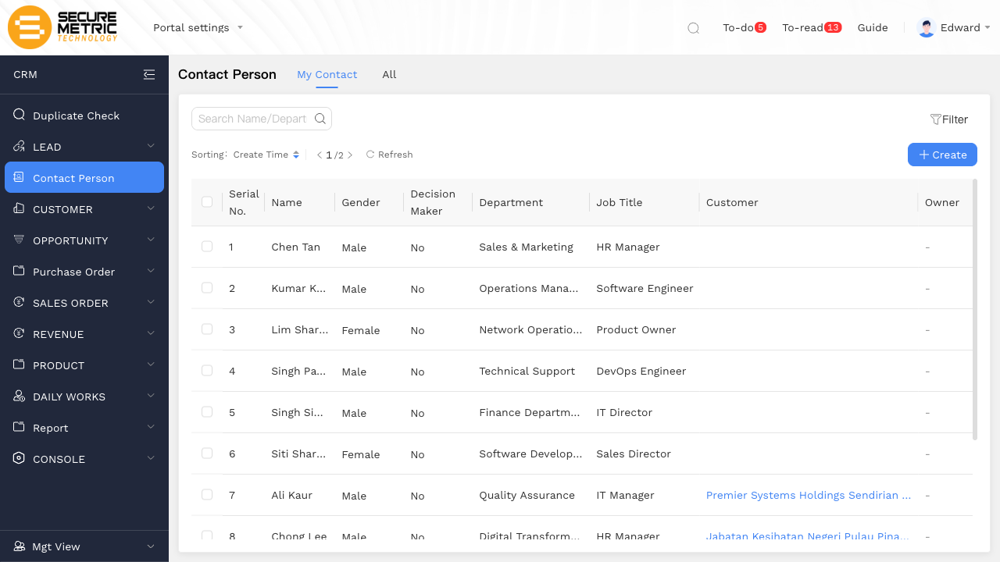
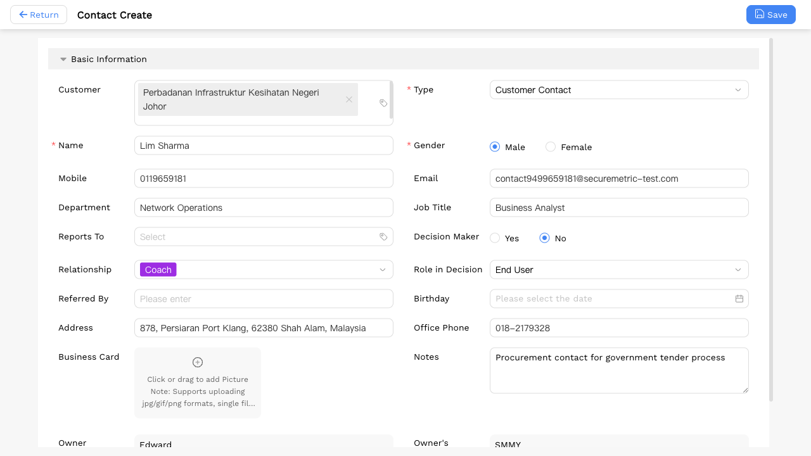
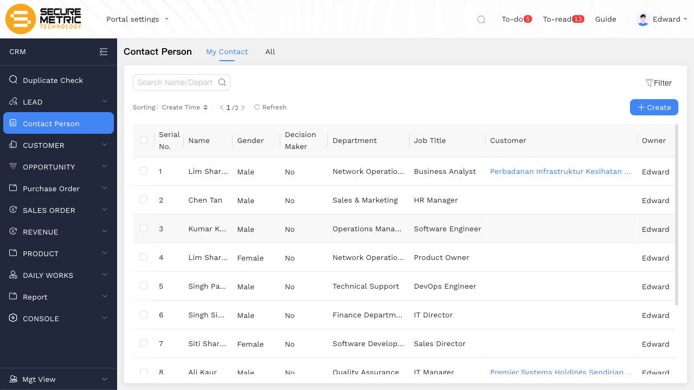

# 联系人新建操作 — 用户手册 / Contact Person — User Manual

> 生成时间 / Generated: 2026/5/23 09:28:27
> 操作账号 / Account: Edward
> 环境 / Environment: http://172.18.114.231:8088

---

## Step 1：进入联系人模块 / Open Contact Person Module

**中文说明：** 在左侧导航中点击 **Contact Person**，进入联系人列表。列表显示所有已建联系人记录；点击右上角 **Create** 按钮开始新建。

**English：** Click **Contact Person** in the left navigation to open the contact list. All existing records are listed here. Click the **Create** button in the top-right corner to start creating a new contact.

---

## Step 2：填写联系人信息 / Fill in Contact Details

**中文说明：** 点击 **Create** 进入新建表单后，依次填写各字段（标红星号 * 为必填）：

- **Customer**：关联已有客户记录，从弹窗列表中选择
- **Type**（必填）：选择联系人业务类型，如 Customer Contact
- **Name**（必填）：联系人全名
- **Gender**（必填）：选择性别
- **Department / Job Title**：所在部门与职务
- **Mobile / Email**：手机号与邮箱（系统会校验唯一性；若提示重复，请前往[查重页面](http://172.18.114.231:8088/web/#/current/sys-modeling/app/km-ltc/listView/1i2b2u2how6aw3k7dw1a3anjl3jnug8m31w1/undefined?navId=1hvp21k7lw4vw6h64w37pp9dm27vj66f3cw1)确认）
- **Office Phone / Address**：办公电话与地址
- **Notes / Role in Decision / Relationship**：可选，建议按实际填写

**English：** After clicking **Create**, fill in the form fields (* = required):

- **Customer**: Link to an existing customer record by selecting from the pop-up list
- **Type** *(required)*: Select the contact's business type, e.g. Customer Contact
- **Name** *(required)*: Full name of the contact
- **Gender** *(required)*: Select gender
- **Department / Job Title**: The contact's department and role
- **Mobile / Email**: Phone and email (must be unique; if a duplicate error appears, use the [Duplicate Check](http://172.18.114.231:8088/web/#/current/sys-modeling/app/km-ltc/listView/1i2b2u2how6aw3k7dw1a3anjl3jnug8m31w1/undefined?navId=1hvp21k7lw4vw6h64w37pp9dm27vj66f3cw1) page to look up existing contacts)
- **Office Phone / Address**: Office phone number and address
- **Notes / Role in Decision / Relationship**: Optional fields — fill in as needed

---

## Step 3：保存联系人 / Save the Contact Record

**中文说明：** 确认所有必填字段已填写后，点击右上角 **Save** 按钮。提交成功后系统返回联系人列表，新建记录已出现在列表中。

**English：** Once all required fields are filled, click the **Save** button in the top-right corner. After a successful save, the system returns to the contact list where the new record is now visible.

---
