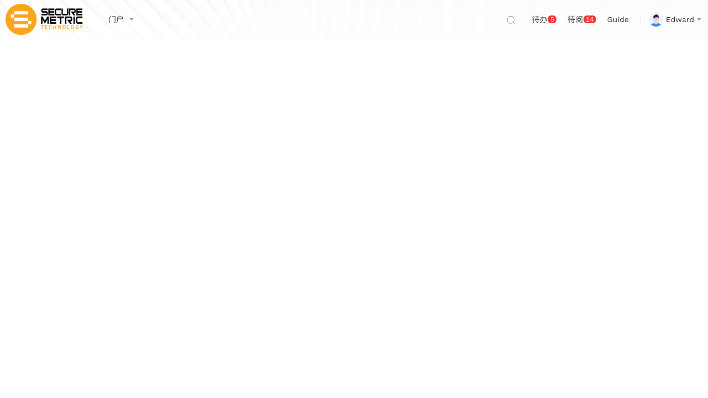
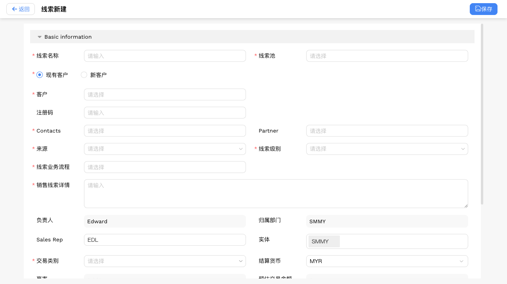
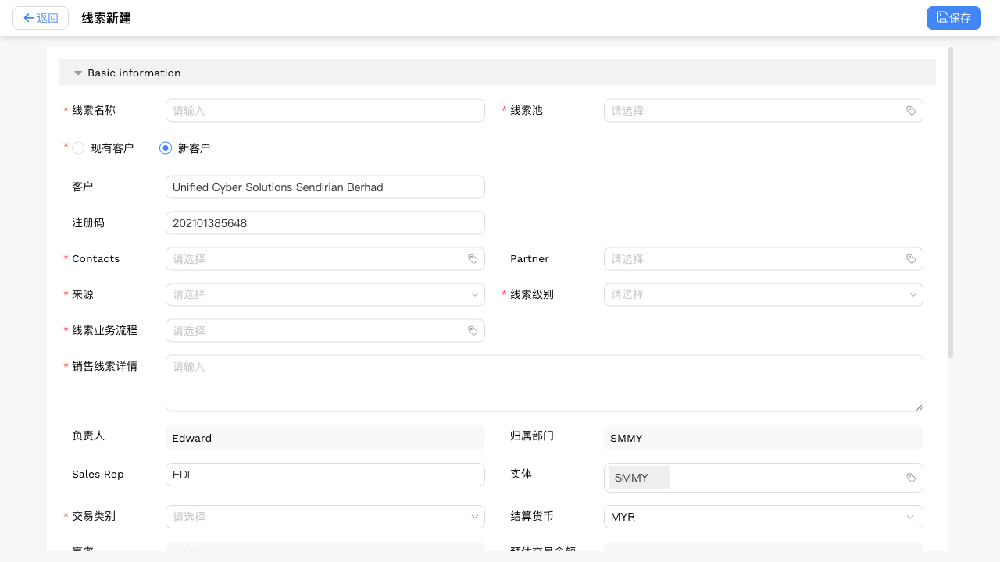
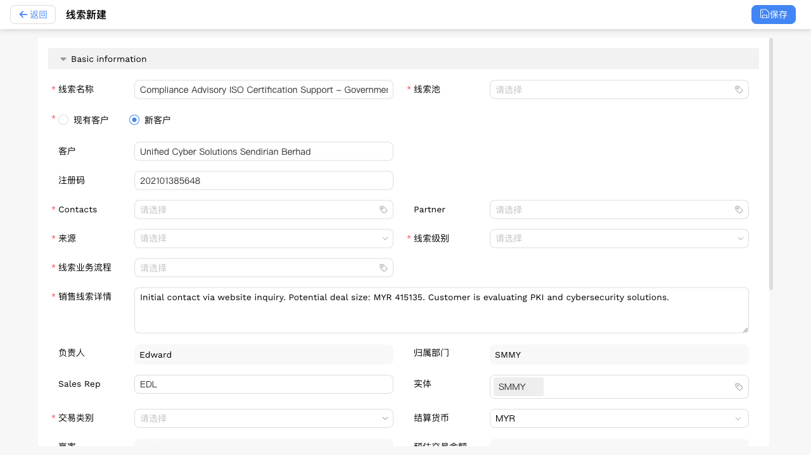
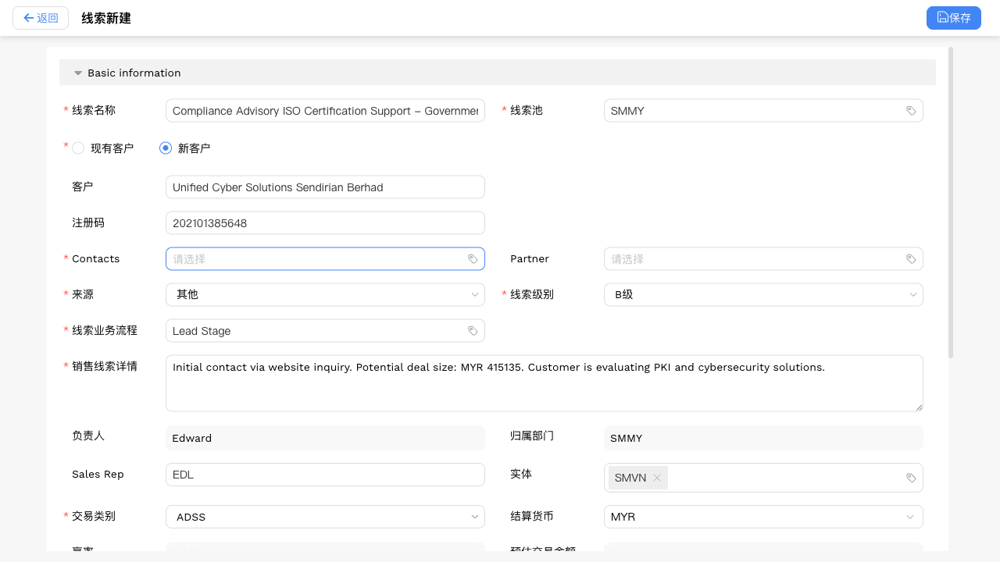
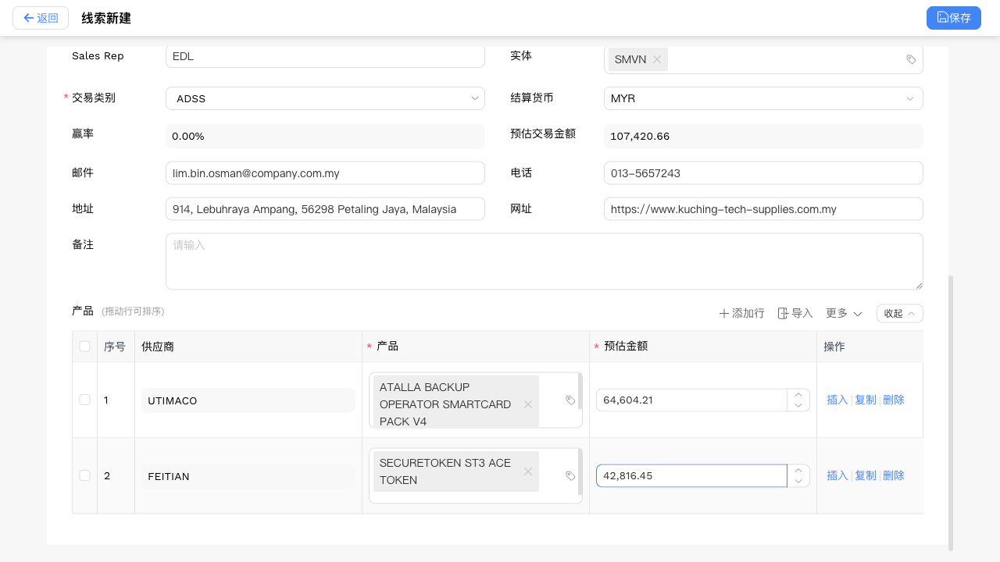
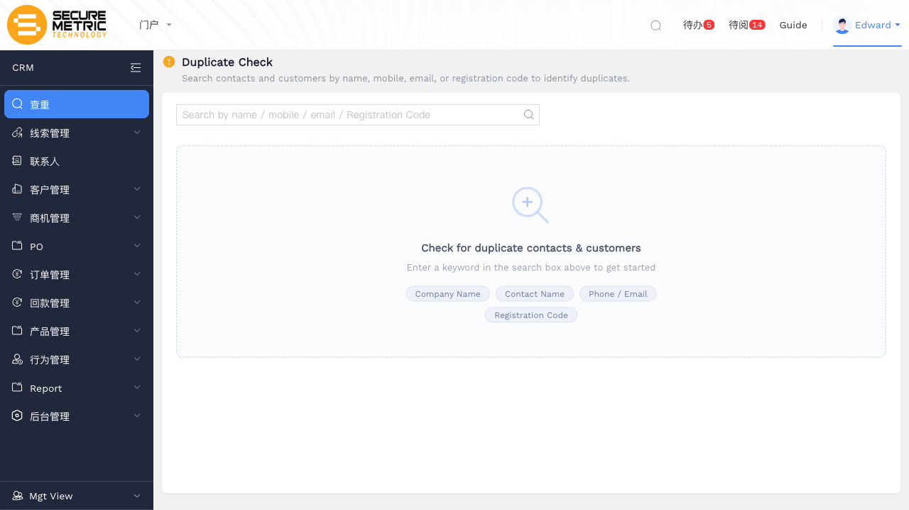

# 线索新建操作 — 用户手册 / Sales Lead — User Manual

> 生成时间 / Generated: 2026/5/23 14:34:11
> 操作账号 / Account: Edward
> 环境 / Environment: http://172.18.114.231:8088

---

## Step 1：进入线索列表页 / Open Sales Lead List

**中文说明：** 在左侧导航中点击 **LEAD** 模块，选择 **Sales Lead** 子分类，进入线索列表页。列表展示所有已创建的线索记录，可通过搜索/筛选快速定位。

**English：** Click the **LEAD** module in the left navigation, then select **Sales Lead** to open the lead list. All existing lead records are displayed here.

---

## Step 2：打开新建线索表单 / Open New Lead Form

**中文说明：** 点击列表页右上角的 **Create** 按钮，进入新建线索表单。表单分为两个区域：
- **上方**：基本信息（客户、名称、联系方式等）
- **下方**：Principal Allocation 明细表（产品/金额）

**English：** Click the **Create** button in the top-right corner. The form has two sections:
- **Top**: Basic information (customer, name, contact details, etc.)
- **Bottom**: Principal Allocation detail table (products and amounts)

---

## Step 3：选择客户类型：New Customer / Select Customer Type: New Customer

**中文说明：** **Customer** 字段有两个选项：
- **New Customer（新客户）**：第一次接触的潜在客户，需填写公司名称和注册码
- **Existing Customer（已有客户）**：系统中已存在的客户记录，通过关联控件搜索选择

选择 **New Customer** 后，下方会出现 **Customer Name** 和 **Registration No.** 输入框。

**English：** The **Customer** field offers two options:
- **New Customer**: A new prospect — fill in company name and registration number
- **Existing Customer**: A customer already in the system — select via the relation picker

After selecting **New Customer**, the **Customer Name** and **Registration No.** fields appear below.

---

## Step 4：填写新客户名称与注册码 / Fill in Customer Name & Registration No.

**中文说明：** 填写新客户的基本信息：
- **Customer Name（公司名称）**: `Global Cyber Ventures (M) Sdn Bhd`
- **Registration No.（注册码）**: `5273800-M`（马来西亚 SSM 格式）

注册码格式示例：`202001234567`（新格式）或 `1234567-X`（旧格式）。

**English：** Fill in the new customer's basic information:
- **Customer Name**: `Global Cyber Ventures (M) Sdn Bhd`
- **Registration No.**: `5273800-M` (Malaysia SSM format)

Registration number formats: `202001234567` (new format) or `1234567-X` (old format).

---

## Step 5：填写线索名称与销售详情 / Fill in Lead Name & Details

**中文说明：** 填写线索的核心信息：
- **Lead Name（线索名称）**: 建议使用业务场景描述格式，如 `PKI Hardware Renewal Opportunity - Healthcare (Kuala Lumpur)...`，包含解决方案类型、行业和地区
- **Details（销售详情）**: 记录与客户沟通的背景、潜在交易规模和需求描述

**Lead Name 命名规范**：`{解决方案}_{行业}_{地区}_{日期}`

**English：** Fill in the core lead information:
- **Lead Name**: Use a descriptive format like `PKI Hardware Renewal Opportunity - Healthcare (Kuala Lumpur)...` — include solution type, industry, and region
- **Details**: Record communication context, estimated deal size, and requirements

**Naming convention**: `{Solution}_{Industry}_{Region}_{Date}`

---

## Step 6：选择分类、负责人与联系人 / Select Classification, Owner & Contacts

**中文说明：** 填写以下必填分类字段：
- **Entity（实体）**: 选择负责此线索的公司主体
- **Source（来源）**: 选择线索来源渠道
- **Lead Level（线索级别）**: 选择线索优先级/等级
- **Deal Category（交易类别）**: 选择本次交易的产品分类
- **Lead Queue（线索池）**: 选择线索所属的分配队列
- **Sales Pipeline（销售阶段）**: 选择线索当前所处的业务流程阶段
- **Owner（负责人）**: 指定负责跟进该线索的销售人员
- **Contacts（联系人）**: 关联已有联系人记录（可关联多个）

**English：** Fill in the required classification fields:
- **Entity**: Select the company entity responsible for this lead
- **Source**: Select the lead source channel
- **Lead Level**: Select the lead priority level
- **Deal Category**: Select the product category for this deal
- **Lead Queue**: Select the allocation queue for this lead
- **Sales Pipeline**: Select the current stage in the sales process
- **Owner**: Assign the sales representative responsible for follow-up
- **Contacts**: Link to existing contact records (multiple allowed)

---

## Step 7：填写联系信息 / Fill in Contact Information

**中文说明：** 填写与该线索关联的联系方式：
- **Phone（电话）**: `010-9489371`
- **Email（邮件）**: `ali.wong83@hotmail.com`
- **Address（地址）**: `732, Persiaran Bukit Bintang, 79016 Johor Bahru, Malaysia`
- **Website（官网）**: `https://www.cyberjaya-technology-park-corp.com.my`

以上字段均为可选，但建议尽量填写以便后续跟进。

**English：** Fill in the lead's contact details:
- **Phone**: `010-9489371`
- **Email**: `ali.wong83@hotmail.com`
- **Address**: `732, Persiaran Bukit Bintang, 79016 Johor Bahru, Malaysia`
- **Website**: `https://www.cyberjaya-technology-park-corp.com.my`

All fields are optional but recommended for future follow-up.

---

## Step 8：填写 Principal Allocation 明细表 / Fill in Principal Allocation Detail Table

**中文说明：** 页面下方的 **Principal Allocation** 明细表用于记录本次线索涉及的产品及预估金额：
1. 点击 **+ Add Row** 新增一行
2. 在 **Product（产品）** 列选择具体产品
3. 在 **Est. Amount（预估金额）** 列填写金额（MYR）

可新增多行，每行对应一个产品/厂商的报价。明细表金额会自动汇总到线索总额。

**English：** The **Principal Allocation** table at the bottom records the products and estimated amounts for this lead:
1. Click **+ Add Row** to add a new row
2. Select a product in the **Product** column
3. Enter the estimated amount (MYR) in the **Est. Amount** column

Multiple rows can be added — one per product or vendor. The total is automatically aggregated.

---

## Step 9：点击保存 / Save the Lead Record

**中文说明：** 所有必填字段填写完成后，点击页面右上角 **Save** 按钮提交表单。（请检查页面状态确认是否保存成功）

**English：** After completing all required fields, click the **Save** button in the top-right corner. (Please verify the page status to confirm if saving was successful.)

---
