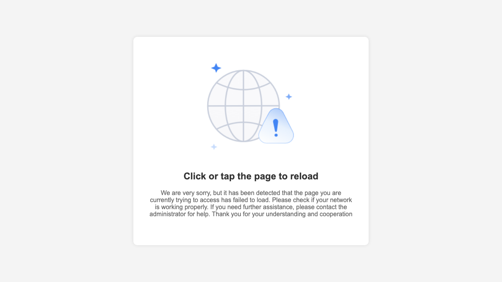
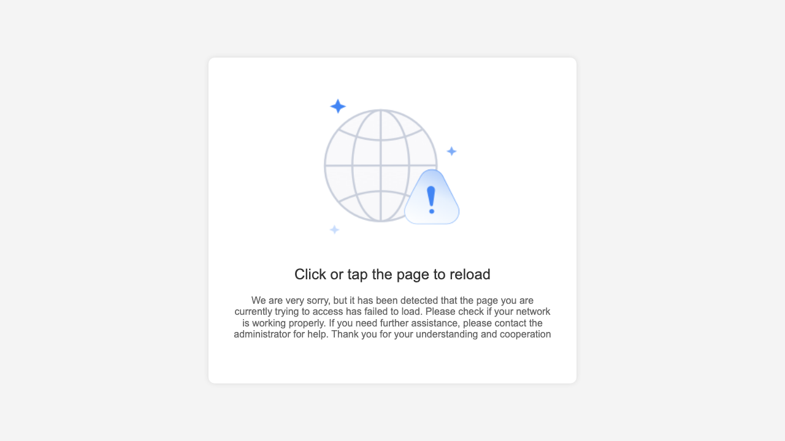

# 线索推进与商机转换 — 用户手册 / Lead Advancement & Opportunity Conversion — User Manual

> 生成时间 / Generated: 2026/5/22 14:21:34
> 操作账号 / Account: Edward
> 环境 / Environment: http://172.18.114.231:8088

## 概述 / Overview

**中文：** 线索生命周期分为三个阶段：**Pending（待跟进）→ Follow-Up（跟进中）→ 转商机**。本手册演示如何逐步推进线索状态，并最终将其转换为商机。

**English：** The lead lifecycle has three stages: **Pending → Follow-Up → Convert to Opportunity**. This manual demonstrates how to advance a lead through each stage and convert it to an opportunity.

---

## Step 1：进入线索列表，查看 Pending 状态 / Open Lead List — View Pending Leads

**中文说明：** 导航路径：**LEAD → Sales Lead**，进入线索列表。

列表顶部显示按状态分类的计数标签：
- **Pending（待跟进）**：已录入但尚未开始跟进的线索
- **Follow-up（跟进中）**：正在跟进的线索
- **Converted（已转商机）**：已转换为商机的线索

点击 **Pending** 标签可过滤仅显示待跟进线索。

**English：** Navigate to **LEAD → Sales Lead** to open the lead list.

The top of the list shows status count tabs:
- **Pending**: Leads entered but not yet followed up
- **Follow-up**: Leads actively being followed
- **Converted**: Leads already converted to opportunities

Click the **Pending** tab to filter and view only pending leads.

---

## Step 2：打开 Pending 线索 — 查看操作按钮 / Open a Pending Lead — View Action Buttons _(跳过 / Skipped)_

**中文说明：** （当前无 Pending 线索，请先通过"新建线索"创建数据后再操作）

**English：** (No Pending leads found. Please create a lead first via "New Lead" before proceeding.)

---

## Step 3：方式一：阶段推进（Advance to next stage） / Method 1: Advance to Next Stage _(跳过 / Skipped)_

**中文说明：** 点击 **Advance to next stage** 按钮，在弹出确认框点击 **Confirm**，线索状态立即从 Pending 变为 Follow-Up。

适用场景：确认有跟进价值后，一键推进到跟进阶段。

**English：** Click **Advance to next stage**, then click **Confirm** in the dialog. The lead status changes from Pending to Follow-Up immediately.

Use case: Confirmed the lead has potential — advance to follow-up with one click.

---

## Step 4：方式二：新增销售记录（New Log） / Method 2: New Log (Sales Record) _(跳过 / Skipped)_

**中文说明：** 点击 **New Log** 按钮，选择 **Activity Type**（如 Calling Contact），填写 **Discussion Details**，点击 **Submit**。提交后线索自动进入 Follow-Up 状态，沟通记录保存在详情页。

**English：** Click **New Log**, select an **Activity Type** (e.g. Calling Contact), fill in **Discussion Details**, and click **Submit**. The lead advances to Follow-Up automatically.

---

## Step 5：方式三：Follow-Up 按钮（填写跟进结果） / Method 3: Follow-Up Button _(跳过 / Skipped)_

**中文说明：** 点击 **Follow-up** 按钮，填写：跟进结果、下次跟进日期、下次跟进备注，点击 **Confirm** 确认。线索状态变为 Follow-Up，跟进历史自动保存。

**English：** Click **Follow-up**, fill in: Results, Next Follow-up Date, Next Follow-up Notes, then click **Confirm**. The lead advances to Follow-Up and history is saved.

---

## Step 6：切换到 Follow-Up 列表，准备转换商机 / Switch to Follow-Up List — Ready to Convert

**中文说明：** 点击列表顶部的 **Follow-up** 标签，查看所有跟进中的线索。

只有 **Follow-Up** 状态的线索才能转换为商机（Pending 状态无 Convert 按钮）。选择一条跟进充分、确认有购买意向的线索，点击进入详情页。

**English：** Click the **Follow-up** tab at the top of the list to view all leads in active follow-up.

Only leads in **Follow-Up** status can be converted to opportunities (Pending leads do not have a Convert button). Select a lead that has been sufficiently followed up and shows clear purchase intent.

---

## Step 7：点击 Convert，填写转换信息 / Click Convert — Fill in Conversion Details _(跳过 / Skipped)_

**中文说明：** 在 Follow-Up 线索详情页点击 **Convert** 按钮，选择客户类型和来源，点击 **Next → Confirm**。

**English：** On the Follow-Up detail page, click **Convert**, select customer type and source, click **Next → Confirm**.

---

## Step 8：确认转换，线索变为商机 / Confirm Conversion — Lead Becomes Opportunity _(跳过 / Skipped)_

**中文说明：** 转换成功后线索变为 Converted 状态，商机模块自动生成对应记录。

**English：** After conversion, the lead becomes Converted and an Opportunity is automatically created.

---
