# P&L Creation — User Manual

> Generated: 2026/5/22 10:34:58
> Account: Edward
> Environment: http://172.18.114.231:8088

---

## Step 1: Open P&L New Page

Click "New" to open the P&L creation page. The top section contains basic information; the bottom section shows product detail tabs.

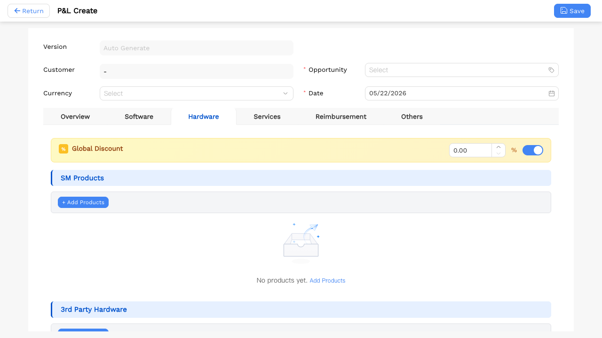

---

## Step 2: Select Linked Opportunity

Search and select an opportunity in the "Opportunity" field. Once selected, the P&L product section below starts rendering.

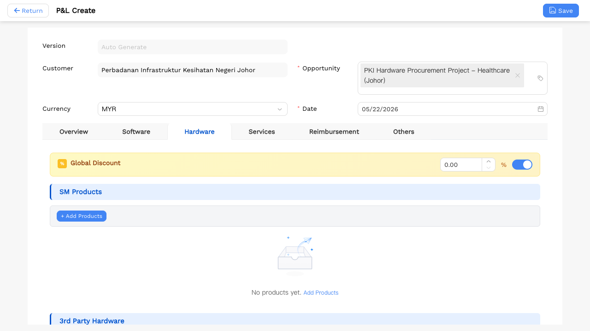

---

## Step 3: Add Products (Batch 1) — Product Selector Dialog

Click "+ Add Products" in the 3rd Party Hardware section. A product selector dialog appears. Select the first 2 products and confirm.

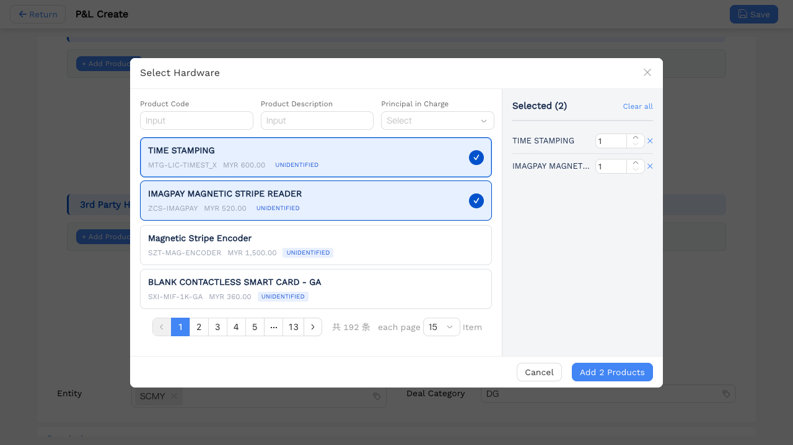

---

## Step 4: Add Products (Batch 2) — Previously Selected Products Marked

Open the selector again. The first 2 already-added products appear as **disabled/selected**. Select the 3rd product and confirm. Hardware now has 3 products.

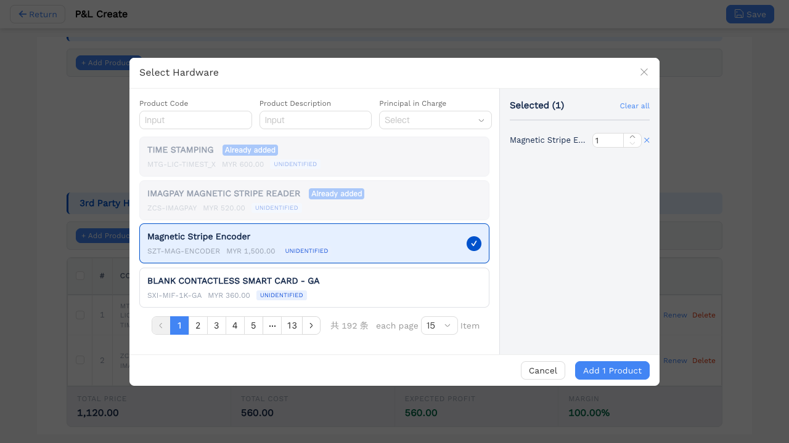

---

## Step 5: Global Discount 10% ON + Set Markup 20% in Product Drawer

Enable **Global Discount** and set it to **10%**. Once enabled, the DISC column shows the global discount for all rows, and the per-row discount field inside the Product Drawer is **read-only** (not editable).

Click a product row to open the Drawer. Enter `20` in the **Markup** field (20%). Formula: `Unit Price = List Price × (1 + Markup Rate)`. After saving, the MARKUP column shows 20.00%.

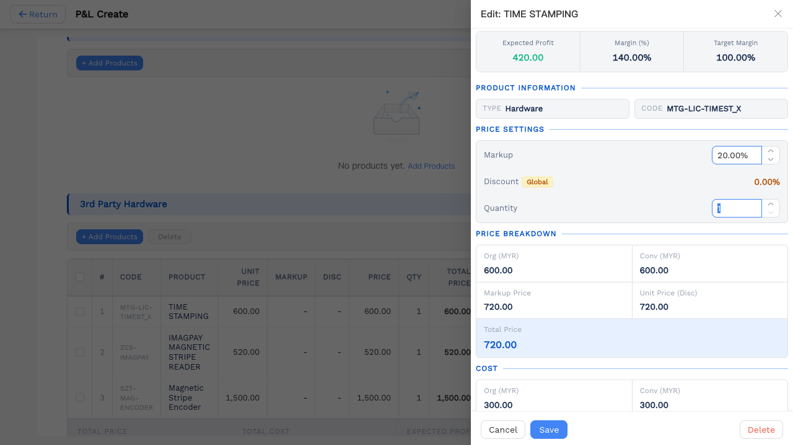

---

## Step 6: Renew: Copy Products to Hardware Renew Tab

Click the **Renew** button in the product row actions. This copies the product to the Hardware Renew tab (Year 2). Switch to "Hardware Renew" to see the renewal product list.

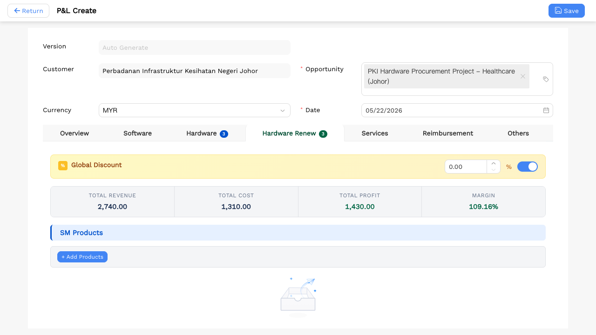

---

## Step 7: Renew Tab: Click Copy Twice to Generate Multi-Year Renewals

In the Hardware Renew tab, click **Copy** on the same row twice:
- 1st click → generates Year 3 row
- 2nd click → generates Year 4 row

The Overview tab automatically aggregates the multi-year totals.

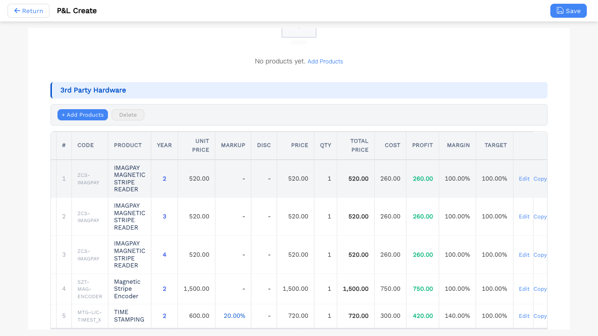

---

## Step 8: Service Tab: Add a Service Product

Switch to the "Service" tab and click "+ Add Products" to add 1 service product. Note: The Service tab has no Markup field; the quantity field is displayed as **Man Day**.

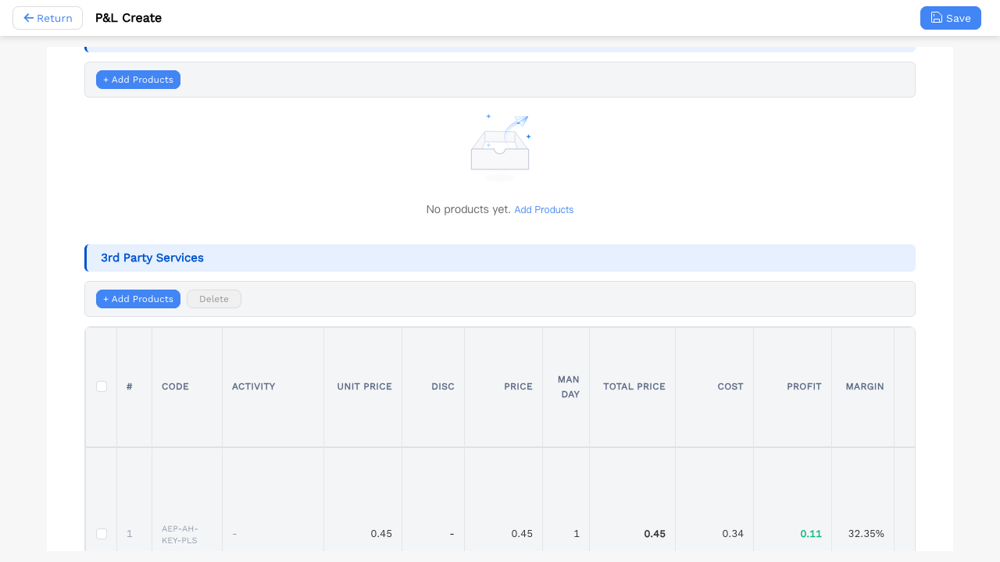

---

## Step 9: Disable Global Discount, Enable Per-Row Discount

Click the Global Discount **Switch** to turn it off. Once disabled, the per-row Discount input in the Product Drawer becomes visible again, allowing individual discount rates per product.

---

## Step 10: Per-Row Discount Drawer: Fill Activity & Set Discount to 20%

Click the product row to open the Drawer. Enter the assignee name (`Ahmad Razif bin Kamaruddin`) in the **Activity** field. Enter `20` in the **Discount** field (20%). Formula: `Unit Price = List Price × (1 - Discount Rate)`.

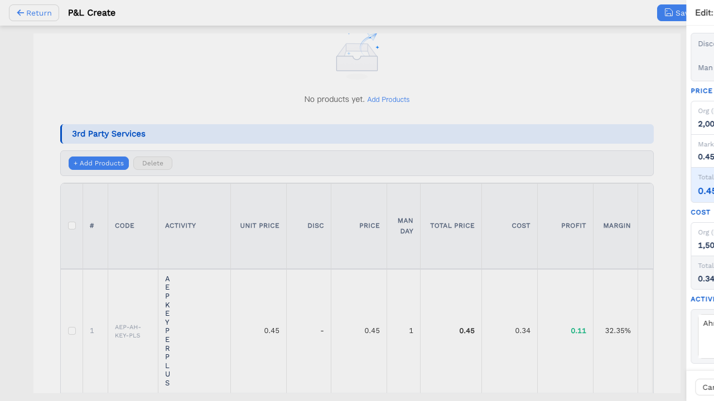

---

## Step 11: Demo: Re-enable Global Discount

Click the Switch again to re-enable Global Discount. This demonstrates the two discount modes:
- **Global Discount**: applies uniformly to all products in the tab
- **Per-Row Discount**: set individually per product (available when Global Discount is OFF)

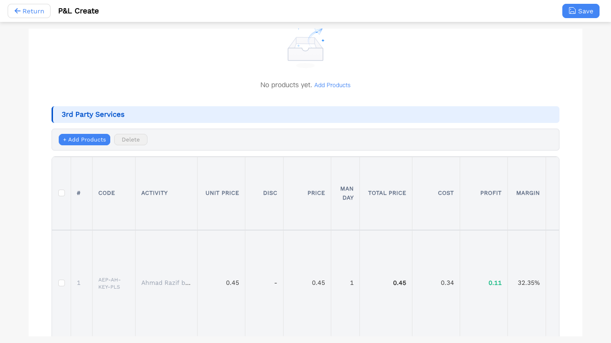

---

## Step 12: Switch to Reimbursement Tab

Click the "Reimbursement" tab. It contains SM Team and 3rd Party Team sub-tables for logging reimbursable expenses (travel, accommodation, etc.). No discount or markup fields apply here.

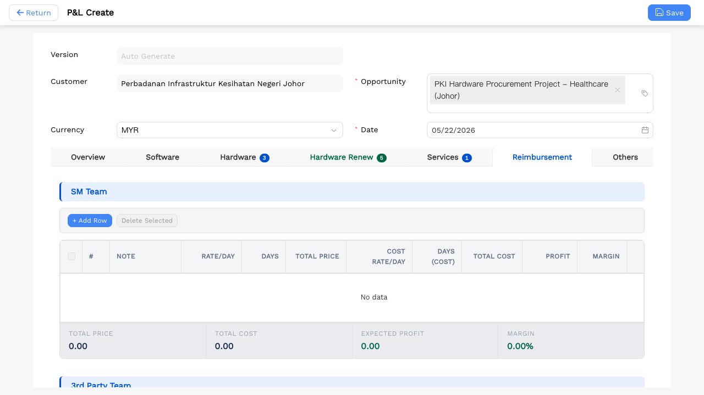

---

## Step 13: Reimbursement: Add a Row to SM Team

Click "+ Add Row" in the SM Team section to add a reimbursement entry:
- **Activity**: Travel & Accommodation
- **Note**: Customer site visit
- **Rate/Day**: 500, **Days**: 2
- **Cost Rate/Day**: 350, **Days (Cost)**: 2

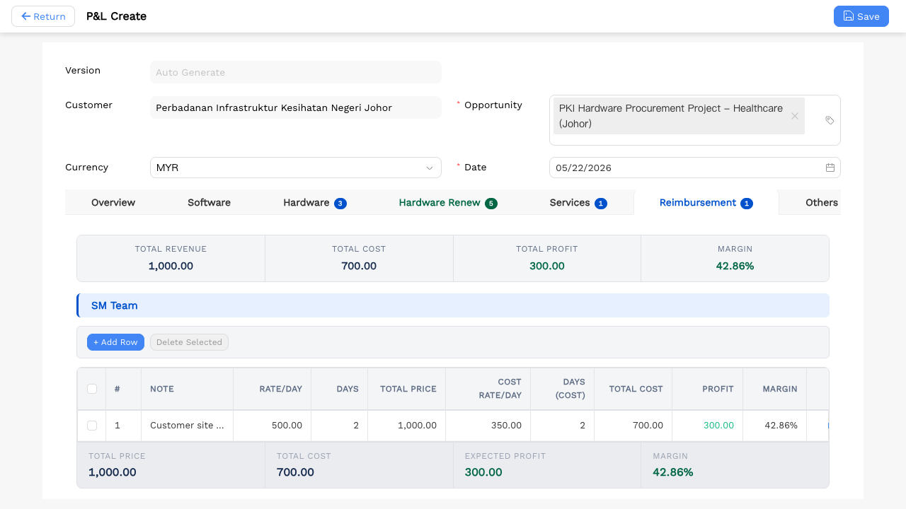

---

## Step 14: Switch to Others Tab

Click the "Others" tab for miscellaneous costs that do not fall under products, services, or reimbursements.

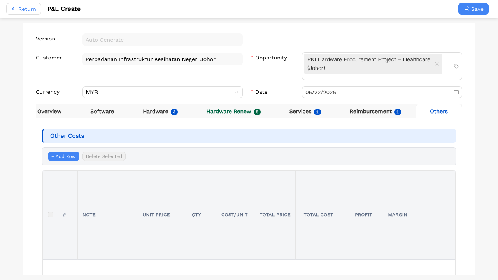

---

## Step 15: Others: Add a Miscellaneous Cost Row

Click "+ Add Row" to add a misc cost entry:
- **Description**: Freight & Customs Clearance
- **Note**: Import duty for hardware shipment
- **Unit Price**: 1200, **Qty**: 1, **Cost/Unit**: 900

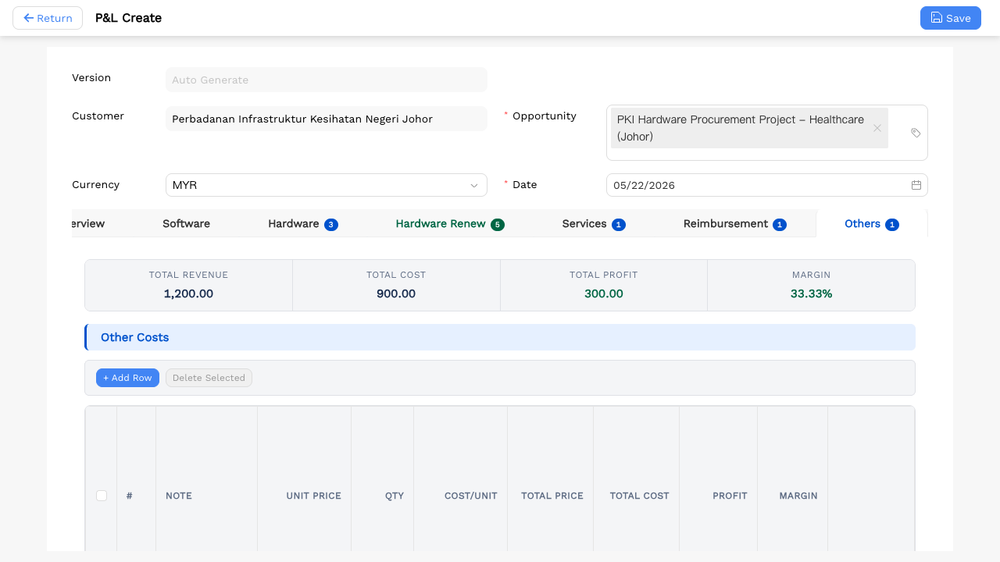

---

## Step 16: Save the P&L Record

Click the **Save** button in the top-right corner. The form is submitted successfully and the system redirects to the P&L detail page.

---
