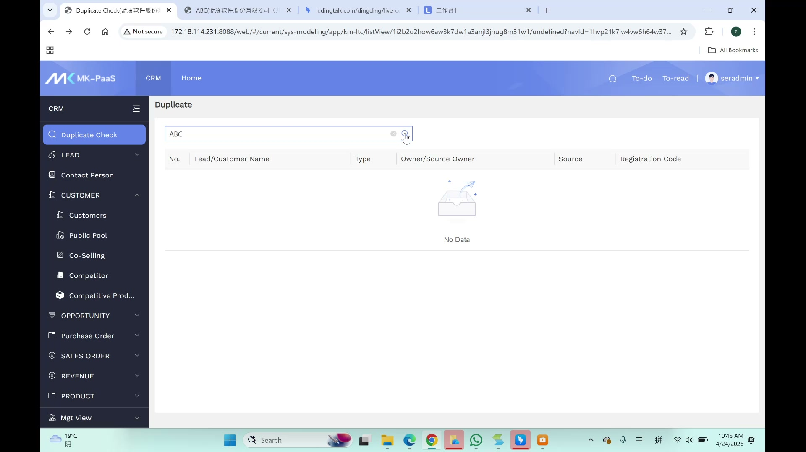
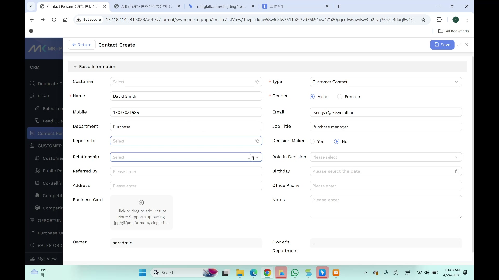

# Contact User Manual

> **Version**: V1.0 | **Date**: 2026-06-04 | **System**: Securemetric CRM (EasyCraft)

---

## Table of Contents

1. [Module Overview](#1-module-overview)
2. [Contact List View](#2-contact-list-view)
3. [Create a Contact](#3-create-a-contact)
4. [Contact Details View](#4-contact-details-view)
5. [Contact Relationship Graph](#5-contact-relationship-graph)
6. [FAQ & Notes](#6-faq--notes)

---

## 1. Module Overview

Contacts (联系人) are individuals associated with a Customer. A contact must be linked to an existing customer record.

### 1.1 Entry Points

- **Sidebar**: Navigate to **Contact Person**
- **From Lead**: Lead Create form → Contact Person table → "New Contact"
- **From Customer**: Customer Details → Contact sub-tab

### 1.2 Core Functions

| Function | Description |
|----------|-------------|
| Contact Creation | Create individual contacts linked to customers |
| Relationship Graph | Visualize connections between contacts |
| Contact Search | Search by name, phone, email, or company |
| Bulk Import | Import contacts from Excel templates |

---

## 2. Contact List View

### 2.1 List Features

| Feature | Description |
|---------|-------------|
| Search | Search by contact name, mobile, or email |
| Sorting | Create Time, Last Modified |
| Bulk Selection | Checkboxes + bulk actions |
| Pagination | "Total N Items" with page navigation |

### 2.2 Row Information

Each contact row displays:
- Contact Name, Customer, Mobile, Email, Department, Job Title
- Owner, Create Time, Relationship score

---

## 3. Create a Contact

### 3.1 Entry

Click **+ Create** on the Contact List toolbar, or click **"New Contact"** button in a Lead's Contact Person table.

### 3.2 Basic Information

| Field | Required | Type | Notes |
|-------|----------|------|-------|
| Customer | No | Association/Lookup | Tag-style with 'x' to clear. Links to existing Customer record |
| Contact Name | Yes | Text | Red asterisk indicates required |
| Mobile | No | Text | Malaysian format: 01x-xxxxxxx. Autocomplete with previous entries |
| Email | No | Text | At least one of Email or Phone required for submission |
| Department | No | Text | Placeholder: "Please enter" |
| Job Title | No | Text | Field name is "position" in CRM |
| Gender | Yes | Radio | Options: Male / Female |
| Type | Yes | Dropdown | Values include "Customer Contact" |
| Address | No | Text | Business address |
| Birthday | No | Date Picker | Calendar icon, placeholder: "Please select the date" |
| Reports To | No | Association/Lookup | Links to another contact |
| Relationship | No | Dropdown | Coach(5) / Champion(4) / Supporter(3) / Neutral(2) / Blocker(1) |
| Referred By | No | Text | Placeholder: "Please enter" |
| Decision Maker | No | Radio | Options: Yes / No |
| Role in Decision | No | Dropdown | Placeholder: "Please select" |
| Office Phone | No | Text | Placeholder: "Please enter" |
| Business Card | No | File Upload | jpg/gif/png only, single file, drag-and-drop |
| Notes | No | Textarea | Additional notes |
| Owner | No | Read-only | Auto-populated (current user) |
| Owner's Department | No | Read-only | Shows "-" when not set |

### 3.3 Footer

After filling in the required fields, click **Save** or **Save & New** to create the contact.

> ⚠️ **Important**: At least one of Email or Phone must be filled for submission.

---

## 4. Contact Details View

### 4.1 Contact Information

The detail view displays all contact fields in read-only mode, including:
- Basic info: Name, Customer, Mobile, Email, Department, Job Title
- Relationship info: Relationship score, Referred By, Decision Maker status
- Address and Business Card (if uploaded)

### 4.2 Edit Contact

Click **Edit** button to modify contact details. Changes are validated against duplicate records.

---

## 5. Contact Relationship Graph

The CRM supports a contact relationship diagram showing connections between contacts within the same customer organization. This helps sales teams understand the decision-making network.

---

## 6. FAQ & Notes

### 6.1 Business Rules

1. **Customer linkage**: Every contact must be associated with a Customer record
2. **Email OR Phone**: Blueprint spec states at least one of Email or Phone is required
3. **Gender field**: Radio buttons — resolved by matching the fieldset label text
4. **Duplicate validation**: System auto-validates against database for uniqueness on save
5. **Owner auto-assignment**: Owner field auto-populated with current logged-in user

### 6.2 Relationship Scoring

| Relationship | Score | Description |
|-------------|-------|-------------|
| Coach | 5 | Actively helps you win the deal |
| Champion | 4 | Advocates for your solution internally |
| Supporter | 3 | Positive but not actively helping |
| Neutral | 2 | No strong opinion either way |
| Blocker | 1 | Opposes your solution |

### 6.3 Known Issues

- Gender field has no `data-tid` attribute — resolved by matching fieldset label text
- When creating a contact via popup, `window.close()` may interfere with automation
- CRM typo: Notes field uses `teaxtarea` (not "textarea")
