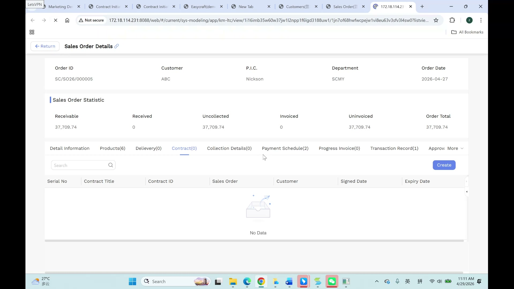
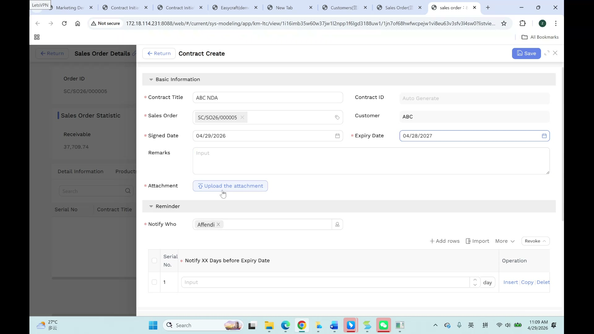
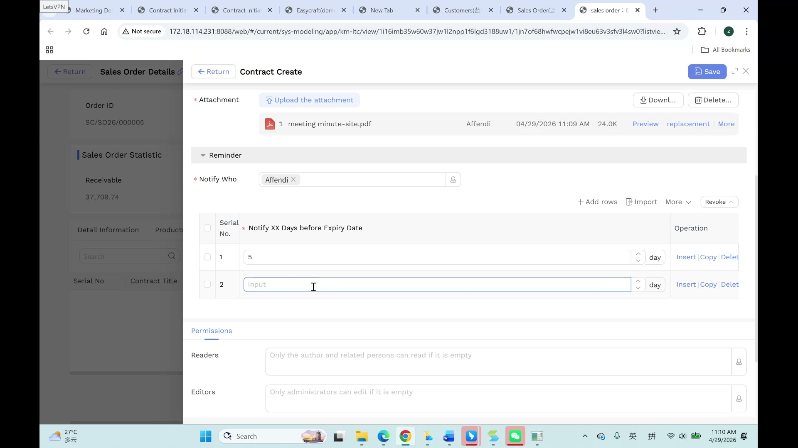
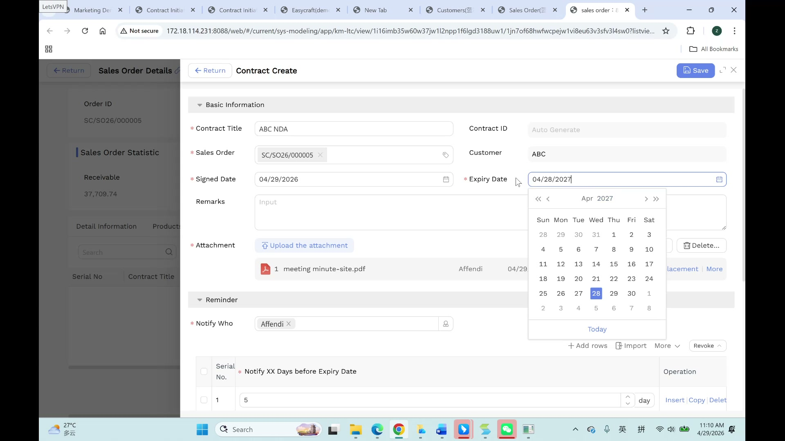

# 合同管理（Contract）用户手册

> **版本**：V1.0 | **日期**：2026-06-04 | **系统**：Securemetric CRM（EasyCraft）

---

## 目录

1. [模块概述](#1-模块概述)
2. [列表视图](#2-列表视图)
3. [创建合同](#3-创建合同)
4. [详情视图](#4-详情视图)
5. [业务规则与流程](#5-业务规则与流程)
6. [常见问题与注意事项](#6-常见问题与注意事项)

---

## 1. 模块概述

**合同（Contract）** 模块用于管理 Securemetric 与客户之间已签署的协议。合同关联至销售订单（SO），代表确认销售后所产生的法律义务。合同记录是签约文件存档、续签追踪和到期监控的核心载体。

### 1.1 入口

| 入口 | 路径 |
|------|------|
| 独立列表 | 左侧导航 → **销售订单（SALES ORDER）** → **合同（Contract）** |
| 从销售订单进入 | 销售订单详情 → **合同** 选项卡 → **+ 新建** |

### 1.2 核心功能

- 记录合同标题、签约日期、到期日期及附件
- 关联销售订单（进而关联至客户）
- 配置合同到期提醒通知，支持自定义提前天数
- 合同文件同步至客户 360 视图
- 追踪合同与销售订单的一对一关系

---

## 2. 列表视图

合同列表展示当前用户有权查看的所有合同。

| 列名 | 说明 |
|------|------|
| 合同标题 | 合同名称 |
| 合同编号 | 系统自动生成的唯一标识 |
| 销售订单 | 关联的销售订单编号 |
| 客户 | 关联客户（派生自销售订单） |
| 签约日期 | 合同正式签署日期 |
| 到期日期 | 合同到期日期 |
| 创建人 | 在 CRM 中创建该记录的用户 |

可按合同标题、客户或日期范围筛选，使用状态筛选识别即将到期的合同。



---

## 3. 创建合同

### 3.1 打开表单

**推荐路径**：进入关联销售订单，切换至 **合同** 选项卡，点击 **+ 新建**，系统将自动预填销售订单关联。

也可从独立合同列表页创建，但需要手动选择销售订单。



### 3.2 字段说明

| 字段 | 必填 | 类型 | 说明 |
|------|------|------|------|
| 合同标题 | 是 | 文本输入 | 合同的描述性名称 |
| 合同编号 | 否（自动） | 只读文本 | 保存后由系统自动生成 |
| 销售订单 | 是 | 标签选择（查找） | 关联对应的销售订单 |
| 客户 | 否（自动） | 只读文本 | 从所选销售订单自动填充 |
| 签约日期 | 是 | 日期选择器 | 合同正式签署的日期 |
| 到期日期 | 是 | 日期选择器 | 合同到期的日期 |
| 备注 | 否 | 多行文本 | 内部注释或说明 |
| 附件 | 是* | 文件上传 | 已签署的合同文件（*业务流程必填；界面未显示红色星号） |
| 通知人 | 否 | 多选用户标签 | 合同到期前需接收提醒的用户 |

> *尽管界面未显示红色星号，**附件**字段按业务规范属于必填项。请务必在保存前上传已签署的合同文件。

### 3.3 合同提醒子表

**合同提醒**子表用于配置到期前的提前通知。

| 列名 | 类型 | 说明 |
|------|------|------|
| 序号 | 自动编号 | 行序号，只读 |
| 提前通知天数 | 数字输入 | 到期前多少天发送提醒 |
| 单位 | 只读文本 | 固定为"天" |
| 操作 | 操作按钮 | 插入 / 复制 / 删除行 |

**示例**：将"提前通知天数"设置为 `30`，表示在到期日前 30 天向**通知人**列表中的所有用户发送提醒。



可添加多行以实现分级提醒（例如：到期前 90 天、30 天、7 天各提醒一次）。

### 3.4 保存

点击顶部操作栏中的 **保存**。系统自动生成**合同编号**并保存记录，合同文件同步至客户 360 合同选项卡。

---

## 4. 详情视图

### 4.1 主要信息

展示新建表单中的所有字段，合同编号（自动生成）已显示，客户字段为只读，派生自关联销售订单。



### 4.2 子选项卡

| 选项卡 | 内容 |
|--------|------|
| 详细信息 | 包含提醒子表在内的所有合同字段 |
| 附件 | 已上传的合同文件 |
| 系统记录 | 创建与修改审计日志 |

### 4.3 编辑

点击顶部操作栏的 **编辑** 进入编辑模式。可修改到期日期、备注，添加新的提醒行，或上传补充附件。

---

## 5. 业务规则与流程

### 5.1 标准合同创建流程

```
销售订单（已确认）→ 进入销售订单 → 合同选项卡 → 创建合同
→ 填写标题 + 签约日期 + 到期日期 + 上传附件
→ 配置提醒子表 → 保存 → 合同编号自动生成
```

### 5.2 每个销售订单对应一份合同

每个销售订单只能关联**一份合同**。如需第二份合同（如修订版），请与上级商议处理方式——可能需要创建新的销售订单。

### 5.3 合同编号自动生成

合同编号由系统在保存时自动分配，无法手动设置或修改。此编号用于所有下游流程和客户沟通中的唯一标识。

### 5.4 附件为业务必填项

尽管界面未显示红色星号，但根据业务规范，已签署的合同文件**必须**上传。审计时会检查缺失的附件。请在保存前上传签署原件的扫描件或电子版。

### 5.5 文件同步至客户 360

上传至合同记录的所有附件将**自动同步**至关联客户的 360 视图下的**合同**子选项卡，无需手动重复上传，客户的完整文件历史在客户记录中即可查看。

### 5.6 到期提醒

到期提醒将通过 CRM 通知发送给**通知人**字段中的所有用户，提醒时间由提醒子表中各行的"提前通知天数"决定。请确保所有需要续签跟进的合同均已填写**通知人**字段。

---

## 6. 常见问题与注意事项

**问：合同创建后，客户字段为空，原因是什么？**
客户字段派生自关联的销售订单。请确认所选销售订单已关联客户。若销售订单创建时未关联客户，请先修改销售订单再重试。

**问：保存后可以更换合同关联的销售订单吗？**
保存后更换销售订单关联受到限制，因为这会影响自动填充的客户及财务关联链。如关联了错误的销售订单，且尚无下游记录，可删除该合同后用正确的销售订单重新创建。

**问：如何设置 90 天和 30 天的双重提醒？**
在合同提醒子表中点击 **+ 插入** 两次，创建两行。第一行"提前通知天数"填 `90`，第二行填 `30`，系统将在对应时间分别触发提醒。

**问：合同已续签，应该修改原合同的到期日期，还是创建新合同？**
标准做法是为续签的销售订单创建**新合同**，不要覆盖原合同的到期日期，因为原记录属于审计历史的一部分。

**问：如何查看某个客户的所有合同？**
打开客户记录，切换至**合同**子选项卡，所有关联合同均在此列出。

**问：为什么合同编号在保存前不显示？**
合同编号由系统在保存时自动生成，无法提前分配。如需将编号用于对外沟通，请先保存后再复制生成的编号值。

**问：一份合同可以上传多个文件吗？**
可以，附件字段支持多文件上传。请将所有相关文件（正本、附录、修订版）一并上传。
