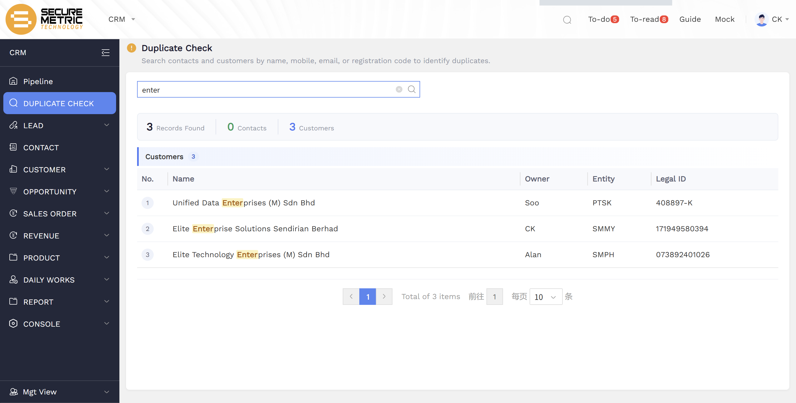

# Duplicate Check User Manual

> **Version**: V1.0 | **Date**: 2026-06-04 | **System**: Securemetric CRM (EasyCraft)

---

## Table of Contents

1. [Module Overview](#1-module-overview)
2. [Search Interface](#2-search-interface)
3. [Search Results](#3-search-results)
4. [Results Navigation](#4-results-navigation)
5. [Business Rules](#5-business-rules)
6. [FAQ & Notes](#6-faq--notes)

---

## 1. Module Overview

The **Duplicate Check** module allows you to search for existing customers or contacts before creating new records. This helps prevent duplicate entries and ensures data quality in the CRM.

### 1.1 Entry Point

- **Sidebar**: Navigate to **CRM → DUPLICATE CHECK**

### 1.2 Core Functions

| Function | Description |
|----------|-------------|
| Cross-entity search | Single search queries both Contacts and Customers simultaneously |
| Fuzzy matching | Partial text matching with highlighted results |
| Split tab results | Results organized by entity type with count badges |
| Quick navigation | Click a result to view or edit the full record |

---

## 2. Search Interface

### 2.1 Search Bar

The search bar is the primary input for finding potential duplicates:

- **Single input field** — type your search term here
- **Search targets**: Name, Mobile, Email, Registration Code (Legal ID)
- **Clear button** (x) — clears the current search text
- **Search button** (magnifying glass) — initiates the search

### 2.2 How to Search

1. Type a keyword into the search bar (e.g., "Enterprise", a phone number, or an email address)
2. Click the **Search** button or press **Enter**
3. Results will appear below, showing matches from both Contacts and Customers

---

## 3. Search Results

### 3.1 Results Summary Bar

After searching, a summary bar displays the total matches:

- **X Records Found** — total number of matches across all entities
- **Y Contacts** — number of contact matches
- **Z Customers** — number of customer matches

### 3.2 Results Tabs

Results are split into two tabs:

- **Customers (Z)** — matching customer records (default tab)
- **Contacts (Y)** — matching contact records

### 3.3 Results Table

| Column | Description |
|--------|-------------|
| **No.** | Row number |
| **Name** | Customer or contact name — matching text is **highlighted in yellow** |
| **Owner** | Record owner (e.g., Soo, CK, Alan) |
| **Entity** | Legal entity code (e.g., SMMY, SCMY, SMPH, PTSK) |
| **Legal ID** | Registration code or unique identifier |

### 3.4 Fuzzy Match Highlighting

When you search for a keyword (e.g., "enter"), the system performs a fuzzy match and **highlights the matching text in yellow** within the result names:

- "Unified Data **Enter**prises (M) Sdn Bhd"
- "Elite **Enter**prise Solutions Sendirian Berhad"
- "Elite Technology **Enter**prises (M) Sdn Bhd"

---

## 4. Results Navigation

### 4.1 Pagination

At the bottom of the results table:

- **Page navigation**: `< 1 2 3 >` — click to switch pages
- **Total items**: "Total of X items" — total count across all pages
- **Page jump**: Enter a page number and click to jump directly
- **Items per page**: Dropdown to set how many results show per page (default: 10)

### 4.2 Viewing a Record

Click on any row in the results table to navigate to that record's full detail page. From there you can:

- View the complete record details
- Edit the record if you have permission
- Compare it with the new record you were about to create

---

## 5. Business Rules

1. **Cross-entity search**: A single search query checks both the Contacts and Customers databases simultaneously.
2. **Fuzzy matching**: The system returns partial matches, not just exact matches. This helps catch near-duplicates.
3. **Highlighting**: Matching text is highlighted in yellow within result names for easy identification.
4. **Real records only**: Only real database records are returned — drafts or unsubmitted records are not included.
5. **Entity scope**: Results include records from all legal entities visible to your account.

---

## 6. FAQ & Notes

**Q: When should I use Duplicate Check?**
Before creating any new customer or contact, search for them first in Duplicate Check. This prevents creating duplicate records and keeps your CRM data clean.

**Q: Can I search by phone number?**
Yes. Enter the phone number in the search bar and the system will search across the Mobile field in both Contacts and Customers.

**Q: What if I find a duplicate?**
If you find an existing record that matches the one you were about to create, use the existing record instead. You can open it, view its details, and add any new information directly to it.

**Q: Does Duplicate Check work for leads?**
No. Duplicate Check searches only Contacts and Customers. Leads have their own duplicate validation during the creation process.

**Q: Why are some search results highlighted and others not?**
Only the text that matches your search keyword is highlighted. If a record appears in the results but nothing is highlighted, it may have matched on a field that isn't displayed in the table (e.g., a matching email address).

**Q: Can I search by Registration Code / Legal ID?**
Yes. Enter the company's registration code (e.g., "171949580394") in the search bar to find customers with that exact or similar Legal ID.
