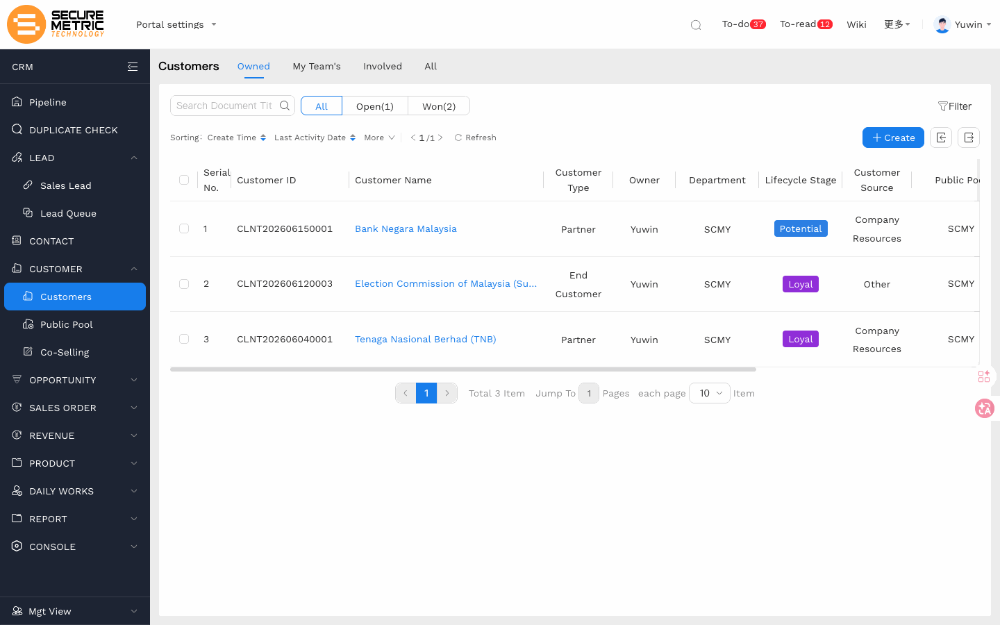
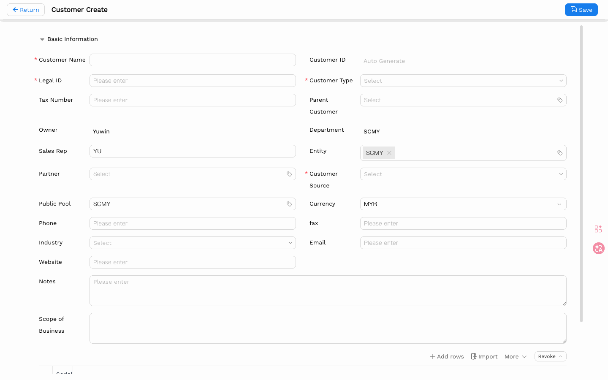
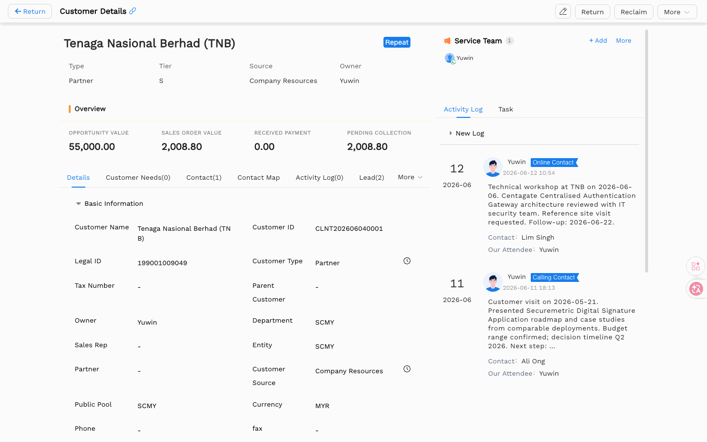

# Customer User Manual

> **Version**: V1.2 | **Date**: 2026-06-17 | **System**: Securemetric CRM (EasyCraft)

---

## Table of Contents

1. [Module Overview](#1-module-overview)
2. [List View](#2-list-view)
3. [Create a Customer](#3-create-a-customer)
4. [Details View](#4-details-view)
5. [Business Operations](#5-business-operations)
   - [5.1 Detail Page Action Buttons](#51-detail-page-action-buttons)
   - [5.2 Return to Public Pool](#52-return-to-public-pool)
   - [5.3 Public Pool Operations](#53-public-pool-operations)
   - [5.4 Create Job Task](#54-create-job-task)
   - [5.5 Merge Customer](#55-merge-customer)
   - [5.6 Change Customer Name](#56-change-customer-name)
   - [5.7 Customer Lost](#57-customer-lost)
   - [5.8 Customer Feedback](#58-customer-feedback)
   - [5.9 Joint Follower](#59-joint-follower)
6. [Business Rules & Workflow](#6-business-rules--workflow)
7. [FAQ & Notes](#7-faq--notes)

---

## 1. Module Overview

The **Customer** module is the central entity of Securemetric CRM. It stores all information about companies or organisations that Securemetric does business with, either as **End Customers** (direct buyers) or **Partners** (resellers, distributors, system integrators).

Every downstream transaction — Opportunities, Quotations, Sales Orders, Contracts, and Collections — is linked to a Customer record.

### 1.1 Entry Points

| Entry Point | Path |
|-------------|------|
| Main entry | Left sidebar → **Customer** | [Direct Link](http://172.18.114.231:8088/web/#/current/sys-modeling/app/km-ltc/listView/1hvp2b0bjw4vw6he8wg8l6lj3eo66ob102w1/1i1oh7vniw66w11k1w225fbfk1c7gcpr6aw1?type=list&navId=1hvp21k7lw4vw6h64w37pp9dm27vj66f3cw1){: target="_blank" rel="noopener"} |
| Create form | Left sidebar → Customer → **+ New** (or navigate to `/web/#/current/sys-modeling/app/km-ltc/add/1hvjheq3nw4vw4j48w3doaci42dfrsq13tw1`) |

### 1.2 Core Functions

- Maintain a master record of all business accounts (End Customer and Partner)
- Track customer ownership and joint followers (multiple sales reps)
- Store address information for multi-country operations (MY / VN / PH / ID)
- Serve as the root anchor for all sales pipeline activity

### 1.3 Customer Status

Customer records carry two independent status dimensions:

**Deal Status**

| Status | Description |
|--------|-------------|
| Not Closed | No contract or sales order has been confirmed yet |
| Closed | A linked opportunity was won, or a sales order/contract was confirmed |
| Multiple Closings | More than one deal has been closed with this customer |

**Assignment Status**

| Status | Description |
|--------|-------------|
| Unassigned | Customer is in the Public Pool with no owner |
| Assigned | Customer has an owner and is being actively followed up |

### 1.4 Customer Lifecycle

```
Lead conversion / manual creation
          ↓
   [Assigned] Sales follow-up
          ↓
   Manual return / timeout recovery
          ↓
   [Unassigned] Enters Public Pool
          ↓
   Claim / Allocate
          ↓
   [Assigned] Continue follow-up → Close deal
```

---

## 2. List View

Key columns include:

| Column | Description |
|--------|-------------|
| Customer Name | Primary identifier, click to open details |
| Customer Type | End Customer or Partner |
| Customer Source | How the customer was acquired |
| Legal Reg. Code | Unique registration number |
| Phone | Primary contact phone |
| Owner | Assigned sales representative |



### 2.1 View Scenarios

| Scenario Tab | Scope |
|--------------|-------|
| My Owned | Customers where the current user is the owner |
| My Team's | Customers owned by the current user's direct reports (for managers) |
| My Involved | Customers where the current user is a joint follower |
| All | All customers visible to the current user |

### 2.2 Filtering & Search

- Use the search bar at the top to filter by Customer Name or Legal Reg. Code.
- Use filter chips to narrow by Customer Type, Customer Source, or Owner.
- The **My Customers** toggle limits the list to records owned by or followed by the current user.

---

## 3. Create a Customer

### 3.1 Opening the Form

Navigate to the Customer list and click **+ New**, or use the direct URL above.



### 3.2 Field Reference

| Field | Required | Type | Notes |
|-------|----------|------|-------|
| Customer Name | Yes | Text input | Full legal or trading name |
| Legal Reg. Code | Yes | Text input | Must be unique across all customers |
| Customer Type | No | Cascade dropdown | End Customer / Partner; drives sub-type options |
| Customer Source | No | Cascade dropdown | How the customer was referred or found |
| Phone | No | Text input | Primary phone number |
| Email | No | Text input | Primary email address |
| Scope of Business | No | Textarea | Brief description of what the customer does |
| Owner | No | Address picker | Defaults to the logged-in user |
| Joint Follower(s) | No | Multi-user picker | Additional sales reps who can view and edit |

### 3.3 Saving

Click **Save** in the top action bar. The system assigns a unique Customer ID and redirects to the list view.

---

## 4. Details View

The Customer detail page contains the main record at the top and multiple sub-tabs below.



### 4.1 Header Information

Displays Customer Name, Customer Type, Owner, and key contact fields at a glance.

### 4.2 Sub-tabs

| Tab | Content |
|-----|---------|
| Details | All fields from the Create form |
| Customer Needs | Customer requirement records |
| Contact | Related contacts list |
| Contact Map | Visual hierarchy of contacts within the customer organisation |
| Activity Log | Follow-up records and communication history |
| Lead | Leads linked to this customer |
| Opportunity | All opportunities linked to this customer |
| PO | Associated purchase orders |
| Payment | Payment collections received |
| Invoice | Invoice requests linked to this customer |
| Payment Schedule | Collection schedule plans for this customer |
| Feedback | Recorded feedback and suggestions from the customer |

### 4.3 Editing

Click **Edit** in the top action bar to enter edit mode. Make changes and click **Save**.

---

## 5. Business Operations

### 5.1 Detail Page Action Buttons

Buttons in the top-right of the detail page are shown dynamically based on the current user's role and the customer's assignment status. When the number of visible buttons exceeds the fixed limit, the overflow is collapsed into a **"More"** drop-down.

#### General

| Button | Description | Visibility |
|--------|-------------|-----------|
| Print | Print customer details | Always visible |
| Edit | Edit customer fields | Always visible |

#### Owner Actions

| Button | Description | Visibility |
|--------|-------------|-----------|
| Return | Return the customer to the Public Pool | Current user is the owner AND assignment status = Assigned |
| Create Job Task | Create a follow-up task with due date and reminder | Assignment status = Assigned |
| Change Name | Modify the customer's name | Current user is the owner |
| Customer Lost | Mark the customer as lost | Current user is the owner AND customer lifecycle is not already at the **Lost** stage |

#### Public Pool Actions

| Button | Description | Visibility |
|--------|-------------|-----------|
| Claim | Take ownership of an unassigned customer | Assignment status = Unassigned; current user is a pool member; pool rule allows self-claim |
| Assign | Assign the customer to a specific sales rep | Assignment status = Unassigned; current user is pool manager |
| Reclaim | Forcibly return an assigned customer to the pool | Assignment status = Assigned; current user is pool manager |
| Transfer | Move the customer to another Public Pool | Current user is pool manager AND pool rule allows transfer; always visible when customer has no pool |
| Change Owner | Replace the customer's current owner | Customer has a pool and an owner; pool rule allows owner change |
| Merge | Merge this customer as a sub-customer of another | Always visible when customer has no pool; requires pool manager role when pool is assigned |

---

### 5.2 Return to Public Pool

Return an assigned customer to the Public Pool when follow-up is no longer progressing or a deal has been lost.

> **Prerequisite**: Current user is the customer's owner AND assignment status is **Assigned**

**Path**: Customer detail page → top-right → **Return**

- A return reason must be selected.
- If the customer does not yet belong to a Public Pool, you must choose a target pool before returning.
- After return, the customer enters the pool's **Unassigned** queue; owner and joint followers are cleared automatically.

### 5.3 Public Pool Operations

The Public Pool is the shared resource for unassigned customers. The following operations are available:

| Operation | Description | Prerequisite |
|-----------|-------------|-------------|
| **Claim** | Take ownership of an unassigned customer | User is a pool member; customer is Unassigned; pool rule allows self-claim |
| **Assign** | Pool manager assigns a customer to a specific rep | User is pool manager; customer is Unassigned |
| **Reclaim** | Pool manager forcibly returns an assigned customer to the pool | User is pool manager; customer is Assigned |
| **Transfer** | Move customer from current pool to another | User is pool manager; pool rule allows transfer; always available when customer has no pool |
| **Change Owner** | Replace the customer's current owner | Customer has a pool and an owner; pool rule allows owner change |

**Path**: Customer detail page → top-right → relevant action button

> **Holding limit**: If the current user has reached their customer holding limit, both **Claim** and **New** operations will be blocked. Contact the pool manager to adjust the quota or return existing customers first.

### 5.4 Create Job Task

Create a follow-up task for the customer, with a due date and reminder, to ensure timely engagement.

> **Prerequisite**: Customer assignment status is **Assigned**

**Path**: Customer detail page → top-right → **Create Job Task**

### 5.5 Merge Customer

Merge the current customer into another customer as a sub-customer, used for handling duplicates or structural re-organisation.

> **Prerequisite**: Always available when the customer has no Public Pool; requires pool manager role when a pool is assigned

**Path**: Customer detail page → top-right → **Merge**

- After merging, the current customer becomes a **sub-customer** of the target. It can be viewed in the target customer's "Sub-customers" tab.
- Merge cannot be undone — confirm carefully before proceeding.

### 5.6 Change Customer Name

Modify the customer's legal or trade name, with the change recorded in history.

> **Prerequisite**: Current user is the customer's owner

**Path**: Customer detail page → top-right → **Change Name**

### 5.7 Customer Lost

Mark the customer as lost, triggering the customer lifecycle to transition to the **Lost** stage.

> **Prerequisite**: Current user is the customer's owner AND the customer lifecycle is not already at the **Lost** stage

**Path**: Customer detail page → top-right → **Customer Lost**

**Customer lifecycle stages** (automatically triggered by action flows):

| Stage | Description |
|-------|-------------|
| Potential | Not yet contracted or transacted |
| Contracted | Contract signed |
| Official | Formal partnership established |
| Active | Ongoing active business engagement |
| Loyal | Long-term stable cooperation |
| Dormant | No active interaction for an extended period |
| Lost | Customer has churned; button no longer appears after this stage |

### 5.8 Customer Feedback

Record feedback, suggestions, or complaints gathered during customer interactions for future follow-up.

**Path**: Customer detail → Customer Feedback → **New**

### 5.9 Joint Follower

Allows multiple sales team members to collaborate on the same customer — suitable for key accounts or complex engagements. Joint followers can view and edit the customer record (subject to role permissions) and receive related notifications.

> **Prerequisite**: Current user is a Public Pool member with customer joint-follow permission

**Path**: CRM navigation menu → [**Customer Joint Follow**](http://172.18.114.231:8088/web/#/current/sys-modeling/app/km-ltc/listView/1igbbd2e4waswpc3twrlj022omb6g52lghw1/1igb3or39waswp7tvw3t9sn0rtepunb25pw1?type=list&navId=1hvp21k7lw4vw6h64w37pp9dm27vj66f3cw1){: target="_blank" rel="noopener"} → **New**

- The application supports an approval workflow; once approved, the applicant automatically joins the customer's Related Team as a joint follower.
- **Joint Follower** differs from **Joint Follower (direct)**: the latter is set directly on the customer form during create/edit; Joint Follower (formal) goes through a separate application and approval process.

---

## 6. Business Rules & Workflow

### 6.1 Legal Reg. Code Uniqueness

The Legal Reg. Code field enforces **system-wide uniqueness**. If you attempt to save a customer with a code already in use, the system will display a validation error. Verify the code before creating a new record — the customer may already exist.

### 6.2 Duplicate Check

When creating a customer, the system checks for duplicates using **Customer Name** as the default identifier. If a match is found, the save will be blocked. Use the **Duplicate Check Tool** to search for existing records before creating new ones.

### 6.3 Customer Holding Limit

Administrators can configure a **customer holding limit** per sales rep. Once the limit is reached, that user cannot create new customers or claim from the Public Pool until their current count decreases. Contact the pool manager to adjust the quota.

### 6.4 Automatic Pool Recovery

Each Public Pool can be configured with **timeout recovery rules**:

| Rule Type | Trigger |
|-----------|---------|
| No-follow-up recovery | No follow-up activity logged within the configured number of days |
| No-close recovery | No deal closed within the configured number of days |

When triggered, the customer is automatically returned to the pool and all owner/follower assignments are cleared. Follow up regularly to avoid unexpected recovery.

### 6.5 Joint Follower

**Joint Follower (direct)** is set on the customer form during create/edit. **Joint Follower (formal)** requires a separate application through the Customer Joint Follow menu and goes through an approval workflow before the applicant joins the customer's Related Team.

### 6.6 Customer Type: End Customer vs Partner

| Type | Description |
|------|-------------|
| End Customer | The organisation that directly uses or purchases Securemetric products/services |
| Partner | A reseller, distributor, or system integrator who sells on behalf of Securemetric |

Customer Type drives cascade sub-type options. Select the correct type at creation — changing it later may affect pipeline reporting.

---

## 7. FAQ & Notes

**Q: I cannot save because "Legal Reg. Code already exists". What do I do?**
Search the customer list for the existing code. If the record belongs to another owner, contact your manager or use the Public Pool claiming process. Do not create a duplicate.

**Q: Can I have more than one owner for a customer?**
There is only one **Owner**, but you can add multiple **Joint Followers** directly on the form, or apply for formal joint-follow access through the Customer Joint Follow menu. Both give visibility and edit rights.


