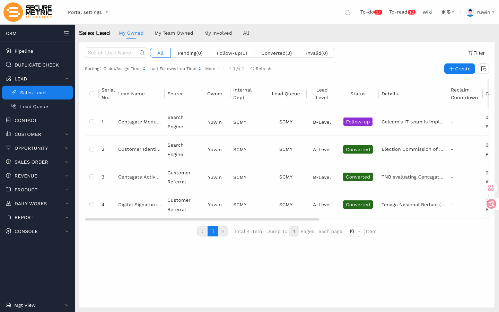
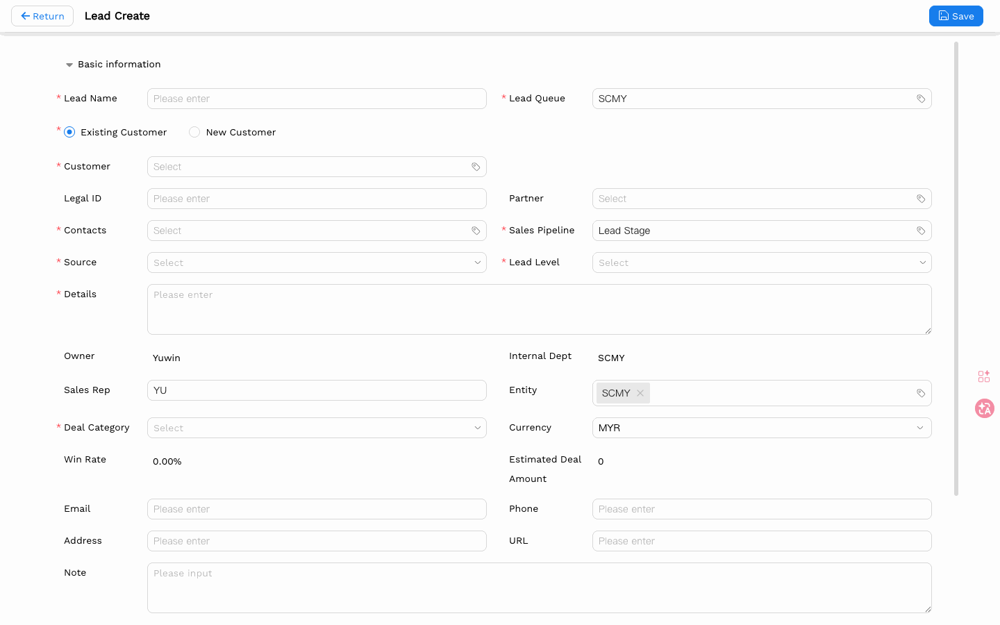
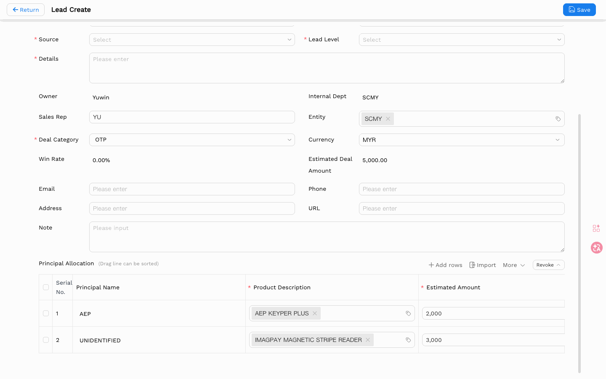
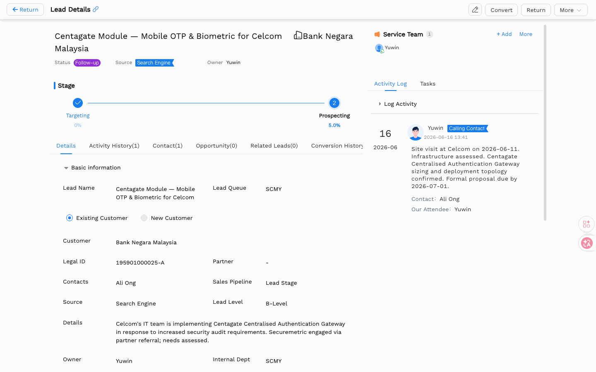
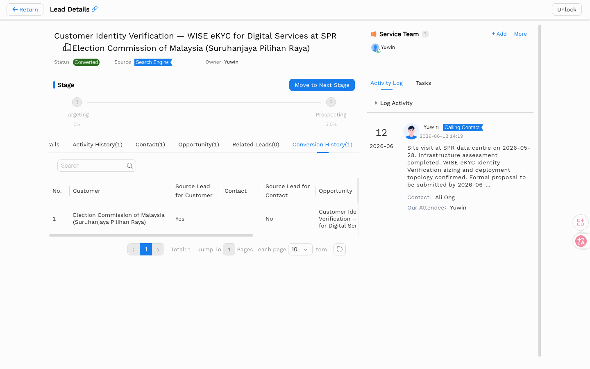

# Lead User Manual

> **Version**: V1.1 | **Date**: 2026-06-13 | **System**: Securemetric CRM (EasyCraft)

---

## Table of Contents

1. [Module Overview](#1-module-overview)
2. [Lead List View](#2-lead-list-view)
3. [Create a Lead](#3-create-a-lead)
4. [Lead Details View](#4-lead-details-view)
5. [Lead Management Operations](#5-lead-management-operations)
6. [Lead Conversion Workflow](#6-lead-conversion-workflow)
7. [Lead Import](#7-lead-import)
8. [FAQ](#8-faq)

---

## 1. Module Overview

Leads represent potential sales opportunities that have not yet been qualified. They follow a lifecycle: Acquisition → Assignment → Follow-up → Conversion (to Opportunity or Customer).

### 1.1 Entry Points

- **Sidebar**: Navigate to **LEAD → Sales Lead** | [Direct Link](http://172.18.114.231:8088/web/#/current/sys-modeling/app/km-ltc/listView/1i2b2u2how6aw3k7dw1a3anjl3jnug8m31w1/1i2b2u2how6aw3k7dw1a3anjl3jnug8m31w1?type=list&navId=1hvp21k7lw4vw6h64w37pp9dm27vj66f3cw1){: target="_blank" rel="noopener"}

### 1.2 Core Functions

| Function | Description |
|----------|-------------|
| Lead Creation | Create new sales leads with customer and deal information |
| Lead Pool | Manage unassigned and assigned leads; unprocessed leads are auto-recalled after 7 days |
| Lead Assignment | Sales Manager assigns leads to sales staff from the queue |
| Lead Conversion | Convert a qualified lead into an Opportunity (2-step process) |
| Lead Import | Bulk import leads from an Excel file |
| Task Management | Create follow-up tasks with due dates and reminders |

### 1.3 Lead Statuses

| Status | Description | Trigger |
|--------|-------------|---------|
| Unassigned | In the Lead Pool, no owner assigned | After import/creation; or after being returned to the pool |
| Pending | Owner assigned, follow-up not yet started | Manager assigns or sales rep claims the lead |
| Follow-up | Owner is actively following up | Owner clicks "Follow-up" or adds an activity record |
| Invalid | Marked as no longer worth pursuing | Owner manually marks after losing contact or no interest |
| Convert Customer | Lead conversion workflow in progress | Automatically set when owner clicks "Convert" |
| Converted | Successfully converted to Customer/Opportunity | Automatically set after conversion is completed |
| Disabled | Lead has been disabled; no further workflow | System or admin action |

### 1.4 Lead Lifecycle

```
Marketing activity / Manual entry / Import
              ↓
    [Unassigned] Enters Lead Pool
              ↓
    Claim / Manager allocates
              ↓
    [Pending] Awaiting follow-up
              ↓
    First follow-up (add activity record)
              ↓
    [Follow-up] ──→ SLA timeout ──→ Auto-recalled to Queue [Unassigned]
              ↓
    [Converted] → Customer + Contact + Opportunity
        or
    [Invalid] → Lead archived
```

> **SLA timeout rule**: After a lead is assigned, if no follow-up activity occurs within the configured number of days, the system automatically recalls it to the queue and resets it to **Unassigned**. The "Reclaim Countdown" column in the list shows time remaining.

---

## 2. Lead List View



### 2.1 Ownership Filter Tabs

- **My Owned**: Leads owned by me
- **My Team Owned**: Manager view — see all leads owned by your team members
- **My Involved**: Leads where I am a team member
- **All**: All leads visible to me

### 2.2 Status Filter Tabs

- **All** | **Unassigned** | **Pending** | **Follow-up** | **Converted** | **Invalid**

### 2.3 List Features

| Feature | Description |
|---------|-------------|
| Search | Enter a phone number in the search bar to find a lead quickly |
| Sorting | Sort by Create Time, Assign Time, or Last Followed-up Time |
| Bulk Actions | Select multiple leads to delete them in one go |
| Pagination | Shows total count at the bottom; jump to any page |

### 2.4 Information Shown Per Lead

Each row displays:
- Lead Name, Customer, Owner, Status
- Estimated Deal Amount and Currency
- Reclaim countdown (e.g., "7Days" remaining, or "-1Days" if overdue)
- Create Time, Last Followed-up Time

---

## 3. Create a Lead

### 3.1 Entry

Click **+ Create** button on the Lead List toolbar to open the Lead Create form.



### 3.2 Basic Information

| Field | Required | Notes |
|-------|----------|-------|
| Lead Name | Yes | System suggests existing records as you type to prevent duplicates |
| Lead Pool | Yes | Defaults to your entity's queue |
| Customer Type | Yes | Select **New Customer** or **Existing Customer** — do this first |
| Customer | Conditional | Required when Customer Type = Existing Customer |
| Legal ID | No | Company registration number |
| Partner | No | Associated partner organization |
| Source | Yes | How the lead was acquired (e.g. Referral, Website, Conference) |
| Lead Level | Yes | A-Level / B-Level / C-Level |
| Sales Pipeline | Yes | Default: "Lead Stage" |
| Details | Yes | Sales notes or background about this lead |
| Email | No | Contact email |
| Phone | No | Contact phone number |
| Address | No | Business address |
| URL | No | Company website |
| Note | No | Any additional remarks |

### 3.3 Deal Details

| Field | Required | Notes |
|-------|----------|-------|
| Deal Category | Yes | Select the product category from the popup (e.g. PKI, HSM) |
| Entity | No | The company entity responsible for this lead; can select multiple |
| Currency | No | Defaults to the entity's currency automatically |
| Estimated Deal Amount | No | Expected deal value; defaults to 0 |

### 3.4 Product Table

> ⚠️ **Important**: At least one product row with an estimated amount is required before submitting.

Steps:
1. Click **+ Add rows**
2. Select a **Product** — the system automatically fills in the Principal (supplier)
3. Enter the **Estimated Amount**
4. MYR Value and Weighted Amount are calculated automatically — no manual input needed

> 💡 Products are account-scoped; only products linked to the current account are available.



### 3.5 Footer

| Field | Description |
|-------|-------------|
| Win Rate | Auto-calculated based on the current stage — no manual input needed |

---

## 4. Lead Details View



### 4.1 Sub-Tabs

| Tab | Description |
|-----|-------------|
| Details | Form view with basic information |
| Activity History | Workflow audit trail (Owner, Acquisition method, Status/Stage, timestamps) |
| Contact | Associated contacts |
| Opportunity | Related opportunities |
| Related Leads | Child leads under parent lead |
| Conversion History | Conversion records |

---

## 5. Lead Management Operations

### 5.1 Detail Page Action Buttons

Buttons on the top-right of the lead detail page appear dynamically based on the current user's role and the lead's status. When the number of visible buttons exceeds the fixed limit, the overflow is collapsed into a **"More"** dropdown.

#### General Actions

| Button | Description | Condition |
|--------|-------------|-----------|
| Print | Print the lead record | Always visible |
| Lock | Lock the lead to prevent further edits | Lead is not locked |
| Unlock | Remove the lock | Lead is locked |
| Create Task | Create a follow-up task with a deadline and reminder | Status ≠ Unassigned, and lead is not locked |

#### Lead Owner Actions

| Button | Description | Condition |
|--------|-------------|-----------|
| Edit | Modify lead fields | Lead is not locked |
| Follow-up | Switch lead status to **Follow-up** | Status is **Pending** or **Invalid**, not locked, current user is owner |
| Return | Return the lead to the Lead Pool | Status is **Pending / Follow-up / Invalid**, not locked, current user is owner |
| Mark Invalid | Mark the lead as invalid | Status is **Pending** or **Follow-up**, not locked, current user is owner |
| Convert | Start the lead conversion workflow (create Customer / Opportunity) | Status is **Follow-up**, Win Rate is filled in, current user is owner, lead is not locked |
| Reset Stage Pusher | Reset the sales pipeline stage to its initial node | Status is **Pending** or **Follow-up**, not locked, current user is owner |

#### Lead Pool Member Actions

| Button | Description | Condition |
|--------|-------------|-----------|
| Claim | Take ownership of an unassigned lead | Status is **Unassigned**, not locked, current user is a pool member, pool rules allow self-claiming |
| Consolidate | Consolidate this lead under another parent lead | Status is **Pending** or **Follow-up**, lead is in normal lock state, current user is pool member or admin |

#### Lead Pool Admin Actions

| Button | Description | Condition |
|--------|-------------|-----------|
| Assign | Assign the lead to a specific sales rep | Status is **Unassigned**, lead is not locked |
| Recall | Forcibly reclaim an assigned lead | Status is **Pending / Follow-up / Invalid**, lead is not locked |
| Transfer | Move the lead to another Lead Pool | Status is **Pending / Follow-up / Invalid**, not locked, pool rules allow transfer |
| Change Owner | Reassign the lead owner to another sales rep | Status is **Pending / Follow-up / Invalid**, lead is not locked |
| Consolidate | Same as above (available to both members and admins) | Same as above |

### 5.2 Service Team Management

Click the Service Team section on the lead detail page to manage who is involved:

- Set each person's role: **Head** (owner) or **Member**
- Set their permission: **Edit** or **Read Only**
- Click **+ Add more** to add team members

### 5.3 Lead Pool

A Lead Pool controls who can see and act on its leads, and governs claiming and transfer behaviour through configurable rules:

**Claim Rules**
- **Visible & Claimable by Members**: Members can self-claim leads; admins can also assign directly
- **Hidden from Members**: Members cannot see the leads; only admins can assign them

**Transfer Rules** (optional)
- When enabled, pool members who have claimed a lead may transfer it to another Lead Pool

Leads that are not acted on within the configured number of days are automatically returned to the Lead Pool for reassignment.

### 5.4 SLA Reclaim Countdown

The Lead Pool list shows a **"Reclaim Countdown"** column:

- **"7Days"** → 7 days remaining before auto-reclaim
- **"2Days"** → 2 days remaining
- **"-1Days"** → Overdue — the lead has been auto-returned to the Public Pool

> 💡 **Business Rule**: The countdown starts from the moment the lead is assigned. When the countdown reaches negative values, any Account Manager in the region can claim the lead from the Public Pool.

### 5.5 Entity Isolation & Service Team Access

**Entity Isolation:**
- Users can only see leads belonging to their entity (e.g., SCMY users see only SCMY leads)
- Direct URL access to another entity's lead returns "Access Denied"

**Service Team Override:**
- Adding a user to a lead's Service Team grants them access regardless of entity
- **Read-Only** permission: user can view but cannot edit the lead
- **Read-Write** permission: user can edit the lead
- **Owner auto-assignment**: When a lead is created, the creator is automatically added to the Service Team

### 5.6 Lead Pool Operations

The Lead Pool is the shared pool for managing unassigned leads. For full button conditions by role, see **5.1 Detail Page Action Buttons**.

**Path**: Lead detail page → top-right → relevant action button

> **Holding limit**: If the current user has reached their lead holding limit, the Claim operation will be blocked. Contact the Lead Pool admin to adjust the quota.

### 5.7 Change Owner

Transfer lead ownership to another sales rep. The original owner can be kept as a team member or removed entirely.

> **Prerequisite**: Current user is a Lead Pool admin, lead status is **Pending / Follow-up / Invalid**, and the lead is not locked

**Path**: Lead detail page → top-right → **Change Owner**

- **Remove from team**: Original owner is removed immediately with no remaining access
- **Keep as team member**: Original owner becomes a regular member (read-only or edit permission)

### 5.8 Consolidate Leads

Consolidate related leads under one parent lead to track them together as a group.

**Path**: Lead detail page → top-right → **Consolidate**

After consolidation, the child lead appears under the parent lead's **Related Leads** tab.

> **Prerequisite**: Status is **Pending** or **Follow-up**, lead is in normal lock state, current user is a Lead Pool member or admin

---

## 6. Lead Conversion Workflow

### 6.1 Prerequisites

> **Prerequisite**: Lead status is **Follow-up**, the sales pipeline stage has been advanced to **Prospecting**, and the current user has lead conversion permission

The system performs duplicate checks during conversion:
- **Customer duplicate check**: If a customer with the same name already exists, you may convert to the existing customer (requires view access) or create a new one
- **Contact duplicate check**: If a matching contact already exists, you can only link to the existing contact — a new one cannot be created
- **Opportunity duplicate check**: If a duplicate opportunity is detected, conversion will fail

### 6.2 Entry

From Lead List or Detail view, click **Convert** to open the "Sales Lead-Conversion" modal.



### 6.3 Step 1: Customer

- Verification/creation of the customer account
- Contacts from the Lead are automatically associated with the Customer

### 6.4 Step 2: Opportunity

| Field | Notes |
|-------|-------|
| Sales Stage | Stage the opportunity will start at |
| Deal Category | Product category |
| Currency | Billing currency (e.g., MYR, IDR) |
| Estimated Deal Amount | Expected deal value |
| Entity | Responsible company entity (e.g., SCMY, PTS) |
| Sales Rep | Person handling the deal |
| Contacts | Tag input — auto-carried from Lead Contact Person table (required) |

### 6.5 Carry Over Information

> **What gets carried over from Lead to Customer, Contact, and Opportunity?**

After completing Step 2, the conversion modal shows a **"Carry Over Information"** section with two groups of checkboxes (all checked by default):

**Copy Team to:**
- ☑ Customer — copy the Lead's Service Team to the new Customer record
- ☑ Contact — copy the Lead's Service Team to the new Contact record
- ☑ Opportunity — copy the Lead's Service Team to the new Opportunity record

**Copy Activities to:**
- ☑ Customer — copy the Lead's Activity Log history to Customer
- ☑ Contact — copy the Lead's Activity Log history to Contact
- ☑ Opportunity — copy the Lead's Activity Log history to Opportunity

> 💡 **Tip**: Uncheck any box if you do NOT want that data carried over. You must check the box to "add" the service team or activities to the target entity.

### 6.6 Opportunity Products Table

Product details are carried over from the lead. Review and adjust if needed:

| Column | Notes |
|--------|-------|
| Principal Name | Product supplier |
| Product | Product name |
| Estimated Amount | Expected value for this product |

### 6.7 Post-Conversion State

- Status badge changes to green **"Converted"**
- Opportunity(1) tab shows linked opportunity
- Conversion Record(1) tab shows conversion history

---

## 7. Lead Import

### 7.1 Entry

Click **Import** button (document icon with inward arrow) on the Lead List toolbar.

### 7.2 Import Settings

| Field | Required | Notes |
|-------|----------|-------|
| Import Mode | Yes | Choose based on your needs (see below) |
| Condition Field | Yes | Used to match existing records; set to "Lead Name" |
| Duplicate Check Field | No | Optional; helps prevent importing duplicates |

### 7.3 Import Modes

| Mode | When to use |
|------|-------------|
| Add Import | Add new records only; skip any that already exist |
| Update Import | Update existing records only; skip new ones |
| New and Update | Add new and update existing records (most common) |
| Quick Import | Import main record data only (without sub-tables) |

### 7.4 Excel Template

The import template has 17 columns. The following are required:

**Required**: Lead Name, Details, Mobile, Lead Level, Source, Lead Pool, Business Process, Status, Lock Status, Sales Pipeline

**Optional**: Customer Company, Customer Dept, Position, Email Address, Address, Association

> **Note**: Lead Level must be A-Level, B-Level, or C-Level. Lock Status is a number: 1 = Unlocked, 2 = Locked.

### 7.5 Enum Validation & Error Handling

During import, the system validates enum fields against allowed values:

| Field | Allowed Values | Invalid Example | Result |
|-------|---------------|-----------------|--------|
| Lead Level | A-Level, B-Level, C-Level | "D-Level" | ❌ Import fails for this row |
| Source | Search Engine, Customer Referral, Conference, Advertisement, Telephone, Website, Other | "Cold Call" | ❌ Import fails for this row |
| Lead Pool | SMMY, SCMY (entity-specific) | "XYZ" | ❌ Import fails for this row |
| Lock Status | 1 (Unlock), 2 (Locked) | "3" or text | ❌ Import fails for this row |

**Import Result Summary**:
After import completes, a summary shows: **N succeeded, M failed, K updated**

- Failed rows are listed with specific error messages (e.g., "Lead Level 'D-Level' is not in allowed values")
- You can correct the errors in your Excel file and re-import the failed rows

---

## 8. FAQ

**Q: How many days do I have to act on an assigned lead before it's auto-recalled?**
The timeout is configured per queue and may differ across queues. Check the "Reclaim Countdown" column in the lead list for the exact days remaining. When it hits zero the lead is automatically returned to the queue.

**Q: What activities reset the SLA countdown?**
Adding an activity record (sales log), changing the lead status, or clicking the "Follow-up" action all count as follow-up activity and reset the countdown.

**Q: Conversion shows "duplicate customer found". What should I do?**
The system found an existing customer with the same name. Choose to convert into the existing customer (you need view access to that record) or confirm it is truly a new entity and create a new one. Do not create duplicate records.

**Q: The lead is already Converted. Can I convert it again?**
No. Once Converted, the status is final. If any data is incorrect, edit the created Customer, Contact, or Opportunity records directly.

**Q: I can't see a lead that my colleague mentioned. Why?**
Possible reasons: ① The lead belongs to a different entity (entity isolation); ② You are not in the lead's Service Team; ③ The lead is in a queue you don't have access to. Ask the lead owner to add you to the Service Team, or contact an admin to check your permissions.

**Q: What value do I put in the "Lead Pool" field when importing?**
Use the queue's system code (e.g., SCMY, SMMY), not its display name. You can find the system codes on the queue management page.

