# P&L User Manual

> **Version**: V1.1 | **Date**: 2026-06-15 | **System**: Securemetric CRM (EasyCraft)

---

## Table of Contents

1. [P&L Module Overview](#1-pnl-module-overview)
2. [P&L Creation Process](#2-pnl-creation-process)
3. [P&L Product Category Management](#3-pnl-product-category-management)
4. [P&L Details and Multi-Year View](#4-pnl-details-and-multi-year-view)
5. [P&L Approval Workflow](#5-pnl-approval-workflow)
6. [FAQ and Notes](#6-faq-and-notes)

---

## 1. P&L Module Overview

The P&L (Profit & Loss) module is the central pricing engine of the CRM system. It is used to calculate product costs and profit margins, and generates the formal quotation (Quotation) once approved.

### 1.1 Entry Points

- **Method 1**: Sidebar → Navigate to Opportunity Details → Click "P&L" tab → Click "Create"
- **Method 2**: Sidebar → Navigate directly to P&L module → Click "Create" | [Direct Link](http://172.18.114.231:8088/web/#/current/sys-modeling/app/km-ltc/listView/1jgm4elqbw5fw6fchw25vqita1j32h2sclw4/1jqqtlk45wfw1r8u6w107lsh8tire8u3jbw0?type=list&navId=1hvp21k7lw4vw6h64w37pp9dm27vj66f3cw1){: target="_blank" rel="noopener"}

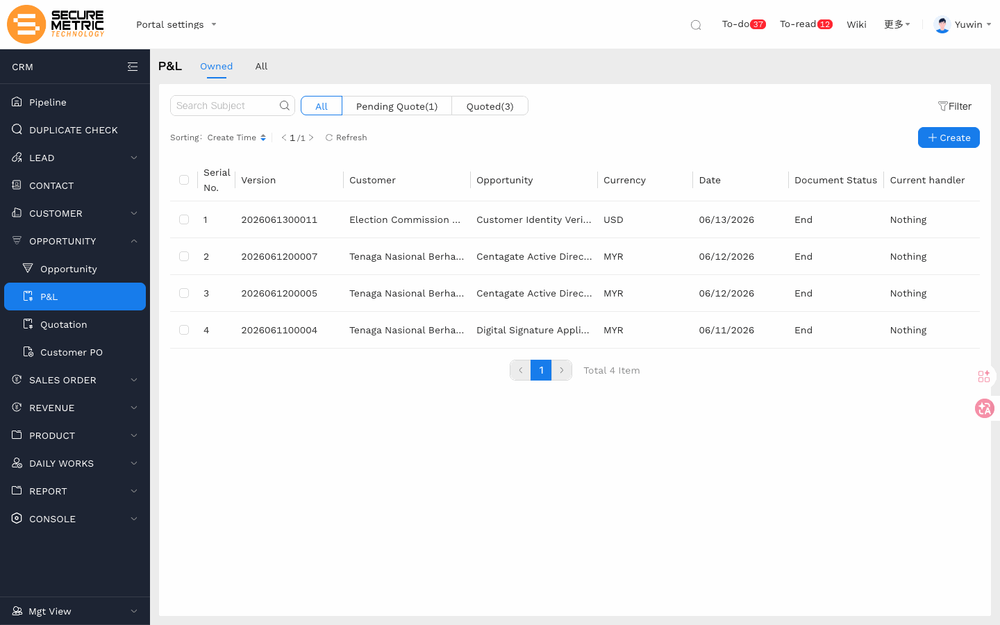

### 1.2 Core Functions

| Function | Description |
|----------|-------------|
| Cost Calculation | Enter costs and prices by product category |
| Profit Calculation | Auto-calculate total revenue, total cost, total profit, and margin |
| Multi-Year Management | Support Year 1 / Year 2 (RENEW) / Year 3 (RENEW) renewal view |
| Discount Management | Support both global discount and per-line discount |
| Approval Workflow | Auto-trigger approval workflow upon submission |
| Cloning | Copy existing P&L for quick creation |

---

## 2. P&L Creation Process

### 2.1 Basic Information

On the P&L Create page, first fill in the basic information:

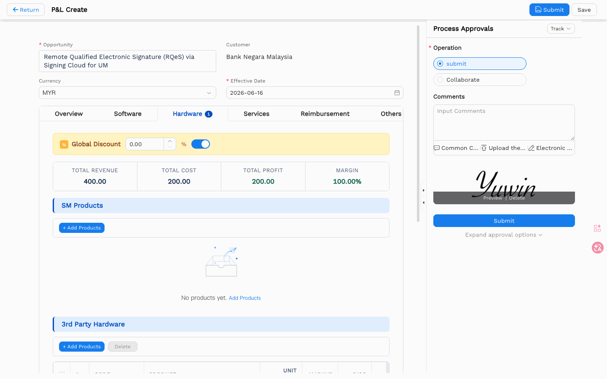

| Field | Description | Required |
|-------|-------------|----------|
| Version | Version number (auto-generated) | Auto |
| Customer | Customer name (auto-filled from Opportunity) | Auto |
| Opportunity | Linked opportunity | Yes (*) |
| Currency | Currency (default MYR) | Yes (*) |
| Date | Date (default today) | Yes (*) |

**Action Buttons**:
- **Save** (blue button, top right): Save as draft
- **Return** (top left): Return to list

### 2.2 Category Tab Navigation

P&L uses 7 category tabs to manage different product types:

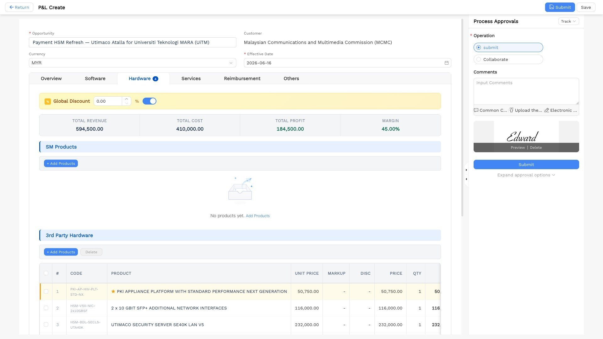

| Tab | Description | Badge Meaning |
|-----|-------------|---------------|
| Overview | Summary view of all categories | — |
| Software | Software products | Number of software items added |
| Hardware | Hardware products | Number of hardware items added |
| Hardware Renew | Hardware renewal products | Number of renewal items added |
| Services | Professional services | Number of service items added |
| Reimbursement | Reimbursement expenses | Number of reimbursement items added |
| Others | Other categories | Number of other items added |

Each tab displays a blue circular badge showing the item count for that category.

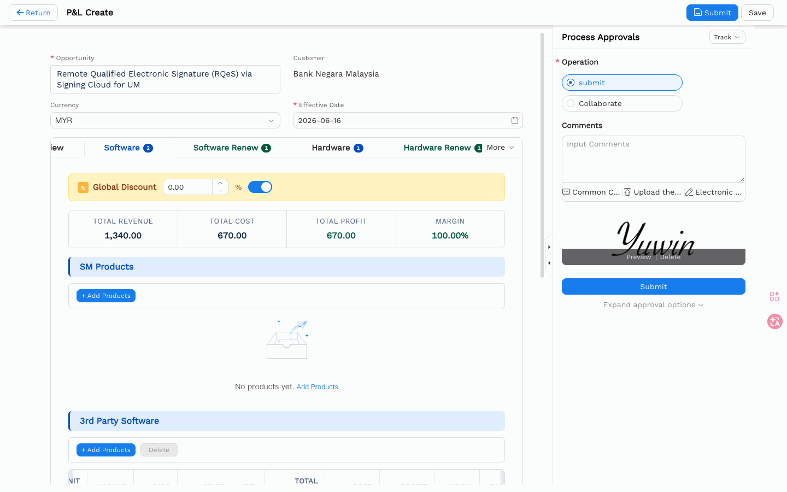

### 2.3 Global Discount Setting

At the top of the page is a yellow-highlighted global discount bar:

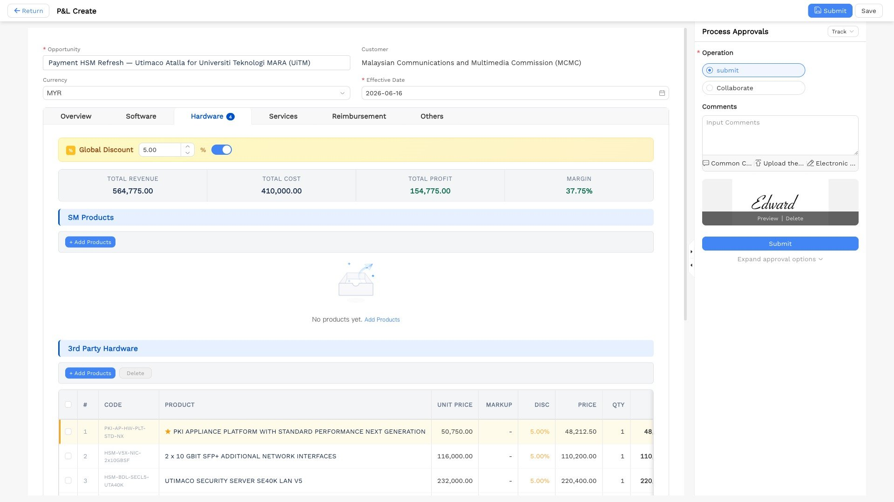

- **Discount Input**: Enter percentage value (e.g., 5.00%)
- **Toggle Switch**: Blue = enabled, grey = disabled
- **When Enabled**: All product lines automatically inherit the global discount
- **When Disabled**: Each product line requires individual discount setting

### 2.4 Financial Summary Cards

The top of the page displays four key financial metrics:

| Card Name | Description | Color |
|-----------|-------------|-------|
| Total Revenue | Total revenue | Blue text |
| Total Cost | Total cost | Default |
| Total Profit | Total profit (Revenue - Cost) | Green text |
| Margin | Margin percentage (Profit / Selling Price × 100%) | Green (healthy) / Red (below target) |

> ⚠️ **Note**: The system uses Gross Margin calculation: `Margin = (Profit / Selling Price) × 100%`, which is the standard Gross Margin `(Profit / Revenue) × 100%`.

---

## 3. P&L Product Category Management

### 3.1 Adding Products

Under each product category, click the "+ Add Products" button to open the product selection modal:

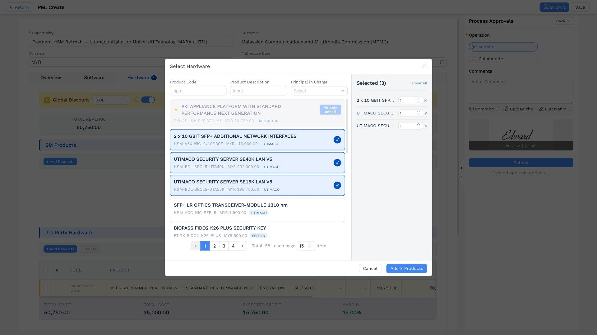

**Modal Structure**:
- **Left Panel**: Search filters (Product Code, Product Description inputs) + Product list
- **Right Panel**: "Selected (N)" — list of chosen products
- **Bottom Buttons**: Cancel, Add N Products (disabled when N=0)

### 3.2 Product Table Columns

| Column | Description | Editable |
|--------|-------------|----------|
| CODE | Product code | Auto-filled |
| PRODUCT | Product name | Auto-filled |
| UNIT PRICE | Unit selling price | Editable |
| MARKUP | Markup percentage | Editable |
| DISC | Discount percentage | Editable (or inherits global) |
| PRICE | Net price after discount | Auto-calculated |
| QTY | Quantity | Editable |
| TOTAL PRICE | Total (PRICE × QTY) | Auto-calculated |
| COST | Cost | Editable |
| PROFIT | Profit (Total - Cost) | Auto-calculated |
| MARGIN | Margin percentage | Auto-calculated |
| TARGET | Target margin | System-defined |
| Actions | Action links | — |

### 3.3 Row Actions

Each product row provides three action links:

| Action | Description |
|--------|-------------|
| Edit | Opens right-side edit panel to modify product parameters |
| Renew | Creates a renewal product line (for Hardware Renew tab) |
| Delete | Removes the product line |

### 3.4 Editing Products

Click a product row directly, or click the "Edit" link at the end of the row, to open the right-side edit drawer:


Editable parameters:
- **Markup**: Markup percentage
- **Discount**: Discount (global or per-line)
- **Quantity**: Item quantity
- **Price Breakdown**: Price details (original, after markup, total)
- **Cost**: Cost details

Click "Save" to confirm changes, or "Cancel" to discard.

### 3.5 Professional Services (Services)

Professional services are managed through SM Team / 3rd Party Team tables:

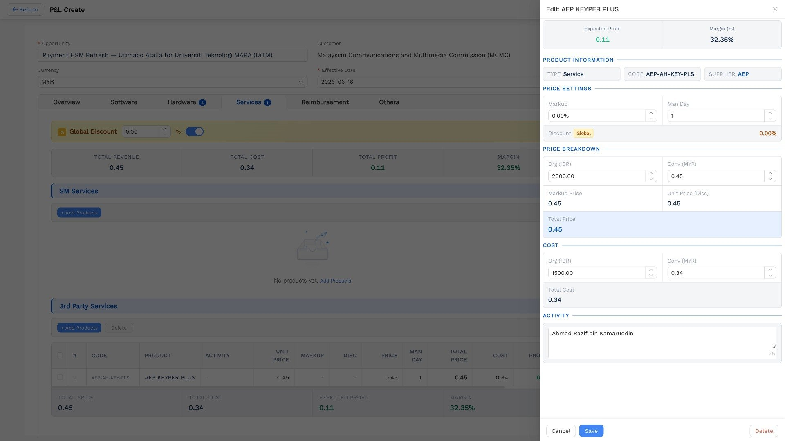

| Column | Description |
|--------|-------------|
| ACTIVITY | Activity description (e.g., "Flight", "Senior Manager") |
| NOTE | Additional notes |
| RATE/DAY | Selling rate per day |
| DAYS | Billable days |
| TOTAL PRICE | Total (RATE/DAY × DAYS) |
| COST RATE/DAY | Internal cost rate per day |
| DAYS (COST) | Cost days (can differ from revenue days) |
| TOTAL COST | Total cost |
| PROFIT | Profit |
| MARGIN | Margin percentage |

### 3.6 Reimbursement

Click "+ Add Products" to open the "Add Reimbursement" modal:

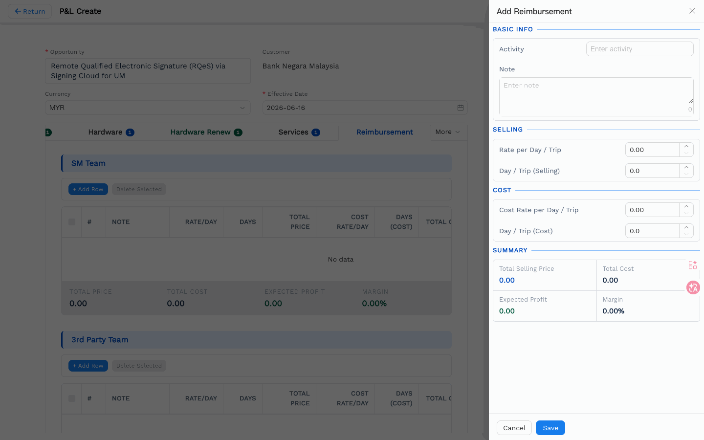

| Field | Description |
|-------|-------------|
| Activity | Activity type (dropdown, e.g., "Flight") |
| Note | Notes |
| Rate per Day / Trip | Selling rate per day/trip |
| Day / Trip (Selling) | Number of selling billing units |
| Cost Rate per Day / Trip | Cost rate per day/trip |
| Day / Trip (Cost) | Number of cost billing units |
| Total Selling Price | Auto-calculated |
| Total Cost | Auto-calculated |
| Expected Profit | Auto-calculated |
| Margin | Auto-calculated |

### 3.7 Product Overview

On the Overview tab, you can see a summary of all products:

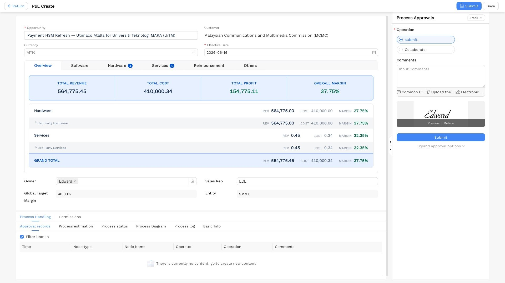

Each category displays a sub-total footer:
- Total Price (category total)
- Total Cost (category total cost)
- Expected Profit (category profit)
- Margin (category margin)

---

## 4. P&L Details and Multi-Year View

### 4.1 Details Page

The P&L Details page (titled "P&L Details") shows saved P&L records:

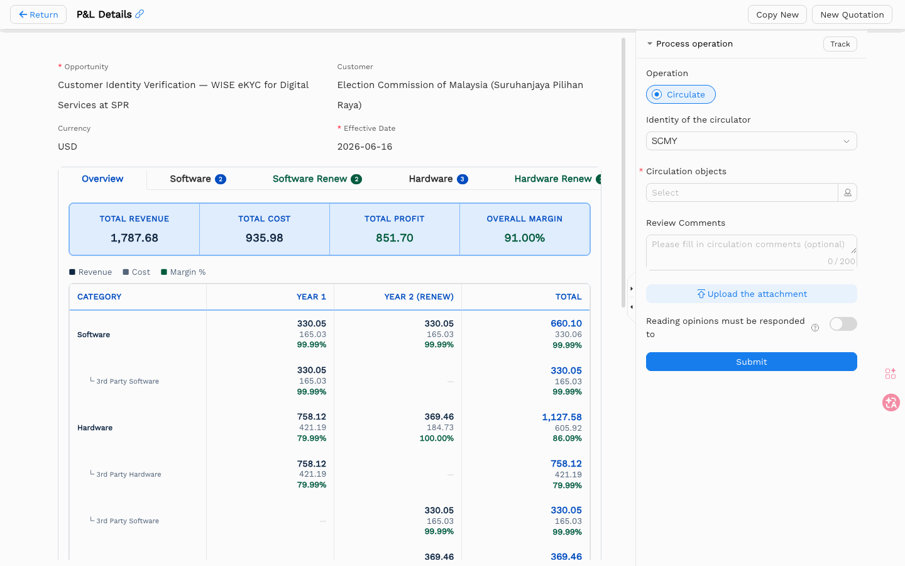

**Action Buttons**:
- **Edit** (pencil icon): Enter edit mode
- **Delete** (trash icon): Delete record
- **Copy New**: Clone to create a new P&L
- **New Quotation**: Create a quotation based on this P&L

### 4.2 Multi-Year View

The details page includes a financial summary table organized by year:

| Category | YEAR 1 | YEAR 2 (RENEW) | YEAR 3 (RENEW) | TOTAL |
|----------|--------|----------------|----------------|-------|
| Software | Rev/Cost/Margin | Renewal data | Renewal data | 3-year total |
| Hardware | Rev/Cost/Margin | Renewal data | Renewal data | 3-year total |
| Services | Rev/Cost/Margin | Renewal data | Renewal data | 3-year total |
| Reimbursement | Rev/Cost/Margin | — | — | Total |
| **GRAND TOTAL** | **Year total** | **Year total** | **Year total** | **Grand total** |

Each cell shows revenue, cost, and margin percentage for that category in that year (color-coded: green = healthy).

### 4.3 Metadata Fields

Below the table:
- **Entity**: Company entity code (e.g., SMMY)
- **Deal Category**: Deal category (e.g., ADSS)

### 4.4 Permission Settings

At the bottom of the details page, there is a "Permissions" tab:

| Permission Type | Default Value |
|-----------------|---------------|
| Readers | "No one can read except the author and related personnel" |
| Editors | "Administrator" |
| Attachment Download | Restricted to author and related personnel |

---

## 5. P&L Approval Workflow

### 5.1 Right-Side Approval Panel

The right side of the P&L Create page displays the "Process Approvals" panel:

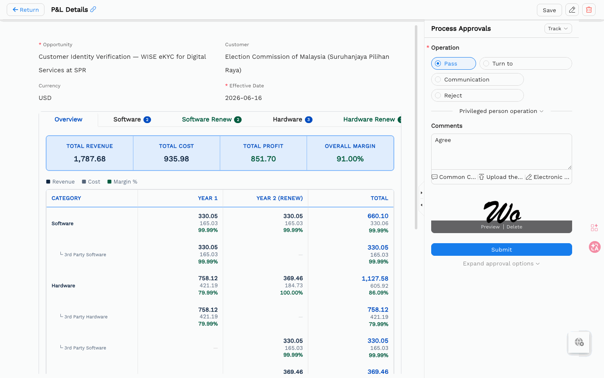

| Element | Description |
|---------|-------------|
| Track Dropdown | Select approval tracking view |
| Input Processing Comments | Approval comments text area |
| Common Comments | Quick-insert common comments |
| Upload attachment | Upload approval attachments |
| Signature Preview | Digital signature preview (shows signature image) |
| Submit | Large blue submit button |
| Expand approval options | Expand more approval options |

### 5.2 Approval Workflow Logic

P&L approval follows this logic:

```
Submit P&L → System compares Margin vs Target
    ├─ Any line item margin < target → Route to Head of Department (HOD)
    ├─ Any Key Product included → Route to HOD
    ├─ Grand total margin < target → Route to Finance team
    └─ All criteria met → Auto-approve
```


### 5.3 Multi-User Collaboration (Before Approval)

Before submitting for approval, P&L supports **multi-user collaboration**:

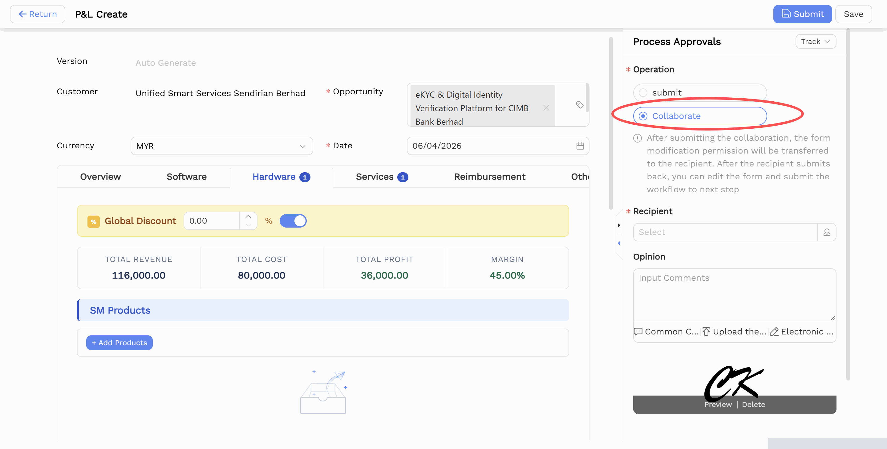

1. **Initiator creates P&L** → fills in form data
2. **Click "Collaborate"** in the Process Approvals sidebar (instead of "Submit")
   - Operation radio buttons: `Submit` | `Collaborate` (selected)
   - Instructional text: *"After submitting the collaboration, the form modification permission will be transferred to the recipient. After the recipient submits back, you can edit the form and submit the workflow to the next step."*
3. **Select Recipient** → opens EasyCraft user picker modal
   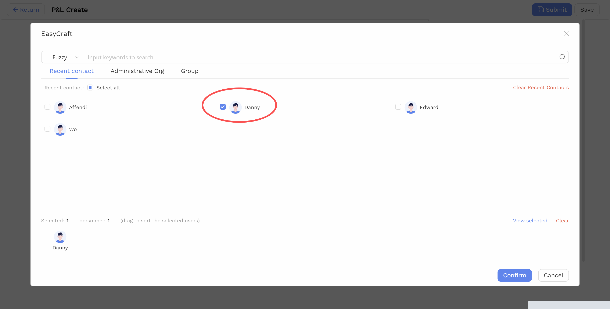
   - Tabs: Recent contact / Administrative Org / Group
   - Supports fuzzy keyword search
   - Select user(s) → Confirm
4. **Form permission transfers to Recipient**
   - Recipient receives a To-do item in the Message Center
   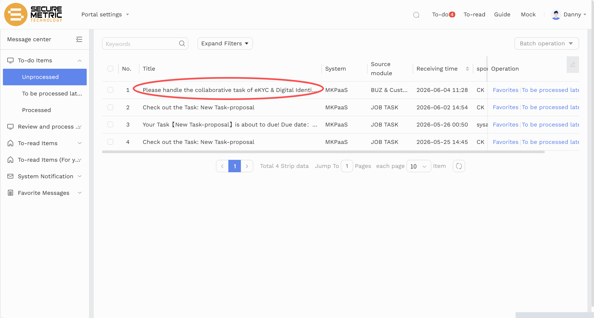
5. **Recipient opens P&L → clicks Edit** (pencil icon, top-right)
   
   - Can modify any field, add/remove line items
6. **Recipient submits back** → permission returns to initiator
7. **Initiator can**:
   - Assign to another collaborator (repeat the cycle)
   - Click **"Submit"** to enter the approval workflow
   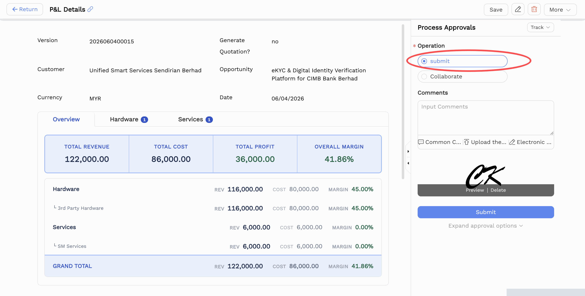

> 💡 **Key Point**: Collaboration is distinct from approval — no HOD/Finance routing happens during collaboration. Only the initiator can submit for formal approval.

### 5.4 Status Flow

| Action | Status |
|--------|--------|
| Save | Draft |
| Submit | Pending Approval |
| Revoke | Revoked |
| Approved | Approved |
| Rejected | Rejected (requires revision and resubmission) |

---

## 6. FAQ and Notes

### 6.1 Multi-Year Contracts

- Hardware products can span multiple years (Year 1 / Year 2 RENEW / Year 3 RENEW)
- Renewal products are managed on the "Hardware Renew" tab
- Use the "Renew" action to create a renewal line from an existing product

### 6.2 Global Discount

- When global discount is enabled, all product lines automatically inherit the discount
- When disabled, each product line requires individual discount setting
- Discount is auto-calculated in the Price column: `Net Price = Unit Price × (1 + Markup) × (1 - Discount)`

### 6.3 Permission Control

- By default, only the author and related personnel can view the P&L
- Edit permissions are limited to Administrator
- Attachment download is restricted to author and related personnel

---

> **End of Document** | Version V1.1 | 2026-06-15
