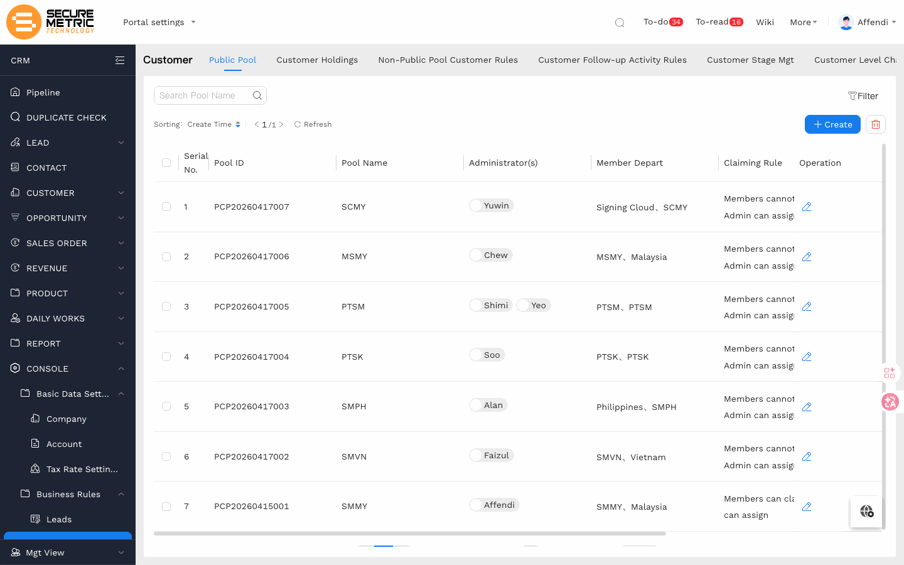
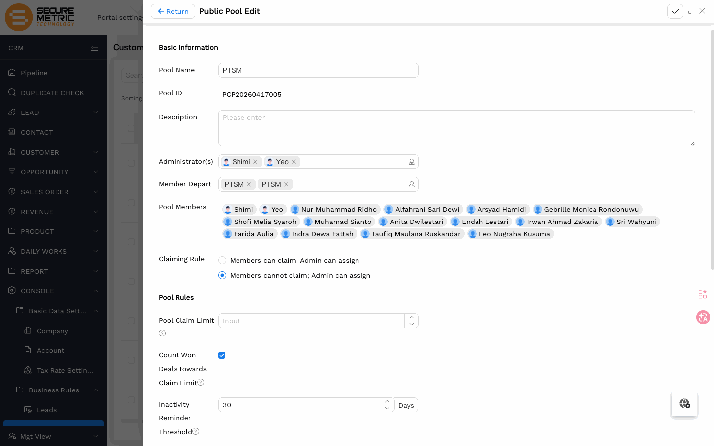
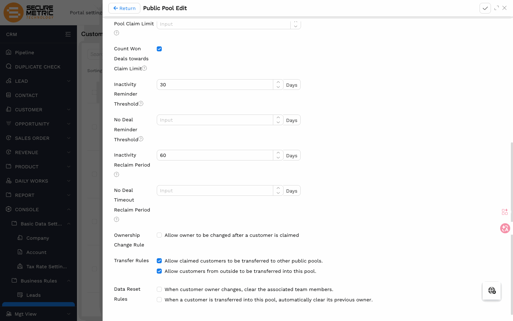

# Public Pool Management User Manual

> **Version**: V1.0 | **Date**: 2026-06-17 | **System**: Securemetric CRM (EasyCraft)

---

## Table of Contents

1. [Overview](#1-overview)
2. [Pool List](#2-pool-list)
3. [Basic Configuration](#3-basic-configuration)
4. [Pool Rules](#4-pool-rules)
5. [FAQ](#5-faq)

---

## 1. Overview

The Public Pool holds customers without an active owner, preventing customer resources from being held idle. Each legal entity has one public pool; rules determine whether sales reps can self-claim customers and when inactive customers are automatically reclaimed.

### 1.1 Entry Point

| Entry | Path |
|-------|------|
| Main | Left nav **CUSTOMER**, switch to the **Public Pool** tab | [Direct Link](http://172.18.114.231:8088/web/#/current/sys-modeling/app/km-ltc/listView/1i1oomam1w64w225gw1ocmdd72g2hl7q34w1/1i03ava4ow5jw123aw1q8gev71o4d7oo2pw1?type=list&navId=1hvp21k7lw4vw6h64w37pp9dm27vj66f3cw1){: target="_blank" rel="noopener"} |

---

## 2. Pool List

One pool exists per legal entity (7 total). The list shows the admin, member departments, and the current claiming rule for each pool. Click the edit icon to configure.

---

## 3. Basic Configuration

Set **Administrator(s)** and **Member Depart**. The system automatically populates **Pool Members** from the selected departments.

> **When department members change**: Pool Members do not update automatically. Go to **Basic Data Settings → Company**, open the relevant entity's detail page, and click **Member Change** to sync. The public pool member list will reflect the update immediately after.

### 3.1 Claiming Rule

Similar to lead queues, this controls whether sales reps can self-claim customers from the pool:

| Option | Behaviour |
|--------|-----------|
| **Members cannot claim; Admin can assign** | Members cannot pick up customers themselves; only admins can assign |
| **Members can claim; Admin can assign** | Members can self-claim customers; admins can also assign directly |

---

## 4. Pool Rules

### 4.1 Inactivity Reclaim

| Rule | Current Value | Description |
|------|---------------|-------------|
| Inactivity Reminder Threshold | 30 Days | Sends a reminder to the owner when a customer has had no activity for this period |
| Inactivity Reclaim Period | 60 Days | Automatically returns the customer to the public pool after this many days of inactivity |

> **Important**: Once reclaimed, the previous owner loses access to the customer. Sales reps should log follow-up activities regularly to prevent unexpected reclaim.

### 4.2 Transfer Rules

- Claimed customers can be transferred to other public pools
- Customers from outside can be transferred into this pool

Both options are currently enabled to support cross-pool collaboration.

### 4.3 Data Reset Rules

- When a customer's owner changes, team members can optionally be cleared
- When a customer is transferred into this pool, the previous owner can optionally be cleared

Both are unchecked by default, so existing team data is preserved on transfer.

---

## 5. FAQ

**Q: A customer suddenly has no owner. What happened?**  
A: The customer was likely reclaimed by the inactivity rule (default: 60 days without activity). Find the customer in the Public Pool list to reassign, and remind the sales team to log follow-up activities regularly.

**Q: How do I let sales reps claim customers from the public pool themselves?**  
A: Edit the relevant entity's public pool and change the Claiming Rule to "Members can claim; Admin can assign", then save.
