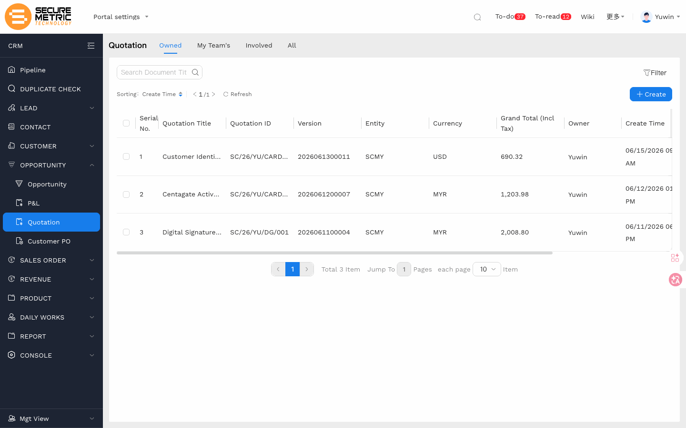
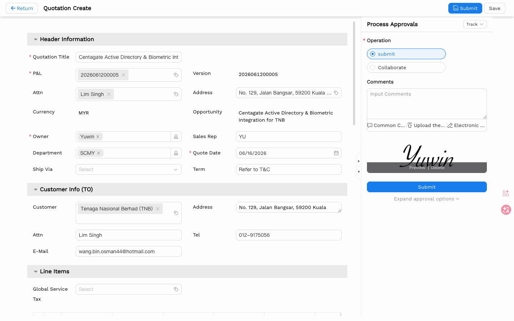
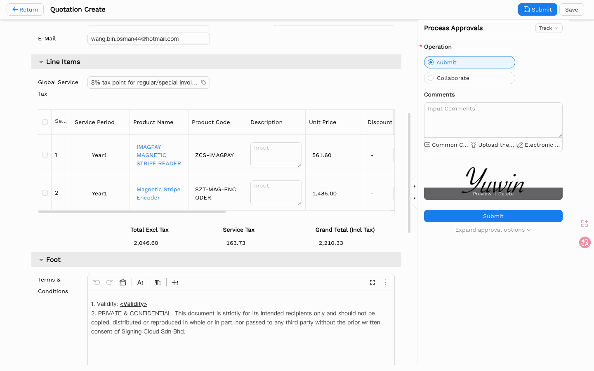
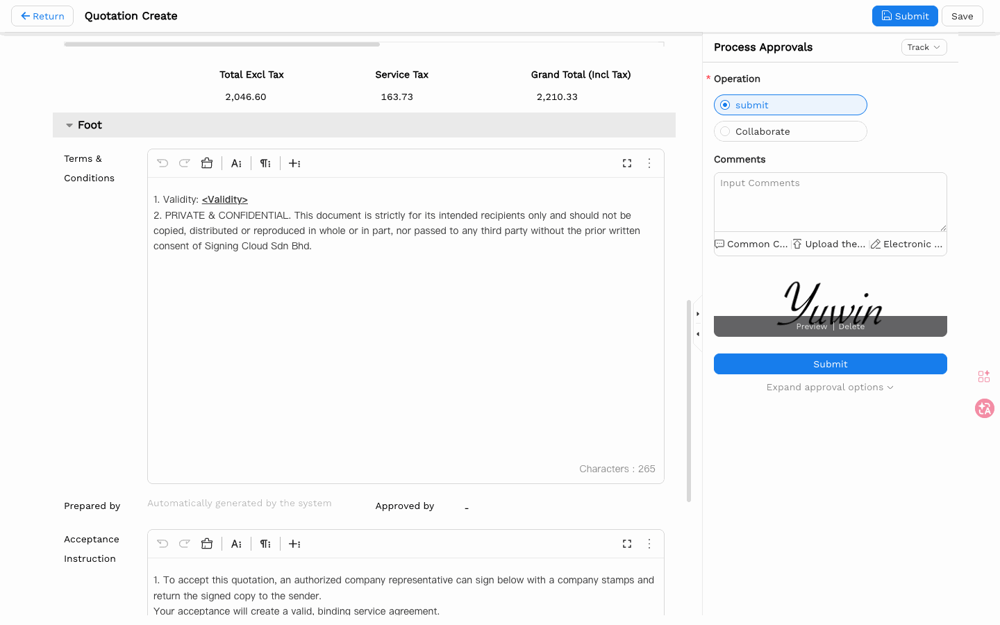
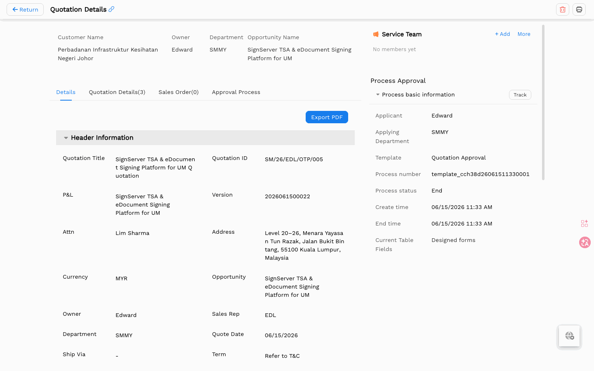
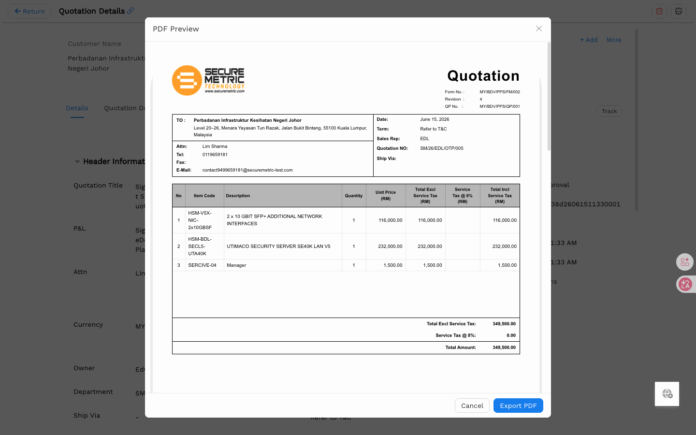

# Quotation User Manual

> **Version**: V1.2 | **Date**: 2026-06-15 | **System**: Securemetric CRM (EasyCraft)

---

## Table of Contents

1. [Module Overview](#1-module-overview)
2. [Quotation Entry Points](#2-quotation-entry-points)
3. [Create a Quotation](#3-create-a-quotation)
4. [Quotation Details View](#4-quotation-details-view)
5. [PDF Preview & Export](#5-pdf-preview--export)
6. [Approval Workflow](#6-approval-workflow)
7. [FAQ & Notes](#7-faq--notes)

---

## 1. Module Overview

Quotations are formal sales documents generated from approved P&L analyses. They follow the "Locked Pair" pricing architecture and enter an approval workflow.

### 1.1 Key Characteristics

| Characteristic | Description |
|----------------|-------------|
| P&L-driven | Generated from approved P&L analyses |
| Version-locked | P&L V1 → Quote V1, P&L V2 → Quote V2 |
| Auto-populated | Customer, Opportunity, Currency, Department inherited from parent |
| Approval-required | Enters approval workflow before finalization |

### 1.2 Entry Points

- **Sidebar**: OPPORTUNITY → Quotation | [Direct Link](http://172.18.114.231:8088/web/#/current/sys-modeling/app/km-ltc/listView/1i0kj6488w5pwln4w35a08362ga8q8b3q6w1/1i20q3rcsw6cw51iw6jmt7028o9aka2etcw1?type=list&navId=1hvp21k7lw4vw6h64w37pp9dm27vj66f3cw1){: target="_blank" rel="noopener"}

---

## 2. Quotation List & Entry Points



### 2.1 View Scenarios

Navigate to the standalone quotation list via **OPPORTUNITY → Quotation** in the sidebar. The following view scenarios are available:

| Scenario Tab | Scope |
|--------------|-------|
| My Owned | Quotations where the current user is the owner |
| My Team's | Quotations owned by the current user's direct reports (for managers) |
| My Involved | Quotations where the current user is a team member |
| All | All quotations visible to the current user |

### 2.2 Existing Quotations Table

| Column | Description |
|--------|-------------|
| Serial No. | Row number |
| Quotation ID | Format: SM/26/YCK/A... |
| Version | Auto-incremented |

---

## 3. Create a Quotation

### 3.1 Entry

Open the quotation list via **OPPORTUNITY → Quotation** in the sidebar, then click **+ Create Quotation** to open the quotation creation panel.



### 3.2 Header Information

| Field | Required | Type | Notes |
|-------|----------|------|-------|
| Quotation Title | Yes | Text + Autocomplete | Autocomplete suggests existing names (e.g., "...Quotation2") |
| P&L | Yes | Lookup | P&L ID (e.g., 2026052700008) |
| Currency | Auto | Text | Auto-filled "MYR" |
| Department | No | Tag Input | e.g., "SMMY" with 'x' to remove |
| Opportunity | Auto | Read-only | Parent opportunity name |
| Ship Via | No | Dropdown | Standard / Express / Overnight / Priority / Economy / Air / Ground |
| Term | No | Text | e.g., "Refer to T&C" |
| Sales Rep | Auto | Text | Auto-filled (e.g., "YCK") |
| Quote Date | Auto | Date Picker | Auto-set to current date |
| Attn | No | Dropdown | Placeholder "Select" |
| P&L ID | Auto | Read-only | Same as P&L lookup value |
| Address | Auto | Text Area | Auto-populated from Customer |

### 3.3 Customer Info (TO) Section

| Field | Type | Notes |
|-------|------|-------|
| Customer | Lookup | Auto-populated from P&L/Opportunity |
| Address | Text Area | Auto-populated (e.g., "Lot 20, Jalan Sultan, 80000 Johor") |
| Attn | Text Input | Placeholder "Input" |
| Tel | Text Input | Placeholder "Input" |
| E-Mail | Text Input | Placeholder "Input" |

### 3.4 Financial Summary

| Metric | Description |
|--------|-------------|
| Total Excl Tax | Base price before tax |
| Service Tax | 8% SST (Malaysia) — calculated automatically |
| Grand Total (Incl Tax) | Total Excl Tax + Service Tax |

### 3.5 Line Items Section

- Section header: "Line Items"
- **Global Service**: Dropdown (placeholder "Select")
- Table columns include product details, quantities, prices, tax calculations

| Column | Description |
|--------|-------------|
| Sequence (Seq) | Row numbering |
| Total Excl Service Tax | Base price, read-only/calculated |
| Service Tax Num | Tax rate (e.g., 0.08 for 8%) |
| Service Tax | Tag selector for tax code |
| Total Incl Service Tax | Calculated: base + tax |
| Total Tax | Calculated tax amount |

> 💡 **Tip**: Global Tax setting applies to all line items.



### 3.6 Foot Section — Rich Text Editors



**Terms & Conditions:**
- Rich text editor with full toolbar (Undo, Redo, Copy/Paste, Font Size, Paragraph formatting, Fullscreen)
- Template content with 8 numbered items:
  1. Delivery lead time (<6 days)
  2. Validity period
  3. Cancellation penalties (no refund of deposit)
  4. Exclusion of customs duties
  5. Price change rights
  6. Warranty (<xx>)
  7. Payment terms (<Payment Terms>)
  8. Confidentiality clause ("Securemetric Technology Sdn Bhd")
- Contains placeholders: `<Validity>`, `<xx>`, `<Payment Terms>`

**Prepared by:** Read-only — "Automatically generated by the system"

**Approved by:** Empty input field (populated after approval)

**Acceptance Instruction:**
- Rich text editor with same toolbar
- Content: "1. To accept this quotation, you can sign below with a company stamps by an authorized company"

**Prepared Signature:** File upload (drag-drop zone, jpg/gif/png)

**Approved Signature:** File upload (drag-drop zone, jpg/gif/png)

**Owner:** Auto-filled (e.g., "admin0")

**Entity:** Tag selector (e.g., SCMY)

**Deal Category:** Dropdown (e.g., PKI)

---

## 4. Quotation Details View

### 4.1 Tabs

| Tab | Description |
|-----|-------------|
| Details | Read-only form view |
| Quotation Details(6) | Generated quotation documents |
| Sales Order | Linked sales orders |

### 4.2 Export Options

| Option | Description |
|--------|-------------|
| Export to PDF | Export the PDF from the quotation details page |
| Batch Delete | Remove attachments |

---

## 5. PDF Preview & Export

### 5.1 Quotation View



### 5.2 PDF Preview Modal



- Title: "PDF Preview"
- Displays generated quotation document preview
- Financial summary table:
  - Total Excl Service Tax
  - Service Tax @ 8%
  - Total Amount

> 💡 **View Quotation Template**: [Click here to view the PDF template](http://172.18.114.231:8088/web/tenant/0/artifact/elements/ltc-pdf-template-a9dp2/static/templates/?type=q&entity=SMPH){: target="_blank" rel="noopener"}

### 5.2 PDF Content

| Section | Content |
|---------|---------|
| Company Header | "SECUREMETRIC TECHNOLOGY SDN. BHD. (759814-V)" |
| Customer Info | TO, Address, Attn, Tel, E-Mail |
| Line Items | Product details with pricing |
| Terms & Conditions | 8 numbered items |
| Signature Blocks | Prepared by + Approved by with digital signatures |

### 5.3 Export Process

1. Click **Export PDF** button (blue primary) in PDF Preview modal
2. Browser download notification appears
3. File name format: "[Opportunity Name] Quotation..." (e.g., 708 KB)
4. Download shows "Done" status in browser notification


---

## 6. Approval Workflow

### 6.1 Approval Flow

```
Draft → Submit → MD/CM Review → Approved
                            ↓
                         Rejected → Revise → Resubmit
```

---

## 7. FAQ & Notes

### 7.1 Role Permissions

| Permission | Description | General Employee | Sales Admin | Administrator |
|------------|-------------|:---------------:|:-----------:|:-------------:|
| Quotation - Create | Create a quotation record | ✓ | ✓ | ✓ |
| Quotation - Edit | Edit a quotation in Draft status | ✓ | ✓ | ✓ |
| Quotation - Delete | Delete a quotation record | — | ✓ | ✓ |
| Quotation - Export | Export the quotation PDF | ✓ | ✓ | ✓ |
| Quotation - Submit | Submit a quotation for approval | ✓ | ✓ | ✓ |
| Quotation - Approve | Approve or reject a submitted quotation | — | — | ✓ (MD/CM) |
| Quotation - View All | View quotations not owned by current user | — | ✓ | ✓ |

> Actual permissions are governed by system configuration. Approval authority (MD/CM) is designated by the administrator in the process design settings.

### 7.2 Business Rules

1. Quotes are generated from approved P&L analyses — cannot be edited directly
2. Version correspondence: P&L V1 → Quote V1, P&L V2 → Quote V2
3. Full audit trail for every version change

### 7.3 Data Flow

```
P&L (approved) → Quotation Create → Save (draft) → Submit (approval) → Approved Quote
```

