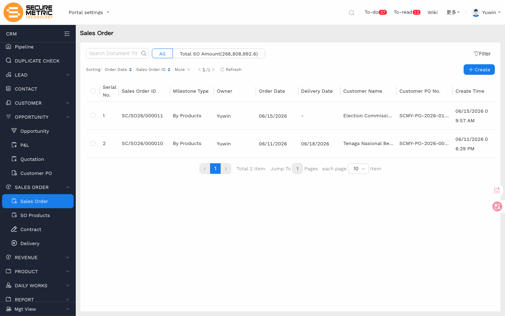
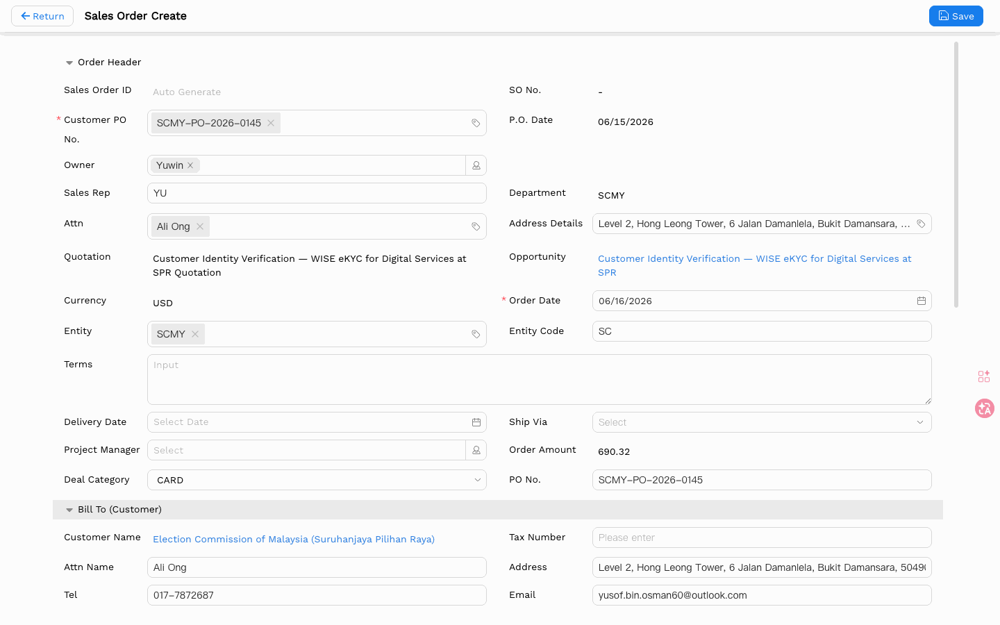
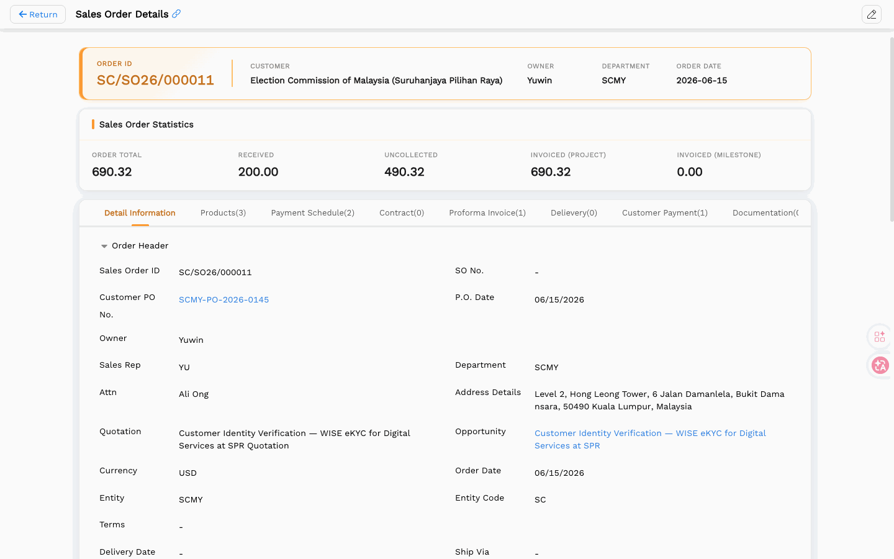
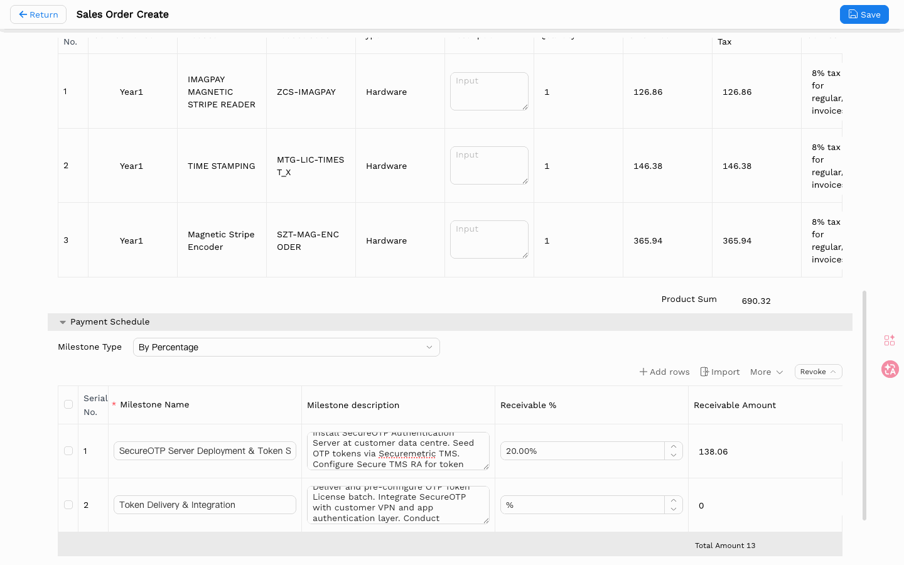
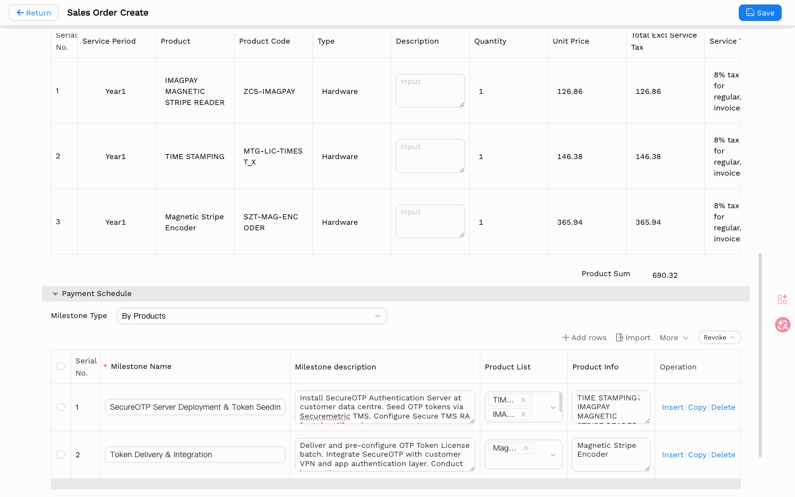

# Sales Order User Manual V2

> **Version**: V2.0 | **Date**: 2026-05-28 | **System**: Securemetric CRM (EasyCraft)

---

## Table of Contents

1. [Module Overview](#1-module-overview)
2. [Sales Order List](#2-sales-order-list)
3. [Creating a Sales Order](#3-creating-a-sales-order)
4. [Sales Order Details](#4-sales-order-details)
5. [Payment Schedule Management](#5-payment-schedule-management)

---

## 1. Module Overview

The Sales Order (SO) module manages confirmed customer orders. Sales Orders are created from approved Quotations with auto-populated commercial details. Each SO links to payment schedules, delivery records, and contracts.

### 1.1 Entry Point

- **Sidebar**: Navigate to **SALES ORDER → Sales Order** | [Direct Link](http://172.18.114.231:8088/web/#/current/sys-modeling/app/km-ltc/listView/1i1ci4gjnw60w3973w1gr0fs43klt2f92uw1/1i16o9mkuw60w6fgw1f9etod28hn26g1q3w1?type=list&navId=1hvp21k7lw4vw6h64w37pp9dm27vj66f3cw1){: target="_blank" rel="noopener"}
- **From Quotation**: Quotation Details → Sales Order tab → Create

### 1.2 Core Functions

| Function | Description |
|----------|-------------|
| Quote-to-Order | Auto-populate from approved Quotation |
| Payment Scheduling | Define milestone-driven payment plans |
| Revenue Tracking | Track receivables, invoicing, and collection |

---

## 2. Sales Order List

### 2.1 List Columns

| Column | Description |
|--------|-------------|
| Sales Order ID | e.g., SM/SO26/000003 |
| Milestone Type | Badge indicator |
| Sales Rep | User name |
| Order Date | Order creation date |
| Delivery Date | Expected delivery date |
| Customer Name | Company name |
| Customer PO No. | Customer's purchase order reference |
| Quotation | Link to source quotation |

### 2.2 Toolbar

- **Total SO Amount**: Summary of all order values
- **Sorting**: By Order Date, Sales Order ID, or More
- **+ Create**: Create a new Sales Order

### 2.3 Sidebar Sub-Menu

Under SALES ORDER:
- **Sales Order** — Main order list
- **SO Product** — Product-level view
- **Contract** — Contract documents
- **Delivery** — Delivery records

---

## 3. Creating a Sales Order

### 3.1 Order Header Fields

| Field | Required | Type | Description |
|-------|----------|------|-------------|
| Sales Order ID | Auto | Read-only | Auto-generated on submission |
| SO No. | Auto | Read-only | Shows "-" until generated |
| Customer PO No. | Yes (*) | Text | Mandatory customer PO number |
| Sales Rep | Yes | User Lookup | e.g., CK |
| P.O. Date | Yes | Date Picker | Customer PO date |
| Department | Auto | Read-only | Auto-filled from Entity |
| Attn | No | Lookup | Attention contact |
| Address Details | Yes | Lookup | Opens address selection |
| Quotation | Yes | Lookup | Source quotation |
| Opportunity | Auto | Read-only | Parent opportunity |
| Currency | Auto | Read-only | Inherited from Quotation |
| Order Date | Yes (*) | Date Picker | Defaults to today |
| Entity | Yes | Tag | e.g., SMMY |
| Entity Code | Auto | Read-only | Auto-filled from Entity |
| Terms | No | Textarea | Payment/delivery terms |
| Delivery Date | No | Date Picker | Expected delivery |
| Ship Via | No | Dropdown | Shipping method |
| Project Manager | No | User Lookup | Assigned PM |
| Order Amount | Auto | Read-only | Auto-calculated from line items |
| Deal Category | Yes | Dropdown | e.g., ADSS |

### 3.2 Customer Information

All customer information fields (Customer Name, Address, Attn Name, Tel, Email) are auto-carried from the linked Quotation.

### 3.3 Product List

Products are auto-populated from the Quotation:

| Column | Description |
|--------|-------------|
| Service Period | e.g., "Year1" |
| Product | Product name |
| Type | Software / Hardware / Service |
| Quantity | From quotation |
| Unit Price | From quotation |
| Total | Auto-calculated |

**Product Sum**: Total of all line items (e.g., 25,277.40)

---

## 4. Sales Order Details

### 4.1 Header Information

| Field | Example |
|-------|---------|
| Order ID | SM/SO26/000003 |
| Customer | Elite Enterprise Solutions Sendirian Berhad |
| P.I.C. | CK |
| Department | SMMY |
| Order Date | 2026-05-27 |

### 4.2 Sales Order Statistic Bar

The statistic bar shows 6 metrics: **Receivable**, **Received**, **Uncollected**, **Invoiced**, **Uninvoiced**, and **Order Total** (total order value).

### 4.3 Details Page Tabs

The SO Details page has 9 tabs for navigating different aspects:

| Tab | Description |
|-----|-------------|
| Detail Information | General SO information |
| Products(6) | Line items grid |
| Delivery(0) | Delivery records |
| Contract(0) | Contract documents |
| Collection Details(0) | Logistics/pickup information |
| Payment Schedule(2) | Financial milestones |
| Progress Invoice(0) | Billing records |
| Transaction Record(0) | Bank/payment transaction logs |
| Approval Workflow | Approval sign-off chain |

Numbers in parentheses indicate the count of records in each section.

---

## 5. Payment Schedule Management

### 5.1 Embedded Payment Schedule (During SO Create)

The Payment Schedule section is embedded in the SO Create page as a collapsible panel.

**Milestone Type**: Dropdown — two options:
- **"By Percentage"** — define payment milestones as percentages (e.g., 20% + 80% = 100%)
- **"By Products"** — split revenue by product category across milestones

**How to set up "By Percentage" milestones**:
1. Set Milestone Type = **"By Percentage"**
2. Add milestone rows with name and receivable percentage
3. Verify percentages sum to **100%** (system validates this)
4. **Receivable Amount** is auto-calculated: Product Sum × Receivable %

> 💡 **Note**: Milestones created with "By Products" have no receivable percentage or amount initially. After invoicing, the system automatically updates the receivable percentage and amount based on the invoiced amount.

**Columns**:
| Column | Description |
|--------|-------------|
| Serial No. | Row number |
| Milestone Name | e.g., "Installation" |
| Payment Type | Down Payment / Progress Payment / Final Payment |
| Job Content | Description of work |
| Contract Terms | Contractual terms for this milestone |
| Product Info | Revenue split by product category |
| Operation | Insert | Copy | Delete |

---

