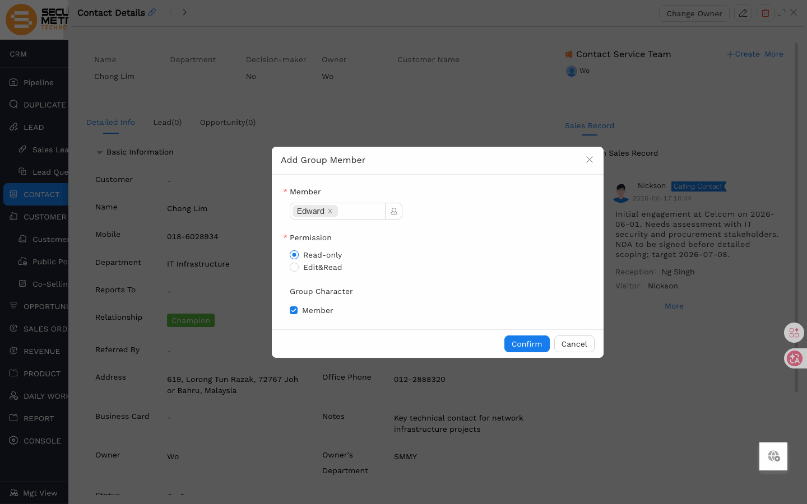
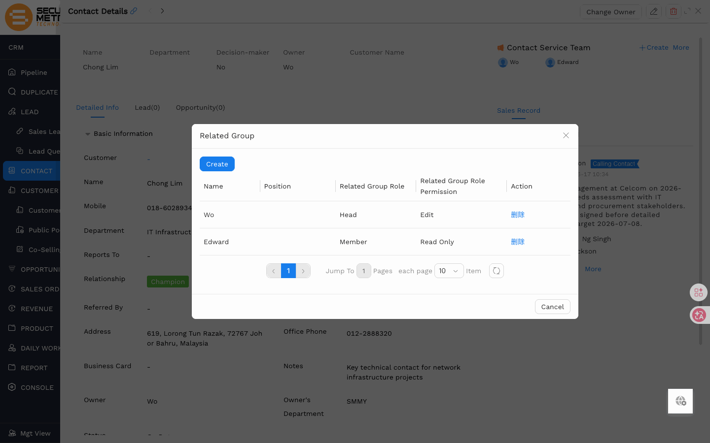
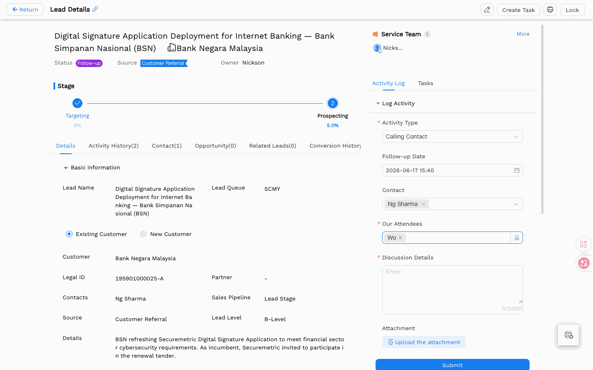

# Service Team & Activity Log User Manual

> **Version**: V1.2 | **Date**: 2026-06-17 | **System**: Securemetric CRM (EasyCraft)

---

## Table of Contents

1. [Module Overview](#1-module-overview)
2. [Service Team](#2-service-team)
3. [Activity Log & Sales Record](#3-activity-log--sales-record)
4. [To-Do Messages & Follow-up Timeout](#4-to-do-messages--follow-up-timeout)
5. [Lead Conversion — Carry-Over](#5-lead-conversion--carry-over)
6. [Business Rules & Workflow](#6-business-rules--workflow)
7. [FAQ & Notes](#7-faq--notes)

---

## 1. Module Overview

**Service Team** and **Activity Log** are two cross-cutting concepts that apply to every customer-facing record in the CRM: Lead, Contact, Customer, and Opportunity.

- **Service Team** — controls who can **see and edit** a record. If you are not in a record's Service Team, you cannot view or modify it.
- **Activity Log** — records every sales interaction (calls, visits, meetings) with the contact or account, building a complete communication history.

### 1.1 Entry Points

| Feature | Path |
|---------|------|
| Service Team / Activity Log | Any detail page (Lead / Contact / Customer / Opportunity) → right sidebar |
| Activity Log main view | Left sidebar → **ACTIVITY → Activity Log** | [Direct Link](http://172.18.114.231:8088/web/#/current/sys-modeling/app/km-ltc/listView/1i1r42sh5w66w24q5wnqffnh3mmfg00jmgw1/1i3cio88kw6ow25o9w3ecc0ud37mbv5810w1?type=list&navId=1hvp21k7lw4vw6h64w37pp9dm27vj66f3cw1){: target="_blank" rel="noopener"} |

### 1.2 Core Functions

| Function | Description |
|----------|-------------|
| Service Team management | Designate which users can access each CRM record and at what permission level |
| Activity Log | Record calls, visits, and meetings; build a searchable interaction timeline |
| Sales Record (Contact) | Same as Activity Log but named differently on the Contact entity |
| To-Do messages | Consolidated notifications for tasks, reminders, and follow-up timeout alerts |

---

## 2. Service Team

### 2.1 What Is the Service Team?

The Service Team is the list of CRM users who have permission to access a specific record. Each record (Lead, Contact, Customer, Opportunity) maintains its own independent Service Team. Membership in one entity's team does **not** automatically grant access to related entities.

> "The service team means the people who have the permission to see and edit the information in this detail page."

### 2.2 Service Team Member Attributes

| Attribute | Options | Default | Notes |
|-----------|---------|---------|-------|
| Member | Any organisation user | — | Selected via user picker |
| Permission | Read-Only / Read-Write | Read-Write | Controls whether the member can edit |
| Team Role | Ordinary Members | Ordinary Members | Internal team structure label |
| Project Role | Customer Manager | (Unchecked) | Check if this person is the account's Customer Manager |

### 2.3 How to Add a Team Member

1. Open any detail page (Lead, Contact, Customer, or Opportunity).
2. Locate the **Service Team** panel in the right sidebar.
3. Click **+ Add** (or **+ Add more** if members already exist).
4. In the **Add Team Members** modal:
   - **Members** (\*): Select the user(s) to add.
   - **Permission** (\*): Choose **Read-Only** or **Read-Write**.
   - **Team Role**: Check **Ordinary Members** (default).
   - **Project Role**: Check **Customer Manager** if applicable.
5. Click **Confirm**.



The new member immediately appears in the Service Team list and can access the record according to their permission level.

### 2.4 How to Remove a Team Member

1. Open the detail page.
2. Find the member in the Service Team panel.
3. Click the **Delete** (trash) icon next to their name.
4. Confirm the removal.

The user immediately loses access to the record.



### 2.5 Service Team Location by Entity

| Entity | Location |
|--------|----------|
| Lead | Right sidebar of Lead Details |
| Contact | Right sidebar of Contact Details |
| Customer | Right sidebar of Customer Details |
| Opportunity | Right sidebar of Opportunity Details |


### 2.6 Permission Levels

**Read-Only** members can view but not edit; **Read-Write** members can view and edit. Users not in the Service Team have no access to the record.

---

## 3. Activity Log & Sales Record

### 3.1 What Is the Activity Log?

The Activity Log captures all sales interactions with a record — phone calls, on-site visits, meetings, and other communications. It creates an auditable timeline of how your team has engaged with a lead or account.

**Note on naming**: The feature is called **Activity Log** on Lead, Customer, and Opportunity, but is called **Sales Record** on the Contact entity. The functionality is identical.

| Entity | Tab / Section Name |
|--------|-------------------|
| Lead | Activity Log |
| Contact | Sales Record |
| Customer | Activity Log |
| Opportunity | Activity Log |

### 3.2 Sales Record Entry Points

Activity logs and sales records can be accessed from multiple locations:

| Entry Point | Path | Best Use |
|-------------|------|---------|
| Lead detail page | Right sidebar → **Activity Log** | View / log interactions for a specific lead |
| Contact detail page | Right sidebar → **Sales Record** | View / log interactions with a specific contact (different label, same function) |
| Customer detail page | Right sidebar → **Activity Log** | View / log interactions for a customer account |
| Opportunity detail page | Right sidebar → **Activity Log** | View / log interactions tied to a deal |
| ACTIVITY main module | Left sidebar → **ACTIVITY → Activity Log** | Consolidated view of all activity logs across entities for the current user |

> **Tip**: The ACTIVITY main module view supports filtering by entity type, date range, and owner — useful for managers who need a cross-record activity overview.

### 3.3 How to Log an Activity

1. Open any detail page (Lead, Contact, Customer, or Opportunity).
2. Find the **Activity Log** (or **Sales Record**) panel in the right sidebar.
3. Click **New Log** (or **Log Activity**).
4. Fill in the activity form:

| Field | Required | Type | Notes |
|-------|----------|------|-------|
| Activity Type | Yes | Dropdown | e.g., "Calling Contact", "Visit", "Meeting" |
| Contact | Yes | Lookup | The contact person involved in the interaction |
| Our Attendee | Yes | User Lookup | Auto-filled with the current user; add others if needed |
| Related Business | No (auto) | Read-Only | Auto-filled with the parent record name |
| Discussion Details | No | Text Area | Notes about the interaction (up to 1,000 characters) |
| Attachment | No | File Upload | Supporting documents (e.g., meeting minutes, call notes) |

5. Click **Submit**.



The log entry appears immediately in the Activity Log timeline with a timestamp, your name, and the activity type.

---

## 4. To-Do Messages & Follow-up Timeout

### 4.1 To-Do Messages

**To-Do messages** appear in the bell icon (🔔) in the top navigation bar and in the **To-Do** panel. They are generated automatically by the following events:

| Trigger | Message Content |
|---------|----------------|
| Task assigned to you | "New task: [Task Title], due [Date]" |
| Task reminder fires | "Task [Title] is due at [Time]" |
| Follow-up timeout alert | "[Lead/Opportunity name] has had no activity for N days — please follow up" |
| Mentioned in an Activity Log | "You were mentioned in the activity log for [Record Name]" |

Click any To-Do message to navigate directly to the related record or task.

### 4.2 Follow-up Timeout

**Follow-up Timeout** is an automated alert that triggers when a Lead or Opportunity has had no new Activity Log entry within the number of days configured by the admin.

**How it works**:

```
Record the date of the last Activity Log entry
               ↓
System checks all records daily
               ↓
No Activity Log entry within the threshold (e.g., 7 days)
               ↓
"Follow-up Timeout" To-Do generated → pushed to record Owner (+ manager)
               ↓
Owner logs a new Activity on the record
               ↓
To-Do message auto-closes; timer resets
```

**Timeout configuration** (set by admin in the back-end):

| Parameter | Description |
|-----------|-------------|
| Timeout days | Number of days without an activity log before alerting (e.g., 7, 14) |
| Applicable entities | Lead / Opportunity / Customer (configurable separately) |
| Notified parties | Record owner / Owner's direct manager |
| Notification method | To-Do item + Email (optional) |

**Resolving a timeout alert**: Open the relevant Lead or Opportunity detail page and log a new Activity Log entry (e.g., "Phone call — confirmed procurement intent"). The system automatically closes the timeout To-Do and resets the timer.

---

## 5. Lead Conversion — Carry-Over

### 5.1 Overview

When you convert a Lead to a Contact, Customer, and Opportunity, the system offers a **Carry Over Information** section in Step 2 of the conversion wizard. This controls whether the Lead's Service Team members and Activity Log entries are copied to the newly created records.

### 5.2 Copy Team To

| Checkbox | Effect | Default |
|----------|--------|---------|
| Customer | Lead's Service Team is copied to the new Customer's Service Team | Checked |
| Contact | Lead's Service Team is copied to the new Contact's Service Team | Checked |
| Opportunity | Lead's Service Team is copied to the new Opportunity's Service Team | Checked |

### 5.3 Copy Activities To

| Checkbox | Effect | Default |
|----------|--------|---------|
| Customer | Lead's Activity Logs are copied to the Customer's Activity Log | Checked |
| Contact | Lead's Activity Logs are copied to the Contact's Sales Record | Checked |
| Opportunity | Lead's Activity Logs are copied to the Opportunity's Activity Log | Checked |

**Best practice**: Keep all three checkboxes checked (default) to ensure the full history is available on every related record after conversion.


### 5.4 What Gets Copied

```
Lead
  Service Team: [Alice, Bob] → Copied to Customer, Contact, Opportunity
  Activity Log: ["Call on 2026-06-01: Discussed requirements"]
                         → Copied to Customer, Contact, Opportunity
```

---

## 6. Business Rules & Workflow

### 6.1 Role Permissions

| Permission | Description | Regular Staff | Sales Admin | Admin |
|------------|-------------|:------------:|:-----------:|:-----:|
| View Activity Log | View activity logs on records in their Service Team | ✓ | ✓ | ✓ |
| Log Activity | Add activity log entries on records with Read-Write access | ✓ | ✓ | ✓ |
| Delete Activity Log | Delete their own activity log entries | ✓ (own) | ✓ | ✓ |
| View Service Team | View the Service Team member list on a record | ✓ | ✓ | ✓ |
| Manage Service Team | Add / remove / edit team members and permissions | ✓ (owner) | ✓ | ✓ |

> Actual permission assignments are governed by system back-end configuration. Contact your system administrator to request changes.

### 6.2 Service Team Is Entity-Specific

Being in a Customer's Service Team does **not** give you access to that Customer's Opportunities. Each Opportunity (and Lead, Contact) has its own Service Team that must be configured separately — or populated via Lead conversion carry-over.

### 6.3 Owner and Service Team

The **Owner** of a record is the primary person responsible for it. The Owner is typically added to the Service Team automatically, but always verify this is the case — especially after editing or re-assigning ownership.

### 6.4 Activity Log Best Practices

- Log every significant customer interaction promptly to maintain an accurate history.
- Use the **Discussion Details** field to record key outcomes, next steps, or commitments made.
- Attach meeting minutes or call summaries in the **Attachment** field for full documentation.

---

## 7. FAQ & Notes

**Q: I can see a Lead in the list but cannot open it. Why?**
You are not in that Lead's Service Team. Contact the Owner or an admin to be added as a team member with at least Read-Only permission.

**Q: I was added to a Customer's Service Team but cannot see the related Opportunity. Why?**
Service Teams are entity-specific. You need to be separately added to the Opportunity's Service Team by its Owner or an admin.

**Q: Can I log an activity on a record I can only view (Read-Only)?**
No. Logging an activity is an edit operation and requires Read-Write permission.

**Q: The Activity Log on the Contact says "Sales Record" — is that a different feature?**
No, it is the same feature with a different label. The Contact entity uses the name "Sales Record" while all other entities use "Activity Log". The fields and workflow are identical.

**Q: How many team members can I add to a Service Team?**
There is no documented limit. Add all relevant stakeholders, keeping the list manageable to avoid ambiguity over responsibility.

**Q: Can I change a team member's permission from Read-Only to Read-Write after adding them?**
Yes. Click the **Edit** icon next to the team member's row in the Service Team panel and update their Permission setting.

**Q: A follow-up timeout alert appeared even though I recently contacted the customer. Why hasn't it cleared?**
The timeout timer resets only when a new **Activity Log** entry is submitted on the record. Viewing the record or editing other fields does not reset the timer. Ensure you have logged an Activity Log entry (not just a note or edit). If the issue persists, contact your administrator to check the timeout rule configuration.
