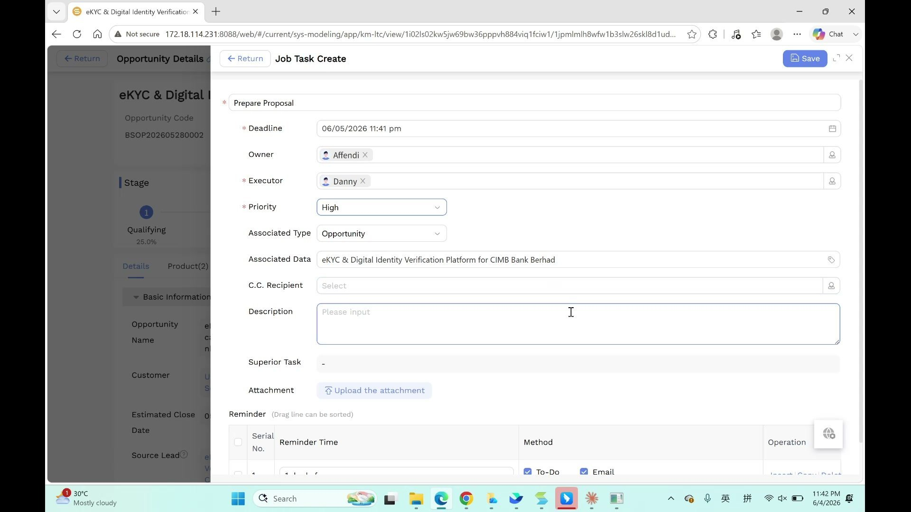
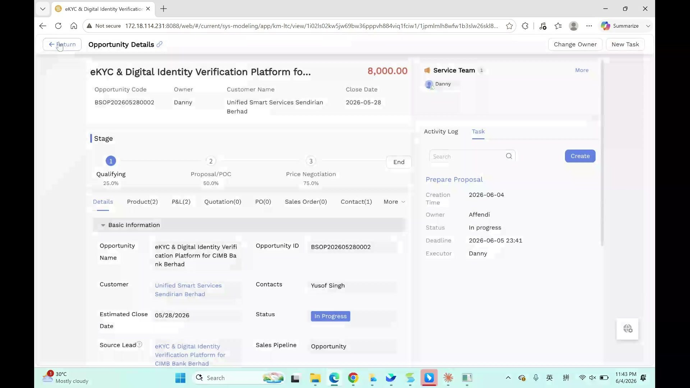
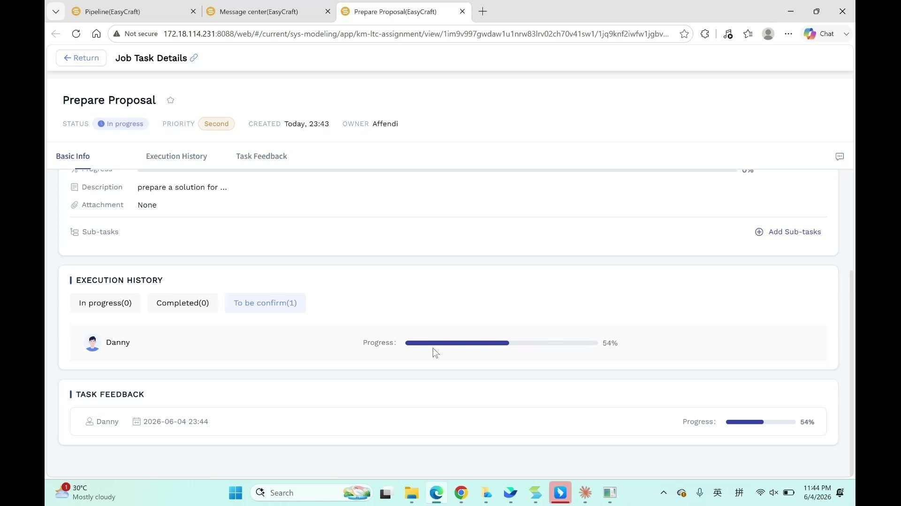
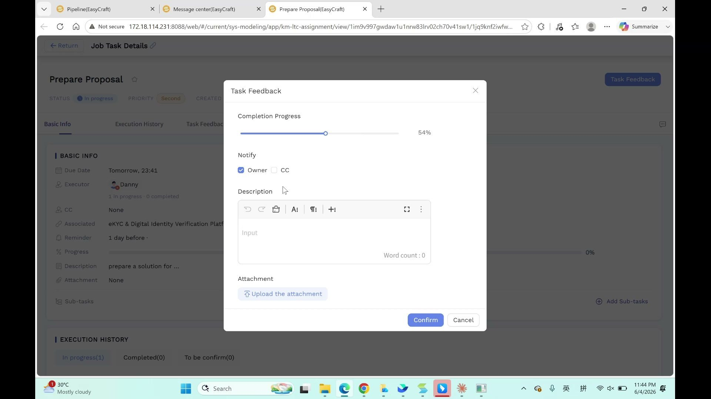

# Task Management User Manual

> **Version**: V1.1 | **Date**: 2026-06-13 | **System**: Securemetric CRM (EasyCraft)

---

## Table of Contents

1. [Module Overview](#1-module-overview)
2. [Creating a Task](#2-creating-a-task)
3. [Task Details View](#3-task-details-view)
4. [Task Views](#4-task-views)
5. [Executor Workflow — Task Feedback](#5-executor-workflow--task-feedback)
6. [Owner Workflow — Confirmation](#6-owner-workflow--confirmation)
7. [Sub-Tasks](#7-sub-tasks)
8. [Task Order](#8-task-order)
9. [Business Rules & Workflow](#9-business-rules--workflow)
10. [FAQ & Notes](#10-faq--notes)

---

## 1. Module Overview

The **Task Management** module enables team members to create, assign, and track tasks across any CRM entity. Tasks are always linked to a parent record — typically an Opportunity, Lead, Customer, or Contact — and follow a structured lifecycle from creation through execution to confirmation. For situations requiring a formal directive with an explicit acknowledgement, use the **Task Order** feature.

### 1.1 Entry Points

| Entry Point | Path |
|-------------|------|
| From Opportunity | Opportunity Details → Task section (right sidebar or tab) → **New Task** | [Direct Link](http://172.18.114.231:8088/web/#/current/sys-modeling/app/km-ltc/listView/1inl12detwehw1ogaow3es4jf12qd3jmlvw1/1imh2voajwe8w5q66w23kb5k33rcjo1p2tw1?type=list&navId=1hvp21k7lw4vw6h64w37pp9dm27vj66f3cw1){: target="_blank" rel="noopener"} |
| From Lead | Lead Details → Task section → **New Task** |
| From Customer | Customer Details → Task section → **New Task** |
| From Contact | Contact Details → Task section → **New Task** |
| Task List page | Left sidebar → **ACTIVITY → Tasks** |
| Task Order | Left sidebar → **ACTIVITY → Task Order** |

### 1.2 Core Functions

- Assign action items to specific team members (Executors)
- Track task progress through a feedback-and-confirmation loop
- Set deadline-relative reminders via To-Do list and Email
- Break complex tasks into Sub-Tasks
- Keep CC recipients informed without requiring action from them
- Use Task Orders to issue formal directives requiring explicit acknowledgement

### 1.3 Task Lifecycle

```
Owner creates task → Executor receives To-Do + Email notification
  → Executor works and submits feedback (progress %)
  → Task status: "To be confirm"
  → Owner reviews and clicks "Pass"
  → Task status: "Completed" (100%)
```

---

## 2. Creating a Task

### 2.1 Opening the Task Form

1. Navigate to any detail page (Opportunity, Lead, Customer, or Contact).
2. Find the **Task** section in the right sidebar or tab area.
3. Click **New Task**.

The task form opens. The **Associated Type** and **Associated Data** fields are pre-filled from the parent record.

### 2.2 Field Reference

| Field | Required | Type | Notes |
|-------|----------|------|-------|
| Deadline | Yes | Date/time picker | When the task must be completed |
| Owner | Yes | User chip | Auto-filled with the current user; the person responsible for reviewing and confirming |
| Executor | Yes | User chip | The person who will perform the task |
| Priority | Yes | Dropdown | High / Second / Low |
| Associated Type | Yes (auto) | Dropdown | Auto-filled with the parent entity type (e.g., "Opportunity") |
| Associated Data | Yes (auto) | Read-only lookup | Auto-filled with the parent record name |
| C.C. Recipient | No | User chip | People who should receive notifications but do not need to act |
| Description | No | Text area | Detailed instructions for the Executor |
| Superior Task | No (auto) | Read-only | Auto-shows parent task if this is a sub-task; shows "-" otherwise |
| Attachment | No | File upload | Supporting documents for the Executor |

### 2.3 Reminder Configuration

At the bottom of the create form is a **Reminder** sub-table. Each row defines one reminder notification.

| Column | Type | Options | Default |
|--------|------|---------|---------|
| Serial No. | Auto | — | 1 |
| Reminder Time | Dropdown | 1 day before / 3 hours before / 1 hour before / 30 min before / 15 min before / At deadline | 1 day before |
| Method | Checkboxes | To-Do, Email | Both checked |

- **To-Do**: Creates a to-do item in the recipient's task list inside CRM.
- **Email**: Sends an email notification to the recipient.
- Click **Insert** or **Copy** to add additional reminder rows (e.g., a 1-day reminder AND a 3-hour reminder).



### 2.4 Saving the Task

Click **Save**. The task is created and the Executor receives:
1. A **To-Do** item in their CRM task list.
2. An **Email notification** (if the Email method was selected in the Reminder sub-table).

The task appears in the parent record's Task list.



---

## 3. Task Details View

### 3.1 Header

| Field | Notes |
|-------|-------|
| Task Title | Task name with a star (favourite) icon |
| Status | Badge: **In progress** (blue) / **To be confirm** / **Completed** (green) |
| Priority | Badge: **High** / **Second** / **Low** |
| Created | Relative time (e.g., "Today, 23:43") |
| Owner | Name of the user responsible for confirming |



### 3.2 Tabs

| Tab | Content |
|-----|---------|
| Basic Info | Due date, Executor, CC, Associated record, Reminder, Progress bar, Description, Attachment, Sub-tasks |
| Execution History | Task records filtered by status: In progress / Completed / To be confirm |
| Task Feedback | Chronological timeline of all feedback submissions from the Executor |

### 3.3 Basic Info Fields

| Field | Notes |
|-------|-------|
| Due Date | Formatted as relative time if near (e.g., "Tomorrow, 23:41") |
| Executor | User avatar + name; subtext shows "N in progress · N completed" |
| CC | "None" if no CC recipients were selected |
| Associated | Clickable link to the parent record |
| Reminder | Summary of configured reminder rules |
| Progress | Visual progress bar (0% → 100%) updated via Task Feedback |
| Description | Task instructions entered during creation |
| Attachment | List of uploaded files, or "None" |
| Sub-tasks | "+ Add Sub-tasks" button for breaking down large tasks |

### 3.4 Action Buttons

| Button | Purpose |
|--------|---------|
| Edit (pencil icon) | Modify task details (deadline, executor, reminder, etc.) |
| Delete (trash icon) | Delete the task permanently |
| Expand | Open task in full-screen view |
| Close (X) | Return to the parent record |
| Task completed | Mark task as complete (only available to Owner; greyed out after use) |

---

## 4. Task Views

Tasks can be viewed from several entry points, each suited to a different use case.

### 4.1 From the Parent Record

On any Opportunity, Lead, Customer, or Contact detail page, the right sidebar or Task tab shows all tasks linked to that record.

| Column | Description |
|--------|-------------|
| Task Title | Click to open task details |
| Status | In progress / To be confirm / Completed |
| Priority | High / Second / Low |
| Executor | Avatar + name |
| Deadline | Date; turns red when approaching |

### 4.2 From the To-Do Panel

The bell icon (🔔) in the top navigation bar and the **To-Do** panel consolidate all tasks where the current user is **Owner** or **Executor**, sorted by deadline. This is the fastest way to see what needs immediate attention.

### 4.3 Task List Page

**Path**: Left sidebar → **ACTIVITY → Tasks**

The Task List page aggregates all tasks accessible to the current user and supports multi-dimensional filtering and sorting.

**Filter Options**:

| Filter | Options |
|--------|---------|
| Status | In progress / To be confirm / Completed |
| Priority | High / Second / Low |
| Deadline | Date range |
| Executor | User picker |
| Associated Record Type | Opportunity / Lead / Customer / Contact |

**Table Columns**:

| Column | Description |
|--------|-------------|
| No. | Row number |
| Task Title | Task name; click to open details |
| Associated Record | Parent record name and type |
| Deadline | Format: YYYY-MM-DD HH:mm |
| Executor | User responsible for performing the task |
| Priority | Badge |
| Status | Badge |

> **Admin view**: Sales Admins and Admins can view all tasks across the team from the Task List page. Regular staff see only tasks where they are the Owner or Executor.

---

## 5. Executor Workflow — Task Feedback

### 5.1 How the Executor Views the Task

When a task is assigned to you (as Executor):
1. Check your **To-Do** list in CRM — the task appears there.
2. You also receive an **Email notification** (if configured).
3. Click the task to open its detail view.

### 5.2 Submitting Task Feedback

1. Open the task detail view.
2. Click **Task Feedback**.
3. In the feedback modal:

| Field | Required | Type | Notes |
|-------|----------|------|-------|
| Completion Progress | Yes | Slider (0–100%) | Drag to reflect current completion percentage |
| Notify | No | Checkboxes | ☑ Owner, ☑ CC — who receives notification of this update |
| Description | No | Rich text editor | Detailed progress notes; supports formatting (bold, lists, links) |
| Attachment | No | File upload | Supporting evidence (e.g., draft documents, screenshots) |

4. Click **Confirm**.



### 5.3 After Submitting Feedback

- The task's **Progress bar** updates to the submitted percentage.
- The task status changes to **"To be confirm"**.
- The Owner (and CC recipients if selected) receive a notification.
- The feedback entry appears in the **Task Feedback** timeline on the task detail page.

---

## 6. Owner Workflow — Confirmation

### 6.1 Reviewing Feedback

1. Open the task detail view (accessible from the parent record's Task list or via the notification).
2. Review the Executor's feedback in the **Task Feedback** tab.
3. Check the updated **Progress** percentage and any attached evidence.

### 6.2 Confirming Completion

The Owner has **two actions** depending on whether the task is partially or fully done:

| Action | When to Use | Result |
|--------|-------------|--------|
| **Pass** | Executor submitted partial progress (e.g., 60% complete) | Status remains **"In progress"**, Executor can continue working. The confirmed progress percentage is recorded. |
| **Complete the task** | Task is fully done (100% progress) | Status changes to **"Completed"**, Progress bar shows **100%**. The "Complete the task" button is disabled after clicking — task cannot be reopened. |

> 💡 **Tip**: The Owner can "Pass" multiple times as the Executor submits progress updates. Only click "Complete the task" when the entire task is truly finished.

### 6.3 Rejecting or Requesting Further Work

If the task is not satisfactory, communicate with the Executor directly (e.g., via Activity Log or messaging) and ask them to submit another round of Task Feedback with updated progress.

---

## 7. Sub-Tasks

Complex tasks can be broken into **Sub-Tasks**:

1. Open the parent task's detail view.
2. Go to the **Basic Info** tab.
3. Click **+ Add Sub-tasks**.
4. Fill in the sub-task form (same fields as a regular task).
5. Save.

Sub-tasks follow the same Owner → Executor → Feedback → Confirmation workflow. The parent task's progress is independent of sub-task progress and must be updated via its own Task Feedback.

---

## 8. Task Order

### 8.1 What Is a Task Order?

A **Task Order** is a formal task assignment mechanism for managers to issue official work directives to subordinates. Unlike a regular task, a Task Order requires the Executor to **explicitly acknowledge receipt** before work begins, ensuring both parties agree on the scope and responsibility.

**Task Order vs. Regular Task**:

| Aspect | Regular Task | Task Order |
|--------|-------------|------------|
| Use case | Everyday action item assignment | Formal work directive |
| Acknowledgement | Not required | Required (Executor clicks "Acknowledge") |
| Editable after issue | Yes | Locked after acknowledgement |
| Entry point | Any detail page | ACTIVITY → Task Order or detail page |
| Audit trail | Basic log | Full issue → acknowledge → execute → complete log |

### 8.2 Task Order Lifecycle

```
Manager issues Task Order
          ↓
    [Issued]
          ↓
Executor clicks "Acknowledge Task Order"
          ↓
    [Acknowledged]
          ↓
Executor begins work and submits feedback
          ↓
    [In Progress]
          ↓
Executor submits 100% feedback
          ↓
    [Pending Confirmation]
          ↓
Owner clicks "Complete the task"
          ↓
    [Completed]
```

### 8.3 Creating a Task Order

**Path**: Left sidebar → **ACTIVITY → Task Order** → **+ New Task Order**
Or: Any CRM detail page → Task panel → **New Task Order**

| Field | Required | Type | Notes |
|-------|----------|------|-------|
| Task Content | Yes | Text area | Specific content of the work directive |
| Executor | Yes | User picker | The person who will receive and carry out the directive |
| Deadline | Yes | Date/time picker | When the task must be completed |
| Priority | Yes | Dropdown | High / Second / Low |
| Associated Record | No | Lookup | Link to an Opportunity, Lead, Customer, or Contact |
| Instructions | No | Text area | Background, execution requirements, and special notes |
| Attachment | No | File upload | Reference materials or guidance documents |

Click **Issue**. The Task Order enters **Issued** status and the Executor receives a To-Do notification and email.

### 8.4 Executor Acknowledging the Task Order

1. Open the Task Order notification in your To-Do list, or navigate to **ACTIVITY → Task Order**.
2. Read the Task Order content carefully.
3. Click **Acknowledge Task Order**.
4. The Task Order status changes to **Acknowledged** and the Owner receives a confirmation notification.

> **Important**: Once the Executor acknowledges the Task Order, the Owner can no longer modify its content (deadline, instructions, etc.). If changes are needed, the Owner must revoke the current Task Order and issue a new one.

### 8.5 Subsequent Execution and Confirmation

After acknowledgement, the Task Order follows the same **Task Feedback → Owner Confirmation** workflow as a regular task (see Sections 5 and 6).

---

## 9. Business Rules & Workflow

### 9.1 Role Permissions

| Permission | Description | Regular Staff | Sales Admin | Admin |
|------------|-------------|:------------:|:-----------:|:-----:|
| Task — Create | Create tasks from CRM records | ✓ | ✓ | ✓ |
| Task — Edit | Edit task details (deadline, executor, etc.) | ✓ (own) | ✓ | ✓ |
| Task — Delete | Delete tasks | ✓ (own) | ✓ | ✓ |
| Task — View All | View tasks not owned or assigned to self | — | ✓ | ✓ |
| Task — Export | Export the task list | — | ✓ | ✓ |
| Sub-Task — Create | Create sub-tasks under an existing task | ✓ | ✓ | ✓ |
| Task Order — Issue | Issue formal Task Orders | — | ✓ | ✓ |
| Task Order — View All | View all team Task Order records | — | ✓ | ✓ |

> Actual permission assignments are governed by system back-end configuration. Contact your system administrator to request changes.

### 9.2 Standard Task Workflow

```
1. Owner creates task from a detail page (Opportunity, Lead, etc.)
2. Sets Deadline, assigns Executor, configures Reminder
3. Executor receives To-Do item and/or Email notification
4. Executor works on the task and submits Task Feedback with progress %
5. Owner reviews the feedback
6. Owner clicks "Complete the task" → task marked Completed (100%)
```

### 9.3 Roles and Responsibilities

| Role | Responsibilities |
|------|----------------|
| **Owner** | Creates the task, reviews Executor feedback, confirms completion |
| **Executor** | Receives the task, performs the work, submits progress updates via Task Feedback |
| **C.C. Recipient** | Receives notifications only; cannot edit or confirm the task |

### 9.4 Priority Levels

| Priority | Use Case |
|----------|---------|
| High | Urgent tasks with tight deadlines or high business impact |
| Second | Normal-priority tasks with moderate urgency |
| Low | Non-urgent tasks that can be deferred |

### 9.5 Reminder Best Practices

- Set at least **one reminder** for every task to ensure the Executor is notified.
- Use both **To-Do** and **Email** channels for important tasks to maximise visibility.
- For tasks with long deadlines, add multiple reminders (e.g., 1 day before AND 3 hours before).

### 9.6 Task Association

Every task must be associated with a parent CRM record. This association is set automatically when creating a task from a detail page. Tasks cannot be created "standalone" without a parent record.

---

## 10. FAQ & Notes

**Q: I assigned a task to Danny but he says he didn't receive a notification. Why?**
Verify that at least one Reminder row is configured in the task's Reminder sub-table with the **To-Do** or **Email** method checked. If the task was saved without any reminder rows, no notification is sent. Edit the task to add reminder rules.

**Q: The Executor submitted feedback but the status still shows "In progress". Why?**
The status changes to "To be confirm" only after the Executor clicks **Confirm** in the Task Feedback modal. If the status has not changed, ask the Executor to confirm that they clicked Confirm (not just closed the window).

**Q: Can the Executor change the Deadline or Priority after the task is created?**
Only the **Owner** can edit task details such as the Deadline and Priority. The Executor can only submit feedback.

**Q: Can I create a task without associating it with a record?**
No. Tasks must be linked to a parent CRM record. Always create tasks from a detail page so the association is set automatically.

**Q: How many sub-tasks can a task have?**
There is no documented limit. Break complex work into as many sub-tasks as needed for clarity and trackability.

**Q: Can I add CC recipients after the task has been created?**
Yes. Click **Edit** on the task and update the **C.C. Recipient** field.

**Q: What is the difference between "Complete the task" and "Pass"?**
**Pass** confirms partial progress — status remains "In progress" and the Executor can continue working. **Complete the task** marks the task as fully done — status changes to "Completed" (100%) and the button is disabled afterward.

**Q: When should I use a Task Order instead of a regular task?**
Use a regular task for everyday action item assignments. Use a Task Order when: (1) a manager needs to formally delegate an important piece of work to a subordinate; (2) explicit acknowledgement is required to confirm the Executor's acceptance of responsibility; (3) a full audit trail of issue → acknowledge → execute → complete is needed for compliance or performance review.

**Q: Can the Owner modify a Task Order after the Executor has acknowledged it?**
No. Once the Executor clicks "Acknowledge Task Order", the Task Order content is locked and cannot be modified. If changes are genuinely required, the Owner must revoke the current Task Order and issue a revised one.
