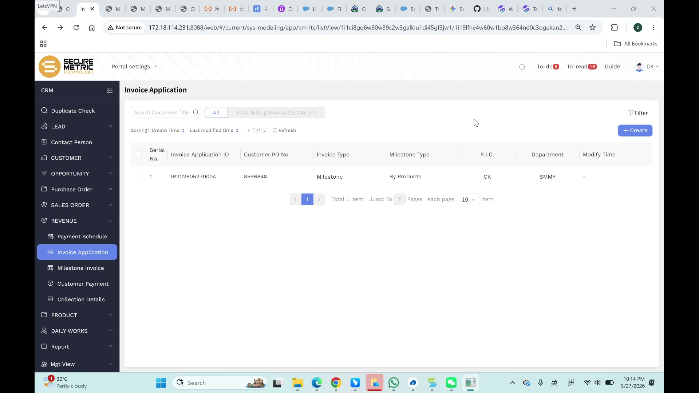
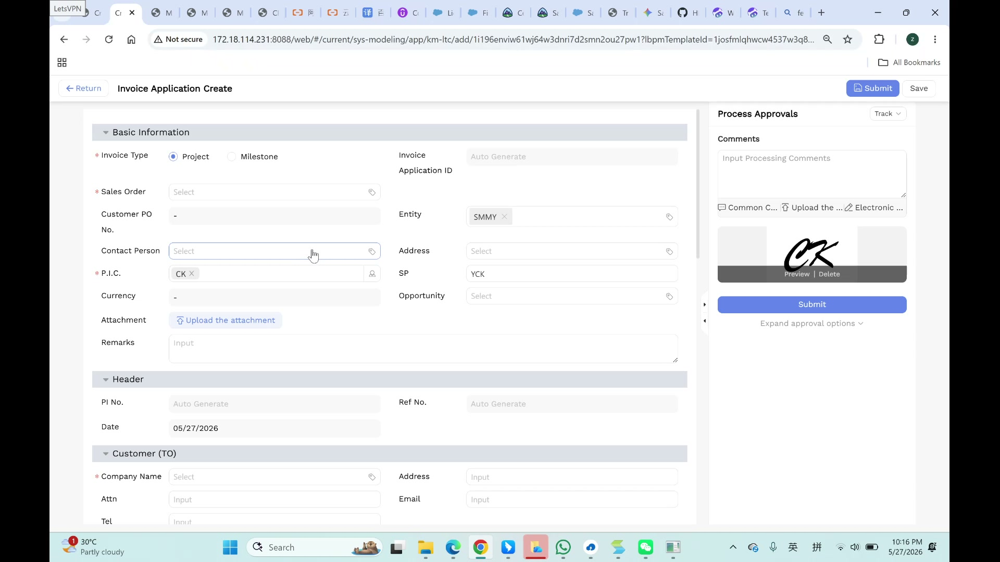
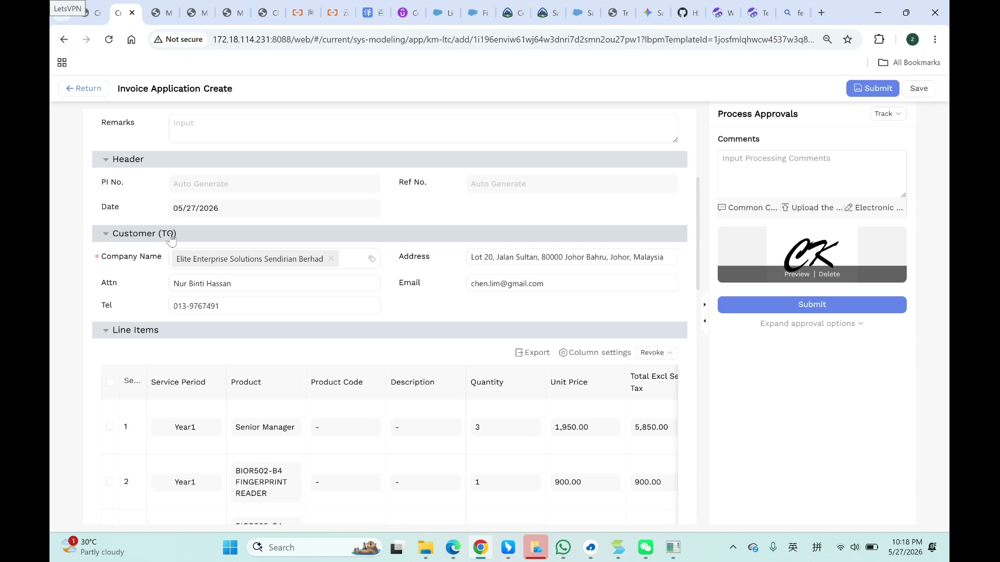
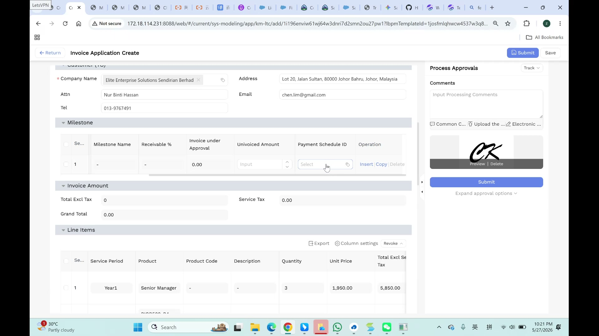
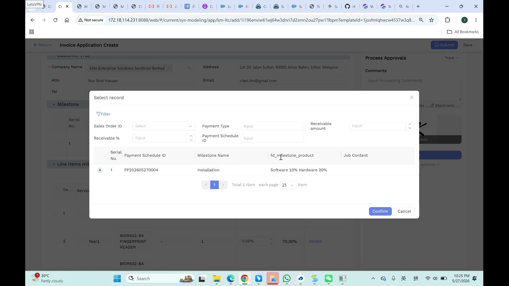
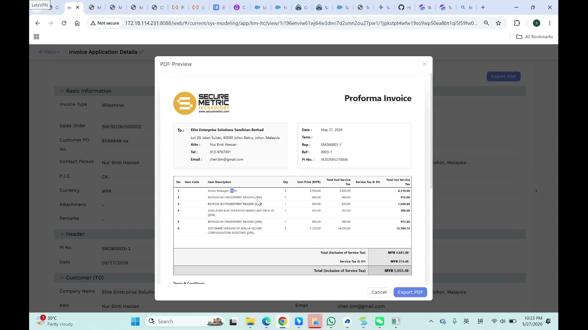

# Invoice Application User Manual

> **Version**: V1.0 | **Date**: 2026-05-28 | **System**: Securemetric CRM (EasyCraft)

---

## Table of Contents

1. [Module Overview](#1-module-overview)
2. [Invoice Application List](#2-invoice-application-list)
3. [Creating an Invoice Application](#3-creating-an-invoice-application)
4. [Project Type Invoice](#4-project-type-invoice)
5. [Milestone Type Invoice](#5-milestone-type-invoice)
6. [Invoice Details and PDF Export](#6-invoice-details-and-pdf-export)
7. [Approval Workflow](#7-approval-workflow)
8. [FAQ and Notes](#8-faq-and-notes)

---

## 1. Module Overview

The Invoice Application module handles post-sales revenue collection. It generates Proforma Invoices based on Sales Orders, supporting two billing models: **Project** (full-value invoicing) and **Milestone** (progress billing against payment schedules).

### 1.1 Entry Point

- **Sidebar**: Navigate to **REVENUE → Invoice Application**

### 1.2 Core Functions

| Function | Description |
|----------|-------------|
| Project Billing | Invoice the full Sales Order value at once |
| Milestone Billing | Invoice against specific payment milestones |
| PDF Preview | Preview and export Proforma Invoice as PDF |
| Approval Workflow | Digital signature and approval chain |
| Auto-Population | Line items inherited from Sales Order |

---

## 2. Invoice Application List

The list page displays all invoice applications with the following columns:

| Column | Description |
|--------|-------------|
| Serial No. | Row numbering |
| Invoice Application ID | Auto-generated (e.g., IR202605270004) |
| Customer PO No. | Customer's purchase order reference |
| Invoice Type | Project or Milestone |
| Milestone Type | By Products / By Percentage / - |
| P.I.C. | Person In Charge |
| Department | e.g., SMMY |
| Modify Time | Last modification timestamp |

### 2.1 Toolbar Features

- **Search Document Title**: Filter by document title
- **All Tab**: View all records
- **Total Billing Amount**: Sum of all invoice amounts
- **Sorting**: Sort by Create Time or Last Modified Time
- **Filter**: Advanced filtering options
- **+ Create**: Create a new invoice application
- **Refresh**: Reload the list

---

## 3. Creating an Invoice Application

Click the **+ Create** button to open the Invoice Application Create page.

### 3.1 Basic Information Section

| Field | Required | Type | Description |
|-------|----------|------|-------------|
| Invoice Type | Yes (*) | Radio | Select **Project** or **Milestone** |
| Invoice Application ID | Auto | Read-only | Auto-generated on submission |
| Sales Order | Yes (*) | Lookup | Select the source Sales Order |
| Customer PO No. | No | Text | Inherited from SO, editable |
| Entity | Yes | Tag | e.g., SMMY |
| Contact Person | No | Lookup | Linked to SO customer |
| Address | No | Lookup | Auto-filled from Contact Person |
| P.I.C. | Yes (*) | User Tag | Auto-filled with current user |
| SP | No | Text | e.g., "YCK" |
| Currency | Auto | Read-only | Inherited from SO (e.g., MYR) |
| Opportunity | No | Lookup | Parent opportunity |
| Attachment | No | Upload | Supporting documents |
| Remarks | No | Textarea | Additional notes |

### 3.2 Header Section

| Field | Required | Type | Description |
|-------|----------|------|-------------|
| PI No. | Auto | Read-only | Auto-generated |
| Ref No. | Auto | Read-only | Auto-generated |
| Date | Yes | Date Picker | Defaults to today |

### 3.3 Customer (TO) Section

| Field | Required | Type | Description |
|-------|----------|------|-------------|
| Company Name | Yes (*) | Lookup | Auto-filled from SO |
| Address | No | Text | Pre-filled from customer |
| Attn | No | Text | Contact person name |
| Email | No | Text | Customer email |
| Tel | No | Text | Customer phone |

---

## 4. Project Type Invoice

When **Invoice Type = Project**, line items are auto-populated from the Sales Order.

### 4.1 Line Items Table

| Column | Description |
|--------|-------------|
| Seq | Row number |
| Service Period | e.g., "Year1" |
| Product | Product name from SO |
| Product Code | e.g., "BIOR502-B4" |
| Description | Product description |
| Quantity | From SO |
| Unit Price | From SO |
| Total Excl Service Tax | Qty × Unit Price |
| Service Tax @ 8% | Auto-calculated |
| Total Incl Service Tax | Auto-calculated |

### 4.2 Invoice Amount Summary

| Field | Description |
|-------|-------------|
| Total Excl Tax | Sum of all line item totals |
| Service Tax | 8% SST |
| Grand Total | Total + Service Tax |

---

## 5. Milestone Type Invoice

When **Invoice Type = Milestone**, you must select a Payment Schedule record.

### 5.1 Milestone Table

| Column | Description |
|--------|-------------|
| Seq | Row number |
| Milestone Name | e.g., "Installation" |
| Receivable % | Percentage of total |
| Invoice under Approval | Amount currently in approval |
| Uninvoiced Amount | Amount not yet invoiced |
| Payment Schedule ID | Click to open Select Record modal |

### 5.2 Select Record Modal

Click the Payment Schedule ID field to open the selection modal.

**Filter Options**:
- Sales Order ID
- Payment Type
- Receivable amount
- Receivable %
- Payment Schedule ID

**Select a record** and click **Confirm** to attach it to the invoice.

---

## 6. Invoice Details and PDF Export

### 6.1 Viewing Invoice Details

After submission, click any record in the list to view details.

### 6.2 PDF Preview

Click **Export PDF** to open the PDF Preview modal:

- **Company Logo**: SECURE METRIC TECHNOLOGY
- **Document Title**: Proforma Invoice
- **Recipient Info**: Company name, address, contact details
- **Invoice Metadata**: Date, Term, Rep, Ref, PI No.
- **Line Items Table**: Item code, description, qty, unit price, tax, total
- **Financial Totals**: Total Excl Tax, Service Tax @ 8%, Total Incl Tax
- **Terms & Conditions**: Standard terms

### 6.3 Export PDF

Click the **Export PDF** button to download the Proforma Invoice as a PDF file.

---

## 7. Approval Workflow

The Process Approvals sidebar is available on the right side of the create/details page.

### 7.1 Approval Steps

1. **Track**: Select the workflow action from the dropdown
2. **Comments**: Enter processing comments
3. **Digital Signature**: Your signature is auto-captured from your profile
4. **Submit**: Click the Submit button to trigger the approval workflow

### 7.2 Signature Management

- **Preview**: View your signature
- **Delete**: Remove the current signature (will re-capture on next submit)

### 7.3 Additional Options

- **Common Comments**: Quick-insert standard comments
- **Upload attachment**: Add supporting documents
- **Expand approval options**: View custom approval chain

---

## 8. FAQ and Notes

### 8.1 What is the difference between Project and Milestone billing?

- **Project**: Invoice the full Sales Order value at once. All line items are included.
- **Milestone**: Invoice against specific payment milestones. Select which milestone to bill.

### 8.2 Why are some fields auto-filled?

Fields like Currency, Customer Name, and line items are inherited from the Sales Order to ensure data consistency and reduce manual entry.

### 8.3 What is the 8% Service Tax?

The system automatically applies 8% SST (Sales and Service Tax) to all invoice amounts, as required by Malaysian tax regulations.

### 8.4 Can I edit an invoice after submission?

Once submitted, the invoice enters the approval workflow. Edits may require revoking the submission or waiting for approval completion.

### 8.5 Known Issues

- **UI Typo**: "Univoiced Amount" should be "Uninvoiced Amount"
