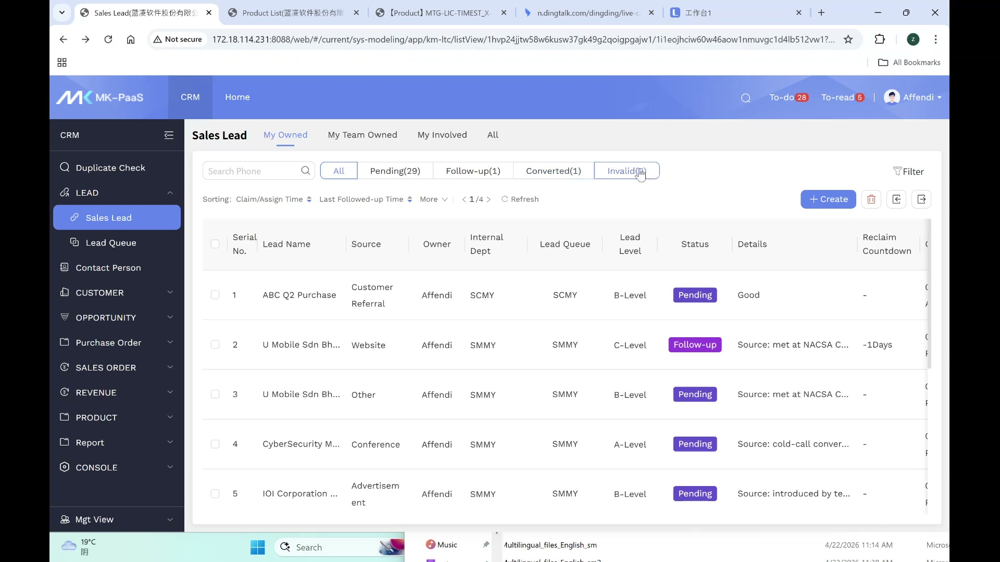
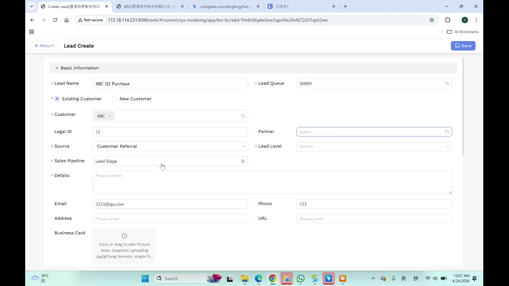
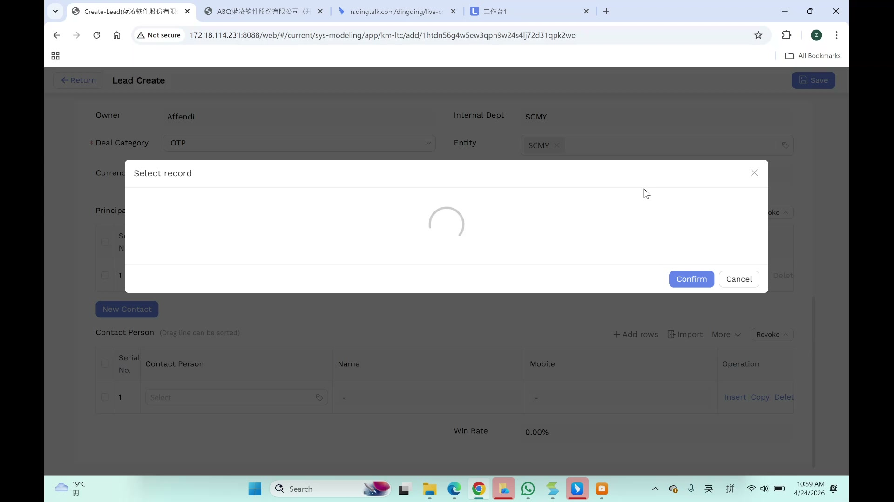
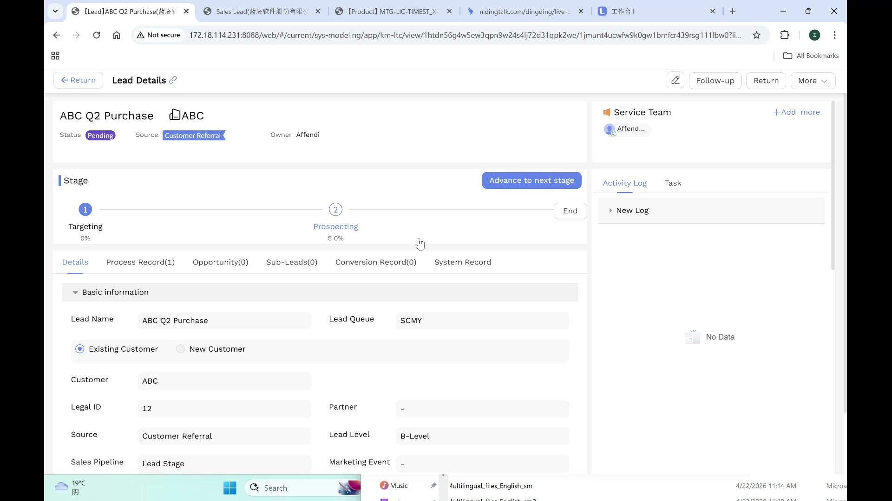
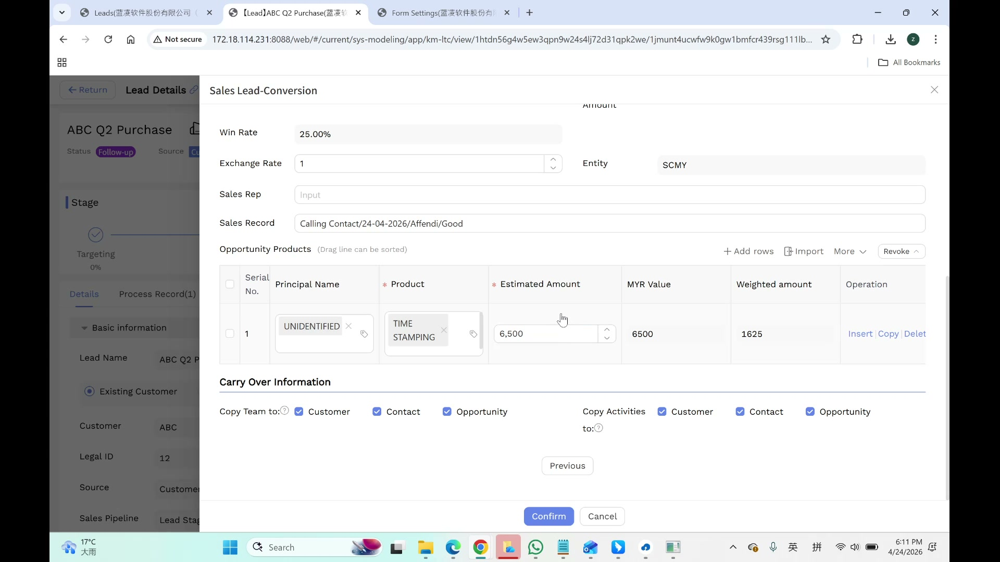
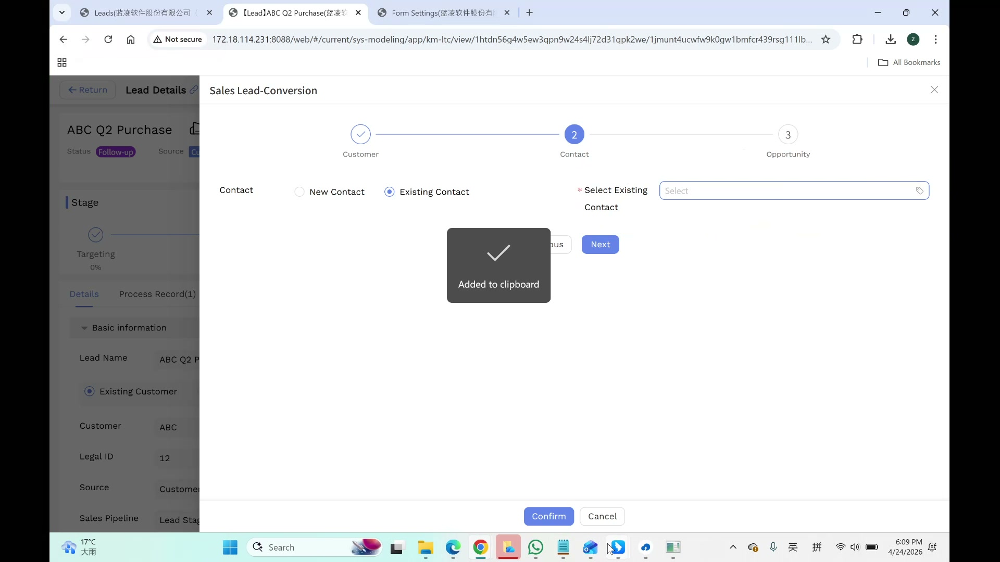
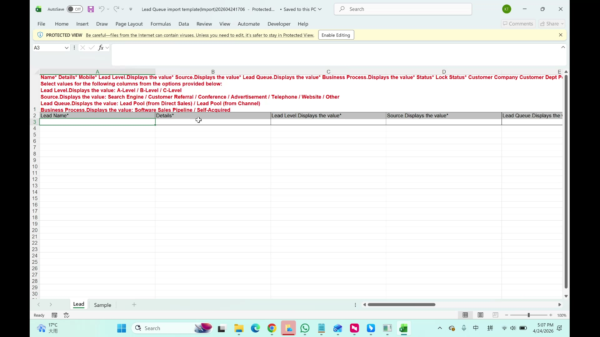
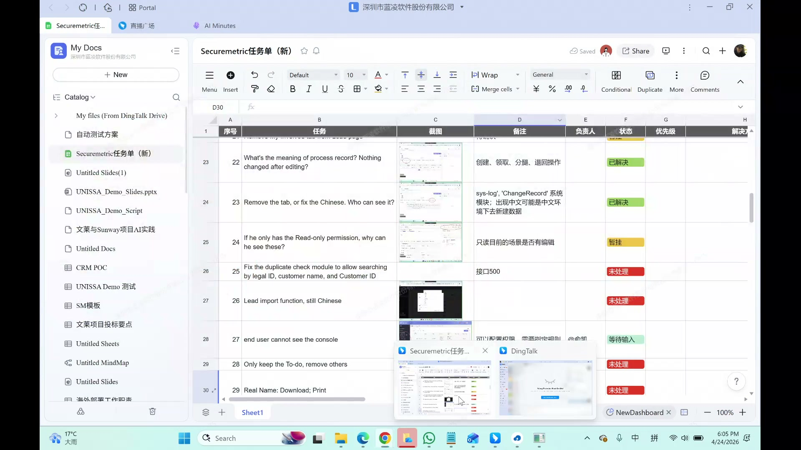

# 线索（Lead）用户手册

> **版本**: V1.0 | **日期**: 2026-06-04 | **系统**: Securemetric CRM (EasyCraft)

---

## 目录

1. [模块概述](#1-模块概述)
2. [线索列表](#2-线索列表)
3. [创建线索](#3-创建线索)
4. [线索详情](#4-线索详情)
5. [线索管理操作](#5-线索管理操作)
6. [线索转化流程](#6-线索转化流程)
7. [线索导入](#7-线索导入)
8. [常见问题与注意事项](#8-常见问题与注意事项)

---

## 1. 模块概述

线索（Lead）代表尚未确认的潜在销售机会。线索遵循以下生命周期：获取 → 分配 → 跟进 → 转化（转为商机或客户）。

### 1.1 入口路径

- **侧边栏**: 导航至 **LEAD（线索） → Sales Lead（销售线索）**
- **从转化**: 线索队列 → 选择线索 → 转化

### 1.2 核心功能

| 功能 | 描述 |
|------|------|
| 线索创建 | 创建包含客户和交易信息的新销售线索 |
| 线索队列 | 管理未分配和已分配的线索，含 SLA 跟踪 |
| 线索分配 | 销售经理从未分配队列中分配线索 |
| 线索转化 | 通过 2 步向导将合格线索转化为商机 |
| 线索导入 | 从 Excel 模板批量导入线索 |
| 任务管理 | 创建带截止日期和提醒的跟进任务 |

### 1.3 线索状态

| 状态 | 描述 |
|------|------|
| 未分配（Unassigned） | 新线索在队列中，等待经理分配 |
| 待处理（Pending） | 已分配但尚未开始跟进 |
| 跟进中（Follow-up） | 负责人正在积极跟进 |
| 已转化（Converted） | 已成功转化为商机/客户 |
| 无效（Invalid） | 通过"更多 → 无效"取消资格 |

### 1.4 线索阶段管道

| 阶段 | 赢率 | 描述 |
|------|------|------|
| 目标（Targeting） | 0% | 初步识别 |
| 发掘（Prospecting） | 5% | 积极互动 |
| 结束（End） | — | 流程完成 |

---

## 2. 线索列表

### 2.1 所属权筛选标签

- **我拥有的（My Owned）**: 我拥有的线索
- **我的团队拥有的（My Team Owned）**: 我团队拥有的线索
- **我参与的（My Involved）**: 我是团队成员的线索
- **全部（All）**: 我可见的所有线索

### 2.2 状态筛选标签

- **全部** | **未分配(N)** | **待处理(N)** | **跟进中(N)** | **已转化(N)** | **无效(N)**

### 2.3 列表功能

| 功能 | 描述 |
|------|------|
| 搜索 | "搜索电话"输入框用于快速查找 |
| 排序 | 创建时间、认领/分配时间、最后跟进时间 |
| 批量选择 | 复选框 + 表头复选框 + 批量删除 |
| 分页 | 底部显示"共 N 项"，支持"跳转至" |

### 2.4 行信息

每条线索显示：
- 线索名称、客户、负责人、状态、销售管道
- 预估交易金额、币种
- 回收倒计时（如"7天"或"-1天"表示已过期）
- 创建时间、最后跟进时间

---

## 3. 创建线索

### 3.1 入口

点击线索列表工具栏上的 **+ 创建** 按钮打开线索创建表单。

### 3.2 头部字段（自动填充）

| 字段 | 描述 |
|------|------|
| 负责人（Owner） | 从当前用户会话自动填充 |
| 内部部门（Internal Dept） | 从用户资料自动填充（如"SCMY"） |

### 3.3 基本信息

| 字段 | 必填 | 类型 | 备注 |
|------|------|------|------|
| 线索名称 | 是 | 文本 | 自动补全建议已有记录 |
| 线索队列 | 是 | 下拉 | 默认用户的实体队列（SMMY/SCMY） |
| 客户类型 | 是 | 单选 | 新客户/已有客户 — 必须首先选择 |
| 客户 | 条件 | 查找 | 客户类型=已有客户时必填 |
| 法定 ID | 否 | 文本 | 公司注册号 |
| 合作伙伴 | 否 | 下拉 | 合作组织 |
| 来源 | 是 | 级联选择器 | 搜索引擎、客户推荐、会议、广告、电话、网站、其他 |
| 线索等级 | 是 | 级联选择器 | A级、B级、C级 |
| 销售管道 | 是 | 下拉 | 默认："线索阶段" |
| 详情 | 是 | 文本域 | 销售备注和描述 |
| 邮箱 | 否 | 文本 | 联系邮箱 |
| 电话 | 否 | 文本 | 联系电话 |
| 地址 | 否 | 文本 | 公司地址 |
| 网址 | 否 | 文本 | 公司网站 |
| 名片 | 否 | 文件上传 | 仅 jpg/gif/png，单文件 |
| 备注 | 否 | 文本域 | 补充说明 |
| 市场活动 | 否 | 文本 | 市场活动关联 |

### 3.4 交易详情

| 字段 | 必填 | 类型 | 备注 |
|------|------|------|------|
| 交易类别 | 是 | 表格选择弹窗 | PKI、OTP、ADSS、CTG、HSM、TKN、RDR、CARD、DG、MS |
| 实体 | 否 | 标签/多选 | 如"SCMY"，可移除标签 |
| 币种 | 否 | 下拉 | 默认来自实体（SCMY为MYR）。支持8种货币 |
| 预估交易金额 | 否 | 数字 | 默认：0 |

### 3.5 主体分配表

> ⚠️ **重要**: 必须至少填写一个产品 + 预估金额。产品是账户范围的。

| 列 | 类型 | 备注 |
|----|------|------|
| 主体名称 | 查找 | 空时显示"-" |
| 产品描述 | 关系弹窗 | 打开"选择记录"弹窗 |
| 预估金额 | 数字 | 值根据币种显示 |
| MYR 值 | 只读 | 自动计算 |
| 加权金额 | 只读 | = 预估金额 × 赢率 |
| 操作 | 操作链接 | 插入 \| 复制 \| 删除 |

**表格工具栏**: + 添加行、导入、更多（下拉）、撤销

### 3.6 联系人表

| 列 | 类型 | 备注 |
|----|------|------|
| 联系人 | 查找 | 打开"选择记录"弹窗 |
| 姓名 | 自动填充 | 从联系人选择自动填充 |
| 手机 | 自动填充 | 从联系人选择自动填充 |
| 操作 | 操作链接 | 插入 \| 复制 \| 删除 |

**按钮**: 表格上方有"新建联系人"蓝色按钮

### 3.7 底部字段

| 字段 | 描述 |
|------|------|
| 赢率 | 默认 0.00%，根据阶段概率自动计算 |

> 💡 **提示**: 在目标阶段（0%），加权金额为空。

### 3.8 币种与预估金额范围

| 币种 | 最小值 | 最大值 |
|------|--------|--------|
| MYR | 5,000 | 50,000 |
| IDR | 15,000,000 | 150,000,000 |
| USD | 1,000 | 10,000 |
| SGD | 1,000 | 10,000 |
| EUR | 1,000 | 10,000 |
| GBP | 1,000 | 10,000 |
| THB | 30,000 | 300,000 |
| PHP | 50,000 | 500,000 |

---

## 4. 线索详情

### 4.1 子标签页

| 标签页 | 描述 |
|--------|------|
| 详情（Details） | 基本信息表单视图 |
| 流程记录(N) | 审计跟踪（负责人、获取方式、当前状态/阶段、时间戳） |
| 商机(N) | 关联商机列表 |
| 子线索(N) | 父线索下的子线索 |
| 转化记录(N) | 转化历史 |
| 系统记录 | 字段级变更日志（变更前后值及时间戳） |

---

## 5. 线索管理操作

### 5.1 "更多"菜单操作

| 操作 | 描述 |
|------|------|
| 无效（Invalid） | 取消线索资格，状态→无效 |
| 合并（Aggregate） | 合并重复/关联线索 |
| 重置阶段 | 回退阶段进度 |
| 创建任务 | 创建跟进任务 |
| 打印 | 打印线索记录 |
| 锁定 | 防止进一步编辑 |

### 5.2 服务团队管理

- 弹窗含列：姓名、职位、团队角色（负责人/成员）、权限（编辑/只读）、操作（删除）
- "+ 添加更多"按钮添加成员
- 权限变更立即触发 UI 更新

### 5.3 线索队列配置

| 字段 | 类型 | 备注 |
|------|------|------|
| 名称 | 文本 | 如"SCMY" |
| 编号 | 只读 | 自动生成：PLP20260417008 |
| 描述 | 文本域 | 占位符："请输入" |
| 管理员 | 多选用户选择器 | 可移除的标签 |
| 成员 | 多选用户选择器 | 可移除的标签 |

**认领与分配规则**:
- "成员可见可认领，管理员可分配"
- "对成员隐藏，管理员可分配"

**SLA**: 7 天回收倒计时。未处理的线索自动退回公共池。

---

## 6. 线索转化流程

### 6.1 入口

从线索列表或详情页，点击 **转化** 打开"销售线索-转化"弹窗。

### 6.2 步骤 1：客户

- 验证/创建客户账户
- 线索中的联系人自动关联到客户

### 6.3 步骤 2：商机

| 字段 | 类型 | 备注 |
|------|------|------|
| 销售阶段 | 下拉 | → "商机" |
| 交易类别 | 下拉 | → "PKI" |
| 状态 | 徽章 | → "进行中" |
| 币种 | 下拉 | → "MYR" |
| 预估交易金额 | 数字 | — |
| 赢率 | 百分比 | → 25.00% |
| 汇率 | 数字（带微调器） | — |
| 实体 | 文本 | → "SCMY" |
| 销售代表 | 文本输入 | — |
| 销售记录 | 文本域 | — |

### 6.4 商机产品表

| 列 | 备注 |
|----|------|
| 序号 | 行号 |
| 主体名称 | 产品供应商 |
| 产品 | 产品名称 |
| 预估金额 | 交易价值 |
| MYR 值 | 自动计算 |
| 加权金额 | = 预估金额 × 赢率 |

### 6.5 转化后状态

- 状态徽章变为绿色 **"已转化"**
- 商机(1) 标签页显示关联的商机
- 转化记录(1) 标签页显示转化历史

---

## 7. 线索导入

### 7.1 入口

点击线索列表工具栏上的 **导入** 按钮（带向内箭头的文档图标）。

### 7.2 导入弹窗

| 字段 | 必填 | 备注 |
|------|------|------|
| 导入模式 | 是 | 4 种模式：新增/更新/新增和更新/快速 |
| 条件字段 | 是 (*) | 设为"线索名称" |
| 重复检查字段 | 否 | 可选 |

### 7.3 导入模式

| 模式 | 行为 |
|------|------|
| 新增导入 | 仅 INSERT — 新记录 |
| 更新导入 | 仅 UPDATE — 已有记录 |
| 新增和更新导入 | UPSERT — 新记录和已有记录 |
| 快速导入 | 仅单表 |

### 7.4 Excel 模板

**共 17 列，9 列必填 (*)**:

**必填**: 线索名称、详情、手机、线索等级、来源、线索队列、业务流程、状态、锁定状态、销售管道

**可选**: 客户公司、客户部门、职位、邮箱、地址、市场活动、关联

> ⚠️ **枚举验证**: 线索等级（A/B/C级）、来源（7个值）、锁定状态数值映射：1=解锁，2=已锁定

---

## 8. 常见问题与注意事项

### 8.1 任务管理

**任务创建弹窗**:

| 字段 | 类型 |
|------|------|
| 截止日期 | 日期/时间选择器 |
| 负责人 | 用户选择器（标签） |
| 执行人 | 用户选择器（标签） |
| 优先级 | 下拉：高/中/低 |
| 关联类型 | 下拉 → "线索"（自动关联） |
| 抄送收件人 | 用户选择器 |
| 描述 | 文本域 |
| 附件 | 文件上传 |

**任务反馈**: 完成进度（滑块 0-100%），富文本编辑器填写描述。

### 8.2 业务规则

1. **72 小时超时**: 72 小时未处理的线索触发"回收倒计时"通知
2. **冲突检查**: 客户名称唯一性会与已有记录进行核对
3. **客户类型必须先选择**，然后才能填写客户详情
4. **主体分配表必须至少填写一个产品 + 预估金额**
5. **负责人自动分配**: 创建时，负责人 = 创建人

### 8.3 已知问题

- CRM 拼写错误：详情字段使用 `teaxtarea`（非"textarea"）
- 主体分配表弹窗为空：只有特定账户有产品记录
- 表单提交后，页面有时会先跳转到 `about:blank` 再到最终 URL
