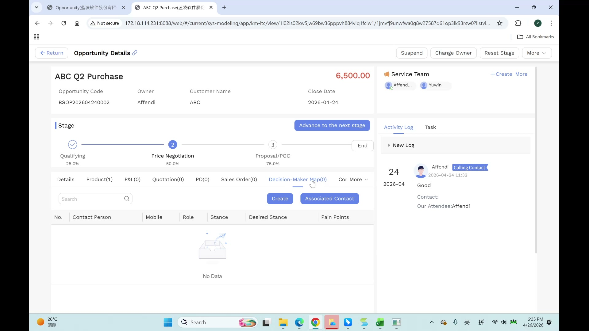

# Opportunity User Manual

> **Version**: V1.0 | **Date**: 2026-06-04 | **System**: Securemetric CRM (EasyCraft)

---

## Table of Contents

1. [Module Overview](#1-module-overview)
2. [Opportunity List View](#2-opportunity-list-view)
3. [Create an Opportunity](#3-create-an-opportunity)
4. [Opportunity Details View](#4-opportunity-details-view)
5. [Stage Pipeline](#5-stage-pipeline)
6. [P&L & Quotation Workflow](#6-pl--quotation-workflow)
7. [Ownership Transfer & Service Team](#7-ownership-transfer--service-team)
8. [FAQ & Notes](#8-faq--notes)

---

## 1. Module Overview

Opportunities are qualified deals driven by P&L (Profit & Loss) analysis. The P&L is the pricing engine; quotes are read-only views generated from approved P&Ls.

### 1.1 Entry Points

- **Sidebar**: Navigate to **OPPORTUNITY → Opportunity**
- **From Lead Conversion**: Lead → Convert → Step 2: Opportunity

### 1.2 Core Functions

| Function | Description |
|----------|-------------|
| Opportunity Creation | Create qualified deals from leads or directly |
| Stage Pipeline | Track deal progression through 5 stages |
| P&L Management | Pricing engine with approval workflow |
| Quotation Generation | Auto-generated from approved P&L |
| Ownership Transfer | Transfer deal ownership with team continuity options |
| Service Team | Manage team members and permissions |

---

## 2. Opportunity List View

### 2.1 View Tabs

| Tab | Description |
|-----|-------------|
| Owned | Opportunities owned by me |
| Team's | Opportunities owned by my team |
| Involved | Opportunities where I am a team member |
| All | All opportunities visible to me |

### 2.2 Status Filter Pills

- **All** | **Open** | **Won** | **Lost** | **Suspended** | **Invalid**

### 2.3 Advanced Search

| Search Field | Type |
|-------------|------|
| Opportunity Name | Text |
| Customer | Lookup |
| Owner | User selector |
| Department | Dropdown |
| Sales Pipeline | Dropdown |
| Estimated Close Date | Date range |
| Create Time | Date range |

### 2.4 Grid Columns

| Column | Description |
|--------|-------------|
| Serial No. | Row number |
| Opportunity Name | Deal name |
| Customer | Associated customer |
| Owner | Deal owner |
| Estimated Close Date | Expected close date |
| Status | Status badge |
| Sales Pipeline | Current stage |
| Estimated Deal Amount | Deal value |

### 2.5 Bulk Actions

- Checkbox selection for multiple records
- Bulk Delete

---

## 3. Create an Opportunity

### 3.1 Entry

Click **+ Create** on the Opportunity List toolbar.

### 3.2 Basic Fields

| Field | Required | Type | Notes |
|-------|----------|------|-------|
| Opportunity Name | Yes | Text | Deal name |
| Estimated Close Date | No | Date Picker | Format: YYYY-MM-DD, then Enter |
| Deal Category | No | Cascader | Same options as Lead (PKI, OTP, ADSS, etc.) |
| Sales Pipeline | No | Dropdown | Stage options loaded dynamically |
| Principal in Charge | No | Relation Modal | Opens "Select record" modal |
| Product Description | No | Detail Table | Inline editable table |

---

## 4. Opportunity Details View



### 4.1 Top Action Bar

| Action | Description |
|--------|-------------|
| Suspend | Suspend the opportunity |
| Change Owner | Transfer ownership to another user |
| Reset Stage | Revert stage progression |
| More | Additional actions |

### 4.2 Summary Header

- Opportunity Name, Deal value (red highlight)
- Opportunity Code: Auto-generated format **BSOP+YYYYMMDD+sequence**
- Owner, Customer, Close Date, Service Team

### 4.3 Sub-Tabs

| Tab | Description |
|-----|-------------|
| Details | Basic information form view |
| Product(N) | Product line items |
| P&L(N) | Profit & Loss analyses |
| Quotation(N) | Generated quotations |
| PO(N) | Purchase orders |
| Sales Order(N) | Sales orders |
| Decision-Maker Map(N) | Contact decision network |
| Competitive Analysis(N) | Competitor comparison |
| More | Additional sub-tabs |

### 4.4 Product Line Items

| Column | Description |
|--------|-------------|
| No. | Row number |
| Service Period | Service duration |
| Principal Name | Product provider |
| Product Name | Product name |
| Estimated Amount | Line item value |

> 💡 **Tip**: Header deal amount = roll-up sum of all line items.

---

## 5. Stage Pipeline

### 5.1 Stage Definition

| Order | Stage | Win Rate | Type | Auto-Advance |
|-------|-------|----------|------|--------------|
| 1 | Qualifying | 25% | Start | Manual |
| 2 | Proposal/POC | 50% | In Progress | Manual |
| 3 | Price Negotiation | 75% | In Progress | Manual |
| 4 | Deal Won | 100% | End | — |
| 5 | Deal Lost | 0% | End | — |

### 5.2 Stage Progression

- Horizontal stepper visualization with numbered circles
- **"Advance to the next stage"** button (blue CTA)
- All stages require manual advancement

---

## 6. P&L & Quotation Workflow

### 6.1 Pricing Architecture

```
Opportunity → P&L Creation → P&L Approval → Quotation Generation
```

### 6.2 Key Rules

1. **P&L-driven pricing**: The P&L is the engine; the quote is just a "view"
2. **Version locking**: P&L V1 → Quote V1. Price changes require creating a new version
3. **Approval workflow**: AM submits → MD/CM approves. Rejected P&Ls must be revised and resubmitted
4. **Only "active" P&L versions** are included in pipeline reports

### 6.3 Approval Workflow

```
AM submits P&L → MD/CM reviews → Approved → Quote generated
                              ↓
                         Rejected → AM revises → Resubmit
```

**Approval Records table**: Start Node → Drafting Node → Approval → End Node with timestamps.

---

## 7. Ownership Transfer & Service Team

### 7.1 Ownership Transfer Logic

| Option | Description |
|--------|-------------|
| New Owner Selection | User picker for selecting new owner |
| Original Owner Options | Remove from team / Demote to team member |
| Permission | Read-Only / Read-Write |
| Team Continuity | Clear All / Keep Existing |

### 7.2 Service Team Management

- **Add Group Member** modal: Member selection, Permission (Read-only/Edit & Read), Group Character
- Team members can be added or removed at any time

---

## 8. FAQ & Notes

### 8.1 Task Creation

Tasks can be created from Opportunity Details via a slide-out drawer:

| Field | Required |
|-------|----------|
| Task Title | Yes |
| Deadline | Yes |
| Owner | No |
| Executor | Yes |
| Priority | Yes |
| Associated Type | Auto-linked to Opportunity |
| C.C. Recipient | No |
| Description | No |
| Attachment | No |

### 8.2 Business Rules

1. P&L is the pricing engine; quotes cannot be edited directly
2. Only active P&L versions included in pipeline reports
3. Report sorting: Entity → Rep → Date
4. Opportunity Code auto-generated: BSOP+YYYYMMDD+sequence

### 8.3 Known Issues

- Approval flow test coverage: 0%
- "Project Character" field in "Add Group Member" modal — no input widget rendered
- Typo: "Oppourtunities" misspelled in stage template
- Inconsistent stage order between detail view and template config
