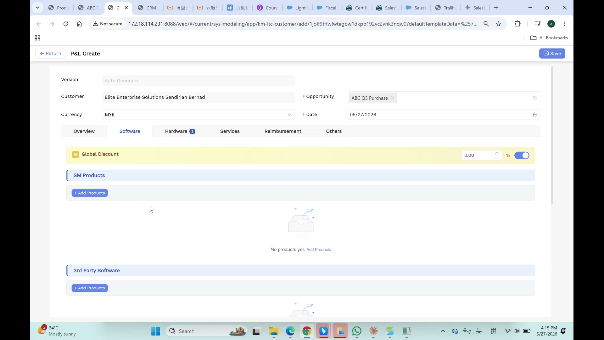
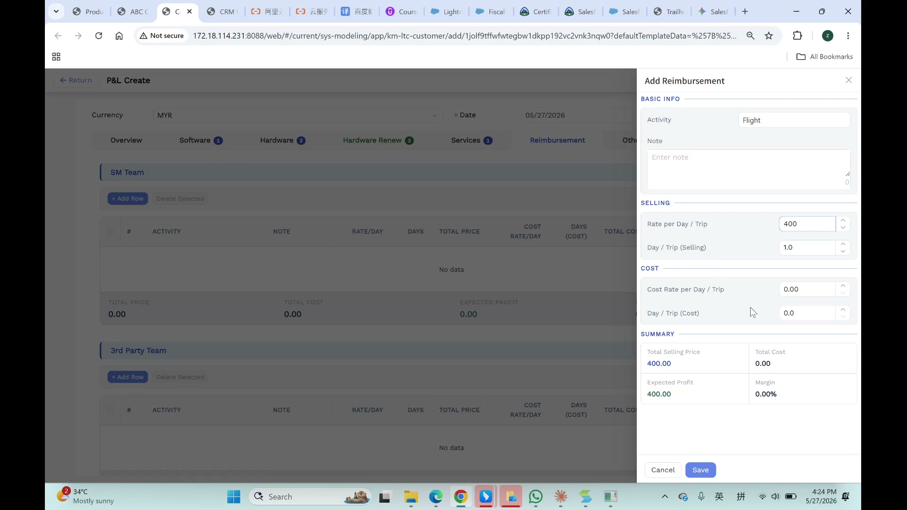
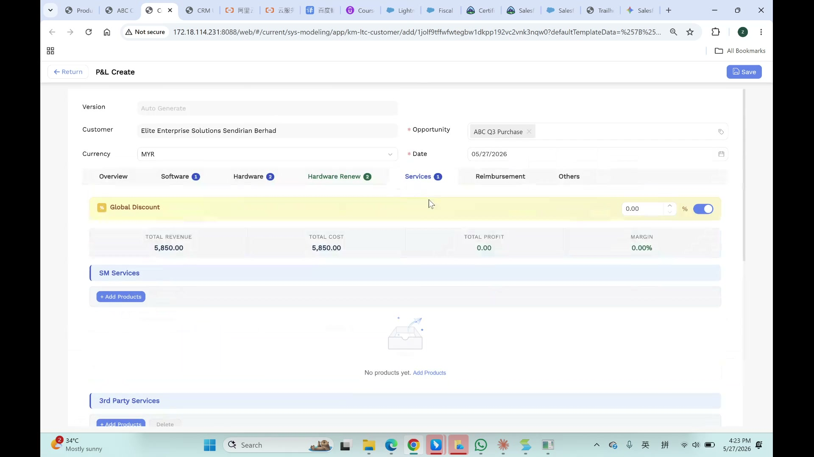
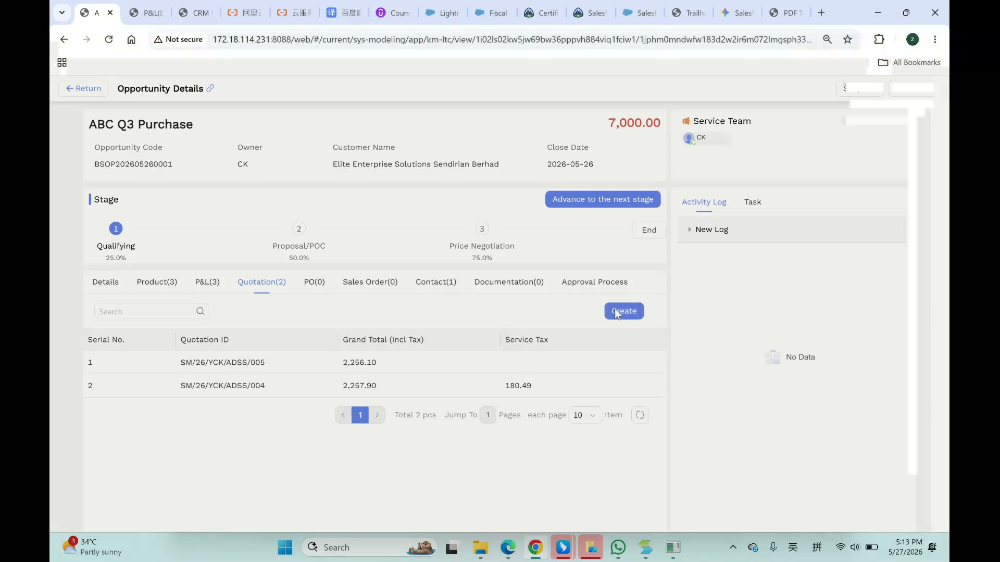
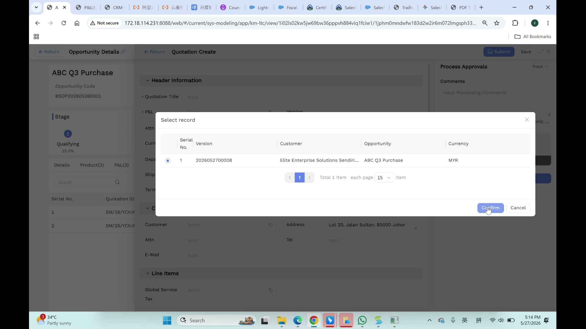
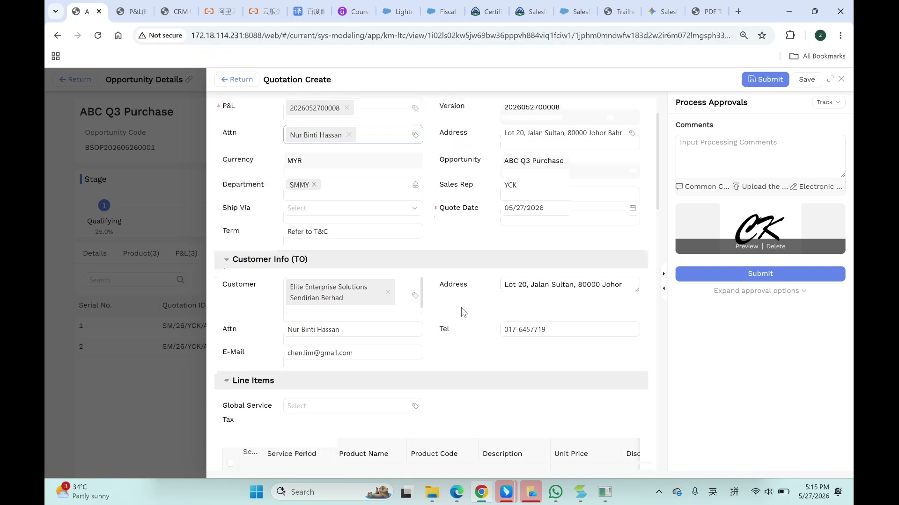
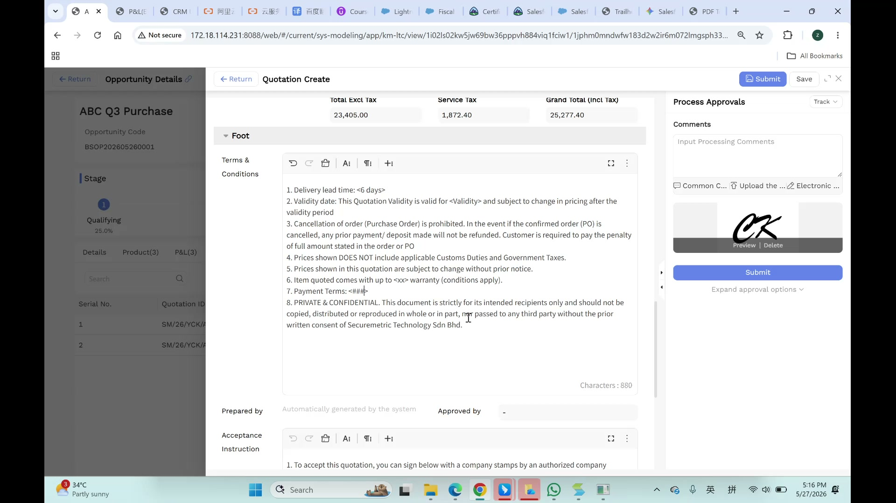

# P&L 与 Quotation 用户手册

> **版本**: V1.0 | **日期**: 2026-05-27 | **适用系统**: Securemetric CRM (EasyCraft)

---

## 目录

1. [P&L 模块概述](#1-pnl-模块概述)
2. [P&L 创建流程](#2-pnl-创建流程)
3. [P&L 产品分类管理](#3-pnl-产品分类管理)
4. [P&L 详情与多年度视图](#4-pnl-详情与多年度视图)
5. [P&L 审批流程](#5-pnl-审批流程)
6. [Quotation 创建流程](#6-quotation-创建流程)
7. [Quotation 条款与签名](#7-quotation-条款与签名)
8. [Quotation PDF 预览与导出](#8-quotation-pdf-预览与导出)
9. [常见问题与注意事项](#9-常见问题与注意事项)

---

## 1. P&L 模块概述

P&L（Profit & Loss，损益表）是 CRM 系统的核心定价引擎。它用于计算产品成本、利润率，并在审批通过后生成正式报价单（Quotation）。

### 1.1 入口路径

- **方式一**：侧边栏 → 进入具体 Opportunity 详情页 → 点击 "P&L" 标签 → 点击 "Create"
- **方式二**：侧边栏 → 直接导航到 P&L 模块 → 点击 "Create"

### 1.2 核心功能

| 功能 | 说明 |
|------|------|
| 成本核算 | 按产品类别录入成本和售价 |
| 利润计算 | 自动计算总收入、总成本、总利润和利润率 |
| 多年度管理 | 支持 Year 1 / Year 2 (RENEW) / Year 3 (RENEW) 续期视图 |
| 折扣管理 | 支持全局折扣和单行折扣两种模式 |
| 审批流程 | 提交后自动触发审批工作流 |
| 克隆功能 | 可复制已有 P&L 进行快速创建 |

---

## 2. P&L 创建流程

### 2.1 基本信息填写

进入 P&L Create 页面后，首先填写基本信息：



| 字段 | 说明 | 是否必填 |
|------|------|----------|
| Version | 版本号（自动生成） | 系统自动 |
| Customer | 客户名称（从 Opportunity 自动带入） | 自动带入 |
| Opportunity | 关联的商机 | 是 (*) |
| Currency | 货币（默认 MYR） | 是 (*) |
| Date | 日期（默认当天） | 是 (*) |

**操作按钮**：
- **Save**（右上角蓝色按钮）：保存草稿
- **Return**（左上角）：返回列表

### 2.2 分类标签导航

P&L 使用 7 个分类标签来管理不同类型的产品：


| 标签 | 说明 | 徽章数字含义 |
|------|------|-------------|
| Overview | 总览页面，汇总所有类别数据 | — |
| Software | 软件产品 | 已添加的软件数量 |
| Hardware | 硬件产品 | 已添加的硬件数量 |
| Hardware Renew | 硬件续期产品 | 已添加的续期硬件数量 |
| Services | 专业服务 | 已添加的服务项目数量 |
| Reimbursement | 报销费用 | 已添加的报销项数量 |
| Others | 其他类别 | 其他项目数量 |

每个标签右上角的蓝色圆形徽章显示该类别下的产品数量。

### 2.3 全局折扣设置

在页面顶部有一个黄色高亮的全局折扣栏：


- **折扣输入框**：输入百分比数值（如 5.00%）
- **开关按钮**：蓝色表示已启用，灰色表示未启用
- **启用后**：所有产品行自动继承全局折扣
- **未启用**：需要在每个产品行单独设置折扣

### 2.4 财务汇总卡片

页面顶部显示四个关键财务指标：

| 卡片名称 | 说明 | 颜色 |
|----------|------|------|
| Total Revenue | 总收入（所有产品售价之和） | 蓝色文字 |
| Total Cost | 总成本（所有产品成本之和） | 默认颜色 |
| Total Profit | 总利润（收入 - 成本） | 绿色文字 |
| Margin | 利润率（利润 / 成本 × 100%） | 绿色（健康）/ 红色（低于目标） |

> ⚠️ **注意**：系统计算的 "Margin" 实际上是 **Markup（加价率）**，计算公式为 `(利润 / 成本) × 100%`，而非标准的毛利率 `(利润 / 收入) × 100%`。

---

## 3. P&L 产品分类管理

### 3.1 添加产品

在每个产品类别下，点击 "+ Add Products" 按钮打开产品选择模态框：


**模态框结构**：
- **左面板**：搜索过滤区（Product Code、Product Description 输入框）+ 产品列表
- **右面板**："Selected (N)" 已选产品列表
- **底部按钮**：Cancel（取消）、Add N Products（添加 N 个产品，未选择时禁用）

### 3.2 产品表格列说明

| 列名 | 说明 | 是否可编辑 |
|------|------|-----------|
| # | 行号 + 复选框 | — |
| CODE | 产品代码 | 自动带入 |
| PRODUCT | 产品名称 | 自动带入 |
| UNIT PRICE | 单价 | 可编辑 |
| MARKUP | 加价百分比 | 可编辑 |
| DISC | 折扣百分比 | 可编辑（或继承全局折扣） |
| PRICE | 折后净价 | 自动计算 |
| QTY | 数量 | 可编辑 |
| TOTAL PRICE | 总价（PRICE × QTY） | 自动计算 |
| COST | 成本 | 可编辑 |
| PROFIT | 利润（总价 - 成本） | 自动计算 |
| MARGIN | 利润率 | 自动计算 |
| TARGET | 目标利润率 | 系统设定 |
| Actions | 操作链接 | — |

### 3.3 行操作

每行产品提供三个操作链接：

| 操作 | 说明 |
|------|------|
| Edit | 打开右侧编辑面板，修改产品参数 |
| Renew | 创建续期产品行（用于 Hardware Renew 标签） |
| Delete | 删除该产品行 |

### 3.4 编辑产品

点击 "Edit" 后，右侧弹出编辑面板：


可修改的参数：
- **Markup**：加价百分比
- **Discount**：折扣（全局或单行）
- **Quantity**：数量
- **Price Breakdown**：价格明细（原价、加价后价格、总价）
- **Cost**：成本明细

修改后点击 "Save" 保存，或 "Cancel" 取消。

### 3.5 专业服务（Services）

专业服务使用 SM Team / 3rd Party Team 两个表格管理：


| 列名 | 说明 |
|------|------|
| ACTIVITY | 活动描述（如 "Flight"、"Senior Manager"） |
| NOTE | 备注 |
| RATE/DAY | 每日售价 |
| DAYS | 计费天数 |
| TOTAL PRICE | 总价（RATE/DAY × DAYS） |
| COST RATE/DAY | 每日成本 |
| DAYS (COST) | 成本天数（可与收入天数不同） |
| TOTAL COST | 总成本 |
| PROFIT | 利润 |
| MARGIN | 利润率 |

### 3.6 报销费用（Reimbursement）

点击 "+ Add Products" 后弹出 "Add Reimbursement" 模态框：



| 字段 | 说明 |
|------|------|
| Activity | 活动类型（下拉选择，如 "Flight"） |
| Note | 备注 |
| Rate per Day / Trip | 每日/每次售价 |
| Day / Trip (Selling) | 售价计费单位数 |
| Cost Rate per Day / Trip | 每日/每次成本 |
| Day / Trip (Cost) | 成本计费单位数 |
| Total Selling Price | 自动计算 |
| Total Cost | 自动计算 |
| Expected Profit | 自动计算 |
| Margin | 自动计算 |

### 3.7 产品总览

在 Overview 标签页可以看到所有产品的汇总：


每个类别下方显示该类别的小计：
- Total Price（该类别总价）
- Total Cost（该类别总成本）
- Expected Profit（该类别预期利润）
- Margin（该类别利润率）

---

## 4. P&L 详情与多年度视图

### 4.1 详情页面

P&L 详情页面标题为 "P&L Details"，显示已保存的 P&L 记录：



**操作按钮**：
- **Edit**（铅笔图标）：进入编辑模式
- **Delete**（垃圾桶图标）：删除记录
- **Copy New**：克隆创建新 P&L
- **New Quotation**：基于此 P&L 创建报价单

### 4.2 多年度视图

详情页面包含按年度分类的财务汇总表：

| 类别 | YEAR 1 | YEAR 2 (RENEW) | YEAR 3 (RENEW) | TOTAL |
|------|--------|----------------|----------------|-------|
| Software | 收入/成本/利润率 | 续期数据 | 续期数据 | 三年合计 |
| Hardware | 收入/成本/利润率 | 续期数据 | 续期数据 | 三年合计 |
| Services | 收入/成本/利润率 | 续期数据 | 续期数据 | 三年合计 |
| Reimbursement | 收入/成本/利润率 | — | — | 合计 |
| **GRAND TOTAL** | **年度合计** | **年度合计** | **年度合计** | **总计** |

每个单元格显示该类别在该年度的收入、成本和利润率（颜色编码：绿色=健康）。

### 4.3 元数据字段

详情页面底部显示：
- **Entity**：公司实体代码（如 SMMY）
- **Deal Category**：交易类别（如 ADSS）

### 4.4 权限设置

详情页面底部有 "Permissions" 标签：

| 权限类型 | 默认值 |
|----------|--------|
| Readers | "No one can read except the author and related personnel" |
| Editors | "Administrator" |
| Attachment Download | 仅限作者和相关人员 |

---

## 5. P&L 审批流程

### 5.1 右侧审批面板

P&L 创建页面右侧显示 "Process Approvals" 面板：

| 元素 | 说明 |
|------|------|
| Track 下拉框 | 选择审批跟踪视图 |
| Input Processing Comments | 审批备注输入框 |
| Common Comments | 快捷插入常用备注 |
| Upload attachment | 上传审批附件 |
| Signature Preview | 数字签名预览（显示签名图片） |
| Submit | 大型蓝色提交按钮 |
| Expand approval options | 展开更多审批选项 |

### 5.2 审批工作流

P&L 审批遵循以下逻辑：

```
提交 P&L → 系统比较 Margin vs Target
    ├─ Margin < Target → 路由至 Sales Team Supervisor 审批
    ├─ Margin ≥ Target → 检查是否包含 Key Products
    │   ├─ 包含 Key Products → 路由至 Sales Team Supervisor 审批
    │   └─ 不包含 → 自动审批通过
    └─ 审批结果：Approved / Rejected
```

### 5.3 状态流转

| 操作 | 状态 |
|------|------|
| Save | 草稿（Draft） |
| Submit | 待审批（Pending Approval） |
| Revoke | 已撤回（Revoked） |
| Approved | 已批准 |
| Rejected | 已驳回（需修改后重新提交） |

---

## 6. Quotation 创建流程

### 6.1 从 Opportunity 创建报价单

Quotation 从已批准的 P&L 创建，作为滑出面板显示在 Opportunity 详情页之上：



**创建步骤**：
1. 进入 Opportunity 详情页
2. 点击 "Quotation" 标签
3. 点击 "Create" 按钮
4. 系统弹出 "Select record" 模态框，选择要关联的 P&L 版本
5. 点击 "Confirm" 确认



### 6.2 Quotation 基本信息

Quotation Create 面板分为多个区域：



**Header Information 区域**：

| 字段 | 说明 | 是否必填 |
|------|------|----------|
| Quotation Title | 报价单标题（带自动补全，防止重名） | 是 (*) |
| P&L | 关联的 P&L 编号 | 是 (*) |
| Attn | 联系人（下拉选择） | — |
| Currency | 货币（自动带入 MYR） | — |
| Department | 部门（标签选择器，如 SMMY） | — |
| Ship Via | 运输方式（下拉选择） | — |
| Term | 付款条款（如 "Refer to T&C"） | — |

**右侧字段**：

| 字段 | 说明 |
|------|------|
| P&L ID | 与 P&L 字段相同 |
| Address | 从客户自动带入 |
| Opportunity | 父商机名称（只读） |
| Sales Rep | 销售代表（自动带入） |
| Quote Date | 报价日期（自动设为当天） |

### 6.3 客户信息（Customer Info - TO）

| 字段 | 说明 |
|------|------|
| Customer | 客户名称（从 P&L/Opportunity 自动带入） |
| Address | 客户地址（自动带入） |
| Attn | 联系人（需手动输入） |
| Tel | 电话号码（需手动输入） |
| E-Mail | 邮箱地址（需手动输入） |

### 6.4 行项目与财务汇总

Quotation 自动从 P&L 计算财务数据：

| 指标 | 说明 |
|------|------|
| Total Excl Tax | 不含税总额 |
| Service Tax | 服务税（马来西亚 8% SST） |
| Grand Total (Incl Tax) | 含税总额（Total Excl Tax + Service Tax） |

---

## 7. Quotation 条款与签名

### 7.1 Foot 区域

Quotation 底部包含法律条款和签名区域：



#### Terms & Conditions（条款与条件）

使用富文本编辑器，包含 8 条预设内容：

1. 交货期（< 6 天）
2. 有效期
3. 取消政策（不退还定金）
4. 关税除外条款
5. 价格变更权
6. 保修条款（<xx>）
7. 付款条款（<Payment Terms>）
8. 保密条款（提及 "Securemetric Technology Sdn Bhd"）

> 💡 **提示**：条款中包含动态占位符（如 `<Validity>`、`<xx>`、`<Payment Terms>`），在生成 PDF 时会被实际值替换。

**富文本编辑器工具栏**：
- 撤销 / 重做
- 复制 / 粘贴
- 字体大小
- 段落格式
- 全屏展开

#### Prepared by / Approved by

| 字段 | 说明 |
|------|------|
| Prepared by | "Automatically generated by the system"（系统自动生成） |
| Approved by | 审批后自动填充审批人 |

#### Acceptance Instruction（接受指引）

富文本编辑器，预设内容：
> "To accept this quotation, you can sign below with a company stamps by an authorized company representative."

### 7.2 数字签名

在右侧 "Process Approvals" 面板中：
- **Signature Preview**：显示手写签名图片（如 "CK"）
- **Preview**：预览签名
- **Delete**：删除签名

---

## 8. Quotation PDF 预览与导出

### 8.1 PDF 预览

从 Quotation Details 页面可以预览生成的 PDF：

**PDF 内容包含**：
- 公司抬头：SECUREMETRIC TECHNOLOGY SDN. BHD. (公司注册号)
- 财务汇总表（Total Excl Service Tax / Service Tax @ 8% / Total Amount）
- 条款与条件（8 条）
- 签名区块：
  - Prepare by（编制人签名）
  - Approved by（审批人签名）

### 8.2 导出 PDF

在 PDF 预览模态框中：
- **Cancel**：关闭预览
- **Export PDF**（蓝色主按钮）：下载 PDF 文件

导出后浏览器右上角显示下载通知：
- 文件名格式：`ABC Q3 Purchase Quotation...`
- 文件大小：约 708 KB
- 状态：Done

### 8.3 Quotation 详情页面

Quotation 详情页面标题为 "Quotation Details"，包含：

| 元素 | 说明 |
|------|------|
| 标签 | Details / Quotation Details(N) / Sales Order |
| Header Information | 所有创建时的字段（只读模式） |
| Customer Info | 客户信息（只读模式） |
| +Create More | 创建更多关联记录 |

---

## 9. 常见问题与注意事项

### 9.1 利润率计算

- 系统使用 `(利润 / 成本) × 100%` 计算 "Margin"
- 这在会计上称为 **Markup（加价率）**，而非 Gross Margin（毛利率）
- 当 Margin < Target 时，显示红色感叹号警告图标

### 9.2 多年度合同

- 硬件产品可以跨越多个年度（Year 1 / Year 2 RENEW / Year 3 RENEW）
- 续期产品在 "Hardware Renew" 标签页管理
- 使用 "Renew" 操作从现有产品创建续期行

### 9.3 全局折扣

- 启用全局折扣后，所有产品行自动继承折扣
- 未启用时，需要在每个产品行单独设置折扣
- 折扣在 Price 列中自动计算：`净价 = 单价 × (1 + Markup) × (1 - Discount)`

### 9.4 审批触发条件

P&L 提交后，以下情况需要人工审批：
1. **利润率低于目标**：Margin < Target → 需要 Sales Team Supervisor 审批
2. **包含关键产品**：产品线中包含 Key Products → 需要 Sales Team Supervisor 审批
3. 否则自动审批通过

### 9.5 克隆 P&L

- 使用 "Copy New" 按钮或 URL 参数 `operationCode=instanceClone`
- 创建现有 P&L 的副本，便于快速修改

### 9.6 权限控制

- 默认情况下，只有作者和相关人员可以查看 P&L
- 编辑权限仅限 Administrator
- 附件下载仅限作者和相关人员

### 9.7 富文本编辑器

- Terms & Conditions 和 Acceptance Instruction 使用富文本编辑器
- 支持撤销/重做、字体格式、段落格式、全屏等功能
- 包含动态占位符，生成 PDF 时替换为实际值

### 9.8 下载注意事项

- PDF 下载可能在 HTTP 环境下被浏览器阻止（"Insecure download blocked"）
- 建议使用 HTTPS 环境或允许浏览器下载
- Excel 模板有行数限制，超出部分会被忽略并显示警告

---

> **文档结束** | 版本 V1.0 | 2026-05-27
