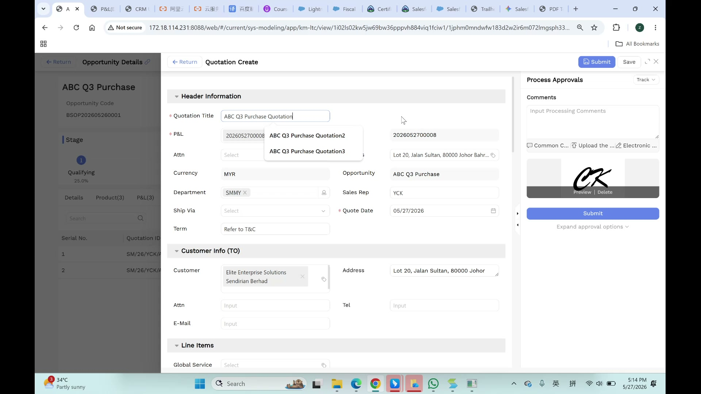
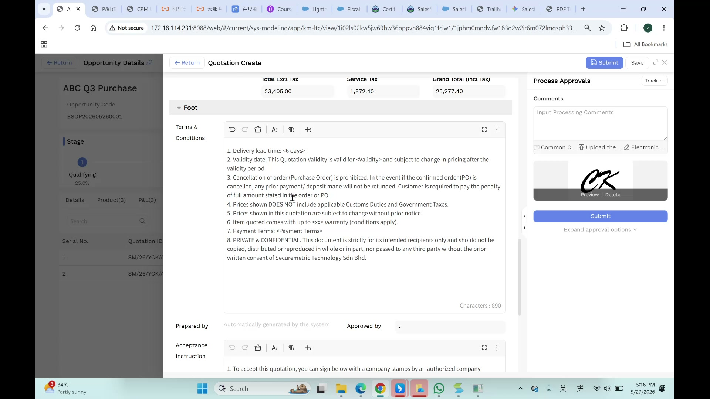

# Quotation User Manual

> **Version**: V1.0 | **Date**: 2026-06-04 | **System**: Securemetric CRM (EasyCraft)

---

## Table of Contents

1. [Module Overview](#1-module-overview)
2. [Quotation Entry Points](#2-quotation-entry-points)
3. [Create a Quotation](#3-create-a-quotation)
4. [Quotation Details View](#4-quotation-details-view)
5. [PDF Preview & Export](#5-pdf-preview--export)
6. [Approval Workflow](#6-approval-workflow)
7. [Excel Template & Configuration](#7-excel-template--configuration)
8. [FAQ & Notes](#8-faq--notes)

---

## 1. Module Overview

Quotations (报价单) are formal sales documents generated from approved P&L analyses. They follow the "Locked Pair" pricing architecture and enter an approval workflow.

### 1.1 Key Characteristics

| Characteristic | Description |
|----------------|-------------|
| P&L-driven | Generated from approved P&L analyses |
| Version-locked | P&L V1 → Quote V1, P&L V2 → Quote V2 |
| Auto-populated | Customer, Opportunity, Currency, Department inherited from parent |
| Approval-required | Enters approval workflow before finalization |

### 1.2 Entry Points

- **From Opportunity**: Opportunity Details → Quotation(N) sub-tab → +Create
- **Sidebar**: OPPORTUNITY → Quotation
- **Launch context**: Opens as a **slide-over panel** on top of Opportunity Details

---

## 2. Quotation Entry Points

### 2.1 From Opportunity Details

1. Navigate to an Opportunity
2. Click the **Quotation(N)** sub-tab
3. Click **+Create** to open the Quotation Create slide-over panel
4. The Opportunity Details panel remains visible but dimmed in the background

### 2.2 Existing Quotations Table

| Column | Description |
|--------|-------------|
| Serial No. | Row number |
| Quotation ID | Format: SM/26/YCK/A... |
| Version | Auto-incremented |

---

## 3. Create a Quotation

### 3.1 Entry

Navigate to Opportunity Details → click **+ Create Quotation** to open the slide-over panel.



### 3.2 Header Information

| Field | Required | Type | Notes |
|-------|----------|------|-------|
| Quotation Title | Yes | Text + Autocomplete | Autocomplete suggests existing names (e.g., "...Quotation2") |
| P&L | Yes | Lookup | P&L ID (e.g., 2026052700008) |
| Currency | Auto | Text | Auto-filled "MYR" |
| Department | No | Tag Input | e.g., "SMMY" with 'x' to remove |
| Opportunity | Auto | Read-only | Parent opportunity name |
| Ship Via | No | Dropdown | Standard / Express / Overnight / Priority / Economy / Air / Ground |
| Term | No | Text | e.g., "Refer to T&C" |
| Sales Rep | Auto | Text | Auto-filled (e.g., "YCK") |
| Quote Date | Auto | Date Picker | Auto-set to current date |
| Attn | No | Dropdown | Placeholder "Select" |
| P&L ID | Auto | Read-only | Same as P&L lookup value |
| Address | Auto | Text Area | Auto-populated from Customer |

### 3.2 Customer Info (TO) Section

| Field | Type | Notes |
|-------|------|-------|
| Customer | Lookup | Auto-populated from P&L/Opportunity |
| Address | Text Area | Auto-populated (e.g., "Lot 20, Jalan Sultan, 80000 Johor") |
| Attn | Text Input | Placeholder "Input" |
| Tel | Text Input | Placeholder "Input" |
| E-Mail | Text Input | Placeholder "Input" |

### 3.3 Financial Summary

| Metric | Description |
|--------|-------------|
| Total Excl Tax | Base price before tax |
| Service Tax | 8% SST (Malaysia) — calculated automatically |
| Grand Total (Incl Tax) | Total Excl Tax + Service Tax |

### 3.4 Line Items Section

- Section header: "Line Items"
- **Global Service**: Dropdown (placeholder "Select")
- Table columns include product details, quantities, prices, tax calculations

| Column | Description |
|--------|-------------|
| Checkbox | Row selection for bulk actions |
| Sequence (Seq) | Row numbering |
| Total Excl Service Tax | Base price, read-only/calculated |
| Service Tax Num | Tax rate (e.g., 0.08 for 8%) |
| Service Tax | Tag selector for tax code |
| Total Incl Service Tax | Calculated: base + tax |
| Total Tax | Calculated tax amount |

> 💡 **Tip**: Global Tax setting applies to all line items.

### 3.5 Foot Section — Rich Text Editors



**Terms & Conditions:**
- Rich text editor with full toolbar (Undo, Redo, Copy/Paste, Font Size, Paragraph formatting, Fullscreen)
- Template content with 8 numbered items:
  1. Delivery lead time (<6 days)
  2. Validity period
  3. Cancellation penalties (no refund of deposit)
  4. Exclusion of customs duties
  5. Price change rights
  6. Warranty (<xx>)
  7. Payment terms (<Payment Terms>)
  8. Confidentiality clause ("Securemetric Technology Sdn Bhd")
- Contains placeholders: `<Validity>`, `<xx>`, `<Payment Terms>`

**Prepared by:** Read-only — "Automatically generated by the system"

**Approved by:** Empty input field (populated after approval)

**Acceptance Instruction:**
- Rich text editor with same toolbar
- Content: "1. To accept this quotation, you can sign below with a company stamps by an authorized company"

**Prepared Signature:** File upload (drag-drop zone, jpg/gif/png)

**Approved Signature:** File upload (drag-drop zone, jpg/gif/png)

**Owner:** Auto-filled (e.g., "admin0")

**Entity:** Tag selector (e.g., SCMY)

**Deal Category:** Dropdown (e.g., PKI)

---

## 4. Quotation Details View

### 4.1 Tabs

| Tab | Description |
|-----|-------------|
| Details | Read-only form view |
| Quotation Details(6) | Generated quotation documents |
| Sales Order | Linked sales orders |

### 4.2 Export Options

| Option | Description |
|--------|-------------|
| Original Template | .xlsm file with Preview/replacement links |
| VDP template | Separate .xlsm for VDP-specific formatting |
| Export Excel | Disabled in view mode ("Only view mode") |
| Export to PDF | Disabled in view mode |
| Batch Delete | Remove attachments |

---

## 5. PDF Preview & Export

### 5.1 PDF Preview Modal

- Title: "PDF Preview"
- Displays generated quotation document preview
- Financial summary table:
  - Total Excl Service Tax
  - Service Tax @ 8%
  - Total Amount

### 5.2 PDF Content

| Section | Content |
|---------|---------|
| Company Header | "SECUREMETRIC TECHNOLOGY SDN. BHD. (759814-V)" |
| Customer Info | TO, Address, Attn, Tel, E-Mail |
| Line Items | Product details with pricing |
| Terms & Conditions | 8 numbered items |
| Signature Blocks | Prepared by + Approved by with digital signatures |

### 5.3 Export Process

1. Click **Export PDF** button (blue primary) in PDF Preview modal
2. Browser download notification appears
3. File name format: "[Opportunity Name] Quotation..." (e.g., 708 KB)
4. Download shows "Done" status in browser notification

> ⚠️ **Note**: HTTP environments may show "Insecure download blocked" — use HTTPS for downloads.

---

## 6. Approval Workflow

### 6.1 Process Approvals Sidebar

| Element | Description |
|---------|-------------|
| Header | "Process Approvals" with "Track" dropdown |
| Comments | "Input Processing Comments" text area |
| Common Comments | Quick-insert standard comments |
| Upload attachment | Supporting documents |
| Electronic signature | Digital signature preview with "Preview | Delete" |
| Submit | Large blue submit button |
| Expand approval options | Collapsible sections for custom approval chain |

### 6.2 Approval Flow

```
Draft → Submit → MD/CM Review → Approved
                            ↓
                         Rejected → Revise → Resubmit
```

---

## 7. Excel Template & Configuration

### 7.1 Excel Template Structure

The company uses an offline Excel template file (`SMMY Quotation^J SO and PI Template.xlsm`) with multiple sheets:

| Sheet | Description |
|-------|-------------|
| Quotation | Main quotation form |
| Sales Order | Auto-generated SO from quotation |
| Proforma Invoice(MYR) | MYR-denominated PI |
| Proforma Invoice(USD) | USD-denominated PI |

### 7.2 Template Features

- **Company Header**: Securemetric Technology Sdn Bhd (759614-V)
- **Document Control**: Form No., Revision, QP No.
- **VBA Macros**: The template contains macros for automation
- **Row Limit Warning**: "N row(s) exceed the template limit, will be ignored"

### 7.3 Excel Editor Modal

| Field | Description |
|-------|-------------|
| Shipping Method | e.g., "Express Shipping" |
| Contact Name | e.g., "David Smith" |
| Phone Number | Contact phone |
| Email Address | Contact email |
| Detail Data grid | Line items with columns: no, product code, product name, unit, discount, total price |

> ⚠️ **Typo**: Excel Editor column header shows `fd_sm_prodcut_code` ("prodcut" instead of "product").

---

## 8. FAQ & Notes

### 8.1 Business Rules

1. Quotes are generated from approved P&L analyses — cannot be edited directly
2. Version correspondence: P&L V1 → Quote V1, P&L V2 → Quote V2
3. Full audit trail for every version change
4. 8% SST (Malaysia) supported for tax calculation
5. Auto-population: Customer, Opportunity, Currency, Department from parent Opportunity

### 8.2 Data Flow

```
Opportunity → P&L (approved) → Quotation Create → Save (draft) → Submit (approval) → Approved Quote
```

### 8.3 Known Issues

- `fd_sm_prodcut_code` — Typo in Excel Editor column header
- "Insecure download blocked" — Browser may block downloads from HTTP environments
- Quotation module has no dedicated page object in test suite yet (test coverage: 0%)
