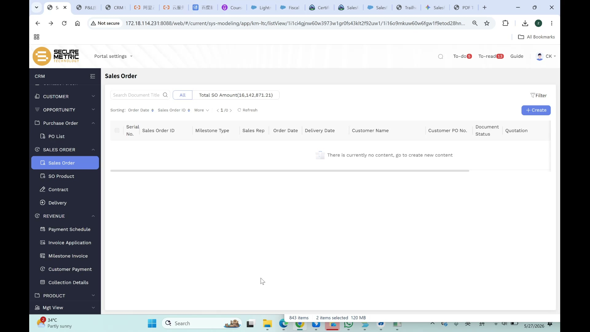
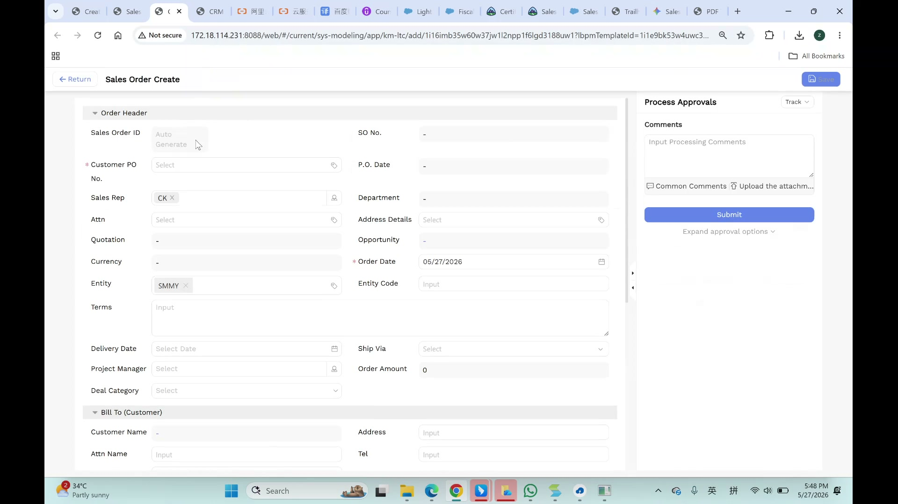
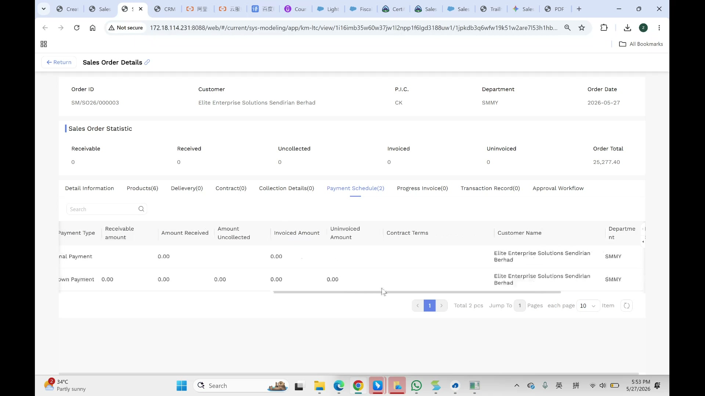
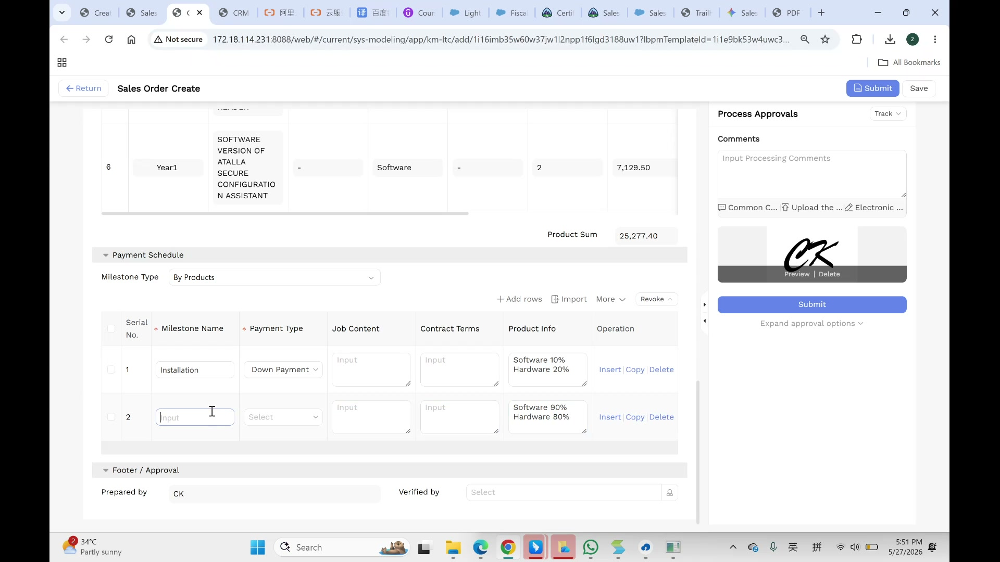
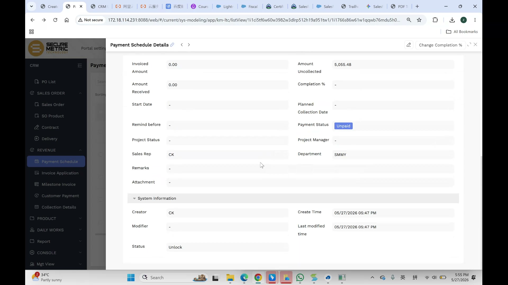
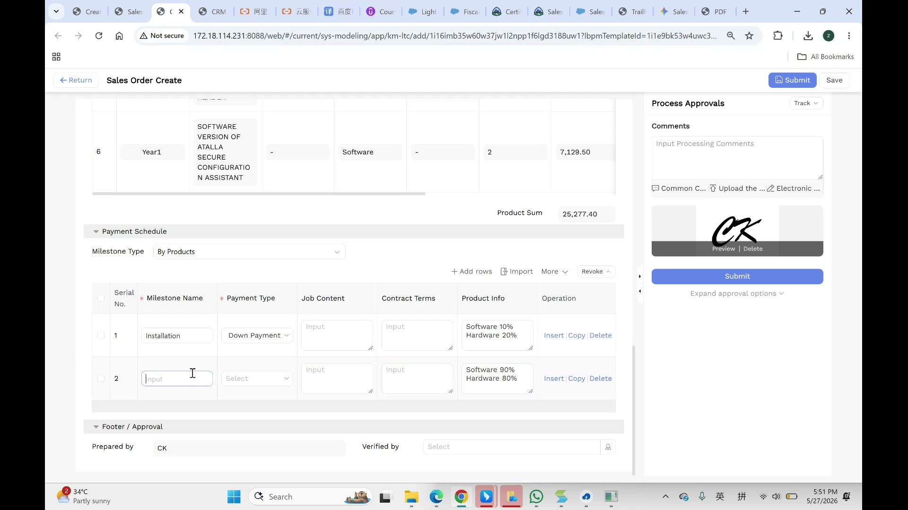

# Sales Order User Manual V2

> **Version**: V2.0 | **Date**: 2026-05-28 | **System**: Securemetric CRM (EasyCraft)

---

## Table of Contents

1. [Module Overview](#1-module-overview)
2. [Sales Order List](#2-sales-order-list)
3. [Creating a Sales Order](#3-creating-a-sales-order)
4. [Sales Order Details](#4-sales-order-details)
5. [Payment Schedule Management](#5-payment-schedule-management)
6. [Revenue Split Logic](#6-revenue-split-logic)
7. [Approval Workflow](#7-approval-workflow)
8. [FAQ and Notes](#8-faq-and-notes)

---

## 1. Module Overview

The Sales Order (SO) module manages confirmed customer orders. Sales Orders are created from approved Quotations with auto-populated commercial details. Each SO links to payment schedules, delivery records, and contracts.

### 1.1 Entry Point

- **Sidebar**: Navigate to **SALES ORDER → Sales Order**
- **From Quotation**: Quotation Details → Sales Order tab → Create

### 1.2 Core Functions

| Function | Description |
|----------|-------------|
| Quote-to-Order | Auto-populate from approved Quotation |
| Payment Scheduling | Define milestone-driven payment plans |
| Revenue Tracking | Track receivables, invoicing, and collection |
| Approval Workflow | Digital signature and multi-stage approval |
| Document Generation | Export SO as PDF |

---

## 2. Sales Order List

### 2.1 List Columns

| Column | Description |
|--------|-------------|
| Serial No. | Row numbering |
| Sales Order ID | e.g., SM/SO26/000003 |
| Milestone Type | Badge indicator |
| Sales Rep | User name |
| Order Date | Order creation date |
| Delivery Date | Expected delivery date |
| Customer Name | Company name |
| Customer PO No. | Customer's purchase order reference |
| Document Status | Status badge |
| Quotation | Link to source quotation |

### 2.2 Toolbar

- **Total SO Amount**: Summary of all order values
- **Sorting**: By Order Date, Sales Order ID, or More
- **+ Create**: Create a new Sales Order

### 2.3 Sidebar Sub-Menu

Under SALES ORDER:
- **Sales Order** — Main order list
- **SO Product** — Product-level view
- **Contract** — Contract documents
- **Delivery** — Delivery records

---

## 3. Creating a Sales Order

### 3.1 Order Header Fields

| Field | Required | Type | Description |
|-------|----------|------|-------------|
| Sales Order ID | Auto | Read-only | Auto-generated on submission |
| SO No. | Auto | Read-only | Shows "-" until generated |
| Customer PO No. | Yes (*) | Text | Mandatory customer PO number |
| Sales Rep | Yes | User Lookup | e.g., CK |
| P.O. Date | Yes | Date Picker | Customer PO date |
| Department | Auto | Read-only | Auto-filled from Entity |
| Attn | No | Lookup | Attention contact |
| Address Details | Yes | Lookup | Opens address selection |
| Quotation | Yes | Lookup | Source quotation |
| Opportunity | Auto | Read-only | Parent opportunity |
| Currency | Auto | Read-only | Inherited from Quotation |
| Order Date | Yes (*) | Date Picker | Defaults to today |
| Entity | Yes | Tag | e.g., SMMY |
| Entity Code | Auto | Read-only | Auto-filled from Entity |
| Terms | No | Textarea | Payment/delivery terms |
| Delivery Date | No | Date Picker | Expected delivery |
| Ship Via | No | Dropdown | Shipping method |
| Project Manager | No | User Lookup | Assigned PM |
| Order Amount | Auto | Read-only | Auto-calculated from line items |
| Deal Category | Yes | Dropdown | e.g., ADSS |

### 3.2 Bill To (Customer) Section

| Field | Description |
|-------|-------------|
| Customer Name | Auto-filled from Quotation |
| Address | Customer billing address |
| Attn Name | Contact person name |
| Tel | Customer phone number |
| Email | Customer email |

### 3.3 Product List

Products are auto-populated from the Quotation:

| Column | Description |
|--------|-------------|
| Service Period | e.g., "Year1" |
| Product | Product name |
| Type | Software / Hardware / Service |
| Quantity | From quotation |
| Unit Price | From quotation |
| Total | Auto-calculated |

**Product Sum**: Total of all line items (e.g., 25,277.40)

---

## 4. Sales Order Details

### 4.1 Header Information

| Field | Example |
|-------|---------|
| Order ID | SM/SO26/000003 |
| Customer | Elite Enterprise Solutions Sendirian Berhad |
| P.I.C. | CK |
| Department | SMMY |
| Order Date | 2026-05-27 |

### 4.2 Sales Order Statistic Bar

| Metric | Description |
|--------|-------------|
| Receivable | Amount owed by customer |
| Received | Amount collected |
| Uncollected | Outstanding balance |
| Invoiced | Amount already invoiced |
| Uninvoiced | Amount not yet invoiced |
| Order Total | Total order value (e.g., 25,277.40) |

### 4.3 Details Page Tabs

The SO Details page has 9 tabs for navigating different aspects:

| Tab | Description |
|-----|-------------|
| Detail Information | General SO information |
| Products(6) | Line items grid |
| Delivery(0) | Delivery records |
| Contract(0) | Contract documents |
| Collection Details(0) | Logistics/pickup information |
| Payment Schedule(2) | Financial milestones |
| Progress Invoice(0) | Billing records |
| Transaction Record(0) | Bank/payment transaction logs |
| Approval Workflow | Approval sign-off chain |

Numbers in parentheses indicate the count of records in each section.

---

## 5. Payment Schedule Management

### 5.1 Embedded Payment Schedule (During SO Create)

The Payment Schedule section is embedded in the SO Create page as a collapsible panel.

**Milestone Type**: Dropdown — select "By Products" or other options

**Columns**:
| Column | Description |
|--------|-------------|
| Serial No. | Row number |
| Milestone Name | e.g., "Installation" |
| Payment Type | Down Payment / Progress Payment / Final Payment |
| Job Content | Description of work |
| Contract Terms | Contractual terms for this milestone |
| Product Info | Revenue split by product category |
| Operation | Insert | Copy | Delete |

### 5.2 Payment Schedule Details Page

| Field | Description |
|-------|-------------|
| Invoiced Amount | Amount already invoiced |
| Amount Uncollected | Outstanding receivable |
| Amount Received | Amount collected |
| Completion % | Progress percentage (editable via "Change Completion %") |
| Start Date | Milestone start date |
| Planned Collection Date | Expected collection date |
| Remind before | Days before due date to send reminder |
| Payment Status | Badge: "Unpaid" / "Paid" |
| Project Status | Current project status |
| Project Manager | Assigned PM |
| Sales Rep | Sales representative |
| Department | e.g., SMMY |
| Remarks | Additional notes |
| Attachment | Supporting documents |

**System Information** (collapsible):
- Creator, Create Time, Modifier, Last modified time, Status (Unlock)

---

## 6. Revenue Split Logic

The Product Info field supports revenue split across product categories per milestone:

**Example**:
| Milestone | Payment Type | Product Info |
|-----------|-------------|--------------|
| Installation | Down Payment | Software 10% Hardware 20% |
| Final Delivery | Final Payment | Software 90% Hardware 80% |

Each product category's percentages sum to 100% across all milestones.

---

## 7. Approval Workflow

### 7.1 Process Approvals Sidebar

- **Track**: Select workflow action
- **Comments**: Enter processing comments
- **Common Comments**: Quick-insert standard comments
- **Upload attachment**: Add supporting documents
- **Digital Signature**: Auto-captured from user profile
- **Submit**: Trigger the approval workflow

### 7.2 Footer / Approval Section

| Field | Description |
|-------|-------------|
| Prepared by | Auto-filled (current user) |
| Verified by | User Lookup — select a verifier |

---

## 8. FAQ and Notes

### 8.1 How is a Sales Order created?

Sales Orders are created from approved Quotations. When you click Create from a Quotation, commercial details are auto-populated.

### 8.2 What is the difference between Down Payment and Final Payment?

- **Down Payment**: Initial payment (typically a smaller percentage)
- **Final Payment**: Remaining balance after delivery/completion

### 8.3 How does the revenue split work?

When using "By Products" milestone type, the system splits revenue by product category (Software/Hardware) across payment milestones. Each category's percentages must sum to 100%.

### 8.4 Can I add custom payment milestones?

Yes, use the "+ Add rows" button or "Insert" row action to add custom milestones.
