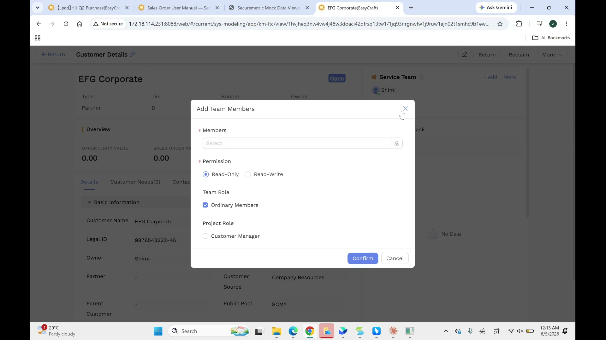
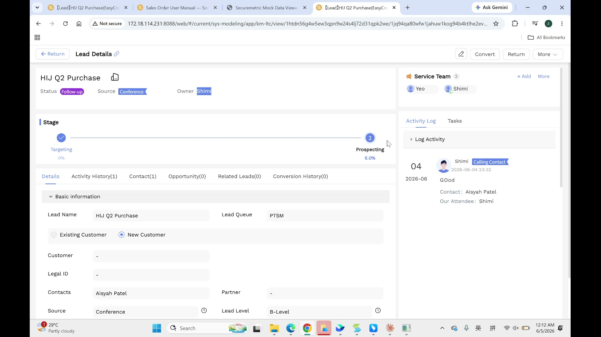
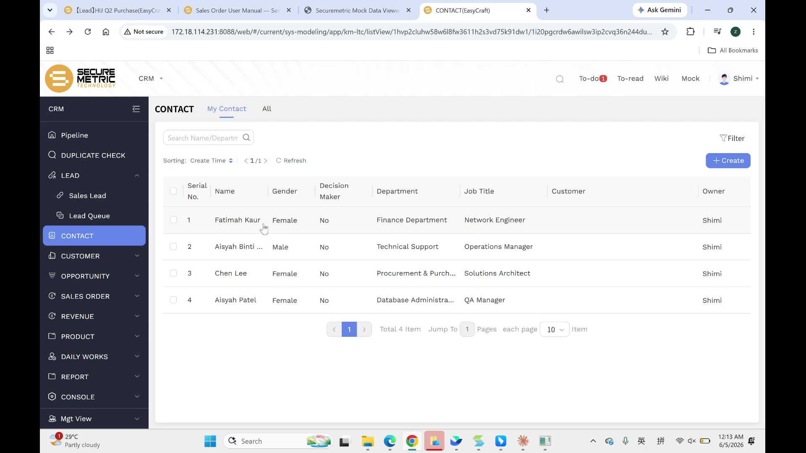
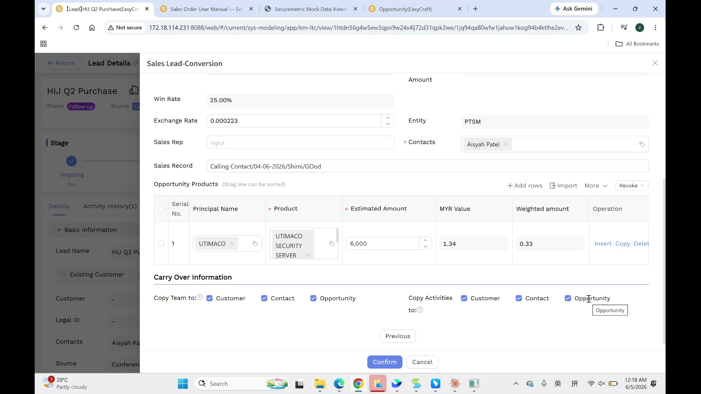

# Service Team & Activity Log User Manual

> **Version**: V1.0 | **Date**: 2026-06-05 | **System**: Securemetric CRM (EasyCraft)

---

## Table of Contents

1. [Module Overview](#1-module-overview)
2. [Service Team](#2-service-team)
3. [Activity Log](#3-activity-log)
4. [Lead Conversion — Carry-Over](#4-lead-conversion--carry-over)
5. [Business Rules & Workflow](#5-business-rules--workflow)
6. [FAQ & Notes](#6-faq--notes)

---

## 1. Module Overview

**Service Team** and **Activity Log** are two cross-cutting concepts that apply to every customer-facing record in the CRM: Lead, Contact, Customer, and Opportunity.

- **Service Team** — controls who can **see and edit** a record. If you are not in a record's Service Team, you cannot view or modify it.
- **Activity Log** — records every sales interaction (calls, visits, meetings) with the contact or account, building a complete communication history.

Both features are accessed from the **right sidebar** of any detail page and are automatically carried over when a Lead is converted to an Opportunity.

---

## 2. Service Team

### 2.1 What Is the Service Team?

The Service Team is the list of CRM users who have permission to access a specific record. Each record (Lead, Contact, Customer, Opportunity) maintains its own independent Service Team. Membership in one entity's team does **not** automatically grant access to related entities.

> "The service team means the people who have the permission to see and edit the information in this detail page."

### 2.2 Service Team Member Attributes

| Attribute | Options | Default | Notes |
|-----------|---------|---------|-------|
| Member | Any organisation user | — | Selected via user picker |
| Permission | Read-Only / Read-Write | Read-Write | Controls whether the member can edit |
| Team Role | Ordinary Members | Ordinary Members | Internal team structure label |
| Project Role | Customer Manager | (Unchecked) | Check if this person is the account's Customer Manager |

### 2.3 How to Add a Team Member

1. Open any detail page (Lead, Contact, Customer, or Opportunity).
2. Locate the **Service Team** panel in the right sidebar.
3. Click **+ Add** (or **+ Add more** if members already exist).
4. In the **Add Team Members** modal:
   - **Members** (\*): Select the user(s) to add.
   - **Permission** (\*): Choose **Read-Only** or **Read-Write**.
   - **Team Role**: Check **Ordinary Members** (default).
   - **Project Role**: Check **Customer Manager** if applicable.
5. Click **Confirm**.



The new member immediately appears in the Service Team list and can access the record according to their permission level.

### 2.4 How to Remove a Team Member

1. Open the detail page.
2. Find the member in the Service Team panel.
3. Click the **Delete** (trash) icon next to their name.
4. Confirm the removal.

The user immediately loses access to the record.

### 2.5 Service Team Location by Entity

| Entity | Location |
|--------|----------|
| Lead | Right sidebar of Lead Details |
| Contact | Right sidebar of Contact Details |
| Customer | Right sidebar of Customer Details |
| Opportunity | Right sidebar of Opportunity Details |



### 2.6 Permission Levels

| Permission | Can View | Can Edit |
|------------|----------|----------|
| Read-Only | Yes | No |
| Read-Write | Yes | Yes |

Users who are not in the Service Team at all should have **no access** to the record.

---

## 3. Activity Log

### 3.1 What Is the Activity Log?

The Activity Log captures all sales interactions with a record — phone calls, on-site visits, meetings, and other communications. It creates an auditable timeline of how your team has engaged with a lead or account.

> "If we have a call with our customer or we pay a visit to our customers, we can log it here."

**Note on naming**: The feature is called **Activity Log** on Lead, Customer, and Opportunity, but is called **Sales Record** on the Contact entity. The functionality is identical.

| Entity | Tab / Section Name |
|--------|-------------------|
| Lead | Activity Log |
| Contact | Sales Record |
| Customer | Activity Log |
| Opportunity | Activity Log |

### 3.2 How to Log an Activity

1. Open any detail page (Lead, Contact, Customer, or Opportunity).
2. Find the **Activity Log** (or **Sales Record**) panel in the right sidebar.
3. Click **New Log** (or **Log Activity**).
4. Fill in the activity form:

| Field | Required | Type | Notes |
|-------|----------|------|-------|
| Activity Type | Yes | Dropdown | e.g., "Calling Contact", "Visit", "Meeting" |
| Contact | Yes | Lookup | The contact person involved in the interaction |
| Our Attendee | Yes | User Lookup | Auto-filled with the current user; add others if needed |
| Related Business | No (auto) | Read-Only | Auto-filled with the parent record name |
| Discussion Details | No | Text Area | Notes about the interaction (up to 1,000 characters) |
| Attachment | No | File Upload | Supporting documents (e.g., meeting minutes, call notes) |

5. Click **Submit**.



The log entry appears immediately in the Activity Log timeline with a timestamp, your name, and the activity type.

### 3.3 Activity Log Display

Each logged entry shows:
- **Date** and **time** of the activity
- **User avatar and name** of the person who logged it
- **Activity Type** badge (e.g., "Calling Contact" in blue)
- **Discussion Details** (the note you entered)
- **Metadata**: Contact name and attendee name

---

## 4. Lead Conversion — Carry-Over

### 4.1 Overview

When you convert a Lead to a Contact, Customer, and Opportunity, the system offers a **Carry Over Information** section in Step 2 of the conversion wizard. This controls whether the Lead's Service Team members and Activity Log entries are copied to the newly created records.

### 4.2 Copy Team To

| Checkbox | Effect | Default |
|----------|--------|---------|
| Customer | Lead's Service Team is copied to the new Customer's Service Team | Checked |
| Contact | Lead's Service Team is copied to the new Contact's Service Team | Checked |
| Opportunity | Lead's Service Team is copied to the new Opportunity's Service Team | Checked |

### 4.3 Copy Activities To

| Checkbox | Effect | Default |
|----------|--------|---------|
| Customer | Lead's Activity Logs are copied to the Customer's Activity Log | Checked |
| Contact | Lead's Activity Logs are copied to the Contact's Sales Record | Checked |
| Opportunity | Lead's Activity Logs are copied to the Opportunity's Activity Log | Checked |

**Best practice**: Keep all three checkboxes checked (default) to ensure the full history is available on every related record after conversion.



### 4.4 What Gets Copied

```
Lead
  Service Team: [Alice, Bob] → Copied to Customer, Contact, Opportunity
  Activity Log: ["Call on 2026-06-01: Discussed requirements"]
                         → Copied to Customer, Contact, Opportunity
```

---

## 5. Business Rules & Workflow

### 5.1 Service Team Is Entity-Specific

Being in a Customer's Service Team does **not** give you access to that Customer's Opportunities. Each Opportunity (and Lead, Contact) has its own Service Team that must be configured separately — or populated via Lead conversion carry-over.

### 5.2 Owner and Service Team

The **Owner** of a record is the primary person responsible for it. The Owner is typically added to the Service Team automatically, but always verify this is the case — especially after editing or re-assigning ownership.

### 5.3 Read-Only vs. Read-Write

Grant **Read-Write** to team members who need to update the record (sales reps, account managers). Grant **Read-Only** to stakeholders who need visibility but should not make changes (e.g., management reviewing a deal).

### 5.4 Activity Log Best Practices

- Log every significant customer interaction promptly to maintain an accurate history.
- Use the **Discussion Details** field to record key outcomes, next steps, or commitments made during the interaction.
- Attach meeting minutes or call summaries in the **Attachment** field for full documentation.

---

## 6. FAQ & Notes

**Q: I can see a Lead in the list but cannot open it. Why?**
You are not in that Lead's Service Team. Contact the Owner or an admin to be added as a team member with at least Read-Only permission.

**Q: I was added to a Customer's Service Team but cannot see the related Opportunity. Why?**
Service Teams are entity-specific. You need to be separately added to the Opportunity's Service Team by its Owner or an admin.

**Q: Can I log an activity on a record I can only view (Read-Only)?**
No. Logging an activity is an edit operation and requires Read-Write permission.

**Q: The Activity Log on the Contact says "Sales Record" — is that a different feature?**
No, it is the same feature with a different label. The Contact entity uses the name "Sales Record" while all other entities use "Activity Log". The fields and workflow are identical.

**Q: After converting a Lead, the Opportunity's Activity Log is empty even though I checked the "Copy Activities" box. Why?**
This is a known issue. If the Activity Log entries from the Lead are not appearing in the Opportunity after conversion, contact your system administrator to investigate.

**Q: How many team members can I add to a Service Team?**
There is no documented limit. Add all relevant stakeholders, keeping the list manageable to avoid ambiguity over responsibility.

**Q: Can I change a team member's permission from Read-Only to Read-Write after adding them?**
Yes. Click the **Edit** icon next to the team member's row in the Service Team panel and update their Permission setting.
