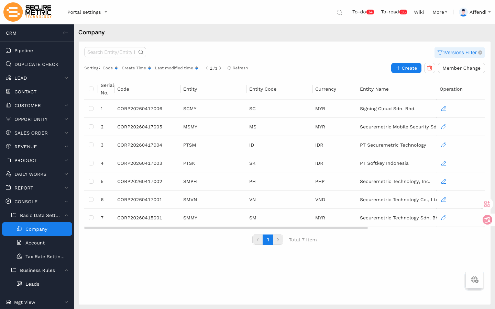
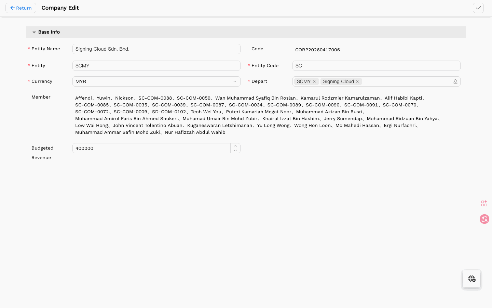
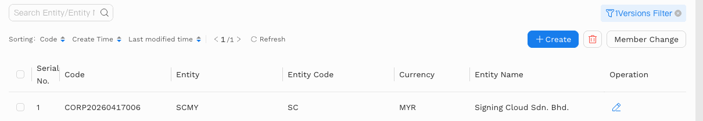
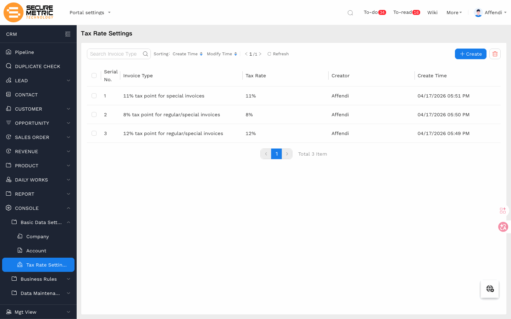
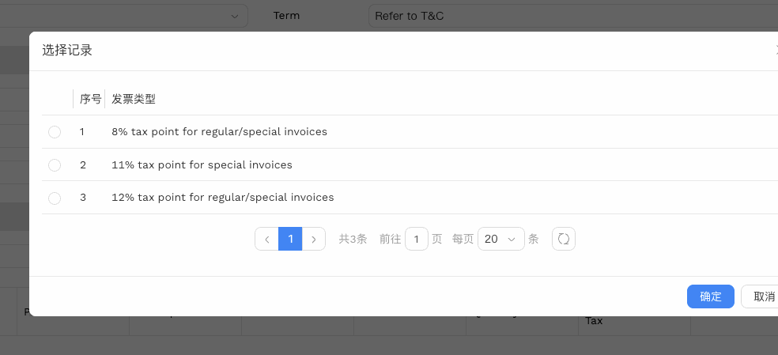

# 基础数据设置（Basic Data Settings）用户手册

> **版本**: V1.0 | **日期**: 2026-06-17 | **系统**: Securemetric CRM (EasyCraft)

---

## 目录

1. [模块概述](#1-模块概述)
2. [公司主体](#2-公司主体)
3. [税率设置](#3-税率设置)
4. [常见问题](#4-常见问题)

---

## 1. 模块概述

基础数据设置为 CRM 各业务模块提供基础配置，包括公司主体（法律实体）和税率两项核心设置。管理员在系统上线前完成配置后，普通用户无需手动维护。

### 1.1 入口路径

| 页签 | 直达链接 |
|------|---------|
| 公司主体 | [直达链接](http://172.18.114.231:8088/web/#/current/sys-modeling/app/km-ltc/listView/1i40lteddw6uw3qmmw3k6o0jq22ifob512w1/1i354i0tiw6owil5w34oan7a2uf49bi11sw1?type=list&navId=1hvp21k7lw4vw6h64w37pp9dm27vj66f3cw1){: target="_blank" rel="noopener"} |
| 税率 | [直达链接](http://172.18.114.231:8088/web/#/current/sys-modeling/app/km-ltc/listView/1jiuh02mew5fw2hr1uw9vfbi71bd1arg9jw4/1i4394522w73wujewge1aje35mtu8t1eobw1?type=list&navId=1hvp21k7lw4vw6h64w37pp9dm27vj66f3cw1){: target="_blank" rel="noopener"} |

---

## 2. 公司主体

公司主体对应 SM 的各个法律实体，决定报价单编号前缀、默认币种，以及业务记录归属的成员范围。

### 2.1 主体与成员

每个主体下配置 **对应机构/部门**（可选机构、部门或具体人员），系统自动将该部门下所有人员带入 **Member** 列表。Member 是各业务模块（线索、商机、报价等）中实际生效的成员范围。

> **注意**：新建线索等业务记录时，系统自动取当前登录用户所在主体作为默认值；若用户同时属于多个主体，默认显示第一个。币种与主体绑定，选定主体后自动带出对应本币。

### 2.2 成员同步

当部门内有人员新增或变更时，Member 列表**不会自动更新**。需进入对应主体详情页，点击 **同步成员** 按钮手动触发同步。

---

## 3. 税率设置

税率在报价及后续开票环节使用，由管理员提前录入并维护。每条税率记录包含税率名称和对应百分比，供用户在报价单中选择。

创建报价单时，点击 **Global Tax** 字段会弹出税率选择窗口，列出此处配置的所有税率供选择。

---

## 4. 常见问题

**Q：新入职员工无法在线索/商机中被选为负责人，怎么处理？**  
A：进入该员工所属法律实体的详情页，点击 **同步成员** 按钮，将新成员同步到 Member 列表后即可正常选择。

**Q：报价单币种默认值不对，如何调整？**  
A：检查当前用户所属主体的默认币种配置，在公司主体详情页中修改 Currency 字段，保存后新建报价单将使用更新后的币种。
