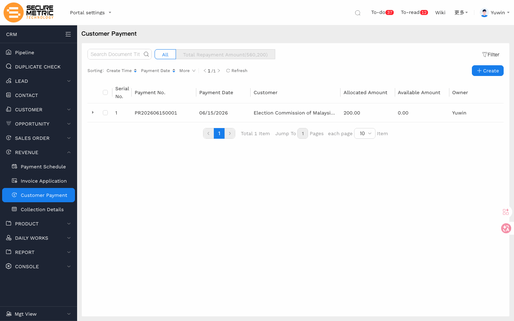
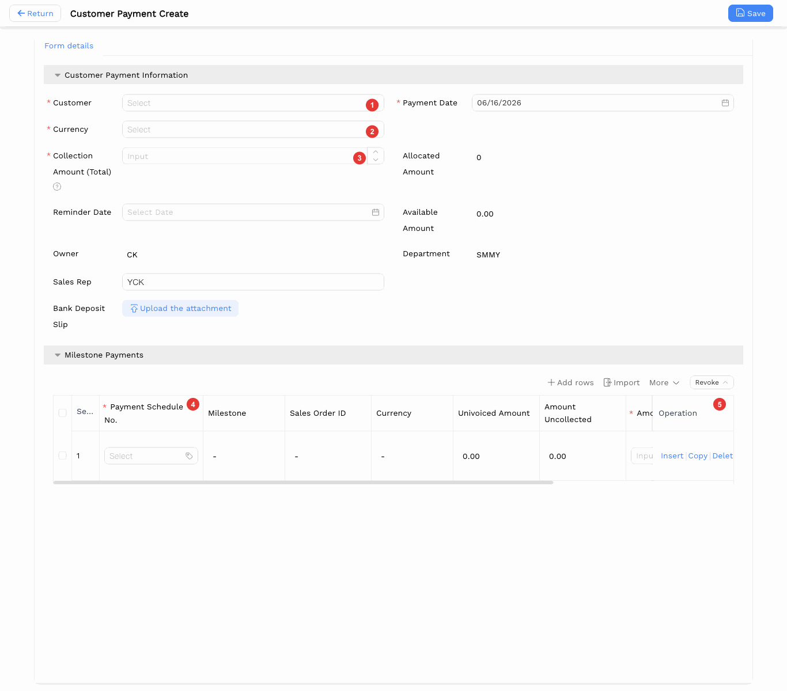
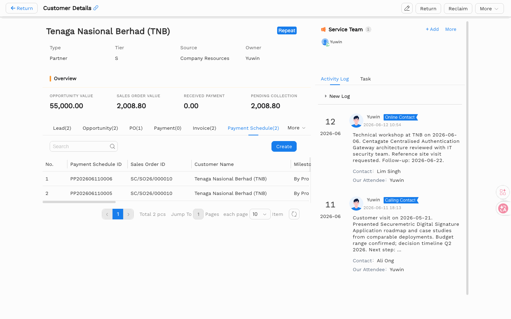
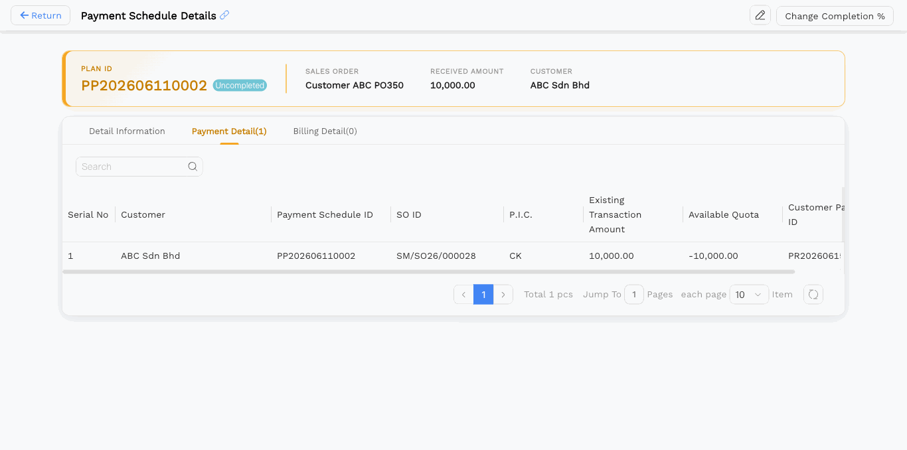
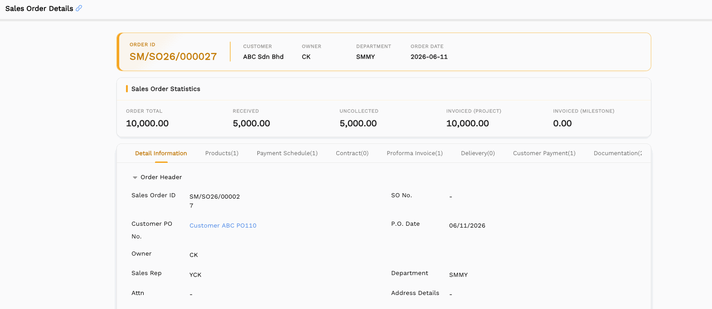
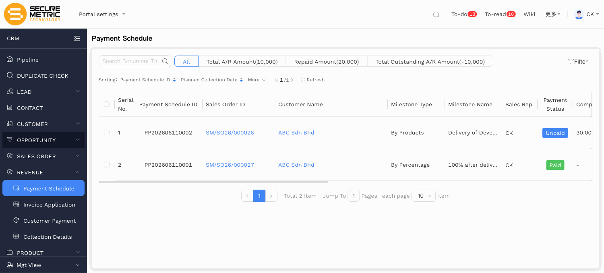

# 客户回款（Collection）用户手册

> **版本**：V1.1 | **日期**：2026-06-15 | **系统**：Securemetric CRM（EasyCraft）

---

## 目录

1. [模块概述](#1-模块概述)
2. [列表视图](#2-列表视图)
3. [创建回款记录](#3-创建回款记录)
4. [详情视图](#4-详情视图)
5. [业务规则与流程](#5-业务规则与流程)
6. [常见问题与注意事项](#6-常见问题与注意事项)

---

## 1. 模块概述

**客户回款（Customer Payment）** 模块用于记录客户针对销售订单所支付的实际款项。每条回款记录对应一笔到账款项，录入后系统自动将金额分配至关联的里程碑付款计划，并同步更新销售订单的已收金额与未收金额。

### 1.1 入口

- **侧边栏**: 导航至 **REVENUE → Customer Payment** | [直达链接](http://172.18.114.231:8088/web/#/current/sys-modeling/app/km-ltc/listView/1i1ci5tf6w60w3982w3dlrp512h19a951tw1/1i1766s86w61w1qqwb76mdu5h0meq1vcelw1?type=list&navId=1hvp21k7lw4vw6h64w37pp9dm27vj66f3cw1){: target="_blank" rel="noopener"}
- **回款明细**: 导航至 **REVENUE → Collection Details** | [直达链接](http://172.18.114.231:8088/web/#/current/sys-modeling/app/km-ltc/listView/1i1ci6bt4w60w3994w1b1gdb83ickip03gw1/1i178leaqw60wjlpw1q6re69bnnbf43qviw1?type=list&navId=1hvp21k7lw4vw6h64w37pp9dm27vj66f3cw1){: target="_blank" rel="noopener"}

### 1.2 核心功能

- 记录客户每笔到账款项
- 将付款金额分配至对应的付款计划里程碑
- 上传银行回单作为凭证
- 回款后自动更新里程碑已收金额及销售订单统计数据
- 百分比类型里程碑收款完成后状态自动变更为"已收款"

---

## 2. 列表视图

回款列表展示当前用户有权查看的所有付款记录。



| 列名 | 说明 |
|------|------|
| Payment No. | 回款单号（如 PR202606110003） |
| Payment Date | 款项到账日期 |
| Customer | 付款客户 |
| Allocated Amount | 已分配至里程碑的金额 |
| Available Amount | 尚未分配的剩余金额 |

使用搜索栏按客户名称或付款日期范围筛选。

---

## 3. 创建回款记录

### 3.1 打开表单

进入左侧导航 → **REVENUE** → **Customer Payment**，点击 **+ 新建**。



### 3.2 字段说明

**Customer Payment Information 区域**

| 字段 | 必填 | 类型 | 说明 |
|------|------|------|------|
| Customer | 是 | 关联查找 | 选择付款客户（标注 ①） |
| Payment Date | 是 | 日期选择器 | 款项到账日期 |
| Currency | 是 | 下拉 | 结算货币（如 MYR，标注 ②）。货币决定可选里程碑的范围，当前系统仅一种货币 |
| Collection Amount (Total) | 是 | 金额输入 | 本次实际到账总金额（标注 ③） |
| Allocated Amount | 自动 | 只读 | 已分配至里程碑的金额合计 |
| Available Amount | 自动 | 只读 | 未分配余额（Collection Amount − Allocated Amount） |
| Reminder Date | 否 | 日期选择器 | 跟进提醒日期 |
| Owner | 否 | 用户选择 | 负责人，默认为当前用户 |
| Sales Rep | 否 | 文本 | 销售代表 |
| Department | 否 | 组织单元选择 | 负责部门 |
| Bank Deposit Slip | 否 | 文件上传 | 银行转账凭证附件 |

**Milestone Payments 区域**

回款的具体分配在下方 "Milestone Payments" 子表中录入：

| 列名 | 必填 | 说明 |
|------|------|------|
| Payment Schedule No. | 是 | 选择关联的付款计划（标注 ④） |
| Milestone | 自动 | 里程碑名称，从付款计划带入 |
| Sales Order ID | 自动 | 关联销售订单 |
| Currency | 自动 | 货币，从付款计划带入 |
| Uninvoiced Amount | 自动 | 未开票金额 |
| Amount Uncollected | 自动 | 未收金额 |
| Amount Applied | 是 | 本次分配至该里程碑的金额（标注 ⑤） |
| Attachment | 否 | 该行凭证附件 |
| Remarks | 否 | 备注 |

> **货币匹配规则**：主表选择的货币必须与付款计划里程碑的货币一致，货币不匹配时无法选择该里程碑。

### 3.3 保存

填写完成后点击顶部操作栏的 **保存**。记录创建完成，Milestone Payments 中的 Amount Applied 将自动更新至对应付款计划。

---

## 4. 详情视图

### 4.1 头部信息



| 字段 | 说明 |
|------|------|
| PAYMENT ID | 系统自动生成的回款单号（如 PR202606110003） |
| CUSTOMER | 付款客户 |
| PAYMENT AMOUNT | 本次回款总金额 |
| USED AMOUNT | 已分配至里程碑的金额 |
| RECEIPT DATE | 回款日期 |

### 4.2 子选项卡

| 选项卡 | 内容 |
|--------|------|
| Detail Information | 所有回款字段（只读） |
| Payment Details(N) | 回款明细，对应每一条已分配的付款计划里程碑记录 |

**Payment Details** 子表列说明：

| 列名 | 说明 |
|------|------|
| Customer Name | 客户名称 |
| Payment Receipt No | 本次回款单号 |
| Sales Order No | 关联销售订单 |
| Payment Schedule No | 付款计划编号 |
| Used Amount | 本次分配至该付款计划的金额 |
| Payment Method | 付款方式 |

---

## 5. 业务规则与流程

### 5.1 标准回款流程

```
客户到账
  → 客户经理新建回款记录
  → 选择客户（①），确认结算货币（②），录入收款金额（③）
  → 在 Milestone Payments 子表中选择付款计划（④），填写 Amount Applied（⑤）
  → 上传银行回单附件
  → 保存
  → 系统自动更新里程碑已收金额 & 销售订单统计数据
```

**校验规则**：
- 系统校验相对宽松：保存后 **Available Amount ≥ 0** 即通过。
- 若项目里程碑尚未开具发票，则无应收金额，系统无法做应收校验。
- 若为**百分比里程碑**，系统存在应收金额校验。

### 5.2 客户关联

若客户尚未建档，请先创建客户记录，再创建回款。

### 5.3 银行回单附件

银行回单（转账凭证或银行确认函）是主要凭证文件。界面虽未设为必填，但按业务规范，大额款项必须上传回单。

### 5.4 回款后自动更新

回款保存后，系统将自动更新以下关联数据：

**付款计划（Payment Schedule）更新**：



付款计划详情页的 **Payment Detail** 子选项卡将记录该笔回款，展示 Existing Transaction Amount 和 Available Quota。

**销售订单（Sales Order）更新**：



销售订单头部统计卡片中的 **RECEIVED**（已收）和 **UNCOLLECTED**（未收）金额将同步更新。

### 5.5 百分比里程碑状态变更



对于**百分比类型（By Percentage）**里程碑，收款完成后其 **Payment Status** 会自动变更为 **Paid**（绿色标签），该里程碑在下次创建回款时将不再出现在可选列表中。

按产品类型（By Products）的里程碑状态为 **Unpaid** 时仍可继续选择。

### 5.6 结算货币

结算货币（Currency）决定可选里程碑的范围：主表货币与里程碑货币必须一致，否则该里程碑无法添加至 Milestone Payments 子表。当前系统仅提供一种货币。

---

## 6. 常见问题与注意事项

**问：可以记录部分付款吗？**
可以。在 Collection Amount (Total) 填写本次实际到账金额，并在 Milestone Payments 中对应填写分配金额。剩余款项到账时再新建回款记录。

**问：里程碑选不到，怎么办？**
通常有两个原因：① 主表货币与里程碑货币不一致；② 百分比里程碑已收款完成（状态为 Paid）。请核对货币是否一致，或确认该里程碑是否已收款。

**问：是否需要同时在回款模块和付款计划中操作？**
不需要。创建回款记录并保存后，关联付款计划的金额将自动更新，无需手动修改付款计划。

**问：同一张销售订单可以创建多条回款记录吗？**
可以。分期付款或多次部分付款时，每笔付款单独创建一条回款记录，系统在付款计划和销售订单中统一汇总。
