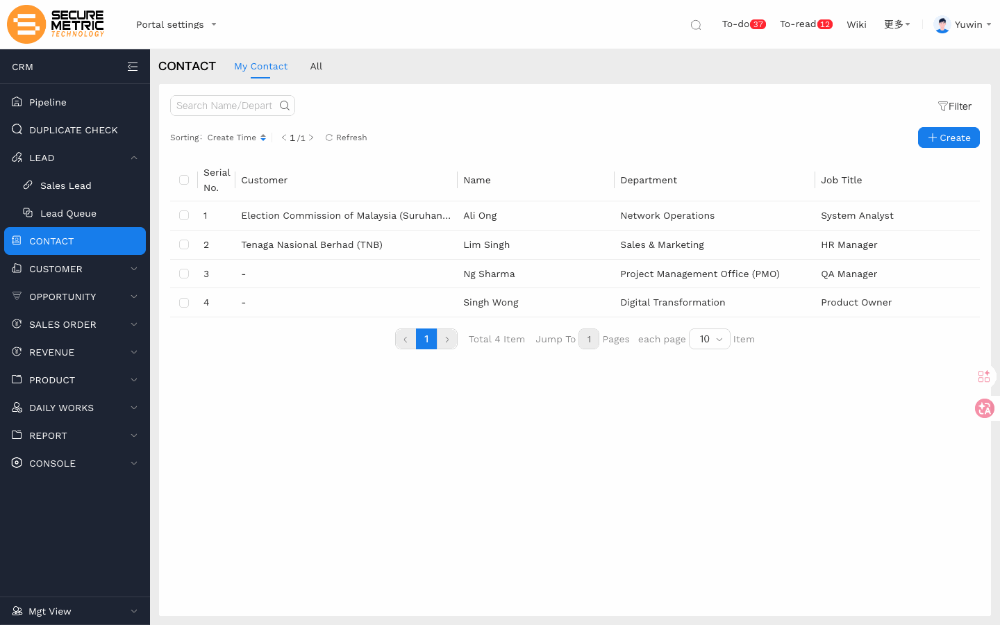
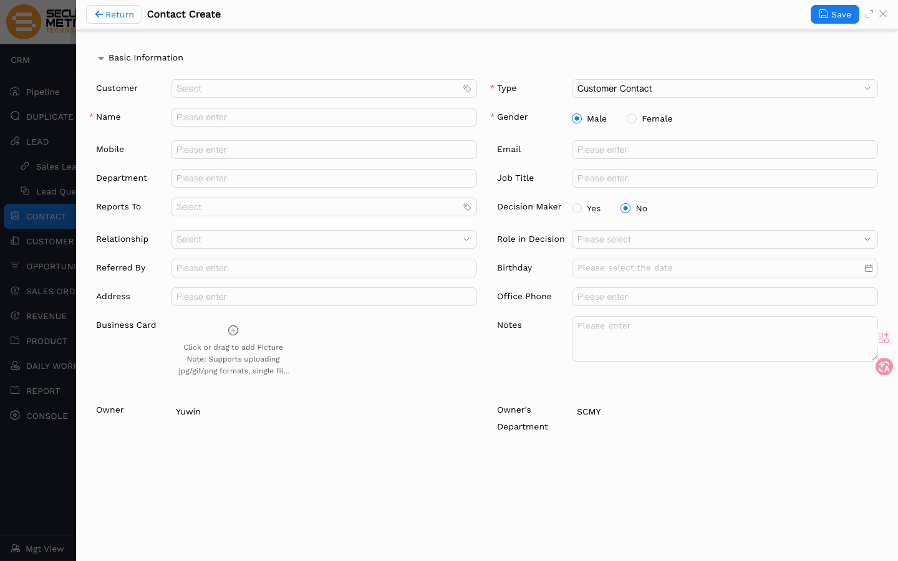
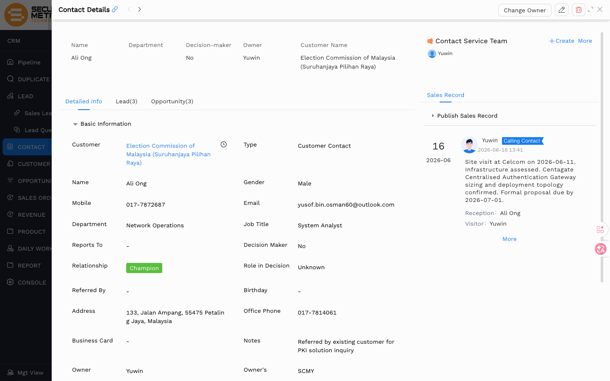
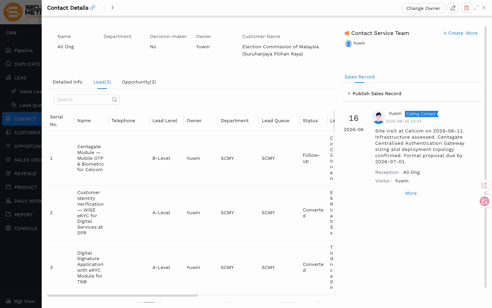
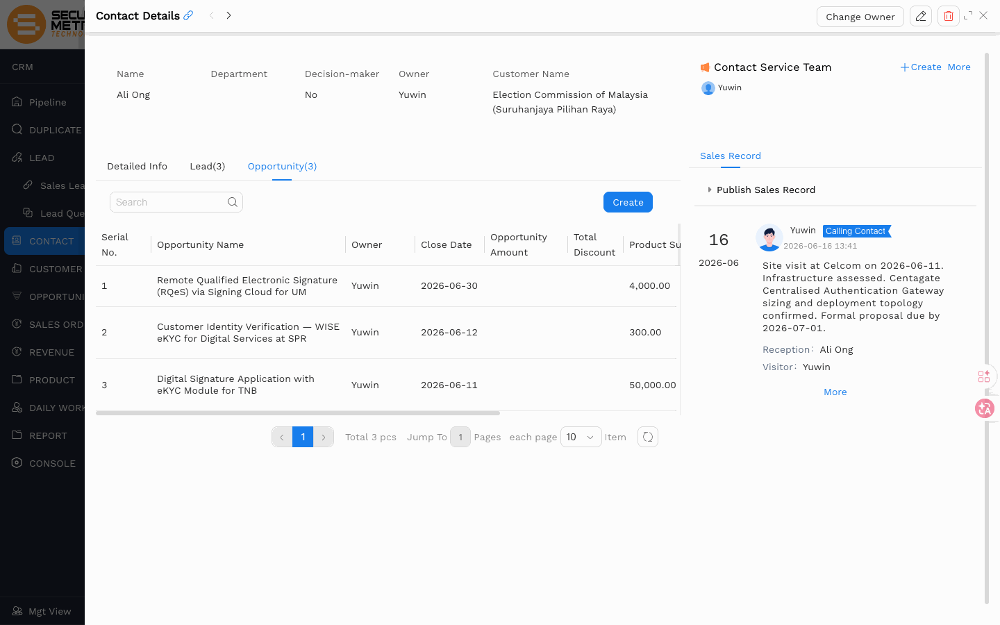

# 联系人（Contact）用户手册

> **版本**：V1.2 | **日期**：2026-06-16 | **系统**：Securemetric CRM（EasyCraft）

---

## 目录

1. [模块概述](#1-模块概述)
2. [列表视图](#2-列表视图)
3. [创建联系人](#3-创建联系人)
4. [详情视图](#4-详情视图)
5. [业务规则与流程](#5-业务规则与流程)

---

## 1. 模块概述

**联系人（Contact）** 是与客户（Customer）关联的具体个人，是销售过程中实际沟通的对象。如果客户是企业，联系人就是与该企业进行沟通联络的人；如果客户是个人，联系人可以是与其有业务关联的其他沟通渠道。

每个联系人必须关联到一条已有的客户记录。联系人可以从线索转换而来，也可以在客户记录下直接新建。

### 1.1 入口路径

| 入口 | 路径 |
|------|------|
| 主入口 | 左侧导航 → **Contact Person（联系人）** \| [直达链接](http://172.18.114.231:8088/web/#/current/sys-modeling/app/km-ltc/listView/1hvp2cluhw58w6l8fw3611h2s3vd75k91dw1/1i20pgcrdw6awilsw3ip2cvq36n244duq8w1?type=list&navId=1hvp21k7lw4vw6h64w37pp9dm27vj66f3cw1){: target="_blank" rel="noopener"} |

### 1.2 核心功能

| 功能 | 描述 |
|------|------|
| 联系人创建 | 创建与客户关联的个人联系人 |
| 联系人搜索 | 按姓名、手机、邮件或关联客户搜索 |
| 批量导入 | 通过 Excel 模板批量导入联系人数据 |

---

## 2. 列表视图

联系人列表展示当前登录用户有权查看的所有联系人记录。

### 2.1 视图场景

| 场景标签 | 显示范围 |
|----------|---------|
| 我负责的 | 当前用户为负责人的联系人 |
| 我下属负责的 | 当前用户为部门主管时，其下属负责的联系人 |
| 我参与的 | 当前用户为团队成员的联系人 |
| 全部 | 当前用户有权查看的所有联系人 |

### 2.2 列表功能

| 功能 | 描述 |
|------|------|
| 搜索 | 按联系人名称、手机或邮件搜索 |
| 批量操作 | 复选框多选 + 批量删除/导出 |

### 2.3 表格列

| 列名 | 说明 |
|------|------|
| 联系人名称 | 点击进入详情 |
| 客户 | 关联客户名称 |
| 手机 | 主要手机号 |
| 邮件 | 主要邮件地址 |
| 部门 | 联系人所在部门 |
| 职位 | 联系人职务 |
| 负责人 | 指定的销售代表 |

---

## 3. 创建联系人

### 3.1 入口

点击联系人列表工具栏 **+ 创建** 按钮；或在客户详情页 → 联系人标签页 → 点击 **新建**。

### 3.2 字段说明

| 字段 | 必填 | 类型 | 说明 |
|------|------|------|------|
| 客户 | 否 | 关联查找 | 标签样式，点击 'x' 清除；从联系人模块创建时需手动选择客户 |
| 联系人名称 | 是 | 文本 | 全名 |
| 手机 | 否 | 文本 | 格式：01x-xxxxxxx；邮件与手机至少填一项 |
| 邮件 | 否 | 文本 | 邮件与手机至少填一项 |
| 部门 | 否 | 文本 | 联系人所在部门 |
| 职位 | 否 | 文本 | 联系人职务 |
| 性别 | 是 | 单选 | 男 / 女 |
| 类型 | 是 | 下拉 | 如：客户联系人 |
| 地址 | 否 | 文本 | 公司或业务地址 |
| 生日 | 否 | 日期选择器 | 日历格式 |
| 汇报给 | 否 | 关联查找 | 选择该联系人的上级联系人，用于建立关系图层级 |
| 推荐人 | 否 | 文本 | 介绍该联系人的来源 |
| 决策者 | 否 | 单选 | 是 / 否 |
| 决策角色 | 否 | 下拉 | 联系人在采购决策中的角色 |
| 办公电话 | 否 | 文本 | 座机号 |
| 名片 | 否 | 文件上传 | 仅 jpg/gif/png，单文件，支持拖拽上传 |
| 备注 | 否 | 文本域 | 补充说明 |
| 负责人 | 否 | 只读 | 自动填充为当前登录用户 |

### 3.3 查重规则

系统在保存联系人时进行重复检测：手机号和邮件在系统中必须唯一，两者至少填写其中一项。若输入的手机号或邮件已被其他联系人使用，系统将提示重复，无法创建新记录。

### 3.4 保存

填写必填字段后点击 **保存** 或 **保存并新建**。

> **注意**：邮件与手机至少填写一项，否则无法提交。

---

## 4. 详情视图

联系人详情页顶部展示基本信息，下方为关联记录子标签页。

### 4.1 基本信息

| 区域 | 内容 |
|------|------|
| 联系信息 | 姓名、手机、邮件、部门、职位、办公电话 |
| 关联客户 | 所属客户名称（点击可跳转） |
| 其他信息 | 地址、生日、名片、备注 |
| 系统字段 | 负责人、创建时间、最后修改时间 |

### 4.2 子标签页

| 标签页 | 内容 |
|--------|------|
| 基本信息 | 详情表单视图，可点击编辑 |
| 线索 | 与该联系人关联的所有线索 |
| 商机 | 与该联系人关联的所有商机 |

### 4.3 编辑

点击顶部操作栏 **编辑** 进入编辑模式，修改后点击 **保存**。保存时系统自动进行查重验证。

---

## 5. 业务规则与流程

### 5.1 查重规则

系统在保存时执行联系人查重验证：
- 以**手机号**或**邮件**作为唯一性标识，两者在系统中不可重复。
- 若匹配到已有联系人，系统提示"数据重复"，只能选择关联已有联系人，不能创建新记录。
