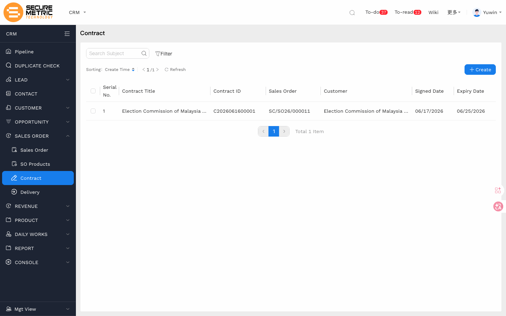
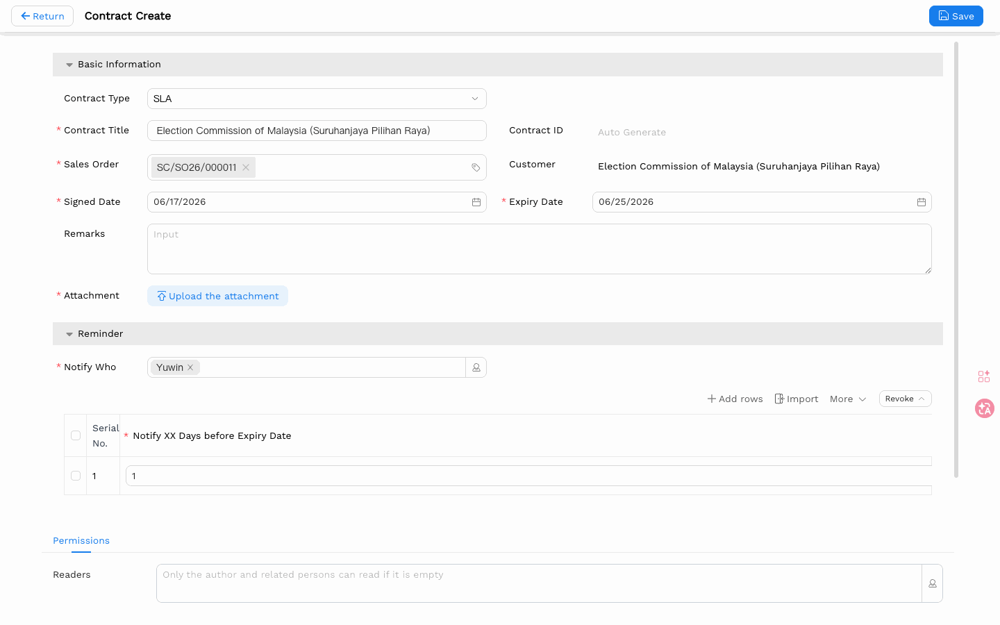

# 合同管理（Contract）用户手册

> **版本**：V1.1 | **日期**：2026-06-13 | **系统**：Securemetric CRM（EasyCraft）

---

## 目录

1. [模块概述](#1-模块概述)
2. [列表视图](#2-列表视图)
3. [创建合同](#3-创建合同)
4. [业务规则与流程](#4-业务规则与流程)
5. [常见问题与注意事项](#5-常见问题与注意事项)

---

## 1. 模块概述

**合同（Contract）** 模块用于管理 Securemetric 与客户之间已签署的协议。合同关联至销售订单（SO），代表确认销售后所产生的法律义务。合同记录是签约文件存档、续签追踪和到期监控的核心载体。

### 1.1 入口

| 入口 | 路径 |
|------|------|
| 独立列表 | 左侧导航 → **销售订单（SALES ORDER）** → **合同（Contract）** | [直达链接](http://172.18.114.231:8088/web/#/current/sys-modeling/app/km-ltc/listView/1jihfrrm2w5fw21uvqw2akr3e91d9p5dm2w4/1jihcnhlqw5fw21obkw2j8d8j21o7ctta3w4?type=list&navId=1hvp21k7lw4vw6h64w37pp9dm27vj66f3cw1){: target="_blank" rel="noopener"} |
| 从销售订单进入 | 销售订单详情 → **合同** 选项卡 → **+ 新建** |

### 1.2 核心功能

- 记录合同标题、签约日期、到期日期及附件
- 关联销售订单（进而关联至客户）
- 配置合同到期提醒通知，支持自定义提前天数
- 合同文件同步至客户 360 视图
- 追踪合同与销售订单的一对一关系

---

## 2. 列表视图

合同列表展示当前用户有权查看的所有合同。

| 列名 | 说明 |
|------|------|
| 合同标题 | 合同描述性名称 |
| 合同编号 | 系统自动生成的唯一标识 |
| 销售订单 | 关联的销售订单编号 |
| 客户 | 关联客户（派生自销售订单） |
| 签约日期 | 签署日期 |
| 到期日期 | 到期日期 |

可按合同标题、客户或日期范围筛选。

---

## 3. 创建合同

### 3.1 打开表单

**推荐路径**：进入关联销售订单，切换至 **合同** 选项卡，点击 **+ 新建**，系统将自动预填销售订单关联。

也可从独立合同列表页创建，但需要手动选择销售订单。

### 3.2 字段说明

| 字段 | 必填 | 类型 | 说明 |
|------|------|------|------|
| 合同标题 | 是 | 文本输入 | 合同的描述性名称 |
| 合同编号 | 否（自动） | 只读文本 | 保存后由系统自动生成 |
| 销售订单 | 是 | 标签选择（查找） | 关联对应的销售订单 |
| 客户 | 否（自动） | 只读文本 | 从所选销售订单自动填充 |
| 签约日期 | 是 | 日期选择器 | 合同正式签署的日期 |
| 到期日期 | 是 | 日期选择器 | 合同到期的日期 |
| 备注 | 否 | 多行文本 | 内部注释或说明 |
| 附件 | 是* | 文件上传 | 已签署的合同文件（*业务流程必填；界面未显示红色星号） |
| 通知人 | 否 | 多选用户标签 | 合同到期前需接收提醒的用户 |

> *尽管界面未显示红色星号，**附件**字段按业务规范属于必填项。请务必在保存前上传已签署的合同文件。

### 3.3 合同提醒子表

**合同提醒**子表用于配置到期前的提前通知。

| 列名 | 类型 | 说明 |
|------|------|------|
| 序号 | 自动编号 | 行序号，只读 |
| 提前通知天数 | 数字输入 | 到期前多少天发送提醒 |
| 单位 | 只读文本 | 固定为"天" |
| 操作 | 操作按钮 | 插入 / 复制 / 删除行 |

**示例**：将"提前通知天数"设置为 `30`，表示在到期日前 30 天向**通知人**列表中的所有用户发送提醒。

可添加多行以实现分级提醒（例如：到期前 90 天、30 天、7 天各提醒一次）。

### 3.4 保存

点击顶部操作栏中的 **保存**。系统自动生成**合同编号**并保存记录，合同文件同步至客户 360 合同选项卡。

