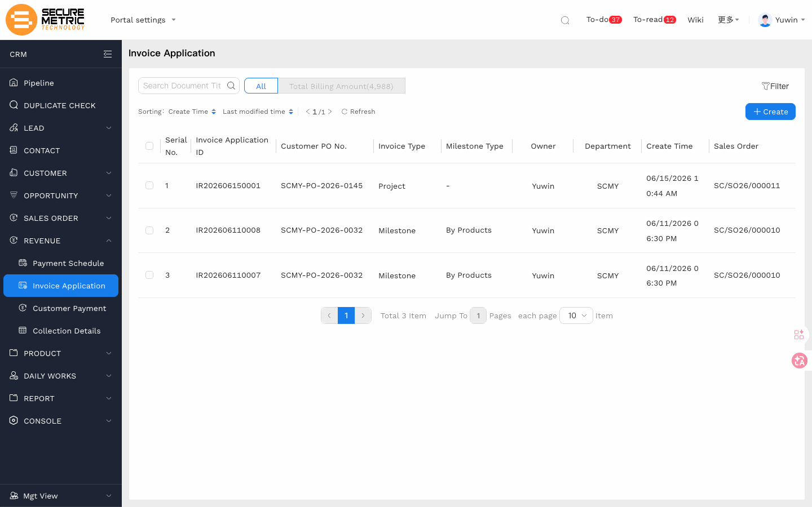
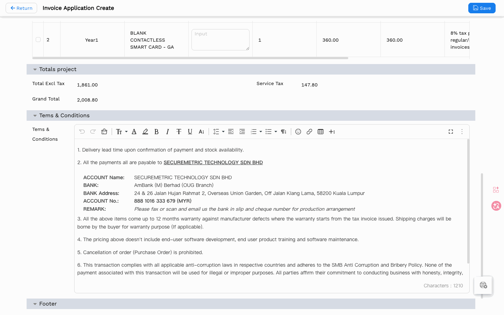
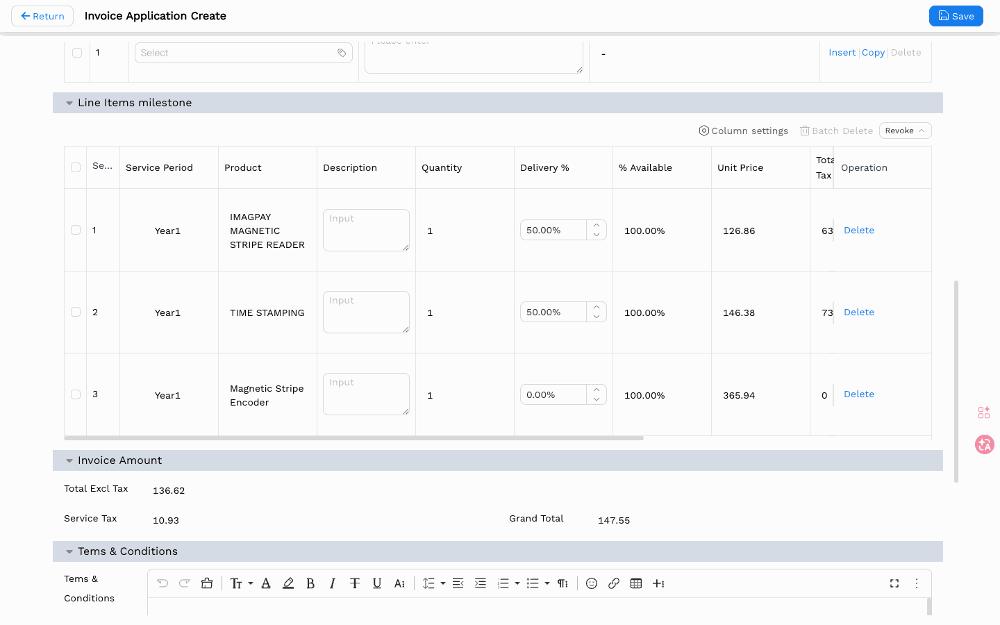
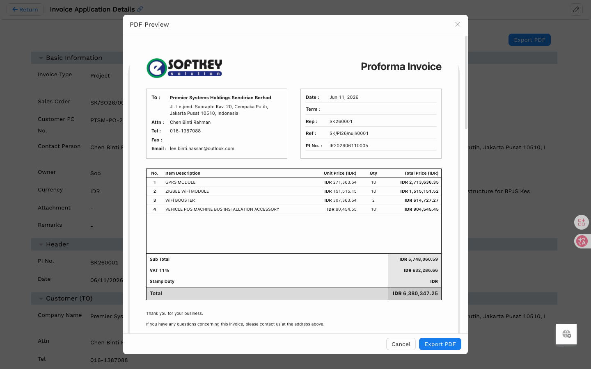
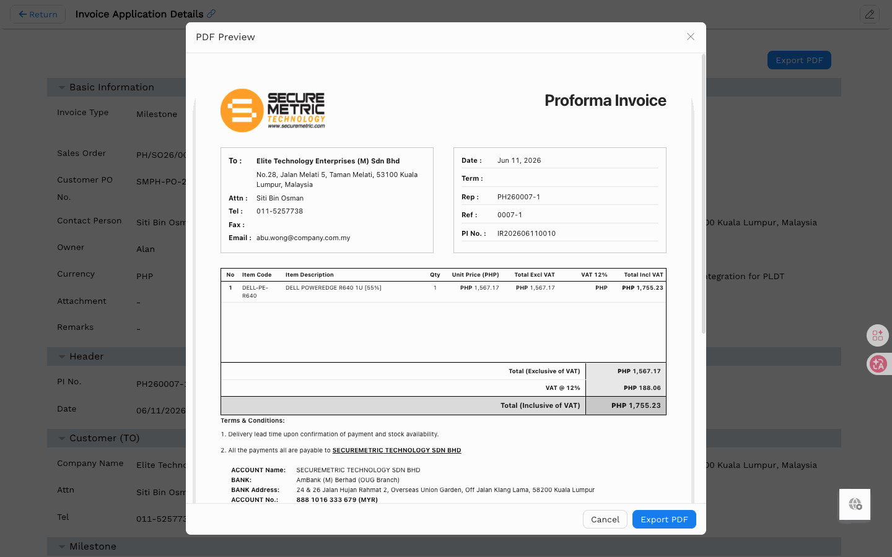

# 发票申请（Invoice Application）用户手册

> **版本**: V1.0 | **日期**: 2026-05-28 | **系统**: Securemetric CRM (EasyCraft)

---

## 目录

1. [模块概述](#1-模块概述)
2. [发票申请列表](#2-发票申请列表)
3. [创建发票申请](#3-创建发票申请)
4. [发票详情与 PDF 导出](#4-发票详情与-pdf-导出)

---

## 1. 模块概述

发票申请模块用于管理售后收款流程。它基于销售订单生成形式发票（Proforma Invoice），支持两种开票模式：**项目**（全额开票）和**里程碑**（按付款计划进度开票）。

### 1.1 入口路径

- **侧边栏**: 导航至 **REVENUE（收入） → Invoice Application（发票申请）** | [直达链接](http://172.18.114.231:8088/web/#/current/sys-modeling/app/km-ltc/listView/1i1ci8gq6w60w39c2w3galklu1di45gf3jw1/1i19lfhe4w60w1bo8w364nd0c3ogekan2kw1?type=list&navId=1hvp21k7lw4vw6h64w37pp9dm27vj66f3cw1){: target="_blank" rel="noopener"}

### 1.2 核心功能

| 功能 | 描述 |
|------|------|
| 项目开票 | 一次性开具销售订单全额发票 |
| 里程碑开票 | 针对特定付款里程碑进行进度开票 |
| PDF 预览 | 预览并导出形式发票为 PDF |

---

## 2. 发票申请列表

---

## 3. 创建发票申请

点击 **+ Create** 按钮打开发票申请创建页面，按以下步骤操作：

1. **确认发票类型** — 项目发票还是里程碑发票（切换类型会清空已填信息）
2. **选择销售订单** — 选择需要开票的销售订单
3. **确认联系人与地址** — 从销售订单或客户记录自动带入
4. **条款** — 根据不同实体和货币自动切换内容

### 3.1 里程碑发票

选择可以开票的里程碑后：

- **百分比类型**：当前发票金额直接按里程碑百分比计算
- **产品类型**：除最后一个里程碑外，均可填写当前开票百分比；最后一次自动锁定，确保发票总金额不超出

里程碑发票一次只能开一个里程碑；开票结束后，回款计划中的相关金额会自动更新。产品里程碑开票结束后，项目中的应收比例和金额也会同步更新。

---

## 4. 发票详情与 PDF 导出

### 4.1 项目发票 PDF

### 4.2 里程碑发票 PDF

> **说明**：里程碑发票的产品描述后面会附带开票百分比；若为 100% 则不显示。

点击 **Export PDF** 按钮将形式发票下载为 PDF 文件。
