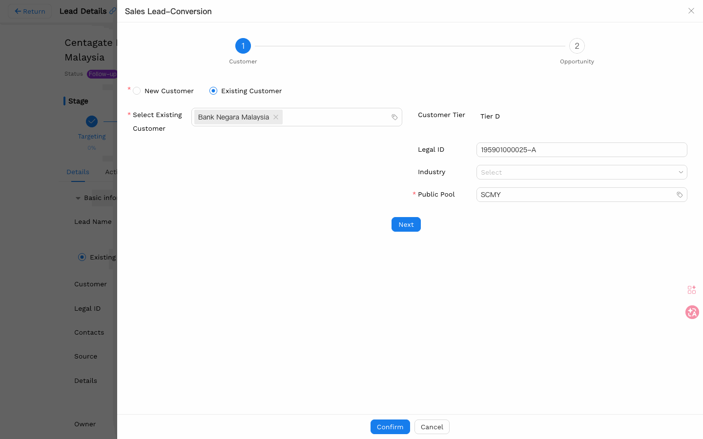
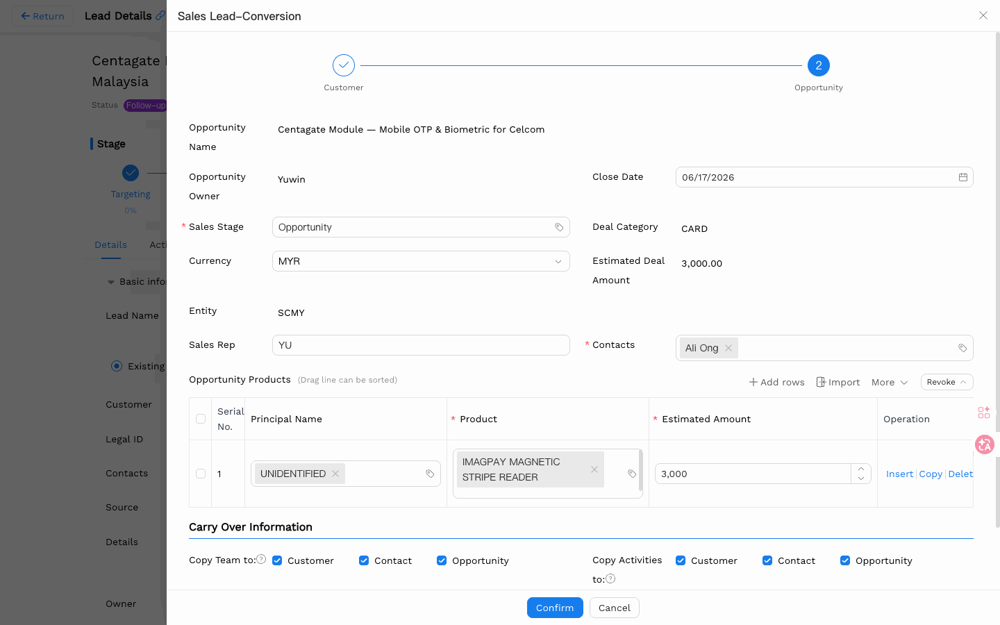

# 线索（Lead）用户手册

> **版本**: V1.1 | **日期**: 2026-06-13 | **系统**: Securemetric CRM (EasyCraft)

---

## 目录

1. [模块概述](#1-模块概述)
2. [线索列表](#2-线索列表)
3. [创建线索](#3-创建线索)
4. [线索详情](#4-线索详情)
5. [线索管理操作](#5-线索管理操作)
6. [线索转化](#6-线索转化流程)
7. [线索导入](#7-线索导入)
8. [常见问题](#8-常见问题)

---

## 1. 模块概述

线索（Lead）代表尚未确认的潜在销售机会，遵循以下生命周期：获取 → 分配 → 跟进 → 转化（转为商机或客户）。

### 1.1 入口路径

- **侧边栏**: 导航至 **LEAD（线索） → Sales Lead（销售线索）** | [直达链接](http://172.18.114.231:8088/web/#/current/sys-modeling/app/km-ltc/listView/1i2b2u2how6aw3k7dw1a3anjl3jnug8m31w1/1i2b2u2how6aw3k7dw1a3anjl3jnug8m31w1?type=list&navId=1hvp21k7lw4vw6h64w37pp9dm27vj66f3cw1){: target="_blank" rel="noopener"}

### 1.2 核心功能

| 功能 | 描述 |
|------|------|
| 线索创建 | 创建新的销售线索，录入客户和交易信息 |
| 线索池 | 管理待分配和已分配的线索，到期未处理自动回收 |
| 线索分配 | 销售经理将未分配的线索分配给销售人员 |
| 线索转化 | 将合格线索转化为商机，操作分两步完成 |
| 线索导入 | 通过 Excel 表格批量导入线索数据 |
| 任务管理 | 创建跟进任务并设置截止日期和提醒 |

### 1.3 线索状态

| 状态 | 描述 | 触发条件 |
|------|------|----------|
| 未分配 | 线索在线索池中，尚无负责人 | 导入/新建后进入线索池；或退回后 |
| 待处理 | 已分配负责人，尚未开始跟进 | 管理员分配或销售自行认领 |
| 跟进中 | 负责人正在跟进 | 负责人点击"跟进中"或添加跟进记录 |
| 无效 | 已标记为无效 | 联系不上或无意向时，负责人手动标记 |
| 转客户 | 线索正在执行转换流程 | 负责人点击"转换"后系统自动变更 |
| 已转换 | 已成功转换为客户/商机 | 完成转换操作后自动变更 |
| 已作废 | 线索已作废，不再参与流转 | 系统或管理员操作 |

### 1.4 线索生命周期

```
市场活动/手工录入/导入
         ↓
  [未分配] 进入线索池
         ↓
  认领 / 管理员分配
         ↓
  [待处理] 等待跟进
         ↓
  开始跟进（添加销售记录）
         ↓
  [跟进中] ──→ 超时未处理 ──→ 自动回收至队列 [未分配]
         ↓
  [已转换] → 客户 + 联系人 + 商机
      或
  [无效] → 线索存档
```

> **SLA 超时规则**：线索被分配后，如在规定天数内无任何跟进行为（添加销售记录、状态变更等），系统自动将其收回至线索池，重置为【未分配】状态。

---

## 2. 线索列表


### 2.1 所属权筛选标签

- **我拥有的（My Owned）**: 我拥有的线索
- **我的团队拥有的（My Team Owned）**: 领导视角 — 查看自己团队所有成员的线索
- **我参与的（My Involved）**: 我是团队成员的线索
- **全部（All）**: 我可见的所有线索

### 2.2 状态筛选标签

- **全部** | **未分配** | **待处理** | **跟进中** | **已转化** | **无效**

### 2.3 列表功能

| 功能 | 描述 |
|------|------|
| 搜索 | 在顶部输入电话号码快速查找线索 |
| 排序 | 可按创建时间、分配时间、最后跟进时间排序 |
| 批量操作 | 勾选多条线索后可批量删除 |
| 分页 | 底部显示总条数，支持跳转到指定页 |

### 2.4 每条线索显示的信息

- 线索名称、客户、负责人、状态
- 预估交易金额、币种
- 回收倒计时（如"7天"表示还剩 7 天，"-1天"表示已过期）
- 创建时间、最后跟进时间

---

## 3. 创建线索

### 3.1 入口

点击线索列表工具栏上的 **+ 创建** 按钮打开线索创建表单。


### 3.2 基本信息

| 字段 | 必填 | 说明 |
|------|------|------|
| 线索名称 | 是 | 输入时会自动提示已有记录，避免重复创建 |
| 线索池 | 是 | 选择所属队列，默认为您的实体队列 |
| 客户类型 | 是 | 选择"新客户"或"已有客户"（请先选此项） |
| 客户 | 条件必填 | 客户类型选"已有客户"时必填 |
| 法定 ID | 否 | 公司注册号 |
| 合作伙伴 | 否 | 关联的合作组织 |
| 来源 | 是 | 线索来源渠道，如搜索引擎、客户推荐、会议等 |
| 线索等级 | 是 | A级 / B级 / C级 |
| 销售管道 | 是 | 默认为"线索阶段" |
| 详情 | 是 | 填写销售备注或与该线索相关的描述 |
| 邮件 | 否 | 联系人邮件 |
| 电话 | 否 | 联系人电话 |
| 地址 | 否 | 公司地址 |
| 网址 | 否 | 公司网站 |
| 备注 | 否 | 其他补充说明 |

### 3.3 交易详情

| 字段 | 必填 | 说明 |
|------|------|------|
| 交易类别 | 是 | 从弹窗中选择产品类别，如 PKI、HSM 等 |
| 实体 | 否 | 负责此线索的实体（公司主体），可多选 |
| 币种 | 否 | 报价币种，默认根据所选实体自动填入 |
| 预估交易金额 | 否 | 填写预计交易总金额，默认为 0 |

### 3.4 产品明细表

> ⚠️ **重要**: 至少填写一行产品 + 预估金额，否则无法提交。

操作步骤：
1. 点击 **+ 添加行**
2. 在 **产品描述** 列选择产品 — 系统自动带出对应的主体（供应商）
3. 填写 **预估金额**
4. 其他列（MYR 值、加权金额）自动计算，无需手动填写

> 💡 产品是账户范围的，仅显示当前账户下的可选产品。


### 3.5 底部字段

| 字段 | 描述 |
|------|------|
| 赢率 | 根据所处阶段自动计算，无需手动填写 |

---

## 4. 线索详情


### 4.1 子标签页

| 标签页 | 描述 |
|--------|------|
| 详情（Details） | 基本信息表单视图 |
| 流转记录 | 流转审计跟踪（负责人、获取方式、当前状态/阶段、时间戳） |
| 联系人 | 关联联系人列表 |
| 商机 | 关联商机列表 |
| 相关线索 | 父线索下的子线索 |
| 转化记录 | 转化历史 |

---

## 5. 线索管理操作

### 5.1 详情页操作按钮

详情页右上角按钮根据当前用户角色和线索状态动态显示；超出固定数量时自动折叠到 **"更多"** 下拉菜单。

#### 通用操作

| 按钮 | 说明 | 显示条件 |
|------|------|----------|
| 打印 | 打印线索详情 | 始终显示 |
| 锁定 | 锁定线索，防止被修改 | 线索未锁定 |
| 解锁 | 解除锁定 | 线索已锁定 |
| 建任务 | 创建跟进任务并设置截止日期和提醒 | 状态≠【未分配】，且线索未锁定 |

#### 负责人操作

| 按钮 | 说明 | 显示条件 |
|------|------|----------|
| 编辑 | 修改线索字段 | 线索未锁定 |
| 跟进中 | 将线索状态切换为【跟进中】 | 状态为【待处理】或【无效】，且未锁定，且当前用户为负责人 |
| 退回 | 主动将线索退回线索池 | 状态为【待处理/跟进中/无效】，且未锁定，且当前用户为负责人 |
| 无效 | 将线索标记为无效 | 状态为【待处理】或【跟进中】，且未锁定，且当前用户为负责人 |
| 转换 | 启动线索转化流程（创建客户/商机） | 状态为【跟进中】，且赢率已填写，且当前用户为负责人，且线索未锁定 |
| 重置阶段推进器 | 将销售管道阶段重置到初始节点 | 状态为【待处理】或【跟进中】，且未锁定，且当前用户为负责人 |

#### 线索池成员操作

| 按钮 | 说明 | 显示条件 |
|------|------|----------|
| 认领 | 将线索认领为自己负责 | 状态为【未分配】，且未锁定，且当前用户为线索池成员，且线索池规则允许成员自领 |
| 归集 | 将本线索归集到另一条主线索下 | 状态为【待处理】或【跟进中】，且锁定状态正常，且当前用户为线索池成员或管理员 |

#### 线索池管理员操作

| 按钮 | 说明 | 显示条件 |
|------|------|----------|
| 分配 | 将线索指派给指定销售 | 状态为【未分配】，且未锁定 |
| 收回 | 强制收回已分配线索 | 状态为【待处理/跟进中/无效】，且未锁定 |
| 转移 | 将线索移至另一个线索池 | 状态为【待处理/跟进中/无效】，且未锁定，且线索池规则允许转移 |
| 变更负责人 | 将线索负责人更换为其他销售 | 状态为【待处理/跟进中/无效】，且未锁定 |
| 归集 | 同上（成员和管理员均可操作） | 同上 |

### 5.2 服务团队管理

点击详情页的"服务团队"区域，可添加或管理参与此线索的团队成员：

- 为成员设置角色（负责人 / 普通成员）
- 设置权限（可编辑 / 只读）
- 点击"+ 添加更多"增加成员

### 5.3 线索池

线索池决定了哪些人可以看到和操作该线索，并通过规则控制认领、转移等行为：

**认领规则**
- **成员可见可认领**：成员可自行认领线索；管理员也可直接分配
- **对成员隐藏**：成员看不到该线索，只有管理员可以分配

**转移规则**（可选）
- 开启后，线索池成员领取的线索可转移至其他线索池

未在规定天数内处理的线索会自动回收到线索池，重新等待分配。

### 5.4 SLA 回收倒计时

线索池列表显示 **"回收倒计时"** 列：

- **"7Days"** → 还剩 7 天自动回收
- **"2Days"** → 还剩 2 天
- **"-1Days"** → 已过期——线索已自动回收到公共池

> 💡 **业务规则**：倒计时从线索分配时开始。当倒计时变为负数时，该区域任何客户经理都可以从公共池认领该线索。

### 5.5 实体隔离与服务团队访问

**实体隔离：**
- 用户只能看到所属实体的线索（如 SCMY 用户只看得到 SCMY 的线索）
- 直接通过 URL 访问其他实体的线索会返回"拒绝访问"

**服务团队覆盖：**
- 将用户添加到线索的服务团队可授予其访问权限（不受实体限制）
- **只读** 权限：用户可查看但不可编辑
- **可编辑** 权限：用户可编辑该线索
- **负责人自动分配**：创建线索时，创建者自动加入服务团队

### 5.6 线索池操作

线索池（Lead Pool）是管理未分配线索的共享池，详细的按钮显示条件见 **5.1 详情页操作按钮**。

**操作路径**：线索详情页右上角 → 对应操作按钮

> **持有量限制**：如当前用户的线索持有量已达上限，认领操作会被阻止。请联系线索池管理员调整配额。

### 5.7 更换负责人

将线索负责人变更为其他销售代表，原负责人可保留为团队成员或直接移出团队。

> **前提**：当前用户为线索池管理员，且线索状态为【待处理/跟进中/无效】，且线索未锁定

**操作路径**：线索详情页右上角 → **变更负责人**

- **移出团队**：原负责人直接退出，不再有任何权限
- **保留为团队成员**：原负责人降级为普通团队成员（可选只读或编辑权限）

### 5.8 归集线索

将多条相关线索归集到一条主线索下，形成父子关系，便于统一追踪。

**操作路径**：线索详情页右上角 → **归集**

归集完成后，被归集的线索作为子线索显示在主线索详情页"相关线索"选项卡中。

> **前提**：状态为【待处理】或【跟进中】，且锁定状态正常，且当前用户为线索池成员或管理员

---

## 6. 线索转化流程

### 6.1 前提条件

> **前提**：线索状态为【跟进中】，且销售管道阶段已推进至 **Prospecting**，同时当前用户拥有线索转换权限

转化时系统会进行查重校验：
- **客户查重**：若系统已存在同名客户，可选择转换为已有客户（需有该客户查看权限）或新建客户
- **联系人查重**：若已有相同联系人记录，只能转换为已有联系人
- **商机查重**：若存在重复商机，转换将失败

### 6.2 入口

从线索列表或详情页，点击 **转化** 打开"销售线索-转化"弹窗。





### 6.3 步骤 1：客户

- 验证/创建客户账户
- 线索中的联系人自动关联到客户

### 6.4 步骤 2：商机

| 字段 | 说明 |
|------|------|
| 销售阶段 | 转化后所处的销售阶段 |
| 交易类别 | 产品类别 |
| 币种 | 报价币种（如 MYR、IDR） |
| 预估交易金额 | 预计交易金额 |
| 实体 | 负责的公司主体（如 SCMY、PTSM） |
| 销售代表 | 负责跟进的销售人员 |
| 联系人 | 标签输入框——从线索联系人表自动带入（必填） |

### 6.5 结转信息（Carry Over Information）

> **哪些数据会从线索结转到客户、联系人和商机？**

完成第 2 步后，转化弹窗会显示 **"结转信息"** 区域，包含两组复选框（默认全部勾选）：

**复制团队到：**
- ☑ 客户 — 将线索的服务团队复制到新客户记录
- ☑ 联系人 — 将线索的服务团队复制到新联系人记录
- ☑ 商机 — 将线索的服务团队复制到新商机记录

**复制活动到：**
- ☑ 客户 — 将线索的活动日志历史结转到客户
- ☑ 联系人 — 将线索的活动日志历史结转到联系人
- ☑ 商机 — 将线索的活动日志历史结转到商机

> 💡 **提示**：如果不想结转某项数据，取消对应勾选即可。必须勾选才能将服务团队或活动添加到目标实体。

### 6.6 商机产品表

产品信息从线索自动带入，可在此确认或调整：

| 列 | 说明 |
|----|------|
| 主体名称 | 产品供应商 |
| 产品 | 产品名称 |
| 预估金额 | 该产品的预计交易金额 |

### 6.7 转化后状态

- 状态徽章变为绿色 **"已转化"**
- 商机(1) 标签页显示关联的商机
- 转化记录(1) 标签页显示转化历史


---

## 7. 线索导入

### 7.1 入口

点击线索列表工具栏上的 **导入** 按钮（带向内箭头的文档图标）。

### 7.2 导入设置

| 字段 | 必填 | 说明 |
|------|------|------|
| 导入模式 | 是 | 根据需求选择导入方式（见下方说明） |
| 条件字段 | 是 | 用于识别记录的字段，建议设为"线索名称" |
| 重复检查字段 | 否 | 可选，用于避免导入重复数据 |

### 7.3 导入模式

| 模式 | 适用场景 |
|------|------|
| 新增导入 | 只添加新记录，不修改已有数据 |
| 更新导入 | 只更新已有记录，不创建新记录 |
| 新增和更新 | 有则更新、无则新增（最常用） |
| 快速导入 | 仅导入主表数据（不含关联子表） |

### 7.4 Excel 模板说明

导入模板共 17 列，其中以下字段为必填：

**必填字段**: 线索名称、详情、手机、线索等级、来源、线索池、业务流程、状态、锁定状态、销售管道

**选填字段**: 客户公司、客户部门、职位、邮件、地址、关联

> **注意**：线索等级请填写 A级 / B级 / C级；锁定状态填写数字：1 = 未锁定，2 = 已锁定。

### 7.5 枚举验证与错误处理

导入期间，系统会对枚举字段进行验证：

| 字段 | 允许的值 | 无效示例 | 结果 |
|------|---------|---------|------|
| 线索等级 | A级, B级, C级 | "D级" | ❌ 该行导入失败 |
| 来源 | 搜索引擎, 客户推荐, 展会, 广告, 电话, 网站, 其他 | "陌生拜访" | ❌ 该行导入失败 |
| 线索池 | SMMY, SCMY（按实体） | "XYZ" | ❌ 该行导入失败 |
| 锁定状态 | 1（未锁定）, 2（已锁定） | "3" 或文本 | ❌ 该行导入失败 |

**导入结果汇总**：
导入完成后，系统显示汇总：**N 成功，M 失败，K 已更新**

- 失败的行会列出具体错误消息（如"线索等级 'D级' 不在允许的值中"）
- 您可以在 Excel 文件中修正错误后重新导入失败的行

---

## 8. 常见问题

**问：线索分配后，多少天内必须处理？**
超时天数由线索池的 SLA 规则决定（各队列配置可能不同）。超时后线索自动收回至队列，重置为【未分配】状态。列表页的"回收倒计时"列可实时查看剩余天数。

**问：线索状态变为"跟进中"需要做什么？**
添加一条销售记录（Activity Log）或在详情页点击"跟进中"按钮，状态即可变更。销售记录同时会重置 SLA 倒计时。

**问：线索转换时提示"存在重复客户"怎么办？**
系统检测到已有同名客户记录。可选择转换为已有客户（需要有该客户的查看权限），或确认确为新客户后选择新建。请勿强行新建重复记录。

**问：线索转换完成后发现数据有误，可以重新转换吗？**
线索状态变为【已转换】后不可再次转换。如需修改，请直接编辑已创建的客户、联系人或商机记录。

**问：我看不到某条线索，但同事说它存在？**
可能原因：① 该线索属于其他实体（实体隔离）；② 你不在该线索的服务团队中；③ 该线索在你没有查看权限的线索池中。请联系该线索负责人将你添加至服务团队，或联系管理员确认权限。

**问：导入时"线索池"字段填什么？**
填写队列的系统名称（如 SCMY、SMMY），而非显示名称。可在队列管理页面查看各队列的系统名称。

