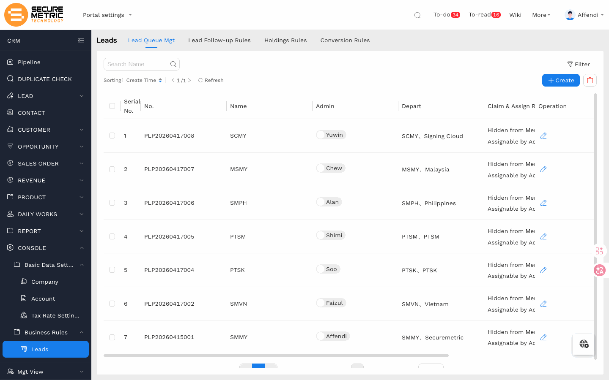
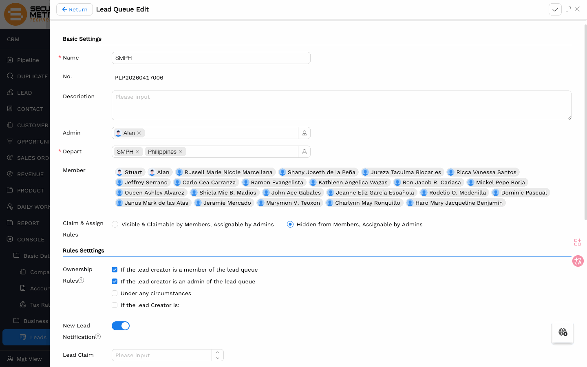
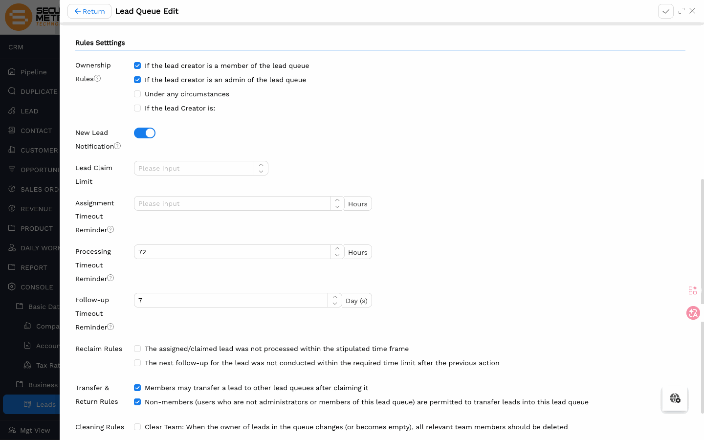

# 线索池规则（Lead Queue Management）用户手册

> **版本**: V1.0 | **日期**: 2026-06-17 | **系统**: Securemetric CRM (EasyCraft)

---

## 目录

1. [模块概述](#1-模块概述)
2. [线索池列表](#2-线索池列表)
3. [基本配置](#3-基本配置)
4. [业务规则](#4-业务规则)
5. [常见问题](#5-常见问题)

---

## 1. 模块概述

线索池（Lead Queue）决定线索进入系统后的分配方式、归属规则和超时回收机制。每个法律实体对应一个线索池，由管理员统一维护。

### 1.1 入口路径

| 入口 | 路径 |
|------|------|
| 主入口 | 左侧导航 **LEAD → Leads**，切换至 **Lead Queue Mgt** 页签 | [直达链接](http://172.18.114.231:8088/web/#/current/sys-modeling/app/km-ltc/listView/1i1ool4u8w66w19kew3oqgu0c33v66po3dw1/1hth1o76iw5ow19cndw6fc5u8bgkqva28twe?type=list&navId=1hvp21k7lw4vw6h64w37pp9dm27vj66f3cw1){: target="_blank" rel="noopener"} |

---

## 2. 线索池列表

系统自动为每个法律实体创建一个线索池，共 7 条，与公司主体设置一一对应。点击右侧编辑图标进入对应线索池的配置页。

---

## 3. 基本配置

每个线索池需配置 **Admin**（管理员）和 **Depart**（所属部门）。选定部门后，系统自动将该部门下的人员带入 **Member** 列表，Member 决定谁可以接收和处理该线索池中的线索。

> **部门成员变更时**：线索池的 Member 列表不会自动更新。需前往 **基础数据设置 → 公司主体**，点击对应主体详情页的 **Member Change** 按钮手动同步，同步完成后线索池 Member 随之更新。

### 3.1 领取与分配规则（Claim & Assign Rules）

此项是线索池最核心的配置，决定销售人员是否能自行领取线索：

| 选项 | 说明 |
|------|------|
| **Hidden from Members, Assignable by Admins** | 成员看不到线索池中的待分配线索，只有管理员可以主动分配 |
| **Visible & Claimable by Members, Assignable by Admins** | 成员可以自行领取线索，管理员也可以主动分配 |

> 当前系统默认配置为"Hidden from Members"，线索统一由管理员分配。

---

## 4. 业务规则

### 4.1 归属规则（Ownership Rules）

控制线索创建时是否自动保留创建人为负责人。默认情况下新建线索会清空负责人（未分配状态）；勾选以下条件时，创建人保留负责人：

- **If the lead creator is a member of the lead queue** — 创建人属于该线索池成员
- **If the lead creator is an admin of the lead queue** — 创建人是该线索池管理员

### 4.2 超时提醒

| 规则 | 当前值 | 说明 |
|------|--------|------|
| Processing Timeout Reminder | 72 小时 | 线索分配后超时未处理，触发提醒 |
| Follow-up Timeout Reminder | 7 天 | 线索跟进超时未更新，触发提醒 |

**新线索提醒（New Lead Notification）**：开启后，有新线索进入时系统向管理员推送待阅通知，便于及时分配。

### 4.3 回收规则（Reclaim Rules）

满足以下任一条件时，线索自动从负责人处回收至未分配状态：

- 分配后在规定时间内未处理
- 跟进操作超过规定时间未更新

### 4.4 转移规则（Transfer & Return Rules）

- 成员认领线索后可将其转移到其他线索池
- 非本池成员（含非管理员）也可将线索转入本池

---

## 5. 常见问题

**Q：新建线索后负责人为空，但销售说他应该自动成为负责人，怎么处理？**  
A：检查该销售人员所属实体的线索池 Ownership Rules，确认是否勾选了"If the lead creator is a member"；同时确认该销售已通过 Member Depart 加入线索池。

**Q：管理员配置了线索池但销售看不到待领取的线索，正常吗？**  
A：是的，若 Claim & Assign Rules 设为 "Hidden from Members"，成员不会看到待分配线索，需由管理员主动分配。若希望销售自行领取，改为 "Visible & Claimable by Members"。
