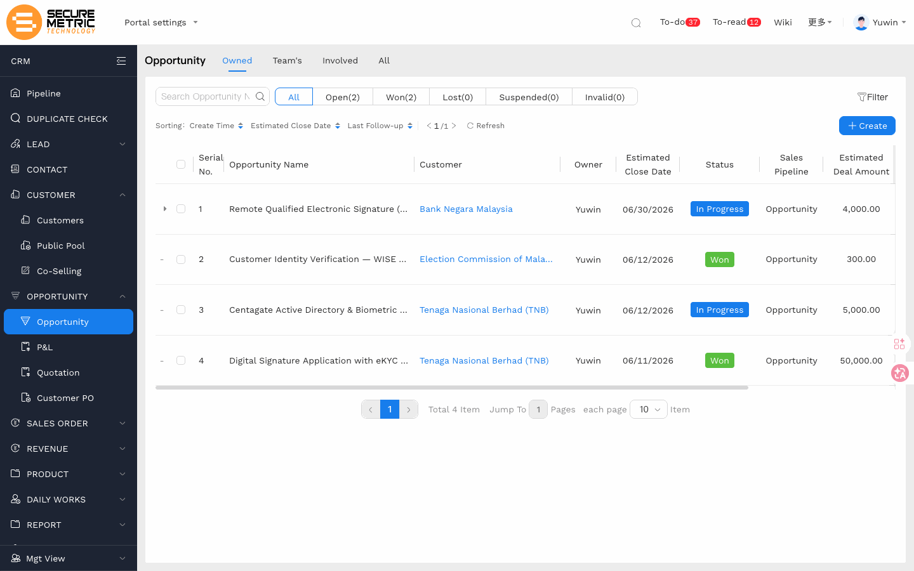
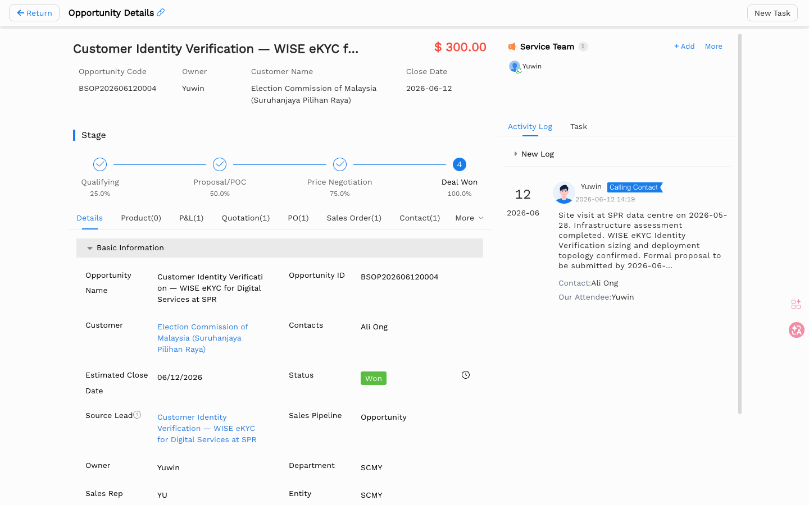

# 商机（Opportunity）用户手册

> **版本**：V1.3 | **日期**：2026-06-17 | **系统**：Securemetric CRM（EasyCraft）

---

## 目录

1. [模块概述](#1-模块概述)
2. [列表视图](#2-列表视图)
3. [创建商机](#3-创建商机)
4. [详情视图](#4-详情视图)
5. [业务操作](#5-业务操作)
6. [P&L 与报价流程](#6-pl-与报价流程)
7. [业务规则与流程](#7-业务规则与流程)
8. [常见问题与注意事项](#8-常见问题与注意事项)

---

## 1. 模块概述

**商机（Opportunity）** 是 Securemetric CRM 中已确认的潜在交易记录，代表一个有望产生收益的销售机会。商机管理不仅涵盖销售团队、产品方案、预估金额、预计结束时间和赢单率等核心功能，还帮助企业建立规范化的销售流程，形成可衡量、可追踪的销售管道。

商机可从线索转化而来，也可直接手工新建。所有下游单据——P&L、报价单、销售订单、采购订单——均挂载于商机记录之下。

### 1.1 入口路径

| 入口 | 路径 |
|------|------|
| 主入口 | 左侧导航 → **OPPORTUNITY（商机）→ Opportunity** | [直达链接](http://172.18.114.231:8088/web/#/current/sys-modeling/app/km-ltc/listView/1hvp2d7e8w4vw6hlbw3tpla2s2mv5r6728w1/1i1okcl85w64w1s61w3ak7jcrlsa1c81ifw1?type=list&navId=1hvp21k7lw4vw6h64w37pp9dm27vj66f3cw1){: target="_blank" rel="noopener"} |
| 从线索转化 | 线索详情页 → **转换** → 步骤 2：选择商机 |

### 1.2 核心功能

| 功能 | 描述 |
|------|------|
| 阶段管道 | 通过多个阶段跟踪交易进度，支持阶段推进器 |
| P&L 管理 | Securemetric 定制定价引擎，含审批流程 |
| 报价单生成 | 从已批准的 P&L 自动生成只读报价单 |
| 所有权转移 | 转移商机负责人，支持团队连续性选项 |
| 服务团队 | 管理商机参与成员及其读写权限 |

### 1.3 商机状态说明

商机有两类独立状态维度：

**进展状态（阶段状态）**

| 状态 | 说明 | 是否终态 |
|------|------|---------|
| 未开始 | 商机已创建，尚未进入推进流程 | 否 |
| 进行中 | 商机处于正常推进中 | 否 |
| 暂停 | 商机因特定原因暂时搁置，条件成熟后可恢复 | 否 |
| 赢单 | 交易成功达成，最终结果为赢单 | 是 |
| 输单 | 交易失败，最终被竞争对手赢得 | 是 |
| 无效 | 商机因某种原因终止，不再具有商业价值 | 是 |

> 赢单、输单、无效为三大结束状态，进入后不可回退至进行中或暂停。

**阶段定义（销售管道）**

| 序号 | 阶段名称 | 赢率参考 | 阶段类型 |
|------|---------|---------|---------|
| 1 | 资格确认（Qualifying） | 25% | 开始 |
| 2 | 方案/POC（Proposal/POC） | 50% | 进行中 |
| 3 | 价格谈判（Price Negotiation） | 75% | 进行中 |
| 4 | 赢单（Deal Won） | 100% | 结束 |
| 5 | 输单（Deal Lost） | 0% | 结束 |

### 1.4 商机生命周期

```
线索转换 / 手工新建
         ↓
  [进行中] 资格确认阶段
         ↓
  阶段推进（Proposal/POC → 价格谈判）
         ↓              ↘ 暂停（条件不成熟）
  [进行中] 价格谈判阶段    ↓
         ↓           可恢复至进行中
         ↓
  ┌──────┬───────┬──────┐
  ↓      ↓       ↓
[赢单] [输单]  [无效]
  ↓
报价单 → 销售订单 → 合同
```

---

## 2. 列表视图

商机列表展示当前登录用户有权查看的所有商机记录。



### 2.1 视图场景

| 场景标签 | 显示范围 |
|----------|---------|
| 我负责的（Owned） | 当前用户为负责人的商机 |
| 我的团队的（Team's） | 当前用户团队拥有的商机（管理者视角） |
| 我参与的（Involved） | 当前用户为服务团队成员的商机 |
| 全部（All） | 当前用户有权查看的所有商机 |

### 2.2 状态筛选

- **全部** | **开放（Open）** | **赢单（Won）** | **输单（Lost）** | **暂停（Suspended）** | **无效（Invalid）**

### 2.3 高级搜索

| 搜索字段 | 类型 |
|---------|------|
| 商机名称 | 文本 |
| 客户 | 查找 |
| 负责人 | 用户选择器 |
| 部门 | 下拉 |
| 销售管道（阶段） | 下拉 |
| 预计结束日期 | 日期范围 |
| 创建时间 | 日期范围 |

### 2.4 表格列

| 列名 | 说明 |
|------|------|
| 商机名称 | 交易名称，点击进入详情 |
| 客户 | 关联客户 |
| 负责人 | 商机负责人 |
| 预计结束日期 | 预期成交日期 |
| 销售管道 | 当前所处阶段 |
| 预估交易金额 | 商机预估价值 |

---

## 3. 创建商机

### 3.1 入口

在商机列表页点击工具栏 **+ 创建** 按钮；或在线索详情页点击 **转换** 进入两步转换流程，步骤 2 中勾选"商机"。

### 3.2 基本字段

| 字段 | 必填 | 类型 | 说明 |
|------|------|------|------|
| 商机名称 | 是 | 文本 | 交易名称，建议格式：客户名-产品-年份 |
| 预计结束日期 | 否 | 日期选择器 | 格式 YYYY-MM-DD |
| 交易类别 | 否 | 级联选择器 | PKI、OTP、ADSS 等产品线选项 |
| 销售管道 | 否 | 下拉 | 阶段选项动态加载，默认从第一阶段开始 |
| 负责主体 | 否 | 关系弹窗 | 关联客户/合作伙伴，打开"选择记录"弹窗 |
| 产品描述 | 否 | 明细表 | 内联可编辑表格，逐行填写产品和服务 |

### 3.3 保存

点击顶部操作栏 **保存**。系统自动分配商机编号（格式：**BSOP+YYYYMMDD+序列号**）并回到列表页。

---

## 4. 详情视图

商机详情页顶部展示核心信息，下方为多个子标签页。



### 4.1 顶部操作栏

| 操作 | 说明 | 显示条件 |
|------|------|---------|
| 暂停（Suspend） | 将商机暂停，不再推进阶段 | 商机状态为**进行中**，且当前用户为负责人 |
| 进行中（Open） | 将暂停商机恢复为进行中 | 商机状态为**暂停**，且当前用户为负责人 |
| 变更负责人（Change Owner） | 转移商机所有权给其他用户 | 商机状态为**进行中**或**暂停**；可见范围受角色权限控制 |
| 重置商机阶段（Reset Stage） | 将销售阶段重置回默认开始阶段 | 当前用户为负责人，且商机状态为**进行中**或**赢单** |
| 编辑（Edit） | 进入编辑模式 | 始终显示；负责人、管理员或服务团队中设置了读写权限的成员可实际编辑 |
| 建任务（New Task） | 为商机创建关联任务 | 商机为正常保存状态 |
| Create P&L | 为商机新建损益分析 | 商机为正常保存状态 |

### 4.2 摘要头部

- 商机名称、预估交易金额（红色高亮显示）
- 商机编号：自动生成，格式 **BSOP+YYYYMMDD+序列号**
- 负责人、关联客户、预计结束日期、服务团队

### 4.3 子标签页

| 标签页 | 内容 |
|--------|------|
| 详情（Details） | 基本信息的表单视图，可编辑 |
| 产品（Product N） | 产品与服务明细行 |
| P&L（N） | 损益分析，Securemetric 定价引擎 |
| 报价单（Quotation N） | 从已批准 P&L 自动生成的报价单 |
| 采购订单（PO N） | 关联采购订单 |
| 销售订单（Sales Order N） | 关联销售订单 |
| 决策者地图（Decision-Maker Map N） | 客户内部决策链联系人网络图 |

### 4.4 产品明细项

| 列名 | 说明 |
|------|------|
| 序号 | 行号 |
| 服务期间 | 服务或授权时长 |
| 主体名称 | 产品供应商/主体 |
| 产品名称 | 具体产品名称 |
| 预估金额 | 该明细行价值 |

> **注意**：头部显示的预估交易金额 = 所有产品明细行的汇总金额，不可手动覆盖。

---

## 5. 业务操作

### 5.1 暂停与恢复

将正在推进的商机暂时搁置，适用于客户暂缓决策、预算冻结或项目延期等场景。

> **前提**：当前用户为商机负责人；商机状态为**进行中**。

**操作路径**：商机详情页右上角 → **暂停（Suspend）**

- 暂停后商机状态变为**暂停**，阶段不变，不计入活跃销售管道报告。
- 恢复时点击 **恢复（Open）** 按钮，商机状态重新变为**进行中**，从原阶段继续推进。
- 暂停状态下仍可添加活动日志和销售记录。

### 5.2 更换负责人

将商机的所有权正式转移给其他用户，适用于销售人员离职、客户重新分配或团队调整等场景。

> **前提**：商机状态为**进行中**或**暂停**。

**操作路径**：商机详情页右上角 → **更换负责人（Change Owner）**

| 选项 | 说明 |
|------|------|
| 新负责人 | 通过用户选择弹窗指定新负责人 |
| 原负责人去向 | **从团队中移除**（完全移除）或 **作为普通成员留在团队中**（保留并设置权限）|
| 权限 | 只读 / 读写 — 控制原负责人留在团队后的编辑权限 |
| 团队连续性 | **保留现有成员** 或 **清除全部成员**（仅保留新负责人） |

### 5.3 阶段推进与阶段推进器

**阶段推进**

商机详情页顶部展示水平步进器，通过编号圆圈可视化当前所处阶段。

- 点击 **商机负责人阶段推进（Change Stage）** 蓝色按钮手动推进。
- 所有阶段均需手动推进，不支持自动跳阶。
- 若配置了**阶段推进器**，推进前系统将检查当前阶段的待办事项是否已完成。

**阶段推进器（Stage Pusher）**

阶段推进器是由管理员配置的阶段引导工具，将销售周期细分为多个阶段，并为每个阶段定义必须完成的具体任务清单，帮助销售团队标准化跟进流程，提升赢单率。

- 当前阶段的推进器任务列表显示在商机详情页的相应区域。
- 销售人员需逐一完成清单中的任务项，才可推进至下一阶段。
- 阶段推进器的配置方式请参考后台管理 → **阶段推进器（Stage Pusher）** 设置。

> **重置商机阶段**：若需将商机阶段归零重跑，具有权限的用户可通过 **重置商机阶段（Reset Stage）** 将销售阶段重置回默认的开始阶段（管道第一节点），并补充重置原因。此操作在商机状态为**进行中**或**赢单**时可用。

### 5.4 活动日志（交互记录）

记录与客户的沟通交流，包括会议、电话、演示等互动事件，形成完整的商机跟进时间线。

**操作路径**：商机详情页 → 右侧边栏 → 点击 **新日志** 或 **记录活动**

| 字段 | 控件 | 说明 |
|------|------|------|
| 交互日期 | 日期/时间选择器 | 预填充为当前日期时间 |
| 联系人 | 下拉/标签 | 从商机关联联系人中预填充 |
| 我方出席人 | 用户查找 | 预填充为商机负责人 |
| 相关业务 | 只读查找 | 自动填充为商机名称 |
| 讨论详情 | 文本域 | 最多 1000 字符 |
| 附件 | 文件上传 | 支持上传会议纪要等文件 |

提交后，日志条目出现在活动日志时间线中，包含日期、用户头像、活动类型徽章和时间戳。附件可从日志条目直接下载。

---

## 6. P&L 与报价流程

> 本节为 Securemetric CRM 特有功能，标准 EasyCraft 部署中不包含。

### 6.1 定价架构

```
商机 → P&L 创建 → P&L 审批 → 报价单生成（只读）
```

P&L（损益分析）是 Securemetric 的定价引擎。报价单是从**已批准 P&L** 自动生成的只读视图，不可直接编辑。

### 6.2 关键规则

1. **P&L 驱动定价**：所有价格变更必须通过修改 P&L 并重新提交审批，不能直接修改报价单。
2. **版本锁定**：P&L V1 对应报价单 V1；价格调整需创建新版本（V2、V3…），旧版本保留。
3. **活跃版本**：只有"活跃"状态的 P&L 版本才会计入销售管道报告的金额汇总。
4. **审批流程**：客户经理（AM）提交 → 管理总监（MD）/商务经理（CM）审批。

### 6.3 审批流程

```
AM 提交 P&L
      ↓
MD/CM 审核
   ↙       ↘
批准         拒绝
  ↓            ↓
报价单生成   AM 修改 P&L → 重新提交
```

审批记录表包含：开始节点 → 起草节点 → 审批节点 → 结束节点，每个节点显示操作人和时间戳。

---

## 7. 业务规则与流程

### 7.1 角色权限

| 角色权限 | 说明 | 一般员工 | 销售管理员 | 管理员 |
|---------|-----|:-------:|:--------:|:-----:|
| 商机-新建 | 新建商机记录 | ✓ | ✓ | ✓ |
| 商机-编辑 | 编辑商机基本信息 | ✓ | ✓ | ✓ |
| 商机-删除 | 删除商机记录 | — | ✓ | ✓ |
| 商机-导入 | 批量导入商机数据 | — | ✓ | ✓ |
| 商机-导出 | 导出商机列表 | ✓ | ✓ | ✓ |
| 商机-暂停 | 暂停/恢复商机（仅限负责人） | ✓ | ✓ | ✓ |
| 商机-更换负责人 | 转移商机所有权 | — | ✓ | ✓ |
| 商机-重置商机阶段 | 将商机阶段重置回第一阶段（仅限负责人） | ✓ | ✓ | ✓ |
| 商机-查看全部 | 查看非本人负责的商机 | — | ✓ | ✓ |

> 实际权限分配以系统后台配置为准；如需调整，请联系系统管理员。

### 7.2 服务团队管理

服务团队管理已分配给商机负责人的相关成员，控制其对商机记录的访问和编辑权限。

**添加团队成员**：商机详情页 → 服务团队侧边栏 → **+ 添加**

| 字段 | 必填 | 控件 | 说明 |
|------|------|------|------|
| 成员 | 是 | 用户选择器 | 选择要添加的用户 |
| 权限 | 是 | 单选按钮 | **只读**（仅查看）/ **读写**（可编辑） |
| 团队角色 | 是 | 复选框 | **普通成员**（默认勾选） |
| 项目角色 | 否 | 复选框 | **客户经理**（默认不勾选） |

> **权限说明**：
> - 服务团队权限仅针对当前商机记录，不影响该用户访问关联客户或线索记录的权限。
> - 权限变更立即生效，无需重新登录。

---

## 8. 常见问题与注意事项

**问：如何查看该商机历史上所有的 P&L 版本？**
进入商机详情页 → **P&L** 子标签页，所有版本按创建时间列出，包含版本号、状态（草稿/审批中/已批准/已拒绝）和金额。
