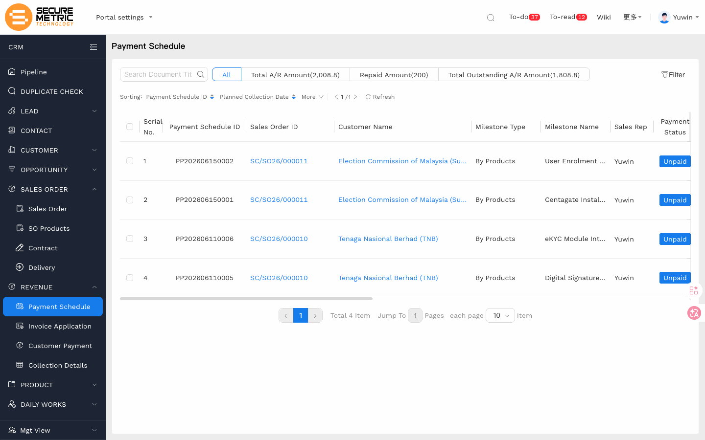
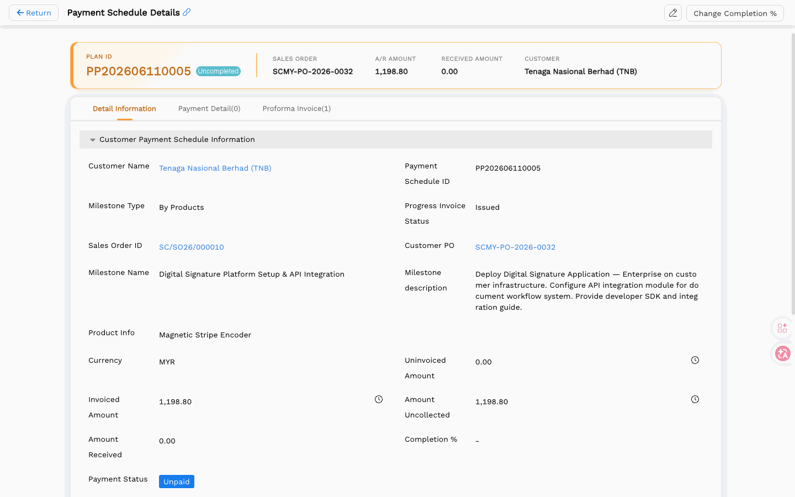
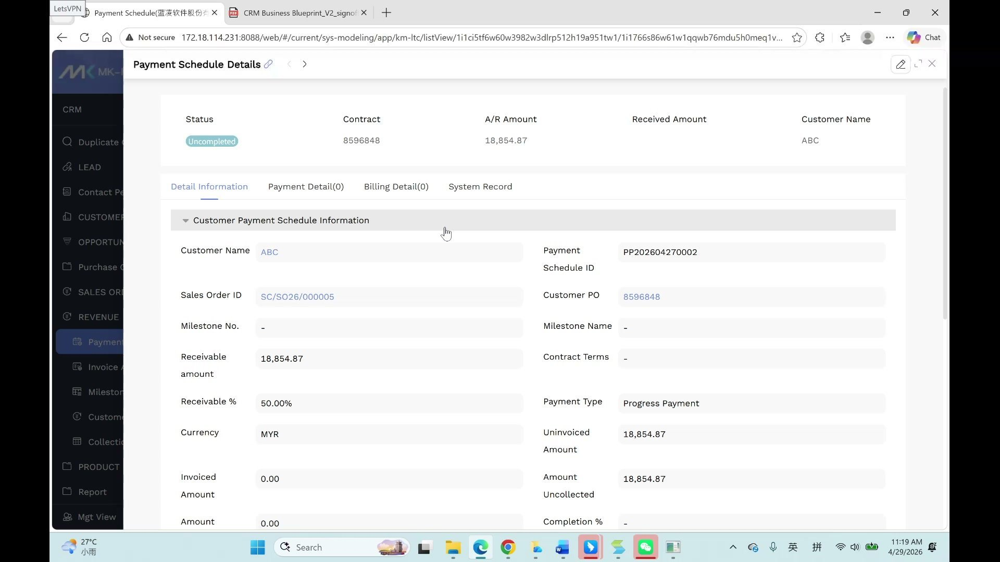
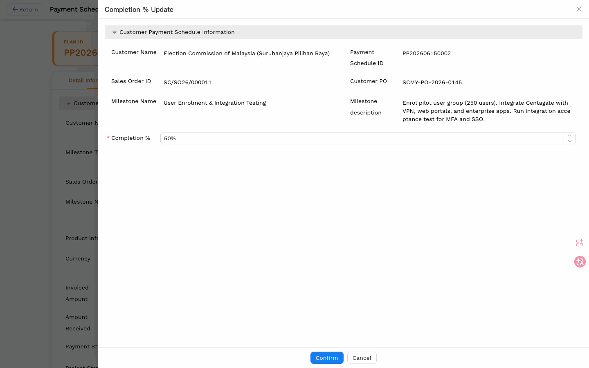

# 付款计划（Payment Schedule）用户手册

> **版本**：V1.0 | **日期**：2026-06-04 | **系统**：Securemetric CRM（EasyCraft）

---

## 目录

1. [模块概述](#1-模块概述)
2. [列表视图](#2-列表视图)
3. [查看付款计划](#3-查看付款计划)
4. [详情视图](#4-详情视图)
5. [业务规则与流程](#5-业务规则与流程)
6. [常见问题与注意事项](#6-常见问题与注意事项)

---

## 1. 模块概述

**付款计划（Payment Schedule）** 模块用于追踪每个销售订单的应收账款（A/R）里程碑。付款计划记录由系统从销售订单**自动生成**，没有手动"新建"表单。用户主要通过该模块监控回款进度、查看应收账款明细，以及触发开票申请。

付款计划编号格式：`PP` + `YYYYMMDD` + 序号（例如：`PP202604270002`）。

### 1.1 入口

| 入口 | 路径 |
|------|------|
| 独立列表 | 左侧导航 → **收入（REVENUE）** → **付款计划（Payment Schedule）** | [直达链接](http://172.18.114.231:8088/web/#/current/sys-modeling/app/km-ltc/listView/1i1ci5tf6w60w3982w3dlrp512h19a951tw1/1i1766s86w61w1qqwb76mdu5h0meq1vcelw1?type=list&navId=1hvp21k7lw4vw6h64w37pp9dm27vj66f3cw1){: target="_blank" rel="noopener"} |
| 从销售订单进入 | 销售订单详情 → **付款计划** 选项卡 |

### 1.2 核心功能

- 追踪应收款里程碑（首付款、进度款、尾款）
- 监控由项目经理（PM）更新的完成度百分比
- 为客户经理（AM）提供生成开票申请的触发信号
- 汇总每个里程碑的已开票、未开票及未收款金额
- 为报表提供收入数据汇总

---

## 2. 列表视图

| 列名 | 说明 |
|------|------|
| 付款计划编号 | 系统生成，格式见§5.3 |
| 销售订单编号 | 关联的销售订单（可点击链接） |
| 销售代表 | 销售订单指定的客户经理 |
| 付款状态 | 当前回款状态（标签标识） |
| 完成度 % | 项目完成百分比（由 PM 更新） |
| 付款类型 | 首付款 / 进度款 / 尾款 |
| 应收比例 % | 该里程碑占销售订单总价值的百分比 |
| 应收金额 | 应收的绝对金额 |
| 已收金额 | 已完成回款的金额 |
| 未收金额 | 该里程碑的未结余额 |

### 选项卡筛选

列表视图顶部提供选项卡式筛选：

| 选项卡 | 说明 |
|--------|------|
| 全部 | 所有付款计划记录 |
| 总应收金额 | 筛选：总应收金额视图 |
| 已回款金额 | 筛选：已完成回款的金额 |
| 总未收应收金额 | 筛选：聚焦未收余额 |

---

## 3. 查看付款计划

由于付款计划由系统自动生成，用户的主要操作是**查看和监控**。

### 3.1 从销售订单进入

1. 打开相关销售订单。
2. 切换至 **付款计划** 选项卡。
3. 该销售订单的所有里程碑记录在此列出，显示各付款类型、金额和状态。

---

## 4. 详情视图

付款计划详情页展示单个里程碑记录的完整信息。

### 4.1 详细信息

| 字段 | 说明 |
|------|------|
| 客户名称 | 关联销售订单的客户 |
| 销售订单编号 | 关联销售订单的参考编号 |
| 付款计划编号 | 系统生成的以 `PP` 为前缀的编号 |
| 客户采购订单号 | 该里程碑引用的客户 PO 编号 |
| 付款类型 | 首付款 / 进度款 / 尾款 |
| 应收金额 | 该里程碑的总应收金额 |
| 应收比例 % | 占销售订单总价的百分比份额 |
| 货币 | 开票/付款货币 |
| 已开票金额 | 已开具发票的金额 |
| 未开票金额 | 尚未开票的剩余金额 |
| 未收金额 | 已开票但尚未收到的金额 |

### 4.2 子选项卡

| 子选项卡 | 内容 |
|----------|------|
| 详细信息 | 主要里程碑字段（如上所述） |
| 付款明细（N） | 针对该里程碑已收到的各笔付款记录 |
| 开票明细（N） | 针对该里程碑已开具的发票记录 |
| 系统记录 | 创建与修改审计日志 |

### 4.3 付款明细子选项卡

每笔已收款项作为一行记录，包含：
- 付款日期
- 已收金额
- 收据参考编号
- 财务确认人

### 4.4 开票明细子选项卡

每张已开发票作为一行记录，包含：
- 发票编号
- 开票日期
- 发票金额
- 状态

---

## 5. 业务规则与流程

### 5.1 从销售订单自动生成

付款计划在销售订单确认时由系统**自动生成**，每个在销售订单付款条款中定义的里程碑对应生成一条记录，无需用户手动填写创建表单。

### 5.2 完成度 %

**完成度 %** 反映项目交付或服务履行的实际进度。

**如何更改完成度 %**：
1. 进入销售订单详情 → 付款计划标签
2. 点击付款计划里程碑打开**详情抽屉**
3. 点击抽屉右上角的 **"更改完成%"** 按钮
4. 设置新的完成百分比并保存

### 5.3 应收金额计算

每个付款计划里程碑的财务金额自动计算：

| 计算公式 | 描述 |
|---------|------|
| 应收金额 | 订单总额 × 应收百分比（如 37,709.74 × 20% = 7,541.95） |
| 未开票金额 | 订单总额 − 已开票金额 |
| 未收金额 | 订单总额 − 已收金额 |

**付款计划 ID 格式**：`PP` + `YYYYMMDD` + 序列号（如 `PP202604270002`）

### 5.4 付款状态标签

| 状态 | 含义 |
|------|------|
| 待处理（Pending） | 发票尚未开具 |
| 已开票（Invoiced） | 发票已开具，款项尚未收到 |
| 部分收款（Partially Paid） | 已收到部分款项，仍有余款未收 |
| 已收款（Paid） | 该里程碑全部款项已收齐 |

