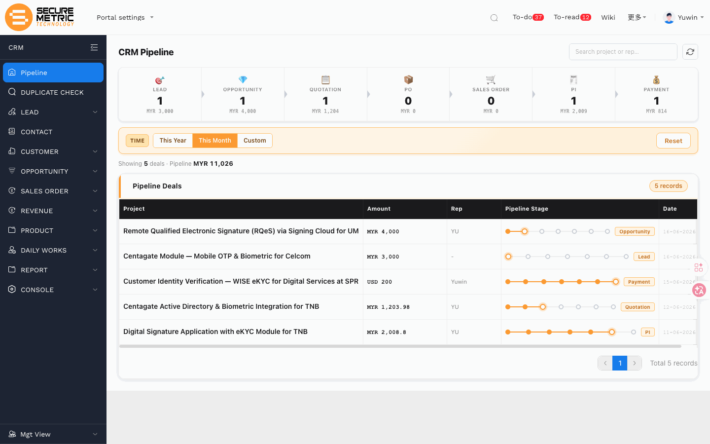

# 销售管道看板用户手册

> **版本**: V1.1 | **日期**: 2026-06-16 | **系统**: Securemetric CRM (EasyCraft)

---

## 目录

1. [模块概述](#1-模块概述)
2. [管道阶段](#2-管道阶段)
3. [数据说明](#3-数据说明)
4. [筛选与搜索](#4-筛选与搜索)

---

## 1. 模块概述

**销售管道看板**（Pipeline Kanban）以单页仪表板形式集中展示当前登录用户所负责项目的完整阶段进展，帮助销售人员随时掌握个人管道状态。

**访问路径**：侧边栏 → **CRM → Pipeline（管道）** | [直达链接](http://172.18.114.231:8088/web/#/current/sys-modeling/app/km-ltc/listView/1jq3s2qiqwfw1g2rkw1ui9f442bumbu7bvw0/1jkms17v5w82wklf5wid4osl2g19maf1j5w4?type=portal&navId=1hvp21k7lw4vw6h64w37pp9dm27vj66f3cw1){: target="_blank" rel="noopener"}

页面顶部水平排列七个阶段磁贴，分别显示对应阶段的项目数量与金额汇总。点击任意磁贴可将下方列表筛选至该阶段；再次点击或点击 **Reset** 按钮即可恢复完整视图。

---

## 2. 管道阶段

本看板覆盖完整销售周期的 **7 个标准阶段**：

| 阶段 | 说明 |
|------|------|
| **LEAD（线索）** | 初步线索已录入系统 |
| **OPPORTUNITY（商机）** | 线索通过资格审核，商机已正式创建 |
| **QUOTATION（报价）** | 基于已审批的 P&L 生成报价单 |
| **PO（采购订单）** | 已收到客户正式采购订单 |
| **SALES ORDER（销售订单）** | 内部销售订单已创建 |
| **PI（项目发票）** | 若存在项目发票，显示发票金额；若仅有里程碑，则显示里程碑合计金额；点击可跳转至对应销售订单 |
| **PAYMENT（回款）** | 当前项目的所有回款合计；点击可跳转至对应销售订单 |

---

## 3. 数据说明

### 3.1 数据范围

看板仅展示**负责人为当前登录账号**的项目记录，不包含其他人员的管道数据。

### 3.2 每项目仅显示一条记录

系统对每个项目仅保留当前所处最新阶段的一条记录，以避免同一项目在多个阶段重复出现：

- 线索转化为商机后，对应线索记录将不再显示
- 商机进入报价流程后，对应商机记录将不再显示
- 以此类推，看板始终仅呈现每个项目当前阶段的最新状态

### 3.3 货币与汇率

所有金额均换算为**当前登录账号的本币**（Home Currency）。各阶段所用汇率的取值日期如下：

| 阶段 | 汇率基准日期 |
|------|------------|
| 线索（LEAD） | 线索创建日期 |
| 商机（OPPORTUNITY） | 商机创建日期 |
| 报价（QUOTATION）及后续阶段 | P&L 中所传递的汇率 |

---

## 4. 筛选与搜索

| 功能 | 说明 |
|------|------|
| **时间筛选** | 默认显示**本月**数据；可切换为今年或自定义日期范围 |
| **阶段磁贴** | 点击可按阶段筛选列表；点击 **Reset** 恢复全部 |
| **搜索** | 支持按项目名称或记录 ID 进行实时检索 |
