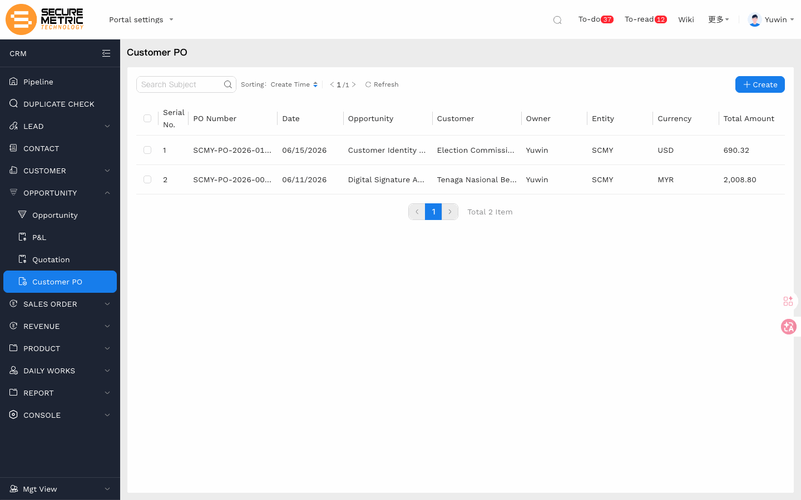
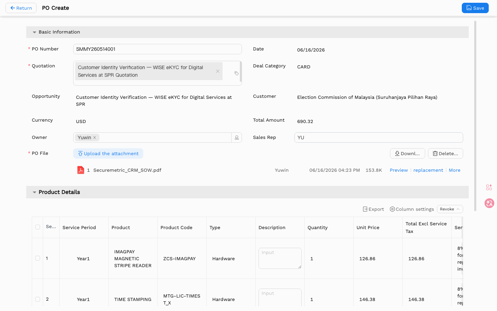

# 客户采购订单（PO）用户手册

> **版本**：V1.0 | **日期**：2026-06-04 | **系统**：Securemetric CRM（EasyCraft）

---

## 目录

1. [模块概述](#1-模块概述)
2. [列表视图](#2-列表视图)
3. [创建采购订单](#3-创建采购订单)
4. [详情视图](#4-详情视图)
5. [业务规则与流程](#5-业务规则与流程)
6. [常见问题与注意事项](#6-常见问题与注意事项)

---

## 1. 模块概述

**采购订单（PO）** 模块用于记录客户向 Securemetric 发出的正式采购订单。PO 代表客户的正式购买承诺，是创建销售订单（SO）或合同的前提条件。

PO 始终关联至商机，创建 PO 时商机状态会自动变为**赢单（Won）**，并从关联报价单中继承财务信息。PO 中的产品和价格会更新商机中的产品明细；PO 结束后，商机状态锁定，不能再新建 P&L 或报价单。

### 1.1 入口

| 入口 | 路径 |
|------|------|
| 主入口 | 左侧导航 → **OPPORTUNITY（商机）→ PO** | [直达链接](http://172.18.114.231:8088/web/#/current/sys-modeling/app/km-ltc/listView/1jg71jasbw58w88mgwpbu9v1399r1p212rw4/1jg7171muw58w87o0w154fbel1s291dufdw4?type=list&navId=1hvp21k7lw4vw6h64w37pp9dm27vj66f3cw1){: target="_blank" rel="noopener"} || 独立列表 | 左侧导航 → **采购订单（Purchase Order）** |
| 从商机进入 | 商机详情 → **PO** 选项卡 → **+ 新建** |

### 1.2 核心功能

- 记录客户的正式采购订单文件及编号
- 关联获胜报价单，自动填充财务数据
- 上传 PO 文件作为附件，满足合规要求
- 创建 PO 后触发商机状态更新为**赢单（Won）**
- 驱动后续销售订单和合同的创建

---

## 2. 列表视图

| 列名 | 说明 |
|------|------|
| PO 编号 | 客户发出的 PO 参考编号 |
| 日期 | PO 签发日期 |
| 客户 | 签发该 PO 的客户 |
| 商机 | 关联的商机 |
| 总金额 | PO 总价值 |
| 交易类别 | 业务交易类别 |

使用搜索栏按 PO 编号或客户筛选，使用筛选标签按交易类别或日期范围缩小范围。



---

## 3. 创建采购订单

### 3.1 打开表单

**推荐路径**：进入关联商机（状态需为**赢单**或准备标记为赢单），打开 **PO** 选项卡，点击 **+ 新建**。

也可从独立 PO 列表页创建，但需要手动选择报价单。



### 3.2 字段说明

| 字段 | 必填 | 类型 | 说明 |
|------|------|------|------|
| PO 编号 | 是 | 文本输入 | 客户签发的 PO 参考编号，须唯一 |
| 日期 | 是 | 日期选择器 | 客户签发 PO 的日期 |
| 报价单 | 是 | 查找（标签选择） | 选择获胜报价单，触发自动填充 |
| 交易类别 | 是 | 下拉 | 业务交易类别 |
| 商机 | 否（自动） | 只读文本 | 从报价单自动填充 |
| 客户 | 否（自动） | 只读文本 | 从报价单自动填充 |
| 货币 | 否（自动） | 只读文本 | 从报价单自动填充 |
| 总金额 | 否（自动） | 只读数字 | 从报价单总价自动填充 |
| PO 文件 | 是 | 文件上传 | 客户 PO 文件的扫描件或电子版 |

### 3.3 产品明细子表

**产品明细**子表列出 PO 中的行项目，通常继承自报价单，可在此查看。

| 列名 | 类型 | 说明 |
|------|------|------|
| 序号 | 自动编号 | 行序号 |
| 服务周期 | 日期范围 | 服务或交付的开始与结束日期 |
| 产品 | 查找 | 产品目录中的产品名称 |
| 产品编码 | 文本 | 产品 SKU 或编码 |
| 类型 | 下拉 | 产品或服务类型分类 |
| 描述 | 文本 | 行项目描述 |
| 数量 | 数字 | 采购数量 |

### 3.4 保存

点击顶部操作栏中的 **保存**。系统保存 PO，并在商机状态未设为**赢单**时自动更新。

---

## 4. 业务规则与流程

### 4.1 标准 PO 流程

```
创建 PO → 填写 PO 编号 + 上传 PO 文件 → 保存 → PO 生效
```

1. 创建 PO 时，关联商机状态自动变为**赢单（Won）**。
2. 填写必填字段：PO 编号、日期、报价单、交易类别、PO 文件。
3. 系统从所选报价单自动填充客户、商机、货币和总金额。
4. 保存 PO 记录。

### 4.2 创建 SO/合同前须有 PO

在关联商机存在至少一个生效 PO 之前，**无法创建**销售订单或合同。此规则确保在开始收入确认步骤前，客户已作出正式的采购承诺。

### 4.3 PO 编号为必填项

**PO 编号**是客户在其正式 PO 文件上标注的参考编号，必须与文件一致。

### 4.4 PO 文件上传为必填项

保存前必须附上客户 PO 文件的扫描件或电子版。该文件作为正式存档，在审计、争议处理和合同管理中均会被引用。

---

## 5. 常见问题与注意事项

**问：客户发来了修订的 PO，金额有变化，如何更新？**
请先修改报价单以反映新金额，然后回到 PO 页面重新选择报价单以刷新自动填充的数值，并上传修订后的 PO 文件。

**问：PO 可以删除吗？**
PO 一旦关联了销售订单或合同，删除操作将被限制。如 PO 系误创建且尚无下游记录，请联系上级处理。

**问："交易类别"代表什么含义？**
交易类别用于划分业务交易的类型（如新业务、续签、增购），主要用于销售流水线和收入报告。

**问：一个商机可以有多个 PO 吗？**
可以。若客户针对不同阶段或不同产品分别签发采购订单，一个商机可以关联多个 PO，每个 PO 独立追踪。
