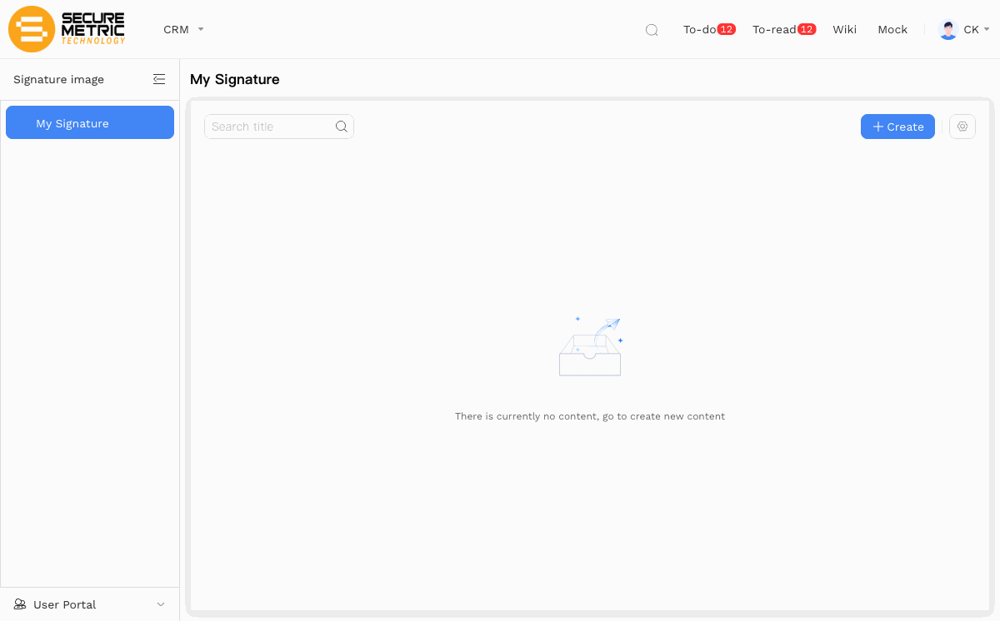
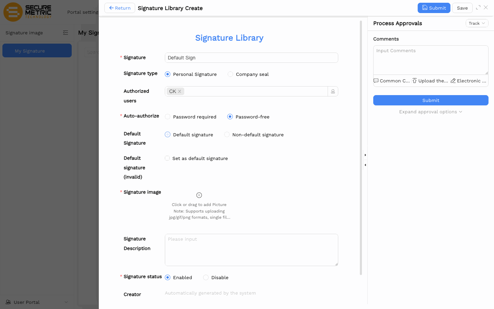

# 签章上传用户手册

> **版本**：V1.0 | **日期**：2026-06-09 | **系统**：Securemetric CRM（EasyCraft）

---

## 快速上手（3 步完成）

> **什么时候需要签章？** 目前只有 **P&L** 和 **报价单** 模块的审批流需要数字签章。如果您参与这两个模块的审批，只需设置一次默认签章——之后每次签署时会自动带出，无需重复选择。

### 第 1 步 — 打开我的签章

进入：**[我的签章](http://172.18.114.231:8088/web/#/current/sys-modeling/app/km-signature/listView/1h63ga1itwsaw4jj8w1mr6an91ehjp1a1bw0/1h2aj825lw2cvwfjuw1s2ro5g2gqb7p033w0?navId=1h63ga1irwsaw4jj7w11052cb3erb8a6p8w0&appId=1gokoobhhwd3qwh5ow3id3n7b10j1gmf1aw0)**

在左侧导航点击 **签章图片** → **我的签章**，然后点击 **新建**。

### 第 2 步 — 填写关键字段

在 **签章库 新建** 表单中，只需关注三项：

| 字段 | 选择 |
|------|------|
| **自动授权** | ✅ **免密** |
| **默认签章** | ✅ **默认签章** *(选免密后此字段才出现)* |
| **签章图片** | 上传您的签章图片（jpg / gif / png，≤ 10 MB） |

其余字段保持默认即可（签章名称填任意名称，状态保持启用）。

### 第 3 步 — 提交

点击 **提交**。等审批流通过后，您的默认签章即生效，之后在 P&L 或报价单的审批流程中会自动预选该签章。

---

## 签章图片准备建议

上传前请先准备好图片：

| 属性 | 推荐值 |
|------|--------|
| 格式 | **PNG**（推荐透明背景） |
| 尺寸 | 宽 300–600 px × 高 100–200 px |
| 文件大小 | ≤ 500 KB |
| 背景 | 透明或白色，**不要彩色背景** |
| 墨迹 | 浅色背景上的深色墨迹，小尺寸下仍清晰可辨 |

> **小技巧**：裁剪紧凑，去掉签名周围多余的空白边距。签章在审批面板中显示较小，清晰度很重要。

---

## 两个关键设置说明

### 自动授权

| 选项 | 效果 |
|------|------|
| 需要密码 | 每次使用签章时都需输入密码 |
| **免密** ✓ | 无需密码，签章立即应用 |

**个人默认签章请始终选择免密**，省去每次审批都要输入密码的步骤。

### 默认签章

**默认签章** 字段仅在选择 **免密** 后才出现。

- **默认签章** → 打开签章选择器时自动预选此签章
- 非默认签章 → 每次需要手动选择

只应有一个签章被设为默认。如果日后创建更多签章，其余一律选 *非默认签章*。

---

## 完整字段说明

| 字段 | 是否必填 | 说明 |
|------|----------|------|
| 签章 | 是 | 显示名称，填您的姓名即可 |
| 签章类型 | 否 | 个人签名 或 公司盖章 |
| 授权用户 | 否 | 可使用此签章的人，自动填入当前用户 |
| 自动授权 | 是 | 推荐 **免密** |
| 默认签章 | 否 | 推荐 **默认签章**（选免密后出现） |
| 签章图片 | 是 | jpg / gif / png，最大 10 MB |
| 签章说明 | 否 | 可选备注 |
| 签章状态 | 是 | 启用 |

---

## 常见问题

**Q：默认签章字段不出现怎么办？**
先在自动授权下选 **免密**，默认签章行在选择免密后才会显示。

**Q：提交后审批表单中签章仍未出现？**
签章记录需要经过审批流审批后才正式生效。请查看表单右侧 Process Approvals 面板的审批状态，如仍为待审批请联系审批人跟进。

**Q：图片在 PDF 中出现彩色背景方块？**
请将图片导出为 **透明背景的 PNG** 格式。白色填充背景会在文档上叠加一个白色方块。

**Q：哪些模块需要签章？**
目前只有 **P&L** 和 **报价单** 的审批流需要数字签章。线索、联系人、客户、销售订单等其他模块不涉及签章。
